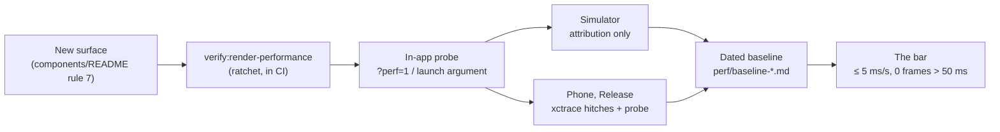

# Render Performance Charter

## Visual Context

Canonical visual owner: [Mobile Reference Index](./README.md). That map holds the native shell top-down; this page is the frame-pacing contract beneath it.



The bar for how the private agent moves on a phone, in numbers, and the
program that measures and defends it. It complements the motion duration
contract (the 150ms ceiling in `hushh-webapp/app/globals.css` and
`skills/improve-animations/AUDIT.md`): that contract says how long an
animation may run; this one says whether the frames inside it arrive.

## The bar

Measured on a real phone with the gestures below, three runs, median.

| KPI | Source | Target | Release gate |
|---|---|---|---|
| Hitch time ratio per gesture | Instruments *Animation Hitches* (`xctrace`) | ≤ 5 ms/s (Apple's "good") | ≤ 10 ms/s |
| p95 / p99 frame interval at the display's rate | in-app probe | ≤ budget / ≤ 2× budget | p99 ≤ 50 ms |
| Frames over 50 ms during any gesture | in-app probe | 0 | ≤ 1 per gesture |
| Forced synchronous layouts per second of scroll | Web Inspector (iOS), CDP tracing (Android, CI) | 0 | 0 |
| Tab switch, tap to settled | probe `→route` window + the 150ms token | ≤ 150 ms and no frame over 33 ms | |
| Chat streaming, frames over 33 ms per 10 s | probe idle bucket on `/one` | 0 | ≤ 2 |
| Android floor phone, janky frames | `dumpsys gfxinfo` | < 5% | < 10% |
| Threads web, same simulator, same gestures | reference session | meet or beat | |

The web engine inside the iOS shell runs at 60 Hz today
(`CADisableMinimumFrameDurationOnPhone` is absent and WebKit's 120 Hz support
varies by model), so the working budget is 16.7 ms. The probe measures the
real rate at boot and derives the budget from it; 120 Hz is an experiment
with a measured result, not an assumption.

## What costs frames here (and what does not)

`transition-all` is already at zero and CSS-only scans are saturated. The
cost on a phone is JavaScript and compositing:

1. **Non-passive touch listeners on `window`.** One makes WebKit wait for the
   main thread on every scroll frame in the app. Edge gestures stay passive.
2. **Custom-property writes on `<html>` per frame.** Each one invalidates
   style for the whole document. Per-frame writers write on the element that
   consumes the value (the pattern in `hushh-webapp/lib/navigation/top-shell-tab-swipe-progress.ts`).
3. **Body-wide subtree `MutationObserver`s.** They wake on every streamed
   token and every marker move. Observe the owning element or use explicit
   triggers (route settle, theme flip, resize, scroll idle).
4. **Blanket layer promotion.** A wildcard `will-change` held 170 glass
   surfaces as compositor layers; `backdrop-filter` already composites.
5. **Per-frame React state.** Audio meters, scroll progress and streamed
   text drive a CSS variable or a leaf store, never a `setState` per frame.
6. **Default chart animation and tooltip.** Recharts animates every series
   for 1500 ms on mount and on each data change, and its default tooltip
   trigger attaches `touchmove`, reading the container rect and re-rendering
   the chart on every frame of a flick that crosses it; series pass
   `CHART_ANIMATION_ACTIVE` and tooltips pass `CHART_TOOLTIP_TRIGGER` (tap
   inside the native shell).
7. **Layer order.** Floating primitives take their z-index from the `--z-*`
   ladder; a menu that opens behind a sheet is a ladder bug.

Load-bearing settings this program never touches: the Keyboard
`resize: "none"` contract and `--kb-height`, `ios.scrollEnabled: false` and
the DOM scroll root, the motion duration tokens, the single route-transition
engine, and `SwipeViews` as the only pager.

## Measuring

### The in-app probe

`hushh-webapp/lib/perf/frame-pacing.ts`, mounted by `hushh-webapp/components/app-ui/render-perf-probe.tsx`
and inert unless asked for. It records the interval between animation frames
and buckets them by gesture (sheet, drawer, pager, bottom nav, top tabs,
scroll, tap; a tap that changes route becomes `kind→route`) and by route.
Output has no personal information: no text, no element content, no full
URLs, no identifiers.

Switch it on with `?perf=1` (or `?perf=hud` for an on-screen readout) on any
URL; the session remembers it. Inside the iOS shell, launch with the
argument `-CapacitorStorage.hushh_perf_probe 1`:

```bash
xcrun simctl launch booted com.hushh.app -CapacitorStorage.hushh_perf_probe 1
xcrun devicectl device process launch --device <id> --terminate-existing com.hushh.app -CapacitorStorage.hushh_perf_probe 1
```

Read it back with `window.__hushhPerf.export()` (also printed to the console
behind the `HUSHH_RENDER_PERF_JSON=` marker), from the `sr-only`
`[data-testid="hushh-perf-status"]` element, or on native from
`Documents/hushh-perf/<run>.json` in the app container (`Data/` on Android),
written every 10 s while no gesture is in flight.

### Native instruments

- iOS presentation truth: `xcrun xctrace record --template 'Animation Hitches' --device <id> --attach App --time-limit 90s --no-prompt --output <trace>`. Attach the app: WKWebView compositing is UI-process side.
- iOS attribution: Safari Web Inspector Timelines (Rendering Frames, Layout & Rendering, JavaScript & Events) on a Debug build, or on a Release build made inspectable with `xcodebuild -configuration Release CAPACITOR_DEBUG=true`. A Layout record with a call stack is a forced synchronous layout; count them per second of scrolling.
- iOS JavaScript cost: `xcrun xctrace record --template 'Time Profiler' --all-processes` (the JavaScript thread lives in the WebContent process).
- Android: `adb shell dumpsys gfxinfo com.hussh.app reset`, gestures, then `dumpsys gfxinfo com.hussh.app framestats`; Chrome DevTools over `chrome://inspect` shows forced reflows for the same JavaScript, which is the cheapest attribution even for iOS findings.

Simulator numbers are attribution only. A simulator renders through the
Mac's GPU and reports the Mac's refresh rate; it finds causes and cannot
certify a frame rate. Sign-off numbers come from a phone, Release build,
test mode off, probe HUD off.

### The gesture card

Three runs each, median reported: feed flick (five down, five up), bottom
nav switch (One → Feed → Kai → Location → Connect → One, 1.5 s dwell), top
shell pager swipe (Kai market/portfolio/analysis; Location tabs), profile
pane open and drag-dismiss, holdings drawer open and drag-close, chat stream
for 30 s, Kai chart flick, Location map pan (native map: hitches only), and
cold start to the first interactive tab.

### The truth lane

`PERF_ATTACHED=1 PERF_CONFIGURATION=Release IOS_DEVICE_ID=<udid> HUSHH_PERF_TIER=<tier> npm run perf:ios:card`
runs the same card with test mode off on a Release build: each surface is
its own launch with only the probe argument and a route argument the probe
honours (`-CapacitorStorage.hushh_perf_route /one/kai`), the vault is
unlocked with the passphrase method from the process environment (never
Face ID; the value is never logged and the log is discarded if it contains
it), and the reviewer bridge and its status poll are absent. This is the
certifying run; the summary says so only when all three hold (phone,
Release, test mode off). `PERF_SECTION=feed|chat|kai|location|all` runs one
surface or all four; `chat` launches at `/` (the Chat tab, the only route
where the composer mounts), sends a fixed prompt and holds a 30 s window
named `chat-stream-30s`.
The Release build sets `ENABLE_TESTABILITY=YES` because the scheme's
unit-test target does `@testable import App`; it keeps `-O`.
The unlock step closes the system passkey sheet that iOS shows at every
cold launch on a phone without a passkey, retypes after a mismatch, and
the card deletes the run's `.xcresult` bundles as soon as the test exits
(XCTest records typed strings in them). On the phone, chat does not
stream (`CapacitorHttp` returns the body whole), so the `chat-stream-30s`
gesture measures one paint of the whole reply plus its auto-scroll, not a
stream; bug log B39.

### Android

The same card, the same two lanes, one phone over adb. The probe is the same
module; it reads its switch from the Capacitor Preferences keys
`hushh_perf_probe` and `hushh_perf_route` (the Preferences plugin stores them
in `SharedPreferences("CapacitorStorage")`), which is how the iOS launch
argument reaches it. On Android:

- **Extras, debuggable builds only.** `MainActivity` honours the intent extras
  `HUSHH_PERF_PROBE` (boolean) and `HUSHH_PERF_ROUTE` (app-relative path) and
  seeds the two keys before the WebView loads; a debuggable launch without
  the extras removes them, so nothing persists past the run. A non-debuggable
  build never touches them (`PerfProbeLaunchPolicy`, pinned by
  `hushh-webapp/android/app/src/test/java/com/hussh/app/PerfProbeLaunchPolicyTest.kt`).
  `adb shell am start -n com.hussh.app/.MainActivity --ez HUSHH_PERF_PROBE true --es HUSHH_PERF_ROUTE /one/kai`.
- **Attribution card:** `ANDROID_SERIAL=<serial> npm run perf:android:card`
  (`hushh-webapp/scripts/perf/android-perf-card.sh`). Builds the web export into
  `.next-native-android` (its own dist dir, under a build lock shared with the
  iOS lane, through `hushh-webapp/scripts/native/with-android-native-env.mjs`),
  syncs it, assembles the debug APK, installs it in place, and launches each
  surface through the native test bridge (reviewer login, vault passphrase as
  intent extras, exactly as the cold UI audit does) plus the probe extras.
  `hushh-webapp/scripts/perf/android-perf-gestures.mjs` drives the gestures
  with `adb shell input`, finds the bottom-bar tabs and the pane controls
  through `uiautomator dump`, stamps every `PERF_GESTURE` line with the
  phone's clock (the probe's windows are stamped there too), and wraps each
  gesture group in `dumpsys gfxinfo com.hussh.app reset` / `framestats`
  (`hushh-webapp/scripts/perf/parse-gfxinfo.mjs`). The summary carries both:
  the probe's rAF intervals inside the WebView and HWUI's janky share and
  percentiles for the app window (`hushh-webapp/scripts/perf/merge-android-gfxinfo.mjs`).
  Debug build, bridge on: attribution only.
- **Truth lane:** `PERF_ATTACHED=1 ANDROID_SERIAL=<serial> npm run perf:android:card`
  runs `hushh-webapp/android/app/src/androidTest/java/com/hussh/app/AttachedRenderPerfTest.kt`
  (UIAutomator, `androidx.test.uiautomator:uiautomator:2.3.0`) under
  `am instrument`: each surface is its own launch with only the probe keys
  seeded, the vault is unlocked with the passphrase method typed into the
  `Vault passphrase` field (never biometrics), the reviewer bridge and its
  status poll are absent, and the same gestures run through `UiDevice`. With
  `PERF_CONFIGURATION=Release` it builds the `perf` build type (release
  settings, `debuggable false`, signed with the debug key so it installs
  without release material; `-PhushhTestBuildType=perf` points the test APK at
  it) and the summary says `certifies=true`. Because `run-as` needs a
  debuggable build, the test copies the probe exports and gfxinfo dumps into
  `Download/hushh-perf` through MediaStore for the card to pull and delete.
  The instrumentation lives in the app's own process, so the app is never
  force-stopped between surfaces; `FLAG_ACTIVITY_CLEAR_TASK` boots a fresh
  activity, WebView and probe run instead.
- **Passphrase rule.** The value reaches the phone only on a command line a
  script builds (`am start --es`, `am instrument -e`), never a file, gradle
  property or `setprop`; every file the card keeps is grepped for it and
  removed if it appears; no `env` dump anywhere.
- **The screen.** The card sets `svc power stayon true` for the run and
  restores the setting; a secure keyguard cannot be passed from adb, so a
  locked phone fails fast (`PERF_BLOCKED reason=keyguard`) instead of
  measuring the lock screen.
- **Refresh rate.** `dumpsys display` while the app is in front reports the
  active mode; the probe reports what the WebView actually delivers
  (`raf_hz`). The two can differ: a 120 Hz panel is only a 120 Hz WebView if
  Chromium and the frame-rate policy agree, and that is a Phase 3 platform
  question (`Window.attributes.preferredDisplayModeId`,
  `Surface.setFrameRate`), not something the card changes.
- **Threads and X on the same phone:** `PERF_THIRD_PARTY=1` flicks their feeds
  with the same swipes and records `dumpsys gfxinfo` for each (HWUI only;
  there is no probe inside them). Native lists there against a DOM scroller
  here, same phone, same flick, same HWUI unit.

### Threads on the same phone

Native Threads is an App Store binary, which Instruments cannot attach to,
but XCUITest can drive it by bundle identifier and
`XCTOSSignpostMetric.scrollDecelerationMetric` scores its UIScrollView
deceleration in Apple's own hitch unit (`testThirdPartyFeedScrollBenchmarkThreads`,
opt-in with `HUSHH_ENABLE_THIRD_PARTY_SCROLL_BENCHMARK=true`; read the result
with `hushh-webapp/scripts/perf/summarize-xcresult-metrics.mjs`). X aborts
itself under any XCUITest-driven session and cannot be measured this way.
One's feed scrolls a DOM element that instrument cannot see, so One's number
is the probe's frame-interval hitch on the identical flick. Two further
symmetric methods, same phone, same gesture, same session:

1. **Threads web in Safari, same sampler.** Enable Web Inspector on the phone
   (Settings > Safari > Advanced > Web Inspector), sign in to threads.com in
   Safari, then on the Mac: Safari > Develop > the phone > the threads.com
   tab > Console. Paste `hushh-webapp/scripts/perf/web-frame-sampler.js`, run
   `__frameSampler.start("feed-flick")`, do the card step, `__frameSampler.stop()`.
   It prints the same p95/p99/max/frames-over-50/hitch numbers the in-app
   probe reports, computed the same way. It records frame intervals only.
2. **Native Threads and One, screen recording.** Control Center > Screen
   Recording, ten seconds of the same flick in each app, AirDrop both files
   to the Mac, then `hushh-webapp/scripts/perf/video-frame-drops.sh <file> <label>`
   for each. A frame the app failed to deliver is a repeat of the previous one
   on the recording; the script reports delivered %, repeated frames and the
   worst stall. Crude, but applied identically to both apps.

The phone's own refresh rate is the bar: an iPhone 16e is a 60 Hz panel, so
the budget is 16.7 ms there; a Pro model is 120 Hz and needs the
`CADisableMinimumFrameDurationOnPhone` experiment before the web engine can
be judged at 8.3 ms.

### Threads web as the reference

Same simulator, Mobile Safari, the founder signed in, Web Inspector only,
metrics only: frames over budget, forced layouts per second, layer count,
JavaScript share of the main thread, for the same gestures where they
exist. Also recorded, from the DOM and stylesheets: which element scrolls,
`content-visibility` and `contain` use, `will-change` count, backdrop filters
active while scrolling, listener passivity, virtualisation. The comparison
table lives in the baseline report and re-ranks the remaining work.

## Defending it

- `npm run verify:render-performance` (also the fourth link of
  `verify:design-system`, so CI runs it): fifteen rules with an allowlist
  that only tightens, including `backdrop-filter-on-list-row` (a
  `backdrop-blur` class on a keyed list element; a row that moves under a
  flick re-samples its backdrop every frame, so blur stays on fixed chrome). `hushh-webapp/scripts/architecture/render-performance-allowlist.json`
  carries today's debt; `--write-allowlist` rewrites it after debt is paid.
- `hushh-webapp/__tests__/ui/layer-order.contract.test.ts` pins the `--z-*` ladder;
  `hushh-webapp/e2e/profile-pane-layer-order.spec.ts` proves the browser stacks it.
- `hushh-webapp/__tests__/morphy-ux/blur-promotion.contract.test.ts`,
  `hushh-webapp/__tests__/components/kai-charts-animation.contract.test.ts`,
  `hushh-webapp/__tests__/components/profile-pane-contract.test.ts` (passive gestures),
  `hushh-webapp/__tests__/lib/ambient-chrome.test.ts` (no `<html>` writes, no body
  observer), `hushh-webapp/__tests__/components/agent-voice-edge-glow.test.tsx` (idle
  glow does nothing) each hold one fix in place.
- Any change to the shell scroll engines, sheets, streaming or the masks
  ships with before/after probe numbers in the commit message.

## Reports

Dated baselines live beside this file under `perf/` as
`baseline-YYYY-MM-DD-<tier>.md` with the machine copy as JSON. The tier is
redacted (`ios-mid-2024`, `android-floor-2023`); no device names or serials.
`ios-sim` is never a sign-off tier.
