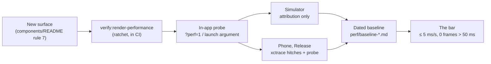

# Render Performance Charter

## Visual Context

Canonical visual owner: [Mobile Reference Index](./README.md). That map holds the native shell top-down; this page is the frame-pacing contract beneath it.



The bar for how the private agent moves on a phone, in numbers, and the
program that measures and defends it. It complements the motion duration
contract (the 150ms ceiling in `hushh-webapp/app/globals.css` and
`skills/improve-animations/AUDIT.md`): that contract says how long an
animation may run; this one says whether the frames inside it arrive.

## The bar

Measured on a real phone with the gestures below, three runs, median.

| KPI | Source | Target | Release gate |
|---|---|---|---|
| Hitch time ratio per gesture | Instruments *Animation Hitches* (`xctrace`) | ≤ 5 ms/s (Apple's "good") | ≤ 10 ms/s |
| p95 / p99 frame interval at the display's rate | in-app probe | ≤ budget / ≤ 2× budget | p99 ≤ 50 ms |
| Frames over 50 ms during any gesture | in-app probe | 0 | ≤ 1 per gesture |
| Forced synchronous layouts per second of scroll | Web Inspector (iOS), CDP tracing (Android, CI) | 0 | 0 |
| Tab switch, tap to settled | probe `→route` window + the 150ms token | ≤ 150 ms and no frame over 33 ms | |
| Chat streaming, frames over 33 ms per 10 s | probe idle bucket on `/one` | 0 | ≤ 2 |
| Android floor phone, janky frames | `dumpsys gfxinfo` | < 5% | < 10% |
| Threads web, same simulator, same gestures | reference session | meet or beat | |

The web engine inside the iOS shell runs at 60 Hz today
(`CADisableMinimumFrameDurationOnPhone` is absent and WebKit's 120 Hz support
varies by model), so the working budget is 16.7 ms. The probe measures the
real rate at boot and derives the budget from it; 120 Hz is an experiment
with a measured result, not an assumption.

## What costs frames here (and what does not)

`transition-all` is already at zero and CSS-only scans are saturated. The
cost on a phone is JavaScript and compositing:

1. **Non-passive touch listeners on `window`.** One makes WebKit wait for the
   main thread on every scroll frame in the app. Edge gestures stay passive.
2. **Custom-property writes on `<html>` per frame.** Each one invalidates
   style for the whole document. Per-frame writers write on the element that
   consumes the value (the pattern in `hushh-webapp/lib/navigation/top-shell-tab-swipe-progress.ts`).
3. **Body-wide subtree `MutationObserver`s.** They wake on every streamed
   token and every marker move. Observe the owning element or use explicit
   triggers (route settle, theme flip, resize, scroll idle).
4. **Blanket layer promotion.** A wildcard `will-change` held 170 glass
   surfaces as compositor layers; `backdrop-filter` already composites.
5. **Per-frame React state.** Audio meters, scroll progress and streamed
   text drive a CSS variable or a leaf store, never a `setState` per frame.
6. **Default chart animation.** Recharts animates every series for 1500 ms
   on mount and on each data change; series pass `CHART_ANIMATION_ACTIVE`.
7. **Layer order.** Floating primitives take their z-index from the `--z-*`
   ladder; a menu that opens behind a sheet is a ladder bug.

Load-bearing settings this program never touches: the Keyboard
`resize: "none"` contract and `--kb-height`, `ios.scrollEnabled: false` and
the DOM scroll root, the motion duration tokens, the single route-transition
engine, and `SwipeViews` as the only pager.

## Measuring

### The in-app probe

`hushh-webapp/lib/perf/frame-pacing.ts`, mounted by `hushh-webapp/components/app-ui/render-perf-probe.tsx`
and inert unless asked for. It records the interval between animation frames
and buckets them by gesture (sheet, drawer, pager, bottom nav, top tabs,
scroll, tap; a tap that changes route becomes `kind→route`) and by route.
Output has no personal information: no text, no element content, no full
URLs, no identifiers.

Switch it on with `?perf=1` (or `?perf=hud` for an on-screen readout) on any
URL; the session remembers it. Inside the iOS shell, launch with the
argument `-CapacitorStorage.hushh_perf_probe 1`:

```bash
xcrun simctl launch booted com.hushh.app -CapacitorStorage.hushh_perf_probe 1
xcrun devicectl device process launch --device <id> --terminate-existing com.hushh.app -CapacitorStorage.hushh_perf_probe 1
```

Read it back with `window.__hushhPerf.export()` (also printed to the console
behind the `HUSHH_RENDER_PERF_JSON=` marker), from the `sr-only`
`[data-testid="hushh-perf-status"]` element, or on native from
`Documents/hushh-perf/<run>.json` in the app container (`Data/` on Android),
written every 10 s while no gesture is in flight.

### Native instruments

- iOS presentation truth: `xcrun xctrace record --template 'Animation Hitches' --device <id> --attach App --time-limit 90s --no-prompt --output <trace>`. Attach the app: WKWebView compositing is UI-process side.
- iOS attribution: Safari Web Inspector Timelines (Rendering Frames, Layout & Rendering, JavaScript & Events) on a Debug build, or on a Release build made inspectable with `xcodebuild -configuration Release CAPACITOR_DEBUG=true`. A Layout record with a call stack is a forced synchronous layout; count them per second of scrolling.
- iOS JavaScript cost: `xcrun xctrace record --template 'Time Profiler' --all-processes` (the JavaScript thread lives in the WebContent process).
- Android: `adb shell dumpsys gfxinfo com.hussh.app reset`, gestures, then `dumpsys gfxinfo com.hussh.app framestats`; Chrome DevTools over `chrome://inspect` shows forced reflows for the same JavaScript, which is the cheapest attribution even for iOS findings.

Simulator numbers are attribution only. A simulator renders through the
Mac's GPU and reports the Mac's refresh rate; it finds causes and cannot
certify a frame rate. Sign-off numbers come from a phone, Release build,
test mode off, probe HUD off.

### The gesture card

Three runs each, median reported: feed flick (five down, five up), bottom
nav switch (One → Feed → Kai → Location → Connect → One, 1.5 s dwell), top
shell pager swipe (Kai market/portfolio/analysis; Location tabs), profile
pane open and drag-dismiss, holdings drawer open and drag-close, chat stream
for 30 s, Kai chart flick, Location map pan (native map: hitches only), and
cold start to the first interactive tab.

### Threads web as the reference

Same simulator, Mobile Safari, the founder signed in, Web Inspector only,
metrics only: frames over budget, forced layouts per second, layer count,
JavaScript share of the main thread, for the same gestures where they
exist. Also recorded, from the DOM and stylesheets: which element scrolls,
`content-visibility` and `contain` use, `will-change` count, backdrop filters
active while scrolling, listener passivity, virtualisation. The comparison
table lives in the baseline report and re-ranks the remaining work.

## Defending it

- `npm run verify:render-performance` (also the fourth link of
  `verify:design-system`, so CI runs it): thirteen rules with an allowlist
  that only tightens. `hushh-webapp/scripts/architecture/render-performance-allowlist.json`
  carries today's debt; `--write-allowlist` rewrites it after debt is paid.
- `hushh-webapp/__tests__/ui/layer-order.contract.test.ts` pins the `--z-*` ladder;
  `hushh-webapp/e2e/profile-pane-layer-order.spec.ts` proves the browser stacks it.
- `hushh-webapp/__tests__/morphy-ux/blur-promotion.contract.test.ts`,
  `hushh-webapp/__tests__/components/kai-charts-animation.contract.test.ts`,
  `hushh-webapp/__tests__/components/profile-pane-contract.test.ts` (passive gestures),
  `hushh-webapp/__tests__/lib/ambient-chrome.test.ts` (no `<html>` writes, no body
  observer), `hushh-webapp/__tests__/components/agent-voice-edge-glow.test.tsx` (idle
  glow does nothing) each hold one fix in place.
- Any change to the shell scroll engines, sheets, streaming or the masks
  ships with before/after probe numbers in the commit message.

## Reports

Dated baselines live beside this file under `perf/` as
`baseline-YYYY-MM-DD-<tier>.md` with the machine copy as JSON. The tier is
redacted (`ios-mid-2024`, `android-floor-2023`); no device names or serials.
`ios-sim` is never a sign-off tier.
