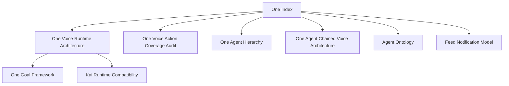

# Hussh One Index

## Visual Map

One is the private agent and relationship layer. Current-state One reference
docs live here when they describe One-owned product contracts rather than a
finance-specialist implementation detail.

Current repo truth:

- One owns the product-facing voice surface and shared transition contract.
- Kai remains the mature finance specialist runtime and compatibility authority
  for several checked-in voice/action execution paths.
- Nav owns privacy, consent, vault, deletion, and scope-review language.
- KYC owns bounded identity and verification workflows.

Do not put broad One product claims under the Kai reference home. Use this index
for One-owned current-state contracts, use [../kai/README.md](../kai/README.md)
for finance-specialist runtime references, and keep future-only One plans under
[../../future/README.md](../../future/README.md).

## References

- [one-voice-runtime-architecture.md](./one-voice-runtime-architecture.md): current One Voice runtime: ADK `Runner.run_live` over Vertex, One's root agent tree (google_search, open_screen, AgentTool Finance/RIA, specialist turn tools), the browser wire protocol, relay ticket auth, and the consent/directive boundary.
- [one-goal-framework.md](./one-goal-framework.md): governed goal planning and running across Gemini Live voice, Agent Chat, typed search, command bar, and UI action buttons.
- [one-agent-hierarchy.md](./one-agent-hierarchy.md): current One-led app agent hierarchy, A2A/specialist registry, consent authority cascade, and Codex subagent boundary.
- [gemini-runtime-configuration.md](./gemini-runtime-configuration.md): Connections-owned managed Gemini and Google AI Studio BYOK boundary for typed turns and live voice.
- [one-voice-action-coverage-audit.md](./one-voice-action-coverage-audit.md): current audit of what One Voice can trigger and where screen/button/action coverage is incomplete.
- [one-voice-kai-compatibility-runtime.md](./one-voice-kai-compatibility-runtime.md): compatibility runtime details for the Kai-era planner, composer, STT/TTS policy, and settlement path beneath the One Voice contract layer.
- [../../vision/agent-ontology.md](../../vision/agent-ontology.md): Hussh / One / Kai / Nav / KYC role contract.
- [one-voice-onboarding-journey.md](./one-voice-onboarding-journey.md): the One Voice onboarding journey and its state contract.
- [feed-notification-model.md](./feed-notification-model.md): the cross-domain Feed route (`/one/feed`) that replaced the top-bar `ActivityInbox` bell — the `feed_events` table, its six domain write paths (Consent, Location, Kai, KYC, Connected Systems, Connections), read/unread semantics, and the bottom-nav tab.
