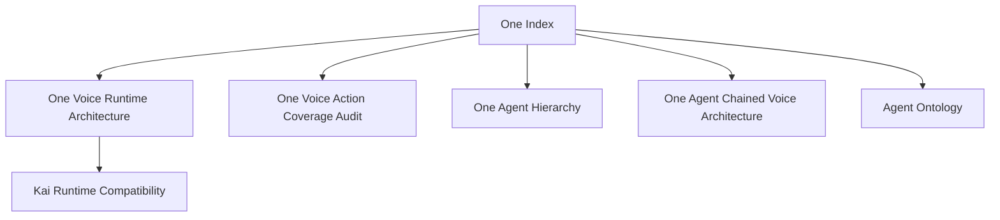

# Hussh One Index

## Visual Map

One is the personal agent and relationship layer. Current-state One reference
docs live here when they describe One-owned product contracts rather than a
finance-specialist implementation detail.

Current repo truth:

- One owns the product-facing voice surface and shared transition contract.
- Kai remains the mature finance specialist runtime and compatibility authority
  for several checked-in voice/action execution paths.
- Nav owns privacy, consent, vault, deletion, and scope-review language.
- KYC owns bounded identity and verification workflows.

Do not put broad One product claims under the Kai reference home. Use this index
for One-owned current-state contracts, use [../kai/README.md](../kai/README.md)
for finance-specialist runtime references, and keep future-only One plans under
[../../future/README.md](../../future/README.md).

## References

- [one-voice-runtime-architecture.md](./one-voice-runtime-architecture.md): current One Voice foundation: shared FSM, redacted context snapshot, provider-adapter seam, and `/api/one/voice/*` wrappers over the Kai-era compatibility runtime.
- [one-agent-hierarchy.md](./one-agent-hierarchy.md): current One-led app agent hierarchy, A2A/specialist registry, consent authority cascade, and Codex subagent boundary.
- [one-voice-action-coverage-audit.md](./one-voice-action-coverage-audit.md): current audit of what One Voice can trigger and where screen/button/action coverage is incomplete.
- [one-agent-chained-voice-architecture.md](./one-agent-chained-voice-architecture.md): One Agent popup voice chain using Gemini STT/TTS around the existing text Agent, including transient audio boundaries, app-wide voice state, settings, and kill switches.
- [one-voice-kai-compatibility-runtime.md](./one-voice-kai-compatibility-runtime.md): compatibility runtime details for the Kai-era planner, composer, STT/TTS policy, and settlement path beneath the One Voice contract layer.
- [../../vision/agent-ontology.md](../../vision/agent-ontology.md): Hussh / One / Kai / Nav / KYC role contract.
