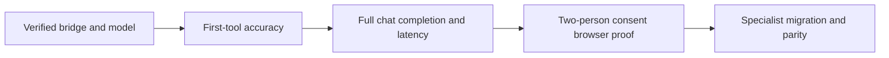

# Agent Chat migration measurements

This record separates saved measurements from checkpoint claims. The specialist implementation phases are landed on the migration branch, while several live before/after parity gates remain incomplete. Generated historical run artifacts are preserved in the local regression evidence workspace and are intentionally not tracked.

## Visual Map



Each gate requires its own evidence. Passing first-tool accuracy does not prove successful tool execution, persisted chat completion, or consent behavior.

## Before evidence

| Measurement | Revision | Result | Limitation |
| --- | --- | --- | --- |
| One first-tool, Gemini 3.7 Flash, two repetitions | `d81ada537879e7ba8125165df81572e3c18ad22b` | 46/52 cases; p50 5,126.2 ms, p95 16,238.6 ms | Saved artifact fails overall, Calendar and Finance gates. The older checkpoint reports 52/52 after widening six expectations; that is not a fresh model run. |
| One first-tool, Gemini 3.7 Flash, fresh two-repetition run | `207792d6bc45625fe4adb40f5d0f6936fd7247f3` | **52/52**, all eight families pass; 104 calls | Current revised fixture. Timings p50 5,208.0 ms / p95 11,557.6 ms include the old two-second pacing delay; not pure inference latency. |
| Nav keyword shim, 22 cases × 3 repetitions | `b80a2169ed5d7f00f4f23b417403e9834e2317b5`, dirty harness additions | First-tool-equivalent and shape: 14/22 (63.64%); p50 0.603 ms, p95 0.754 ms | Fixture-backed service calls, no model calls or network latency. `effective_model=null`; model labels are comparison metadata only. |
| Agent Chat route, 10 prompts × 3 | Historical September 14 checkpoint; artifact has no source revision | 28/30 finished; first-visible p50 8,823.6 ms / p95 53,413.7 ms; total p50 19,708.7 ms / p95 69,638.2 ms | Quota-distorted, two execution-bound failures; server timing unmatched. Not a comparable release baseline. |
| Agent Chat route, fresh 3.7, 10 prompts × 3 | `207792d6bc45625fe4adb40f5d0f6936fd7247f3`, isolated no-reload backend | **25/30 finished**; first-visible p50 5,453 ms / p95 27,975 ms; total p50 9,420 ms / p95 77,941 ms | All 30 persisted model receipts verify 3.7. Three finance serialization errors, one Vertex 429 and one timeout remain failures. Both latency ceilings fail. |
| Gemini 3.8 Flash, global | Integration of `b80a2169e` and `a1850ff4b`, uncommitted merge | Initial attempt: HTTP 499; repeat: 9 completed cases, then HTTP 504 after 399,288.6 ms | Repaired harness saved completed repetitions and marked 43 cases incomplete/unattempted. Accuracy is null; the gate fails. User authorized continuing on 3.7. |

Historical Gemini 3.7 saved family accuracy (the fresh run passes all families):

| Family | Correct / total |
| --- | --- |
| Consent | 13/13 |
| Delegation | 5/5 |
| Email | 5/5 |
| Location | 8/8 |
| Memory | 4/4 |
| General | 5/6 |
| Finance | 5/7 |
| Calendar | 1/4 |

The fresh first-tool accuracy run is saved under `artifacts/regression/before-20260914-continuation/`. The pacing correction is committed as `f6cc98d1d`; subsequent reports identify timing semantics explicitly and exclude harness pacing while retaining provider retries. Do not silently rewrite old timings.

The fresh route report and model receipts are retained in the same dated artifact directory. Finance failures reproduce `PydanticSerializationError` during encrypted session encoding; the memory failure is HTTP 429 `RESOURCE_EXHAUSTED` (capacity versus quota is not established). The consent timeout was caused by the driver’s old 90-second deadline, before the backend’s 120-second execution bound; backend generation finalized about one second after the client disconnected. Subsequent measurements must explicitly record the corrected window. A slow consent turn includes approximately 31 seconds before its tool and 54 seconds after it, without a correlated provider retry. These are separate causes, not evidence that every delay is quota-related.

The isolated measurement server was stopped after receipt verification; its port was confirmed closed. Commit `bab92576e` corrects telemetry that previously relabeled terminal streams as client disconnects when consumers closed them. It passed the full backend runner: 3,052 passed, 111 skipped. This telemetry correction does not turn failed chats into successes.

## Reproduction

Run from `consent-protocol` with the existing environment loaded in process; never copy credentials into reports.

```sh
.venv/bin/python scripts/eval_one_first_tool.py --model gemini-3.8-flash --reps 2 --report-dir artifacts/regression/before
.venv/bin/python scripts/eval_specialist_turns.py --specialist nav --mode baseline --model both --runs 3 --report artifacts/regression/before/nav_specialist_turns.json
```

The specialist harness exercises the public handler with synthetic service fixtures. The migrated source supports `--mode adk` and rejects baseline mode so it cannot mislabel model calls as the old keyword runtime. Infrastructure errors are not tool-selection misses; incomplete runs fail the gate and retain unattempted cases. Do not overwrite historical artifacts when collecting comparable before/after runs.

## Current prerequisites

- Local and UAT Gemini configuration both select `hushh-vertex-personal54` with `global`; native UAT infrastructure remains `hushh-pda-uat`. The personal account is confirmed project owner. Local ADC authenticates as `kushal@hushh.ai`; selecting the bridge project does not require replacing infrastructure credentials. This checks routing, not billing-credit availability.
- The user waived two-person reviewer browser acceptance. It was not run and is not reported as passed; counterpart setup is no longer a prerequisite.
- Real PostgreSQL lifecycle proof passed with the complete canonical legacy schema plus current init/release migrations. Empty-database `--init` alone still lacks the Gmail foundation required by migration 039.
- `tests/test_pod_architecture_is_authoritative.py` is absent from this branch. The old plan names a gate from another branch; it must not be reported as passed here.
- Official A2A compatibility remains `ADK_A2A_SDK_MATRIX_UNVERIFIED` despite the local hierarchy/compliance checks passing.

## Targeted runtime corrections

Commit `77a842056` repairs deferred SDK model serialization before encrypted persistence, preserving the original event objects and encryption format. Regression coverage is now included in the backend CI manifest. With the driver-window regression in `82c7f2acb`, the full backend runner passed **3,061 tests**, with **111 skipped**. The driver now allows 120 seconds; first-visible and total latency ceilings remain 8 and 30 seconds.

A targeted repeat of the identical finance prompt completed **3/3**, versus **0/3** before. All three persisted model receipts confirm Gemini 3.7 Flash. First-visible p95 was **7,745 ms**; total p95 **32,558 ms** still exceeds the unchanged 30-second performance ceiling. This proves the observed serialization failure is resolved in this run, not general performance acceptance. Reports remain under `artifacts/regression/serialization-fix-20260914/`.

Consent visibility also completed **3/3** with the corrected 120-second driver window, and persisted receipts confirmed 3.7 for all three. Durations were **72.7, 98.4 and 104.7 seconds**. First-visible p95 **70,680 ms** and total p95 **104,029 ms** fail the unchanged performance gates. The two longer turns demonstrate why the old 90-second cutoff was premature; they do not establish acceptable latency.

A single memory-preference recheck completed in **10,963 ms**, passed its latency bounds, and persisted a 3.7 model receipt. No 429 recurred in this recheck; one successful retry does not prove provider quota or capacity issues are eliminated. All seven targeted follow-up chats completed. The task-owned server was stopped afterward and its port was verified closed.

## After evidence

The implementation phases below are landed in this continuation. Record each phase's
revision, identical fixtures/model/configuration, per-family accuracy, latency and
retained failures here before claiming behavioral parity. A passing source or unit
gate does not substitute for an unrun live-provider measurement.

### Phase H cleanup: retired summary reducer

The unused `agent_summary_reducer` manifest and its generated registry and hierarchy
entries were removed in `b8e5ff1fb`. Active documentation was then corrected to remove
the retired name and stale package count in `414446811`. A repository search now finds
no active `summary_reducer` reference. The focused manifest and authority suites pass
(`120 passed`), and the full protocol gate passes (`4,025 passed, 191 skipped`), with
the unrelated live-provider failures below still retained as acceptance evidence.

### September 16 Email auxiliary genes

The remaining Email-owned model calls are now manifest-owned single-turn genes in
`3ccb254a9`: the opt-in personal-information request classifier and the bounded
receipt extractor. Their services use the shared Email single-turn runtime with
schema-constrained outputs and turn-local authority sentinels; no direct
`google.genai` generation path remains in either classifier. Existing read-only,
fail-closed behavior and deterministic receipt classification remain unchanged.
The generated product-agent registries are current.

Static checks and focused verification passed: Python compilation, Ruff, registry
freshness, Email runtime/manifest/registry tests, and the Gmail classifier/receipt
service tests yielded **117 passed**. One unrelated pre-existing test failed because
the branch's migration manifest ends at `223_one_location_setup_progress.sql`, while
that test still assumes the Gmail migration `220_gmail_personal_information_request_initial_inbox_scan.sql`
is last; no schema-order change was made here. No live Gemini calls were issued.

### September 16 deterministic ADK/conformance gate

The current branch reran the offline acceptance surfaces without contacting Gemini:

```sh
cd consent-protocol
UV_CACHE_DIR=/tmp/hushh-uv-cache uv run pytest -q \
  tests/test_nav_conformance.py tests/test_conformance_harness.py \
  tests/test_one_adk_agent_tree.py tests/test_adk_dispatch.py \
  tests/test_hushh_adk_single_turn.py tests/test_hushh_adk_manifest_and_factory.py
```

The result was **288 passed, 74 skipped** in 15.47 seconds. This covers the recorded
Nav/Consent replay, conformance harness invariants, agent-tree authority checks, dispatch,
single-turn runtime, and manifest/factory contracts. It is deterministic source evidence;
it does not replace the outstanding live Gemini parity, latency, or final chat acceptance.

### Phase G routing decisions

Calendar remains on One's existing deterministic toolset. The measured Gemini 3.7
first-tool gate was **1/4** for the Calendar family, below the migration precondition;
no `ask_calendar_agent` child was introduced. Re-run the comparable family fixture
before reconsidering that boundary. KYC's four bounded drafting and extraction calls
are now manifest-owned single-turn genes, with the current service contracts and
unit fakes preserved for deterministic tests.

The live KYC routing fixture was run against the personal Vertex bridge on
`gemini-3.7-flash` at commit `9fb674ea8`: **8/10 (80%)**, meeting the explicit
`MIN_ACCURACY = 0.8` gate. The two retained misses were the financial-only
classification label and a travel-preference request; both remain visible in the
fixture output. An earlier live attempt exposed a `gemini-default` alias being sent
literally and returning Vertex 404; the shared single-turn factory now resolves that
alias through `HUSHH_GEMINI_TEXT_MODEL`. No 3.8 live result is claimed here.

### Phase A live specialist evaluation

The unchanged 22 Nav cases were evaluated through the real public Nav/Consent ADK path on Gemini 3.7, personal54/global. These are synthetic service fixtures with real model calls, not browser or production proof.

| Run | Completed attempts | Strict first-tool / shape | p50 | p95 | Failure evidence |
| --- | --- | --- | --- | --- | --- |
| Initial diagnostic, 1 repetition | 19/22 | 19/22 | 8,881ms | 16,578ms | timeout, resource exhaustion, one ambiguous-question mismatch |
| Low thinking, no redundant root summary, 3 repetitions | 57/66 | 14/22 each | 6,823ms | 22,707ms | seven event timeouts, two resource-exhaustion errors |
| Progress-aware timeout correction, 3 repetitions | 56/66 | 13/22 each | 6,466ms | 22,434ms | seven progress-correlated timeouts, three quota errors |

The first three-repetition run observed 155 model requests. The progress-aware correction observed 150. Every completed attempt matched both tool and shape expectations. All repetitions must pass for a case to pass; failures remain in the denominator. All four unchanged gates failed on both runs: 90% first-tool, 90% shape, p50 ≤4s and p95 ≤8s. No provider failure is relabeled as successful model behavior. The corrected run recorded nested model and tool callbacks as progress; each timeout occurred about 20 seconds after the last observed progress, so it does not prove that the provider was still advancing silently.

A preceding run was interrupted at the user's pause request and is not a completed measurement. Its partial log remains preserved in the local regression evidence workspace. The complete Phase A reports, including `nav-adk-37-acceptance-resumed.json`, are retained there as generated evidence. The measured dirty source was based on `d7c0ce99a` and preserved under the integration worktree's local temporary evidence before subsequent edits. These measurements do not cover A2's later Connections and authority changes.

The shared execution foundation is committed as `06e3373a7`; strict owner/hop primitives as `6e6d150cc`; nested-progress correction as `f2a916a4d`. Phase A's earlier frozen-source checks passed 3,092 backend tests (111 skipped) and 7,146 web tests (six skipped). These passing suites do not override failed live acceptance or establish completion of the remaining migration phases.

### Phase G continuation: Portfolio Import extraction boundary

The resumable Portfolio Import stream now routes its single extraction request
through the manifest-owned `agent_portfolio_import_extract` ADK single-turn gene.
The route preserves the existing canonical SSE stages, terminal payload, strict
top-level extraction keys, deterministic PDF excerpt selection, and the original
document part when required. The model is resolved from `gemini-default` through
the shared fleet resolver; the route no longer calls the provider streaming API
directly. This phase has unit and source-contract coverage, but no live brokerage
document run has been claimed. The legacy non-stream `PortfolioImportService`
relevance, comprehensive extraction and holdings parsing paths now use the three
manifest-owned Portfolio Import genes through the shared runtime adapter; no
provider client is constructed directly by those parser paths. A live brokerage
document run remains unclaimed, and other specialist loops remain in the migration
queue.

Location voice transcription is declared as `agent_location_transcriber` and
uses the same bounded single-turn runtime with an audio-only input contract.
The route passes the authenticated owner token into the turn, while the
existing WAV validation, silence guard, and bounded transcript output remain
unchanged.

The Memory Agent's background attribute learner is also declared as
`agent_personal_information_attribute_learner` and uses the same bounded
single-turn runtime. It extracts explicit claims only; PKM mutation events
remain owned by the existing service, and the learner has no write tools.

RIA brochure enrichment is now declared as `agent_ria_brochure` and uses the
shared single-turn runtime for public Form ADV narrative extraction. Filing
selection, size/page/text bounds, defensive shaping, and best-effort profile
writes remain unchanged. The focused RIA route and brochure suites pass; no
live filing run is claimed by this phase.

Kai portfolio optimization is now declared as `agent_kai_portfolio_optimizer`
and uses the shared single-turn runtime for both typed and SSE entrypoints.
The SSE route emits the existing stage/chunk/complete envelope while polling
one bounded model task, and disconnects cancel that task. Renaissance context,
request validation, and deterministic fallback behavior remain route-owned;
no trade or external write is performed by the gene.

### Phase F continuation: legacy Kai chat authority path

The product-facing `/api/kai/chat` route now passes the authenticated vault-owner token into
the manifest-owned `agent_kai_chat` ADK chat child. The service keeps its existing conversation,
PKM context, response validation, component hints, and safe fallback contracts; only the
authoritative generation path changes. Unauthenticated direct service tests retain their
provider fixture seam, while authenticated route traffic uses one bounded ADK model call with
the shared managed Vertex adapter and no child transfer. Commit `34be51bd8` adds runtime,
route, manifest-boundary, and auth-matrix coverage. Focused Kai tests pass (96/96), and the
full backend runner passes (3,867 passed, 191 skipped). A live provider run is not claimed by
this source phase; the existing route/latency evidence above remains the acceptance record.

### Phase F continuation: Kai analyst operons

Fundamental, sentiment, and valuation analysis now use the manifest-owned
`agent_kai_fundamental`, `agent_kai_sentiment`, and `agent_kai_valuation`
single-turn genes through the shared ADK runtime. The analysts still own their
existing consent-checked data fetches and deterministic fallbacks; only the
structured Gemini generation seam moved. JSON response shapes and downstream
`FundamentalInsight`, `SentimentInsight`, and `ValuationInsight` adapters are
preserved. Commit `0b95acce6` adds the three manifest contracts, shared runtime
dispatch, and operon routing tests. Focused Kai manifest/runtime/operon checks
pass (45/45); the full backend runner passes (3,867 passed, 191 skipped).
A live analyst/debate measurement is not claimed by this phase, so the existing
failed or incomplete performance evidence remains in the acceptance record.

### Phase F continuation: Kai DebateEngine boundary

Authenticated Kai debate turns now use the manifest-owned `agent_kai_debate`
single-turn gene through the shared ADK runtime. The route passes the owner and
consent authority into the engine, while the existing SSE event envelope and
XML-compatible statement parsing remain unchanged. Unauthenticated unit
fixtures retain the legacy stream seam because they do not carry product
authority. If the bounded ADK call fails, the engine emits its existing
redacted error and deterministic statement fallback; it does not retry a
completed tool action. Commit `9f5a52d2a` adds the manifest contract, generated
registry projections, route wiring, and authenticated-routing coverage.
Focused debate tests pass (70/70); the full backend runner passes (3,867
passed, 191 skipped), and the One Voice web gate passes (362/362). No live
Gemini debate run is claimed here, so provider latency, quota behavior, and
end-to-end debate quality remain open acceptance work.

### September 16 continuation: Gemini 3.8 live Nav acceptance

The unchanged 22-case Nav fixture ran once on `gemini-3.8-flash` through
`hushh-vertex-personal54/global`, at `0e896f20581323ab6a78f04d2ec51db61cab20b6`.
The report marks the tree dirty because conformance-test scaffolding was added
while the run was active; production Nav/Consent source was unchanged during it.
The live report is `artifacts/regression/after-20260916/nav-adk-38-current-1x.json`.

- First-tool and response-shape rates: **21/22 (95.45%)** each.
- Median latency: **7,669.7 ms**; p95: **13,875.6 ms**; maximum: **18,712.6 ms**.
- Observed ADK model requests: **54** (not a count of transport retries).
- `explain_revoke` failed with provider `429 RESOURCE_EXHAUSTED`; it remains in
  the denominator. No quota-versus-capacity cause is established.
- The 90% accuracy thresholds passed for this single repetition; the unchanged
  median ≤4s and p95 ≤8s gates failed. This is not three-repetition acceptance,
  Connections coverage, or full One chat completion proof.

Reproduce with the existing process-local environment loaded, selecting the
personal54 bridge and `GOOGLE_CLOUD_LOCATION=global`:

```sh
.venv/bin/python scripts/eval_specialist_turns.py --mode adk \
  --model gemini-3.8-flash --runs 1 \
  --report artifacts/regression/after-20260916/nav-adk-38-current-1x.json
```

The CLI rejects an existing report path; choose a new path for a repeat. Official
A2A v1 Kai rehearsal remains explicitly deferred by the approved plan, rather
than a newly added migration acceptance requirement. Real-model conformance
recordings, downstream specialist measurements and final full-chat performance
remain separate acceptance requirements.

### Nav/Consent real-model conformance

Two fixture-only Gemini 3.8 recordings now live under
`consent-protocol/tests/conformance/nav/`: active sharing and revoked history.
They use the production Nav builder, a real Consent child and synthetic
owner/service boundaries. Offline replay checks parent/child model requests,
leaf calls, actions and complete outer session state with a refusing model and
socket guard. Three focused tests pass, including rejection of tampered child
arguments and recorded responses. The test is included in the backend CI manifest.

ADK 2.9's stock plugins drop nested plugin configuration, overwrite the shared
recording file and skip AgentTool execution during replay. Test-local adapters
preserve these specific sequential Nav/Consent exchanges without changing
production behavior. They do not establish general concurrent-graph replay,
Connections or public-wrapper acceptance. Fixture documentation records that
boundary and regeneration procedure. Live latency and other specialist
acceptance remain open.

The full repository backend runner after adding this replay suite passed:
**3,870 passed, 191 skipped**, followed by the all-test-file import check.
Concurrent frontend/One-manifest edits from another session were preserved;
this evidence does not certify those separate changes or waived browser flows.

### September 16 downstream runtime acceptance

The synthetic PKM release chain ran on Gemini 3.8 through personal54/global with
shadow reads disabled. The first run stopped on case 10 with `schema_invalid`,
but the evaluator raised before saving its report. Its log remains local;
no aggregate accuracy is claimed for that lost partial report. The evaluator
now saves partial fail-fast results and unattempted counts, distinguishes outer
timeouts from other exceptions without saving exception messages, and lets the
45-second runtime budget finish before its own cancellation boundary. Quality
thresholds are unchanged. A stale import test that expected keyword fallback on
an unavailable model now asserts the current fail-closed response.

The corrected run (`after-20260916/pkm-38-release-chain-v2.json`) evaluated **7/24**
cases in **135.69s**, retaining **17 unattempted**. It stopped on an inner
structure-agent timeout (30,001.61ms); the outer evaluation captured the result
at 44,956.84ms rather than mislabeling it as an outer timeout. Domain accuracy and
durable-domain coverage were **71.43%**, fallback **14.29%**. The run fails its
unchanged quality gates. A provider429 also occurred; that alone does not prove
the cause of the later timeout.

The existing `run_kai_accuracy_suite.py` benchmarks direct-provider PDF extraction,
not migrated Kai analyst/debate/chat execution. The new fixture-only
`eval_kai_adk_synthetic.py` exercises six actual runtime paths, requires expected
agent/model receipts, rejects fallback as completion, checkpoints each result
and refuses to overwrite historical reports. It is explicitly a smoke test,
not a financial accuracy benchmark or full debate/HTTP persistence rehearsal.

Live report `after-20260916/kai-adk-synthetic.json` records source `2790418ae`
with a dirty working tree (new evaluator plus concurrent unrelated edits):

| Runtime path | Result | Duration |
| --- | --- | --- |
| Fundamental analyst | Passed | 5,620ms |
| Sentiment analyst | Passed | 2,858ms |
| Valuation analyst | Passed | 2,087ms |
| One debate statement | Passed | 3,699ms |
| Synthesis | Failed: provider429 followed by fallback | 14,548ms |
| Chat with supplied synthetic context | Passed | 6,331ms |

All six observed the expected manifest agent and Gemini 3.8 model. The five
successes do not erase the synthesis failure, establish before/after accuracy,
or complete migration acceptance. The ignored local regression outputs are
retained for inspection; all model inputs in these runs were synthetic.

Verification of the evaluator changes: full backend runner **3,918 passed,
191 skipped**, followed by the all-test-file import check; focused evaluator
suites **48 passed**. Synthetic-only runs now omit unused shadow-user identifiers
from newly generated reports. No runtime quality threshold was relaxed.

### September 16 PKM low-thinking follow-up

The five sequential PKM manifests now explicitly author `thinking_level: low`.
The shared single-turn builder test proves that this becomes the provider's
`LOW` thinking configuration for every stage; a missing level would leave the
Gemini provider default (`MEDIUM`) in effect. The strict prompt allowlist also
retains every selectable canonical and owner-defined domain, while excluding
reserved, internal, malformed, and overlong keys. The model remains the semantic
owner; this change does not add deterministic routing.

The fresh release-chain runs below use the same synthetic fixtures and bounded
45-second preview budget. They are retained as infrastructure evidence, not
completion claims:

| Run | Evaluated | Contract result | Failure evidence |
| --- | ---: | --- | --- |
| Gemini 3.8 Flash, personal54/global | 1/24 | schema, intent, mutation, and domain each 100% for the completed case | global Vertex 429; inner timeout; 23 cases unattempted |
| Gemini 3.7 Flash, personal54/global | 2/24 | schema, intent, mutation, and domain each 100% for completed cases | global Vertex 429; fallback 50%; inner timeout 1; inner budget exhausted 2; 22 cases unattempted |

The local run outputs are retained as `pkm-38-low-thinking.json` and
`pkm-37-low-thinking.json` under the operator's ignored regression-artifact
directory. Both runs show the bridge is reachable and the 429 is quota/rate
limiting in the selected personal project. They do not prove quality-gate
completion; a comparable run after quota recovery is still required.

### Core runtime review closure (September 16)

The post-migration source review found and corrected three shared single-turn
issues: a process-global schema map keyed by object identity, missing local
validation for dictionary response schemas, and an implicit 30-second event
cutoff inside longer caller deadlines. The runtime now uses the agent's own
schema, validates dictionary schemas with the already-locked jsonschema package
(declared directly), and gives the one tool-free call its caller-bounded deadline.
No retry or model-call budget was increased.

Focused offline verification: 53 single-turn, Email, Kai routing/runtime and
evaluator tests; 11 portfolio optimizer and ADK foundation tests. All 64 passed.
The agent hierarchy verifier passed. No live Gemini calls were made.

The manual Kai evaluator now supports selected paths, sequential pacing and
stop-on-first-failure with unattempted cases retained. Its CI tests use mocks.
The earlier live synthesis 429 is not a CI synthesis workload. Future verification
should reuse passing evidence and run only failed paths after capacity recovers.

These corrections close the identified core source defects, not the historical
live accuracy/latency failures. Full migration acceptance still requires the
outstanding comparable PKM/Kai and final chat evidence above; no failed result
has been relabeled as a pass. Generate and check dependent artifacts together
before a single push, rather than using successive remote runs for discovery.

### Admin landing integration verification (September 16)

PR #6803 integration exposed stale `route.one_agents` action metadata from main,
a roster prop mismatch, an accessibility verifier tied to only `aria-label`,
and unused frontend declarations. Preserve the published action semantics,
accept either a direct accessible label or its existing linked Agents heading,
and regenerate gateway, graph, workflow catalog and topology together.
The roster retains its caller-compatible prop type. Frontend cleanup removes
unused bindings and captures the recipient-loader callback for its effect.

Full backend runner: 4,032 passed, 191 skipped; lint, type analysis and security
checks passed. Generated contract verification and 19 offline voice tests passed.
These checks made no live Gemini requests. Admin identity and live main branch
protection were verified; landing still requires exact-head remote CI success.

The existing Location regression pack exposed two main-integration behavior
regressions: the visible status button had no toggle handler, and duration
editing bypassed the owning callback that records the focus-return trigger.
Both paths now use their existing callbacks, including each share lane's trigger.
The accompanying stale layout/copy assertions now verify current accessible
labels, keyboard order, command-capture ownership and preserved routing.
The pack initially passed 1,054/1,069; the five affected files passed 181/184
after correction, and all three remaining cases passed on their focused rerun.
TypeScript and lint for the affected files passed. No live provider tests ran.
