# Calendar meeting reminders

## Visual Map

```mermaid
flowchart LR
  prefs[Calendar reminder preferences] --> scan[OIDC scheduler and live Google reads]
  scan --> queue[Encrypted locator and leased reminder]
  queue --> verify[Recheck meeting and current Calendar access]
  verify --> push[FCM Android or APNs iOS alert]
  push --> unlock[Tap then login and vault unlock]
  unlock --> feed[Exact meeting pinned in Feed]
  feed --> join[Explicit Join Meet and fresh URL validation]
```

Calendar settings let the owner enable a phone reminder ten minutes before a
timed meeting in the primary Google Calendar. A separate title preference
controls lock-screen preview. Title preview is selected in the new settings
flow, with visible disclosure before saving; the migration default remains
private and reminders remain off until the owner enables them. Allow One
notifications on the phone. Web settings can manage the same preference, while
this reminder transport targets iOS and Android registrations.

The server reads expanded recurring occurrences in a rolling 24-hour window.
All-day, cancelled, declined-self and non-default event types are excluded.
Timed events without a Meet link still remind; Join appears only for a validated
Google Meet link, from fifteen minutes before start until end. Meeting details
remain in React memory after vault unlock. Feed stores no meeting title or URL.

## Contracts and privacy

| Endpoint | Admission | Outcome |
| --- | --- | --- |
| `GET/PUT /api/one/calendar/reminders/preferences` | Firebase owner | Enabled, title preview, IANA time zone, fixed 10-minute offset and rollout availability |
| `GET /api/one/calendar/reminders/{UUID}` | Vault owner | Resolve only that owner's opaque reminder against current Google contents |
| `POST /api/one/calendar/meetings/join` | Vault owner | Revalidate current event, time window and HTTPS `meet.google.com` link |
| `POST /api/one/calendar/reminders/drain` | Dedicated Google OIDC scheduler | Bounded aggregate counts; no event titles, user identifiers or provider errors |

The existing One catch-all proxy forwards browser calls; ApiService sends native
calls directly to the backend. The scheduler accepts only
`calendar-meeting-reminders@hushh-pda-uat.iam.gserviceaccount.com` with audience
`https://api.uat.hushh.ai` in UAT/test/local/development, or the corresponding
`hushh-pda` account and `https://api.hushh.ai` audience in production. Firebase
user tokens and the Mail scheduler identity do not authorize the drain.

Migration285 stores owner preferences, HMAC occurrence fingerprints, timing,
leases, revisions and encrypted provider locators/cursors. Encryption uses the
existing Google OAuth key and owner/purpose-bound AES-GCM. Account reconnection
gets a new occurrence identity; an old alert cannot resolve another account's
meeting. Meeting title, attendees, description, location, join URL, vault keys,
owner session tokens and duplicate raw device tokens are absent from this queue.
Title preview crosses FCM/APNs only when selected. App events and logs sanitize
Calendar push contents to routing metadata and generic copy.

Current Google account/grant, preference generation, lease and current event
start are checked before committing a send. Disable/disconnect blocks uncommitted
work. A push already committed to an external provider cannot be recalled.
FCM acceptance is recorded per target/revision and skipped on retry. A crash
between provider acceptance and ledger commit can still cause a duplicate;
Android tags and APNs collapse IDs reduce it, without claiming exactly-once
delivery. Offline payload expiry is the meeting start; a banner already displayed
on a phone may remain until the owner clears it.

The worker prioritizes due reminders, claims five sends or three scans at a
time, fits claims inside their 90-second leases, and uses a 45-second work budget.
Each run considers at most 100 due reminders and 60 accounts, with
at most 2 pages of 250 events per scan and one page-one restart for an invalid cursor. Dense calendars continue the same encrypted
fixed window on a subsequent minute tick. Each send is bounded to 20 seconds,
each scan to 10 seconds, and the HTTP/scheduler deadline is 55 seconds. Accounts normally reconcile every five minutes;
partial scans/errors retry after a minute. Attempts cap at six before start.
Successful targets are retained across privacy-setting changes. Terminal rows
ending more than 24 hours ago are deleted in bounded batches of 500, with receipt
cascade. Account deletion cascades all reminder state.

Meeting edits shortly before delivery are checked live; edits after the final
provider read may race an already committed push. New events are subject to scan
cadence, provider availability and workload. Monitor backlog and scheduler error
counts before broad rollout; increase scheduler throughput under the same lease
contract when meeting/account volume exceeds one job's budget. This version uses
polling rather than Google watch channels. Push arrival also depends on OS
notification permission, focus/battery settings, connectivity and provider health.
Existing registration remains one token per owner/platform (latest registration
wins); this PR does not promise multiple devices on the same platform.

## Testing and rollout before main

This PR must be tested before merge. Default `CALENDAR_REMINDERS_ENABLED=false`
keeps the scheduler unavailable and prevents enabling new reminders. The canonical
runtime JSON key is `calendar_reminders_enabled`; the runtime secret sync command
accepts `--calendar-reminders-enabled`, defaulting to false. No deployment or
external scheduler change is performed by the code change itself.

1. Apply migration285 to the isolated test/UAT database using the existing
   release migration workflow and deploy the PR backend plus matching native app.
2. Ensure existing Google OAuth encryption and Firebase Admin/APNs credentials
   are available. Keep owner/session/vault credentials out of logs and artifacts.
3. Prepare the dedicated job with
   `bash scripts/ops/configure_calendar_reminder_scheduler.sh uat <scheduler-region>`.
   The script leaves it paused. Keep the project Cloud Scheduler service agent's
   existing token-creation role; give the operator permission to act as this
   dedicated account. If Cloud Run ingress is IAM-protected, grant only its
   required invoker access to this account.
4. Enable the runtime flag for the test deployment, explicitly resume the job,
   and enable Calendar reminders/title preview in the app on each test phone.
5. Create an ordinary Meet event at least 15 minutes ahead. On iOS and Android,
   background/close One, lock the phone, observe the title reminder near the
   ten-minute boundary, tap, authenticate/unlock if needed and join from Feed.
6. Repeat cancelled/rescheduled/declined events, two recurring occurrences,
   no-link/all-day events, multiple due meetings, time-zone changes, permission
   denial/re-enable, logout/account switch, network loss, scheduler overlap and a
   selected event outside the first three Feed rows. Expired/cancelled taps must
   show an unavailable outcome; Join must reject stale links.
7. Inspect aggregate counts and FCM acceptance alongside physical-device arrival.
   Unit/static/build checks alone do not prove APNs/FCM delivery. iOS native
   compilation requires macOS/Xcode; physical delivery requires provisioned phones.

Rollback: turn the runtime flag off and pause the job first. Owner settings remain
readable and can be disabled. Old alert taps fail safely when their row is gone.
After reverting the matching callers/backend, use
`db/migrations/rollback/285_calendar_meeting_reminders.rollback.sql` to remove
only reminder operational state. Google Calendar events and sibling grants remain
untouched.
