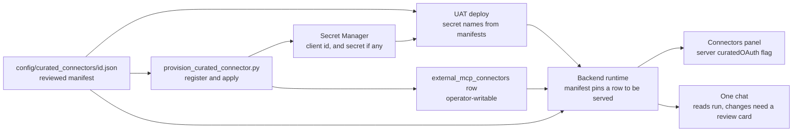

# Curated MCP Connectors

A curated connector is an operator-registered OAuth MCP provider (HubSpot,
Notion and Attio today) that an owner connects from Connectors and then uses in
One chat. Everything the application must not take from the operator-writable
registry is kept in one reviewed, checked-in file per provider.

## Visual Map



## What the manifest holds

Each `*.json` file in `consent-protocol/config/curated_connectors/`, schema
`curated-connector.v1`, is parsed strictly: an unknown key, a non-HTTPS address
or a malformed name is an error, and a provider whose manifest does not validate
is never served.

| Field | Meaning |
|---|---|
| `mcpEndpoint`, `oauth.authorizeUrl`, `oauth.tokenUrl`, `oauth.scopes` | The pins a live registry row must equal exactly. A row that differs is not served. |
| `oauth.registrationUrl` | Required for a public client. Dynamic-registration metadata must equal this public HTTPS URL exactly; it may be cross-origin only because this reviewed pin allows it. |
| `oauth.issuer` | Optional reviewed authorization-server issuer. Stripe's distinct issuer additionally requires matching protected-resource metadata; this is not permission to trust arbitrary cross-origin discovery. |
| `oauth.tokenEndpointAuth` | `client_secret_post` (client id and secret) or `none` (public client, PKCE only, no secret). |
| `oauth.clientIdEnv`, `oauth.clientSecretEnv` | Named `<ID>_OAUTH_CLIENT_ID` and `<ID>_OAUTH_CLIENT_SECRET`. A public client names no secret. The Secret Manager name equals the variable name. |
| `tools.allowlist` | The exact tools chat may offer. |
| `tools.freeRead` | The subset that may run without a review card. A tool must also be annotated read-only by the server itself. |
| `environments.<env>.registeredRedirectUris` | The return addresses the registry row is applied with. |

Every tool outside `tools.freeRead` keeps an exact-call review card. A provider
with no free-read tools keeps a card on every call.

## Adding a provider

1. Before finalizing a runtime manifest, obtain the provider's authenticated
   `tools/list` result under separately authorized operator testing. Review the
   exact allowlist from that result. Put a tool in `freeRead` only when the
   provider annotates it read-only; all other tools retain the review card.
2. Write the provider's JSON file in `config/curated_connectors/` and open a PR. Review of this
   file is the gate: it decides endpoints, scopes, which tools exist and which
   skip review. The contract test `tests/services/test_curated_connector_manifest.py`
   runs over every manifest with no new test code.
3. Provision the client.
   - Public client (`none`): `python3 scripts/ops/provision_curated_connector.py register <id> --env uat --store --dry-run`
     shows the exact request. Run it again without `--dry-run` to register and
     store the client id. The script checks the provider's issuer plus
     authorization, token, and registration endpoints against the manifest
     first, and refuses to register twice because a second registration would
     orphan existing grants. An optional `--extra-redirect` is limited to the
     canonical HTTP loopback callback used by a development frontend.
   - Confidential client: create the app in the provider's dashboard, then store
     the two values under the manifest's names with `gcloud secrets create`.
4. `python3 scripts/ops/provision_curated_connector.py apply <id> --env uat --operator you@hushh.ai`
   writes the registry row from the manifest. Applying a hand-edited descriptor
   for a manifest provider is refused.
5. `python3 scripts/ops/provision_curated_connector.py status <id> --env uat`
   reports which secrets exist.
6. The deploy derives secret names from the manifests
   (`scripts/ci/curated_connector_secrets.py`) and fails when one is missing in
   Secret Manager while `CURATED_MCP_CONNECTORS_UAT` is `true`. No per-provider
   line exists in Cloud Build, the deploy workflow or the coverage baseline.

The frontend needs no change: the Connectors panel offers any catalog entry the
server marks `curatedOAuth`, which is true only for an operator-owned OAuth row
that has a valid manifest.

## Client shapes

- **Confidential** (`client_secret_post`): client id and secret are read from the
  two named variables and sent in the token request.
- **Public** (`none`): only the client id is read. The token request carries the
  PKCE verifier and never a secret. It also pins the provider's public HTTPS
  dynamic-registration endpoint; a manifest or registry row that names a
  secret variable for a public client is rejected.

## Disconnect and provider revocation

Disconnecting always scrubs the local credential first. If the provider publishes
a token revocation endpoint (RFC 7009) in its OAuth metadata, the manifest may
name it as `oauth.revocationUrl`, and disconnect then makes one bounded revoke
call (10 s) with the refresh token, or the access token when there is no refresh
token, and records `revoked` or `failed`. The call is made only for a verified
credential bound to the current OAuth client, to a public HTTPS endpoint, and the
response body is never read or logged.

| Provider | Endpoint advertised | Outcome |
| --- | --- | --- |
| Notion | `https://mcp.notion.com/token` | `revoked` / `failed` |
| HubSpot | none published | `unavailable` |
| Attio | none published | `unavailable` |

For `unavailable`, the grant stays valid at the provider until the person
removes it in that provider's own settings. Add `revocationUrl` to a manifest only
when the provider publishes the endpoint; do not guess one.

## Keeping the registry in step with the manifests

The runtime serves a connector only while its registry row equals the reviewed
manifest (endpoints, scopes, client-variable names and the environment's redirect
addresses). A manifest change that is merged but not re-applied therefore hides
the connector and fails its sign-in closed. The UAT deploy reports this, and an
operator can check it at any time:

```sh
python3 scripts/ops/provision_curated_connector.py verify --env uat
python3 scripts/ops/provision_curated_connector.py verify hubspot --env uat --strict   # exit 2 on drift
```

`verify` only reads. It lists the differing field names, never their values. To
fix a row, re-run `apply <id> --env uat --operator you@hushh.ai`.

## Registration-only bootstrap

Some public providers require OAuth sign-in before their authenticated
`tools/list` response can establish a safe runtime allowlist. Their reviewed
`config/curated_connector_registrations/<id>.json` contract may pin only the
MCP/OAuth endpoints, scopes, public client-id variable and UAT callback. It is
valid for `register` and `status` only:

- it is not read by the runtime catalog, registry apply path or deployment
  secret derivation;
- `status` can say `registrationReady`, but never reports runtime `ready`;
- it cannot be passed to the descriptor CLI or applied as a registry row.

For a public provider such as Attio, the operator first reviews this exact dynamic-registration request:

```sh
python3 scripts/ops/provision_curated_connector.py register attio --env uat --store --dry-run
```

After explicit authorization, run the command once without `--dry-run`. The
request registers `https://uat.one.hushh.ai/one/profile/connectors/oauth/return`
with Attio; do not create a dashboard OAuth app, API key or client secret, and
do not add a callback manually. A separately authorized controlled MCP client
then signs in with the resulting public client, selects the intended workspace,
and captures authenticated `tools/list` plus read-only annotations. Registration
alone does not make Attio appear in One or give it runtime access.

## Attio

Attio is a separate per-owner connector, not a Notion synchronization. Its
verified OAuth metadata uses a protected resource at
`https://mcp.attio.com/mcp` with issuer `https://mcp.attio.com`, while its
authorization, token, and dynamic-registration endpoints are on
`https://app.attio.com`. Attio authenticates as the individual owner, who
selects the intended workspace during sign-in:

```json
{
  "authorizeUrl": "https://app.attio.com/oidc/authorize",
  "tokenUrl": "https://app.attio.com/oidc/token",
  "registrationUrl": "https://app.attio.com/oauth/register",
  "scopes": ["mcp", "offline_access", "openid"],
  "tokenEndpointAuth": "none",
  "clientIdEnv": "ATTIO_OAUTH_CLIENT_ID"
}
```

There is deliberately no `clientSecretEnv`.

### Tool policy

`config/curated_connectors/attio.json` was written from an authenticated
`tools/list` capture (41 tools, each with Attio's own annotations). Attio marks
every write `destructiveHint: true`, including plain creates, so that
annotation cannot separate safe from irreversible writes. The split below is a
reviewed judgement, not something derived from the annotations:

- **36 tools are allowlisted**: 25 reads and 11 writes (record, note, task,
  comment and list-entry create or update, and upsert). Every write goes
  through the review card.
- **19 reads run without review.** Each must still be annotated read-only by
  the live server.
- **6 reads stay behind the review card** even though they are reads: email
  bodies and call recordings (`get-email-content`,
  `search-emails-by-metadata`, `semantic-search-emails`, `get-call-recording`,
  `search-call-recordings-by-metadata`, `semantic-search-call-recordings`).
  They return third parties' private communications and are the widest
  untrusted-content surface.
- **5 tools are not offered at all**: `delete-comment`, `delete-task` and
  `merge-records` (irreversible), and `create-list` and `update-list`
  (workspace structure and permissions).

When Attio adds tools, capture `tools/list` again and review the difference
before widening either list.

### Rollout order

Deploy mounts the secrets of every runtime manifest, so `ATTIO_OAUTH_CLIENT_ID`
has to exist in Secret Manager before this manifest is deployed; a missing
secret fails the UAT deploy.

1. Check first: `status attio --env uat` shows whether `ATTIO_OAUTH_CLIENT_ID`
   already exists in `hushh-pda-uat`. If it is `ready`, do not register again.
2. Only if it is missing, review the request and register the public client
   once (see above); it stores the client id in `hushh-pda-uat`. Registering
   again refuses unless `--force` is passed, because it would orphan every
   existing grant.
3. Merge. Until a deploy-time registry sync exists, an operator writes the UAT
   registry row with `apply attio --env uat`.
4. A local run needs no registry write: in a loopback development runtime the
   registry derives the row from the manifest, read-only.

## Stripe

Stripe's official MCP resource is `https://mcp.stripe.com`. Its reviewed
registration-only contract pins the separate issuer
`https://access.stripe.com/mcp`, public-client dynamic registration, PKCE and
exact authorization/token endpoints. OAuth discovery validates protected-resource
metadata before trusting that issuer. For an issuer containing a path, the
authorization-server metadata address inserts the well-known segment before the
path, as required by RFC 8414. Private-pod discovery uses the same rule while
retaining its sealed owner credential custody.

This contract enables controlled client registration and setup guidance; it
does not finalize a runtime allowlist. Authenticated `tools/list`, provider
annotations and a reviewed account/environment verification contract remain
prerequisites. Connectors exposes these states separately from `toolingConnected`.
Reachability, sign-in and an application SDK key cannot establish the selected
Stripe account or Sandbox identity.

The reachable per-owner Stripe setup uses the existing custom OAuth begin path,
which registers its public PKCE client with the exact configured application
HTTPS origin. It does not apply the operator UAT registration or use
`STRIPE_OAUTH_CLIENT_ID`. An isolated preview therefore needs its own attested
frontend origin and real owner authorization; the UAT bootstrap is not preview
readiness and no wildcard callback is introduced.

To activate the connection in One:

1. An administrator enables MCP access for the dedicated Sandbox in
   [Stripe MCP settings](https://dashboard.stripe.com/settings/mcp-and-cli-access).
2. Deploy the application with its verified exact HTTPS frontend origin and
   reachable `/one/profile/connectors/oauth/return` callback.
3. The owner signs in to One, unlocks the vault, opens Profile → Connections →
   Stripe, and selects **Connect or reconnect Stripe tools**. In Stripe's OAuth page,
   authorize only the intended Sandbox and the required permissions.
4. Complete the application return, reauthenticate and unlock if needed, then
   select **Check connection**. Saved sign-in alone is not a verified catalog.

The connection check uses the existing authenticated, governed catalog, then
rechecks the saved configuration revision before reporting documentation tools
connected. Empty or failed catalogs, expired credentials and owner/vault changes
cannot establish connection readiness. It leaves the OAuth return's one-shot
catalog handoff for the custom settings panel. Returning focus clears the displayed
verification until another explicit check. The explicit `POST /api/connectors/{connector_id}/mcp/verify`
action then attempts the closed account/balance pair through the same owner-bound
OAuth transport; catalog refresh alone never does. The private-runtime equivalent
stays inside the owner pod. Only the pinned test account, a supported authenticated
schema and current paired receipts enable read-only account tools. Unsupported
schemas and unverifiable receipts retain documentation access. Saved review rules
still apply to each read. No check grants payment authority, and the cosmetic
catalog card's disconnected projection does not override this owner-bound status.

As verified against [Stripe's MCP documentation](https://docs.stripe.com/mcp) on
2026-10-07, OAuth is supported for interactive access; independent application
access uses Agent-tag API keys. Stripe stops accepting ordinary full-access or
untagged restricted keys for MCP on 2026-10-31. Hussh's initial owner connector
uses OAuth. The publishable and secret test SDK keys configure payment services;
they do not complete owner OAuth or prove its selected Sandbox.

Public discovery on 2026-10-07 returned HTTP 200 for the official protected
resource and issuer metadata, matching the pinned resource, issuer, registration,
authorization and token endpoints, S256 and public-client authentication. This
is provider reachability evidence, not an authenticated catalog or account receipt.

OAuth continuations currently reside in their initiating process. The dedicated
commerce preview selects one backend worker and one service/revision instance,
and its pre-promotion verifier checks these bounds. Private pods already use one
worker. Shared UAT/production retain their existing settings. Instance affinity
alone cannot route to a specific Gunicorn worker. Restarts, rollouts and transient
extra instances can still require a fresh sign-in; Cloud Run's
[maximum-instance setting can be exceeded temporarily](https://docs.cloud.google.com/run/docs/configuring/max-instances).
These rehearsal bounds do not implement durable multi-process OAuth recovery.
The standalone app verification also uses the canonical serving-state resolver
to require the checked backend and frontend revisions to receive 100% traffic.
A no-traffic candidate passing the mounts phase cannot establish this evidence.

The metadata accessor accepts either the reviewed runtime manifest or the
registration-only specification, preserving the official endpoint, issuer,
public-client and S256 pins. Invalid or coexisting forms fail closed. This
supports a later manifest promotion; it does not prove the account/environment
contract or enable account tools.

One applies the official endpoint policy to curated, custom and private-pod
connections, including aliases. Only explicitly named documentation tools with
verified live read-only annotations can be admitted. Account, analytics and
generic API tools remain unavailable pending account/environment verification;
payment writes stay outside this initial read-only integration. Platform keys,
restricted SDK keys and `Stripe-Account` impersonation headers cannot substitute
for owner OAuth. The policy leaves other providers' existing contracts intact.

The existing CRM MCP network adapter also denies the official Stripe host before
using credentials or opening a connection. This prevents a CRM alias from
bypassing One's governed connector policy. Host matching canonicalizes IDNA and
DNS trailing dots; malformed IDNA fails closed. The CRM adapter's public facade
and non-Stripe provider behavior retain their existing contracts.

The private agent's Personal Information specialist instead reads commercial
readiness, canonical earnings and bounded activity through the
existing owner marketplace port. These application facts do not depend on the
Stripe MCP connection and authorize no payment. Purchases, funding, refunds and
withdrawals require their existing human review interfaces.
Requester payment methods are collected by hosted Stripe Checkout; optional
Link can accelerate funding. Consumers receiving earnings complete hosted
Connect Express onboarding from Account. MCP OAuth authorizes private-agent
Stripe tools and is optional for either commercial role; it does not collect
a buyer payment method or complete consumer payout onboarding.

The ChatGPT [official Stripe connector](https://chatgpt.com/plugins/plugin_connector_690ab09fa43c8191bca40280e4563238)
is a separate host authorization from the application's per-owner connector.
Neither establishes the application's SDK or webhook secret configuration.
See the [consumer commerce implementation](../../../consent-protocol/docs/reference/consumer-scope-commerce.md)
for the dedicated Sandbox setup and outstanding external evidence.

## Limits

- Production is not enabled. Provider credentials are provisioned for UAT, and
  the deploy coverage baseline records the curated secrets as deliberately
  absent from the production and dev lanes.
- Disconnect removes the local credential; it does not call the provider's
  revocation endpoint.
- Notion refresh tokens rotate on every refresh and end after 180 days, or after
  30 days without a refresh. The refresh path is single-flight per grant, and an
  ended grant shows as needing sign-in.
