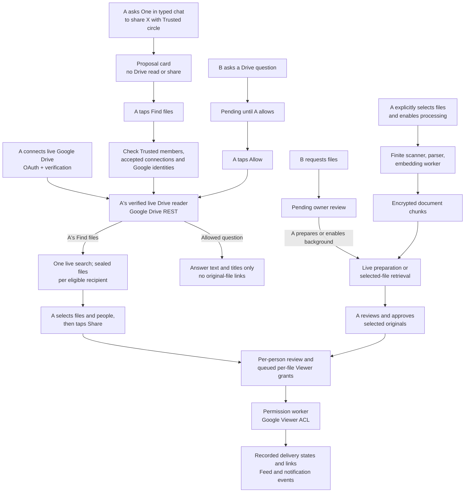

# Drive connection and sharing: working memory

Status: current code map, checked on 2026-09-26. PRs [#7079](https://github.com/hushh-labs/hushh-research/pull/7079) and [#7089](https://github.com/hushh-labs/hushh-research/pull/7089) are merged. This note follows the `fix/drive-live-search-latency-p0` branch and its base. It records code paths, one redacted UAT timing observation, and investigation leads. It is not proof that the branch is deployed or that live Google latency improved.

## Visual Map

## Terms and boundaries

| Term | Meaning here |
| --- | --- |
| A | The Drive owner and the person whose vault authority governs the read and share. |
| B | A connected recipient or requester. In a Trusted circle share, there may be up to ten eligible B recipients. |
| X | A's natural-language description of files, such as “the Chris recordings”; the chat tool stages these words, not file bytes. |
| Trusted circle | A's active system circle (`one_location_circles.system_kind='trusted'`). Membership by itself is insufficient for sharing. |
| Live Drive | A verified OAuth `profile='live'`; the current implementation uses `GoogleDriveRestTransport` against Google Drive's REST API with the live tool contract. |
| Selected-file index | A separate, opt-in compatibility path that processes explicitly selected files into encrypted `document_chunks`. It is not the search path for PR #7079. |

“Chat” in this PR is One's typed AG-UI chat, entered through `/api/one/agent-chat`. The traced code does not establish a separate external ChatGPT-to-Drive integration. The selected-file processing store is not encrypted PKM memory, a public search index, or durable chat history.

## 1. How A connects Drive

1. The One Connectors panel starts the Google Drive OAuth flow with `profile='live'` by default. The backend owns the PKCE attempt and asks for `openid`, `email`, and `https://www.googleapis.com/auth/drive`; it accepts only the allowlisted live scope set or that set plus `drive.file`, and checks the linked identity. A selected-file profile remains supported separately.
2. Web completion or native finalization stores the credential in the connector lifecycle boundary. Live verification probes Google Drive and records the verified policy. The UI can show `verifying`, `connected`, `needs_reauth`, or an error; a completed OAuth redirect alone is not the live-read proof.
3. Before and after live provider calls, the reader checks owner authority, connection generation, verified profile and provider eligibility. Disconnect or account change invalidates stale work.

Code entrypoints: `hushh-webapp/components/agent/connectors-panel.tsx` (`connectDrive`), `consent-protocol/api/routes/external_connectors.py` (OAuth and `/google_drive/live/verify`), `consent-protocol/hushh_mcp/services/external_connector_google_oauth.py`, `drive_live_reader.py`, and `google_drive_rest_transport.py`.

B does **not** connect B's Drive to receive A's shared files. For A-initiated sharing, the server uses B's linked Google identity or B's verified One account email, checks it again before the grant and link delivery, and grants Viewer access to that exact address. Google can reject an external address under A's Drive policy. B-initiated file requests still require B's linked Google identity; a plain Drive question does not. Both requests require the app's own authenticated authority.

## 2. A sends X to One and shares with the Trusted circle — PR #7079

| Step | Trigger and current effect | Main owner |
| --- | --- | --- |
| Proposal | A says “share X with my Trusted circle.” One calls `propose_drive_share(trusted_circle=true)` and returns a `one.drive_share_review.v1` card. No Drive search or share runs yet. The card can be restored from chat history. | `one/agent.yaml`, `one_adk/action_tools.py`, `api/routes/one/agent_chat.py` |
| Find files | A taps **Find files** with an unlocked vault. The card posts `audience: "trusted_circle"`, a client request ID, query and time zone to `POST /api/connectors/google_drive/sharing/owner-shares`. | `drive-circle-share-card.tsx`, `drive-sharing-service.ts`, `api/routes/drive_sharing.py` |
| Recipient filter | The server finds active Trusted members with an active connection A accepted through `direct_request` or `legacy_invite`, feature admission, and a linked Google identity or verified One account email. An accepted connection missing from the best-effort Trusted roster is included; any existing membership row, including an explicit removal, prevents that fallback. It caps eligible recipients at ten. Contact-sync, circle-only, imported, unavailable and unverified-email members are shown under **Not included** with a closed reason. Identity checks run concurrently. | `drive_owner_share_store.py`, `drive_live_query_service.py` |
| Live search | One owner-authorized `run_live_query(require_live=True)` plans the query, searches A's Drive, may select candidates, and returns at most eight shareable non-folder references. The search may read and interpret contents when its plan asks for an answer; a simple find can stop at metadata. This does not query `document_chunks`. | `drive_chat_service.py`, `drive_live_reader.py` |
| Prepared view | The server seals the same found files into one `drive_owner_shares` row per eligible recipient. The card receives names, dates and `f1`–`f8` references, never a client-chosen Google file ID. The prepared rows expire after one hour. A retry with the same client request ID reuses the first search and can add a missed eligible member from those sealed files. | `drive_owner_share_store.py`, migration `245_drive_owner_shares.sql` |
| Share | A may untick files or people. The card posts selected references to `/owner-shares/{id}/share` **one recipient at a time**. Each request binds the references to sealed files, prepares an exact-file review without another model/content read, records A's approval and queues separate Viewer operations. | `drive-circle-share-card.tsx`, `drive_live_query_service.py`, `drive_sharing_store.py` |
| Delivery | A sharing worker rechecks authority, source and recipient, then either creates an individual Google Viewer permission or recognizes existing access. Google sends the permission email with the link for a new grant; visitor verification depends on A's Drive policy. B's delivery projection releases original-file links only for recorded delivered states. Drive events feed the Feed and notification lanes. | `drive_permission_worker.py`, `drive_permission_executor.py`, `drive_sharing_projection_store.py` |

The backend card's `shared` state means that A's per-recipient share request was recorded and its grants were queued. The UI says **sharing requested** and links to delivery status; it does not claim Google has granted access. The recipient's delivery snapshot and recorded permission outcomes are the confirmation points. There is no circle-wide Google grant or standing rule for future files in PR #7079.

## 3. How B requests information from A

B's composer has two distinct actions. Sending either one records a pending request. A question never reads Drive before A taps **Allow**. An original-file request can be prepared after A's tap or under separately enabled background consent.

### B asks a question about A's Drive

1. **Ask about files** posts `/sharing/queries`. A sealed, idempotent `drive_live_query_requests` row is pending. An opaque notification event is queued and a Consent Center row points A to it; push delivery is asynchronous. Sending, listing and denying do not read Drive.
2. A taps **Allow** or **Deny**. Allow atomically claims the stored question and runs one bounded, owner-authorized live Drive turn. It checks the current owner token, feature gate and request claim during the run. Ordinary failures release the claim; an abandoned or interrupted claim can be reclaimed after five minutes.
3. B's structured response contains answer text and, when appropriate, file titles, with no separate Drive URL, file ID, timestamp or owner-only error fields. A title can itself contain a date, and content-mode answer text comes from the interpreter. If A later shares selected files from an answered question, that is another exact-file Viewer share and delivery path.

Code: `api/routes/drive_sharing.py` (`/queries`), `drive_live_query_store.py`, `drive_live_query_service.py`, and `drive_chat_service.py`. This question path requires A's live Drive profile; it does not use the selected-file index.

### B requests original files

1. **Request files** posts `/sharing/requests` with the purpose and optional period. The route verifies B's app and linked Google identity, then stores a sealed, idempotent `drive_share_requests` row. It wakes suggestion and sharing scheduler jobs on a best-effort basis. B sees a pending request, not candidate filenames.
2. A's review can be prepared on A's explicit tap with the current owner token, or by separately enabled background preparation. The verified A connection profile selects live Drive planning/search/reads or the selected-file index. Preparation publishes a private `drive_share_reviews` snapshot; it does not share a file.
3. A selects all or a non-empty subset of the reviewed files and confirms. Approval binds the review digest and source evidence, writes an action ledger record, and queues `drive_share_permission_operations`. It returns pending rather than Google success. A separately disclosed, revocable trust rule can allow a covered future request; ordinary Trusted circle membership does not create that rule.
4. The permission worker creates an individual Viewer permission or recognizes existing access. B's `/requests/{id}/delivery` projection releases only recorded delivered originals and links. A can review outcomes and separately revoke recorded managed permissions.

Merged PR #7089 added `/requests/{id}/prepare/stream` and a grouped, progressively updated review sheet. Its stream reports stages (`starting`, `searching`, `choosing`, `checking`) and a terminal status; private files remain behind `/review`.

Code: `document-file-request.tsx`, `document-share-review.tsx`, `api/routes/drive_sharing.py` (`/requests`), `drive_sharing_service.py`, `drive_suggestion_service.py`, `drive_sharing_store.py`, `drive_permission_worker.py`.

## 4. What “indexing” actually means here

| Path | Source and storage | Used by |
| --- | --- | --- |
| Live | A's verified live OAuth credential drives bounded Google Drive REST listing and reads. No selected-file catalog or chunk index is needed. | A's own live chat, PR #7079 owner search, B's allowed question, and live-profile file-request preparation. |
| Selected-file processing | A explicitly selects up to 25 files through Picker and separately enables processing. `connected_documents` holds encrypted source metadata and job state; `document_chunks` holds encrypted text, source ranges and embeddings. | Selected-profile owner retrieval and selected-profile file-request preparation. |

The selected-file worker leases one owner job at a time, fetches bounded bytes, scans with ClamAV, parses supported documents in isolated subprocesses, generates pinned local E5 embeddings, and atomically publishes a complete encrypted version. Transient errors retain the last good index for retry; source denial or unsafe content invalidates it. Retrieval decrypts only bounded candidates in memory and rechecks Google source eligibility before releasing excerpts. Selection alone is `queued`, not `ready` or indexed.

Code: `drive_selection_service.py`, `drive_document_store.py`, `drive_ingestion_store.py`, `drive_document_worker.py`, `drive_document_processor.py`, `drive_document_retrieval.py`, migrations `228_selected_drive_documents.sql` and `229_drive_document_chunks.sql`.

## 5. Where latency can enter

These are source-level candidates. No end-to-end trace or live timing was collected for this note.

| User-visible interval | Work on the critical path | Code bound or throughput fact |
| --- | --- | --- |
| Chat message → proposal card | One AG-UI turn and tool proposal. | Agent-chat turn logs include first-visible and total elapsed timing, but do not time the later card actions. |
| **Find files** → prepared circle card | Concurrent recipient identity checks, a typed search plan, sequential paged Drive listing, optional candidate selector and possibly content read/interpreter, then sequential recipient-row writes. | Each identity lookup is bounded to 6 s. `run_live_query` has a 160 s outer bound. This P0 branch requests up to 25 candidates in the first Drive page and reads at most two files concurrently. Exact recent-file listing questions skip model planning. Other questions may still spend time in the planner or interpreter. |
| **Share** tap → card status | Frontend waits for one recipient HTTP call before starting the next. Each call binds the chosen files, prepares a private review, approves, and awaits a best-effort scheduler wake. | Up to ten recipients and eight file references; a sharing wake is bounded to 5 s. The status reflects queueing. |
| Queued approval → B can open files | One durable permission operation per selected file and recipient; worker performs current checks and Google ACL writes. | Current UAT scheduler code runs sharing every minute, and `MAX_JOBS_PER_WORKER=1` limits each sharing drain to one permission job. Prompt wakes may run sooner but are best effort. Six files for three recipients can queue 18 grants. |
| B request → review or answer | Request creation can await two best-effort wakes; live preparation or an allowed question invokes model/provider work; selected mode may wait for the finite indexing worker. | Each wake has a 5 s limit; live question and foreground file preparation have 160 s bounds. Current scheduler code configures documents every four minutes and suggestions every four minutes with a two-minute offset. |
| Selected-index retrieval | A local E5 query embedding may start cold before encrypted-chunk retrieval. | A processor comment reports about 71 s for a cold E5 query on the UAT worker's 2-CPU/4-GiB allocation, with 105/100 s admission/child bounds. This does not apply to PR #7079's live share search. |

The code settings do not establish current deployed scheduler state, queue depth, Google response times, or which interval the reported latency concerns. Generic chat latency baselines are not measurements of these Drive card and worker paths. The live Drive path has outcome/stage logs but lacks per-stage elapsed measurements; worker HTTP returns aggregate counts.

The P0 branch uses Google Drive REST `files.list` and `files.get`/export for live search. The separate selected-file index remains opt-in. The review stream reports preparation stages to A only; a typed chat turn shows its private-memory preparation and Drive tool activity but does not stream each document's bytes or model tokens. Real Google latency and end-to-end improvement still require a deployed UAT run with redacted timing evidence.

### Long-range owner listing and the UAT failure

At 2026-09-25 20:08 UTC, a redacted UAT log recorded `drive_chat.read_failed stage=select_candidates type=SpecialistAdkTurnError`. Drive search had reached candidate selection, so that event does not establish a Google Drive outage. A nearby likely matching chat POST lasted 168.274 seconds; first visible activity took 67.54 seconds and the first answer token took 167.71 seconds. Available logs do not establish the UI's stated “safety policy” reason or link nearby provider 429s to that request.

The previous live path capped search at 25 candidates, model selection at eight, and owner presentation at ten. A request for all 25–30 named daily notes could not return all of them through that path. The owner-only metadata listing handles explicit “all files from the last N days” requests with a named subject, including the two standup phrasings in the UAT screenshots. It uses the shared bounded discovery described below, requires the requested local-calendar-day window (title date first, then creation date), and renders up to 60 links with matching source references. The result is a **bounded candidate list**, not a completeness guarantee: pages beyond the search bounds may remain unseen and are marked partial. It does not grant Google Viewer access to B. `drive_long_range_listing.py`, `drive_chat_service.py`, `drive_content_compilation.py`, and `drive_live_reader.py` own this route.

The follow-on owner-only compilation route, `POST /api/connectors/google_drive/sharing/owner/compile/stream`, turns that explicit named-window request into a downloadable Markdown copy of the original extracted note text. Its owner-only chat receipt carries a canonical `owner_compile_query` and fixed `owner_compile_window`; the route validates both, so a click after local midnight does not shift the date range. Owner listing and compilation share bounded metadata discovery: creation-time search, a full-text token search for titles whose subject word is not a Drive prefix, and dated document children of up to three matched meeting folders. The folder path accepts Google Docs titled “Notes by Gemini” or with the requested meeting subject, while it excludes dated files whose titles or formats cannot verify them as notes; the direct title path also excludes obvious agendas, budgets, recordings and similar non-notes for meeting-note requests. Exclusions mark coverage partial. Every returned candidate is filtered by its local title date (where present) or file date; provider paging or folder limits also force partial coverage. Compilation checks up to 40 files with four concurrent Google REST reads, and verifies each file's name and version before and after reading and again before releasing the assembled text. The stream reports only stage and checked-file counts while it works. It sends Markdown chunks to A only after those source checks; no Drive text enters one combined model prompt, selected-file index, B answer, sharing ledger, or Google Viewer operation. The Markdown names every included source with a canonical link to that exact Drive file. Unreadable, changed, or oversized files and candidate-count gaps are explicit partial results; the result is never called a complete archive of Drive. The 2 MB Markdown and per-file extraction bounds may shorten a large note. The current Vault Owner and live Drive connection generation are checked before each private Markdown or completion frame. The work is read-only and cancels on client disconnect.

When a model planning, selection, or interpretation stage fails, the branch now reports that stage truthfully. It does not label those failures as a provider outage or an unverified safety block. The owner-facing result still requires a deployed authenticated UAT run to prove behavior against the user's real Drive.

For a precise follow-up, capture **which transition is slow** (chat card, Find files, each recipient Share call, review preparation, or confirmed recipient access), the environment and deployed SHA, client and server timestamps, a redacted request/correlation ID, the relevant request/operation status transitions, and scheduler outcome counts. Keep owner IDs, file names, questions, tokens and document contents out of shared logs.

## 6. Known corrections and open checks

- On 2026-09-26, UAT chat claimed Drive was disconnected after two unsuccessful status calls even though connector verification succeeded. The SDK rejected a generic status call with omitted `file_name`; the external-read guard then blocked its repair call. `inspect_selected_drive_files` now defaults the filename to empty, so a general access question checks the current connection directly. An actual ADK Runner regression covers an omitted filename after an older disconnected answer, including a connected live grant and no selected-index read. One must treat blocked/unavailable checks as unknown status, and the UI says the status could not be checked. `drive_status.check` logs only outcome, authored reason, exception class and elapsed time. Before this correction was deployed, a live diagnostic with an explicit empty filename returned connected/live in 10.5 seconds; that observation confirms the connection worked, not the corrected natural-language flow.
- PR [#7083](https://github.com/hushh-labs/hushh-research/pull/7083) records a real post-#7079 UAT failure: one of three recipients received a multi-person share because a Google Viewer grant changed a file's version and invalidated later metadata-only grants. The merged fix changed that source fence and added Drive events to the Feed. PR [#7086](https://github.com/hushh-labs/hushh-research/pull/7086) records a later three-recipient grant success and fixed Feed visibility for those rows. Neither PR measures the current latency.
- The final `/owner-shares/{id}/share` path rechecks the active connection and prepared-row expiry. The prepared circle eligibility check is earlier; whether the final tap must recheck current Trusted membership and accepted origin after a membership change is a focused review question.
- The question response projects model answer text directly. Check answer-content constraints before claiming it cannot include owner-directed wording; the structured response only guarantees that separate links, file IDs, dates and owner-only error fields are withheld.
- The Trusted member query inspects at most 100 rows before the ten-recipient cap. A circle larger than that needs explicit product and test review for what the **Not included** list should display.
- `docs/reference/operations/mail-drive-uat-acceptance.md` contains dated deployment observations. Use the current scheduler scripts and a fresh UAT inspection for runtime timing claims.

## Source map for the next debugging session

| Concern | Start here |
| --- | --- |
| One chat proposal and card | [`action_tools.py`](../../../consent-protocol/hushh_mcp/one_adk/action_tools.py), [`agent_chat.py`](../../../consent-protocol/api/routes/one/agent_chat.py), [`drive-circle-share-card.tsx`](../../../hushh-webapp/components/consent/drive-circle-share-card.tsx) |
| Live OAuth and Google calls | [`external_connector_google_oauth.py`](../../../consent-protocol/hushh_mcp/services/external_connector_google_oauth.py), [`drive_live_reader.py`](../../../consent-protocol/hushh_mcp/services/drive_live_reader.py), [`google_drive_rest_transport.py`](../../../consent-protocol/hushh_mcp/services/google_drive_rest_transport.py) |
| Owner share and B question | [`drive_live_query_service.py`](../../../consent-protocol/hushh_mcp/services/drive_live_query_service.py), [`drive_owner_share_store.py`](../../../consent-protocol/hushh_mcp/services/drive_owner_share_store.py), [`drive_live_query_store.py`](../../../consent-protocol/hushh_mcp/services/drive_live_query_store.py) |
| File request, review and delivery | [`drive_suggestion_service.py`](../../../consent-protocol/hushh_mcp/services/drive_suggestion_service.py), [`drive_sharing_store.py`](../../../consent-protocol/hushh_mcp/services/drive_sharing_store.py), [`drive_permission_executor.py`](../../../consent-protocol/hushh_mcp/services/drive_permission_executor.py) |
| Selected index | [`drive_document_processor.py`](../../../consent-protocol/hushh_mcp/services/drive_document_processor.py), [`drive_document_retrieval.py`](../../../consent-protocol/hushh_mcp/services/drive_document_retrieval.py) |
| UAT worker cadence | [`drive_work_drain.py`](../../../consent-protocol/hushh_mcp/services/drive_work_drain.py), [`setup_work_drain_scheduler.sh`](../../../deploy/drive/setup_work_drain_scheduler.sh) |
| Chat timing | [`agui_turn_timing.py`](../../../consent-protocol/hushh_mcp/one_adk/agui_turn_timing.py) |

Focused tests to consult before a fix: `consent-protocol/tests/services/test_drive_owner_share.py`, `test_drive_live_query.py`, `test_drive_live_journey.py`, `test_drive_ingestion.py`, `test_drive_document_retrieval.py`, plus `hushh-webapp/__tests__/components/drive-circle-share-card.test.tsx` and `__tests__/services/drive-sharing-service.test.ts`.

Google reference material used for this P0: [Drive `files.list`](https://developers.google.com/workspace/drive/api/reference/rest/v3/files/list), [file search](https://developers.google.com/workspace/drive/api/guides/search-files), [sharing permissions](https://developers.google.com/workspace/drive/api/guides/manage-sharing), and [Google Picker](https://developers.google.com/workspace/drive/picker/guides/overview). Picker is for explicit user selection; the live question paths above use Drive REST search.
