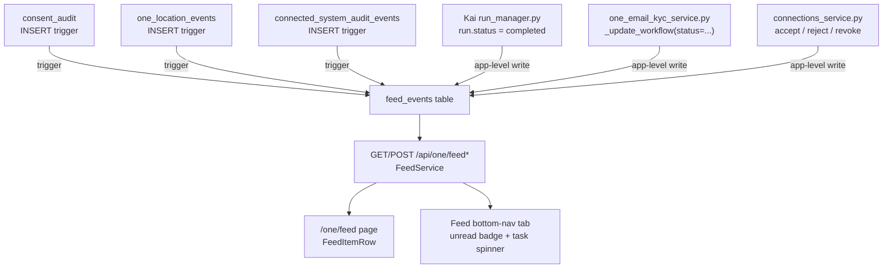

# One Feed Notification Model

## Visual Map



Feed is the cross-domain activity surface for One: a single, paginated,
read/unread-tracked list of what happened across Consent, Location, Kai,
KYC, Connected Systems, and Connections. It replaced the top-bar
`ActivityInbox` bell (which only ever surfaced Consent + background-task
activity) with a real bottom-nav tab and a dedicated route, `/one/feed`.

## The `feed_events` table

Migration `consent-protocol/db/migrations/117_feed_events.sql` adds a single,
presentation-only table:

```sql
CREATE TABLE feed_events (
  id BIGSERIAL PRIMARY KEY,
  user_id TEXT NOT NULL,
  source_domain TEXT NOT NULL CHECK (source_domain IN
    ('consent','location','kai','kyc','connected_systems','connections')),
  event_type TEXT NOT NULL,
  actor_label TEXT,
  metadata JSONB NOT NULL DEFAULT '{}'::jsonb,
  source_row_id TEXT,
  read_at TIMESTAMPTZ,
  created_at TIMESTAMPTZ NOT NULL DEFAULT now()
);
```

`feed_events` is deliberately **not** a domain audit authority. Each domain's
own table (`consent_audit`, `one_location_events`,
`connected_system_audit_events`) or write path remains the source of truth
for its own compliance/business logic; `feed_events` exists only to give the
Feed route one uniform shape to paginate. Rows never carry ciphertext or
vault-protected content, only bounded, non-sensitive `metadata` a
human-readable line can be rendered from client-side (see
`hushh-webapp/lib/feed/feed-item-renderers.tsx`).

## Write paths (six domains, two mechanisms)

**Trigger-based** (existing durable per-domain event table, near-zero app
code — mirrors the established `consent_audit` NOTIFY-trigger pattern from
`011_consent_audit_notify_trigger.sql`):

- **Consent** — a trigger on `consent_audit` INSERT fans out `REQUESTED` /
  `CONSENT_GRANTED` / `REVOKED` rows.
- **Location** — a trigger on `one_location_events` INSERT fans out
  share/access lifecycle events, owner-scoped.
- **Connected Systems** — a trigger on `connected_system_audit_events` INSERT
  fans out terminal statuses (`approved`, `connected`, `rejected`, `failed`).

**App-level writes** (no existing durable event table to hook — this is new
tracking, added alongside each domain's existing mutation):

- **Kai** — `consent-protocol/api/routes/kai/run_manager.py`, at the existing
  debate-completion point (`run.status = "completed"`). The analysis itself
  stays E2EE in PKM as before; the feed row is just `{ticker}` metadata.
- **KYC** — `consent-protocol/hushh_mcp/services/one_email_kyc_service.py`,
  inside the shared `_update_workflow` helper, whenever `status` is set.
- **Connections** — `consent-protocol/hushh_mcp/services/connections_service.py`,
  at `accept_request` / `reject_request` / `remove_connection`.

All writes go through `FeedService.record_event` (Python) or the migration's
trigger functions, both best-effort: a feed-write failure is logged and
swallowed, never allowed to fail or roll back the domain action that produced
it (see `hushh_mcp/services/feed_service.py`'s docstring).

## Read/unread and pagination

- `GET /api/one/feed?cursor=&limit=` — keyset pagination (`id` cursor, not
  page numbers) because a live-growing append-only feed drifts under
  page-number pagination. Returns `{items, next_cursor, unread_count}`.
- `GET /api/one/feed/unread-count` — lightweight, polled by the bottom-nav
  tab badge (`hushh-webapp/lib/feed/use-feed-unread-count.ts`, 45s interval +
  an immediate refresh on `FEED_STATE_CHANGED_EVENT`).
- `POST /api/one/feed/read` — marks unread rows read up to a given `id`.
  Fired once when the Feed page opens (Instagram/Twitter's "opening the tab
  clears the badge" convention), not per item.

Feed is read-only and navigational: tapping an item deep-links into the
originating domain screen (Consent Center, Analysis, Location, KYC,
Connected Systems, Connect) rather than exposing inline approve/deny
actions.

## Live-task visibility

The Feed tab's icon shows a spinner while a debate or background task is
actively running (`hushh-webapp/lib/feed/use-any-task-active.ts`), extracted
from the same `DebateRunManagerService` / `AppBackgroundTaskService`
singletons the old `DebateTaskCenter` popover read. Task-level control
(cancel a running debate, retry a failed save, dismiss a completed one)
stays on the pages that own those flows (Analysis, `kai-flow.tsx`), not in
the shell — Feed shows what happened, not live process control.
