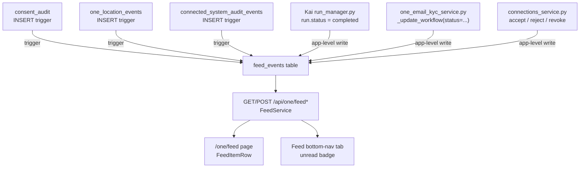

# One Feed Notification Model

## Visual Map



Feed is the cross-domain activity surface for One: a single, paginated,
read/unread-tracked list of what happened across Consent, Location, Kai,
KYC, Connected Systems, and Connections. It replaced the top-bar
`ActivityInbox` bell (which only ever surfaced Consent + background-task
activity) with a real bottom-nav tab and a dedicated route, `/one/feed`.

## The `feed_events` table

Migration `consent-protocol/db/migrations/117_feed_events.sql` adds a single,
presentation-only table:

```sql
CREATE TABLE feed_events (
  id BIGSERIAL PRIMARY KEY,
  user_id TEXT NOT NULL,
  source_domain TEXT NOT NULL CHECK (source_domain IN
    ('consent','location','kai','kyc','connected_systems','connections')),
  event_type TEXT NOT NULL,
  actor_label TEXT,
  metadata JSONB NOT NULL DEFAULT '{}'::jsonb,
  source_row_id TEXT,
  read_at TIMESTAMPTZ,
  created_at TIMESTAMPTZ NOT NULL DEFAULT now()
);
```

`feed_events` is deliberately **not** a domain audit authority. Each domain's
own table (`consent_audit`, `one_location_events`,
`connected_system_audit_events`) or write path remains the source of truth
for its own compliance/business logic; `feed_events` exists only to give the
Feed route one uniform shape to paginate. Rows never carry ciphertext or
vault-protected content, only bounded, non-sensitive `metadata` a
human-readable line can be rendered from client-side (see
`hushh-webapp/lib/feed/feed-item-renderers.tsx`).

## Write paths (six domains, two mechanisms)

**Trigger-based** (existing durable per-domain event table, near-zero app
code — mirrors the established `consent_audit` NOTIFY-trigger pattern from
`011_consent_audit_notify_trigger.sql`):

- **Consent** — a trigger on `consent_audit` INSERT fans out `REQUESTED` /
  `CONSENT_GRANTED` / `REVOKED` rows.
- **Location** — a trigger on `one_location_events` INSERT fans out
  share/access lifecycle events, owner-scoped.
- **Connected Systems** — a trigger on `connected_system_audit_events` INSERT
  fans out terminal statuses (`approved`, `connected`, `rejected`, `failed`).

**App-level writes** (no existing durable event table to hook — this is new
tracking, added alongside each domain's existing mutation):

- **Kai** — `consent-protocol/api/routes/kai/run_manager.py`, at the existing
  debate-completion point (`run.status = "completed"`). The analysis itself
  stays E2EE in PKM as before; the feed row is just `{ticker}` metadata.
- **KYC** — `consent-protocol/hushh_mcp/services/one_email_kyc_service.py`,
  inside the shared `_update_workflow` helper, whenever `status` is set.
- **Connections** — `consent-protocol/hushh_mcp/services/connections_service.py`,
  at `accept_request` / `reject_request` / `remove_connection`.

All writes go through `FeedService.record_event` (Python) or the migration's
trigger functions, both best-effort: a feed-write failure is logged and
swallowed, never allowed to fail or roll back the domain action that produced
it (see `hushh_mcp/services/feed_service.py`'s docstring).

## Read/unread and pagination

- `GET /api/one/feed?cursor=&limit=` — keyset pagination (`id` cursor, not
  page numbers) because a live-growing append-only feed drifts under
  page-number pagination. Returns `{items, next_cursor, unread_count}`.
- `GET /api/one/feed/unread-count` — lightweight, polled by the bottom-nav
  tab badge (`hushh-webapp/lib/feed/use-feed-unread-count.ts`, 45s interval +
  an immediate refresh on `FEED_STATE_CHANGED_EVENT`).
- `POST /api/one/feed/read` — marks unread rows read up to a given `id`.
  Fired once when the Feed page opens (Instagram/Twitter's "opening the tab
  clears the badge" convention), not per item.

The Feed tab's icon is fixed (no spinner or live-task overlay): the tab is a
static navigational affordance, and unread state surfaces only through its
badge count, not an icon swap.

## Two zones: "Needs you" over "Earlier"

The Feed route renders under one fixed (sticky) header where only the list
scrolls, in two stacked zones modelled on Instagram's Activity pane (pinned
actionable requests over a chronological log):

1. **"Needs you" (live + actionable).** A `useFeedActionables`
   (`hushh-webapp/lib/feed/use-feed-actionables.ts`) hook aggregates the live
   domain stores/services — not the `feed_events` log — so each action is real
   and current:
   - pending consent → **Review** (deep-links to the consent manager; the feed
     never one-tap-approves because approval requires the BYOK export-key
     ceremony that lives there),
   - pending location-access requests → inline **Approve** (1h) / **Deny**
     (`OneLocationService`),
   - incoming connection requests → inline **Confirm** / **Decline**
     (`ConnectionsService`),
   - running Kai debates → **Resume** (reconnects the stream via
     `analysis?focus=active&run_id=…`) + **Cancel**, and running background
     tasks → **Open** / **Cancel** (`DebateRunManagerService`,
     `AppBackgroundTaskService`).
   Vault-gated actions disable cleanly when the vault is locked.
2. **"Earlier" (history).** The `feed_events` log, day-grouped
   (Today / Yesterday / date), each row deep-linking into its origin screen.

Both zones are built on the canonical `SettingsGroup` + `SettingsRow` list
primitives (`FeedRow` for history, `FeedActionableRow` for the actionable
zone), so the feed shares the app's list vocabulary.

## Person identity and responsive rows

Connect, Location People/Circle rosters, and both Feed zones use
`ConnectionPersonAvatar`. Person lists use a 40px circular leading visual and
a 68px text/separator inset. Compact rows use a 16px name, 13px description,
and a separate timestamp line. On narrow phones, relationship actions move
below the name instead of compressing it; interactive targets remain at least
44px even when the action looks like secondary text. These are shared React
and CSS contracts for web and the iOS/Android Capacitor containers.

Photo reads prefer a nonblank `actor_identity_cache.custom_photo_url`, then
`photo_url`. Pending connection-request DTOs include optional
`counterpartPhotoUrl`; Circle member-invite DTOs include optional
`inviterPhotoUrl` and `inviteePhotoUrl`. Web proxies and native HTTP transport
preserve these additive fields. Image failure, replacement, and removal reset
the avatar loading state and reveal the same initials used by Connect.

Feed photo sanitization preserves complete bounded PNG/JPEG/WebP data URLs
(up to 300 KiB decoded, matching the upload contract). It never truncates
base64 to the general metadata text limit. Invalid/oversized data, SVG, and
unsupported schemes are omitted; HTTP(S) URLs remain bounded to 1024
characters. A failed identity read must not resurrect a stored photo snapshot.

Migration `202_feed_counterpart_identity.sql` adds a server-only companion
table, `feed_event_counterparts`, linking a Feed event to its registered
counterpart. An AFTER INSERT trigger resolves the source event with the
viewer's audience checks. This link survives short-lived Location source
cleanup and resolves the current photo at read time; it grants no location
access and is not part of the public Feed DTO. Feed deletion or counterpart
account deletion cascades the link; migration 201's tombstone/write guards
apply. Historical event copy remains historical rather than being rewritten
when a profile changes.

Reads resolve at most the requested Feed page, materializing counterpart IDs
before joining the indexed identity cache. Retained legacy sources can still
be resolved during a rolling migration. Legacy sources already purged before
the identity link existed cannot be reconstructed; their rows keep initials
or a domain icon, never another person's guessed photo.

Migrations 203–204 remove the Location audit-table scan from identity resolution.
Grant keys use the existing grant index; numeric audit keys retain their primary-key
lookup. Request, referral, and arbitrary legacy metadata keys inspect only the
viewer's owner/recipient events through indexes, then apply the original exact
source and audience checks. Legacy lookup cost can still grow with that viewer's
own history. No source records or identities are backfilled inside these migrations.

Apply through migration 204 before running the explicit resumable backfill outside
the schema transaction:

```bash
cd consent-protocol
python scripts/backfill_feed_counterpart_identity.py --apply --expected-database <exact-database-name> --batch-size 250 --max-batches 20
```

Without `--apply` it is a dry run. Output contains counts and cursors, not
identities or photos. The down migration is
`db/migrations/rollback/202_feed_counterpart_identity.rollback.sql`; it removes
only this derived feature and preserves Feed history. New readers fall back
to legacy source enrichment on an older schema.

Migration 203 builds the recipient/event-type index concurrently, as a single
statement outside a transaction. Migration 204 refuses to install the new resolver
if that index is missing or invalid. If a concurrent build is interrupted, an
`IF NOT EXISTS` retry can leave the invalid index in place. With migration runners
stopped, run `rollback/203_feed_counterpart_recipient_index.rollback.sql`, then run
the **203 SQL file itself** outside a transaction, and retry the release. Merely
retrying ledger mode after dropping the index is insufficient: 203 may already be
recorded as applied. Do not change an accepted migration checksum or delete ledger
history to repair the index.

To roll back this optimization, execute
`rollback/204_feed_counterpart_indexed_lookup.rollback.sql` first, then
`rollback/203_feed_counterpart_recipient_index.rollback.sql` outside a transaction.
This restores the 202 resolver and preserves all Feed events and counterpart links.

Automated proof includes the actual-component Feed fixture, Circle layout
contracts, image lifecycle unit tests, and
`tests/test_feed_counterpart_identity_postgres.py` and
`tests/test_feed_counterpart_lookup_postgres.py` against unique disposable
PostgreSQL databases. Set `FEED_IDENTITY_POSTGRES_TEST_URL` to a local disposable
server's admin database and run those tests explicitly. The lookup regression
checks buffer accesses with 250,000 unrelated audit rows in custom and generic plan
modes, source compatibility, concurrent-index failure recovery, and rollback.
Browser emulation and these fixtures do not replace
authenticated user review or physical iOS/Android acceptance.

## Caching

`FeedPage` (`hushh-webapp/components/feed/feed-page.tsx`) loads its first
page through `useStaleResource` under `CACHE_KEYS.FEED_LIST(userId)`
(`CACHE_TTL.SHORT`), so a revisit renders the last-known page instantly while
a background refresh runs, matching every other cache-coherent route.
Pagination beyond the first page ("load more") stays a live, uncached fetch
appended to local state — only the first page needs an instant warm render.
Opening the feed calls `FeedService.markRead` (clearing the unread badge via
`dispatchFeedStateChanged`) but deliberately does **not** force-refresh the
list: the rows on screen keep their unread styling for the current visit and
only read as seen on the next open, matching Instagram's "opening clears the
badge, the items you're looking at stay highlighted" behavior. `FEED_LIST`,
`FEED_UNREAD_COUNT`, and `CONNECTIONS_INCOMING` (the actionable zone's
connection-requests read) are all covered by `CacheService.invalidateUser`, so
sign-out and account deletion purge them with the rest of the session.
