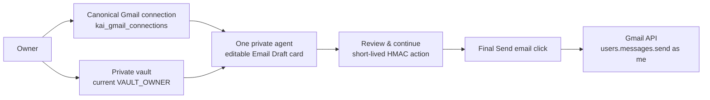

# Owner-Approved Gmail Email

One's Gmail Email Agent uses the existing receipts connector and its
`kai_gmail_connections` credential row. It is a personal-Gmail capability for
receipt/inbox context and owner-approved mail delivery; it is not the
`one@hushh.ai` KYC mailbox workflow.

## Visual Map

## Connection and onboarding

- `/one/setup/gmail` preserves the Gmail cinematic introduction, then requires
  the Gmail vault prerequisite before the setup workspace mounts.
- `/one/gmail` requires the same prerequisite before the workspace mounts.
  A vault key and `VAULT_OWNER` token are process-memory-only. Reloading or a
  cold OAuth return therefore requires a fresh vault unlock; the existing
  same-window popup flow preserves the already open session naturally.
- `/one/email` is a compact handoff surface. A disconnected account is sent to
  `/one/gmail`; a connected account opens One with the approval-first drafting
  prompt.
- One Google OAuth request includes both `gmail.readonly` and `gmail.send`.
  The redirect is environment-derived and must exactly equal
  `APP_FRONTEND_ORIGIN + /one/profile/gmail/oauth/return` in the Google OAuth
  client for each environment.
- A legacy read-only connection remains usable for receipt sync, but must be
  reconnected once before an owner can send email from One.

Provider `gmail.send` allows the delivery boundary to prepare an owner-reviewed
message after the combined grant. It never lets One or a chat message send
mail directly: every email still requires a visible editable draft, review,
and the owner’s final **Send email** click. Disconnect revokes and clears the
canonical connection as before.

## Delivery contract

When a person explicitly asks One to write, draft, or send a personal Gmail
email, One opens an in-memory editable card containing To, Cc, Bcc, Subject,
and Message. There is no composer mail shortcut. If the vault is not unlocked,
the existing vault dialog opens instead.

1. One’s explicit request opens the draft and sends only that instruction to
   `POST /api/one/email/draft`, which returns structured draft fields and
   `missing_details`. It cannot send mail and is not persisted as agent-chat
   history, a workflow record, or PKM.
2. Every field edit invalidates the prepared action. **Review & continue**
   calls `POST /api/one/email/prepare` and creates a ten-minute action for the
   exact normalized envelope.
3. **Send email** calls `POST /api/one/email/send` for that unchanged action.
   The server atomically claims it once, constructs RFC MIME itself, and calls
   Gmail `users.messages.send` as `me`. No caller-provided From address, OAuth
   token, or raw MIME message is accepted.

Every delivery endpoint requires both the Firebase identity and a current
`X-Hushh-Consent` `VAULT_OWNER` token for the same user. The server stores only
short-lived action metadata: IDs, owner ID, envelope/idempotency HMACs,
recipient count, lifecycle timestamps/state, Gmail message/thread IDs, and a
safe error code. It never persists recipients, subject, body, OAuth tokens,
vault credentials, or PKM values. Provider timeouts or a response without a
Gmail message ID become `outcome_unknown`; the owner is told to check Sent Mail
and the action is not blindly retried.

## Explicit boundaries

- `GmailReceiptsService` remains the sole Gmail OAuth, encrypted-token, and
  receipt/inbox connector authority.
- `api/routes/one/gmail_delivery.py` and `gmail_delivery_service.py` are the
  approval-gated personal-Gmail delivery operon.
- `api/routes/one/email.py`, `one_email_kyc_service.py`, `/one/setup/email`,
  and `one@hushh.ai` remain the separate One Email KYC platform-mailbox flow.
- `google_connection_service.py`, `EmailChatService`, and the read-only Gmail
  specialist do not send personal Gmail on behalf of the owner.
