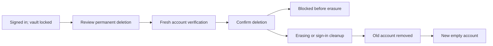

# Lost vault access: delete and start fresh

Status: P0 product and acceptance contract. Runtime availability is established by a successful release and UAT verification, not by this document alone.

## Visual Map

## Product promise

A person may still be signed in to One after losing their vault passphrase, recovery key, passkey, and every unlocked device. The locked-vault screen must give them a visible **Delete account and start fresh** choice. They can remove the old account without a vault secret, then register a new, empty account once deletion and sign-in cleanup are confirmed. This is permanent deletion, not recovery or the existing account reset.

A reported customer experience is the P0 example: a person can sign in, cannot open their vault, and should not need an engineer with admin rights to erase the account. The same journey must work for anyone in that state.

## What the choice means

Deletion removes active One information and access controlled by Hussh: the old vault and unlock wrappers, memories and PKM, chat context, profile, settings, One-side connections, sharing and consent state, trusted devices, and the old sign-in identity. A new account receives a new identity, vault, and recovery methods. No old memory, grant, device authority, or context may reattach.

One cannot promise that every copy everywhere disappears at once. Required evidence follows its retention policy; a one-way tombstone prevents old-account resurrection; backups expire on their schedule; other people's copies and external providers' records are outside One. When a bank connection token is sealed in the inaccessible vault, One cannot use it to revoke the Plaid grant. The person must remove One's access through their bank or Plaid. The [public deletion page](../../../hushh-webapp/app/delete-account/page.tsx) explains these boundaries.

## Journey and states

| Moment | The user sees or does | Product rule |
| --- | --- | --- |
| Locked vault | **Lost access? Delete account** remains reachable next to unlock and sign-out. | The first tap only opens the explanation. |
| Review | One names the information that will go, the permanent loss, retained records, and outside-provider steps. | No vault secret or repeated failed unlock attempts are required. |
| Verify | The person reauthenticates with the Google or Apple account already linked to this One account. If a verified phone is linked, they also confirm a code sent there. | A stale signed-in session, a phone code alone, or a number submitted to the deletion endpoint cannot authorize deletion. If the linked phone is unavailable, offer the established support verification path. |
| Confirm | The person explicitly chooses **Permanently delete account** after review. | This is the sole destructive action; Back and Cancel remain available until submission. |
| Blocked before erasure | One explains the specific connection or private-agent cleanup that needs attention. | Say **Account not deleted**. Do not erase One-side records and leave an unmanaged external resource. |
| Processing or uncertain | One checks the account lifecycle status after a lost response. | Never automatically submit a second delete. Do not report success from a timeout. |
| Account erased, sign-in cleanup pending | One shows **Finishing account removal**. | Do not offer a new account until the old Firebase identity is removed or a safe, proven new-identity path is available. |
| Complete | One signs the person out and offers **Create a new account**. | Signing in again with the same provider must create a new UID and an empty vault. |

The flow is an escape hatch from the locked gate, not a hidden Profile setting. The ordinary unlocked Profile deletion route remains available.

## Current implementation boundaries

- The [locked-vault UI](../../../hushh-webapp/components/vault/vault-flow.tsx) owns the entry. The frontend must use the existing auth and account-deletion state machinery so sibling tabs, local vault material, and uncertain outcomes are handled consistently.
- The [backend account route](../../../consent-protocol/api/routes/account.py) owns deletion-only identity verification. The existing `VAULT_OWNER` token must not be minted or reused for this path; it would grant broader vault authority.
- The [full erasure service](../../../consent-protocol/hushh_mcp/services/account_service.py) remains the single place that erases account data, enforces its tombstone, and rejects unresolved BYOC or external-resource blockers. The [deletion rollout contract](../operations/account-deletion-rollout.md) owns Firebase cleanup and release fences.
- The [public deletion page](../../../hushh-webapp/app/delete-account/page.tsx) remains the route for someone who cannot sign in at all. Support must verify ownership and record consent before any assisted deletion.

## Delivery plan and release gates

1. Expose the locked-vault CTA, review, identity verification, irreversible confirmation, and outcome states in the shared web view. Use concise language and semantic destructive styling.
2. Add a purpose-limited backend deletion route that verifies fresh same-account provider reauthentication and any pre-existing verified phone proof. Keep it separate from vault access. Reuse full transactional erasure and Firebase cleanup.
3. Cover rejection of stale, mismatched, unverified, and phone-only proofs; a success path; blocked external resources; and lost-response/pending identity cleanup with focused automated tests. Check the frontend/backend request contract and typecheck. The user will perform manual UAT; no manual browser tour is required for this delivery.
4. Update the public deletion explanation and API contract. Merge only after the exact PR head's required checks pass. Deploy the exact green post-merge `main` SHA to UAT, then verify the workflow's release and runtime evidence.

## Acceptance story for UAT

Given a signed-in person whose vault cannot be unlocked by any method, they find **Delete account and start fresh** on the locked screen. They review what goes away and what One cannot erase outside its control. They verify the existing sign-in account and, when applicable, its previously linked phone. On confirming, they see either a specific **not deleted** blocker, a truthful pending state, or a completed deletion. After completion they sign in with the same Google or Apple account and see a new, empty One with no old vault, memories, chats, connections, shares, or device grants. A stale session or wrong proof cannot delete the account.

## Follow-up beyond P0

Measure locked-gate entry, verification failure, pre-erasure blockers, pending identity cleanup, deletion completion, and fresh-start completion without recording secrets. Review support cases where the linked phone is lost, and add a governed alternate verification mechanism that gives those people a self-service outcome without weakening deletion authority. The current identity cache has no immutable phone-enrollment timestamp, so a future identity migration should record one before treating phone age or a cooling-off period as an enforced guarantee. Review provider-side revocation options that preserve zero knowledge; never pretend the server can decrypt vault-sealed bank tokens.
