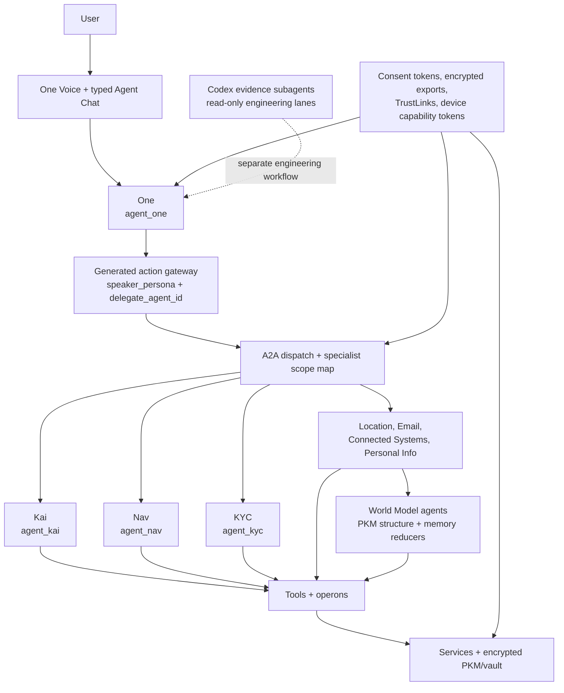

# One Agent Hierarchy

## Visual Map

## Purpose

One is the only direct personal-agent head. It owns the relationship layer, the user-facing voice/chat handoff, and the authority to route intent. Specialists sit below One and execute bounded work through A2A, generated action contracts, tools, operons, services, consent tokens, and encrypted data boundaries.

This page is current-state implementation truth. It does not rename runtime identifiers, remove Kai compatibility paths, or claim external-agent zero-knowledge parity where checked-in code still uses first-party compatibility tokens.

## Runtime Registry

| Layer | Runtime id | Current role | Authority |
| --- | --- | --- | --- |
| Head agent | `agent_one` | Relationship layer, intent framing, specialist routing | `agent.one.orchestrate` |
| Legacy alias | `agent_orchestrator` | Compatibility package and manifest alias for One | Must resolve to One semantics |
| Finance specialist | `agent_kai` | Finance, portfolio, markets, RIA/investor analysis | `agent.kai.analyze` plus finance PKM gates |
| Privacy specialist | `agent_nav` | Consent, scope review, vault friction, deletion, revocation | `agent.nav.review` |
| Identity specialist | `agent_kyc` | KYC workflow state, approved disclosure formatter, structured PKM writeback | `agent.kyc.process` and approved optional scopes |
| Location specialist | `agent_location` | Trusted-people live location workflow | `agent.one.orchestrate` today, device capability tokens per flow |
| Connections specialist | `agent_connections` | Trusted-connection graph questions and relationship write proposals | `agent.one.orchestrate` today |
| Connected systems | `agent_connected_systems` | CRM and connected-system workflow planning | `agent.one.orchestrate` today |
| Email specialist | `agent_email` | Inbox and Gmail task planning behind One | `agent.one.orchestrate` today |
| Personal information | `agent_personal_information` | Information marketplace and data-slice workflows | `agent.one.orchestrate` today |
| World Model agents | `memory_intent`, `memory_segmentation`, `memory_merge`, `pkm_structure`, `summary_reducer` | Semantic memory shaping and summary reduction | Must stay under vault/PKM consent and redaction boundaries |

`agent_one` and `agent_orchestrator` are not two product heads. The orchestrator path is a compatibility implementation namespace for One.

## Wiring Modes

The hierarchy has three current wiring modes. Do not collapse them into one claim.

### Scope-gated A2A specialists

`SPECIALIST_A2A_SCOPE_MAP` defines the least-privilege scope gate for:

| Agent id | Scope |
| --- | --- |
| `agent_one` | `agent.one.orchestrate` |
| `agent_connected_systems` | `agent.one.orchestrate` |
| `agent_kai` | `agent.kai.analyze` |
| `agent_nav` | `agent.nav.review` |
| `agent_kyc` | `agent.kyc.process` |
| `agent_connections` | `agent.one.orchestrate` |
| `agent_location` | `agent.one.orchestrate` |
| `agent_personal_information` | `agent.one.orchestrate` |
| `agent_email` | `agent.one.orchestrate` |

### In-process dispatch registry

The in-process `dispatch` table currently registers `agent_connected_systems`, `agent_connections`, `agent_email`, `agent_location`, `agent_nav`, and `agent_personal_information`.

Kai has a dedicated A2A server in `adk_bridge/kai_agent.py`. KYC is manifest/service-backed through One Email KYC and approved disclosure formatting; it is scope-gated but not an in-process dispatch handler today.

Therefore, not every scope-gated specialist is registered in the in-process dispatch table.

## Execution Stack

1. One Voice or typed Agent Chat captures intent and active app state.
2. The generated action gateway grounds allowed actions with `speaker_persona`, `delegate_agent_id`, confirmation policy, and transition metadata.
3. One routes specialist work through deterministic routing and A2A contracts.
4. A2A entry points validate the caller token against `SPECIALIST_A2A_SCOPE_MAP`.
5. Tools expose callable surfaces and re-check their own scope.
6. Operons hold business logic. Pure operons avoid side effects; impure operons validate consent before network, LLM, or storage work.
7. Services are the only persistence layer and own encrypted PKM, vault, audit, and external integration storage.

## Authority Cascade

One may delegate; it does not widen authority.

1. External MCP agents use explicit consent plus encrypted scoped exports. Hosted MCP returns ciphertext and wrapped export-key metadata, not plaintext user data.
2. Agent One external A2A uses `X-Consent-Token` scoped `agent.one.orchestrate`.
3. Specialist A2A uses `SPECIALIST_A2A_SCOPE_MAP` and must validate the least-privilege specialist scope.
4. TrustLinks are signed delegation proofs. They are not consent tokens, vault keys, or encrypted exports.
5. First-party compatibility routes may still carry `VAULT_OWNER` to internal specialists, but external, vendor, process, or network specialists should receive attenuated specialist tokens or encrypted scoped exports instead.

## Codex Subagent Boundary

Codex subagents are engineering evidence lanes, not app runtime agents. They inspect code, docs, tests, and contracts; they do not become `agent_one`, Kai, Nav, KYC, or operons.

Use the repo-scoped subagent budget from [Coding Agent MCP](../operations/coding-agent-mcp.md): `max_threads = 6`, `max_depth = 1`, one reserved recovery slot, and two read-only evidence lanes by default.

## Change Contract

When adding or changing a runtime agent, update these surfaces together:

1. Agent manifest and system instruction under `consent-protocol/hushh_mcp/agents`.
2. A2A scope map and dispatch registration when the specialist is live.
3. Tool and operon docs if the execution boundary changes.
4. Consent scope catalog and agent delegation boundary if authority changes.
5. Voice/action gateway metadata when One Voice can invoke or mention the specialist.
6. Route, cache, and native surface maps when the specialist changes reachable UI.
7. Tests for manifest loading, routing, A2A scope validation, dispatch, and privacy boundaries.

## References

- [One Voice Runtime Architecture](./one-voice-runtime-architecture.md)
- [One Voice Kai Compatibility Runtime](./one-voice-kai-compatibility-runtime.md)
- [Agent Delegation Boundary](../iam/agent-delegation-boundary.md)
- [Agent Development](../../../consent-protocol/docs/reference/agent-development.md)
- [Kai Agents](../../../consent-protocol/docs/reference/kai-agents.md)
