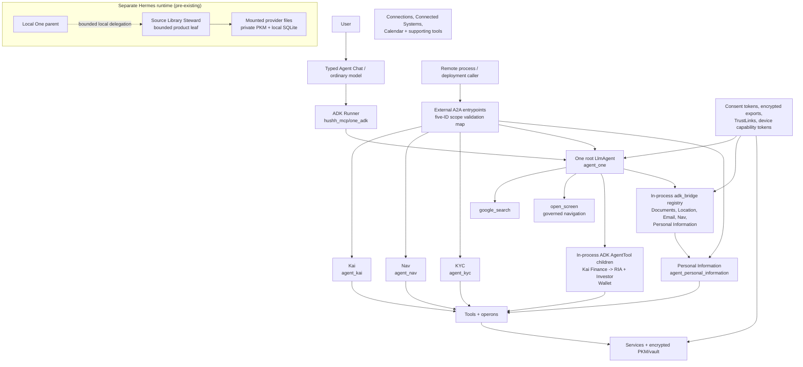

# One Agent Hierarchy

Location commands use the restricted semantic Location package and the shared action authority described in [One Voice Runtime Architecture](./one-voice-runtime-architecture.md). The old `/api/one/adk/*` Live path is retired; `/api/one/voice/*` remains a flag-gated Live adapter. The diagram below describes the retained text-agent hierarchy.

## Visual Map

## Purpose

One is the only direct private-agent head. It owns the relationship layer, the user-facing voice/chat handoff, and the authority to route intent. Specialists sit below One and execute bounded work through the mechanism appropriate to each boundary—local `AgentTool`, process-local dispatch, or scoped A2A—along with generated action contracts, tools, operons, services, consent tokens, and encrypted information boundaries.

This page is current-state implementation truth. It does not rename runtime identifiers, remove Kai compatibility paths, or claim external-agent zero-knowledge parity where checked-in code still uses first-party compatibility tokens.

## Runtime Registry

| Layer | Runtime id | Current role | Authority |
| --- | --- | --- | --- |
| Head agent | `agent_one` | Relationship layer, intent framing, specialist routing | `cap.one.invoke` for external task invocation only |
| Onboarding policy adjudicator | `agent_onboarding` | Validates One's typed semantic assessment against redacted journey and current-screen action state; keeps capability messaging and verified completion boundaries aligned; never a second semantic router | No tools, scopes, vault access, speaking authority, or standing authority |
| Legacy alias | `agent_orchestrator` | Compatibility package and manifest alias for One | Must resolve to One semantics |
| Finance specialist | `agent_kai` | Finance, portfolio, markets; RIA (advisor workspace) and Investor (personal investing) are its subagents | `agent.kai.analyze` plus finance PKM gates |
| Wallet specialist | `agent_wallet` | Wallet (payment cards) conversation over client-executed actions (`wallet.list`, `wallet.add`, `wallet.reveal`); an AgentTool child of One, roster-gated on `ONE_WALLET_ENABLED`, with no server-side tools, no PKM context injection, and no A2A transport. Card secrets live in the reserved `wallet` PKM domain and decrypt only in the owner's browser | `agent.wallet.manage` invocation only; data leaves the vault solely through owner-approved `attr.wallet.summary.*` / `attr.wallet.secrets.*` grants |
| Consent Center parent | `agent_nav` | Consent, scope review, vault friction, deletion, revocation; parent of Connections | `agent.nav.review` |
| Identity specialist | `agent_kyc` | KYC workflow state, approved disclosure formatter, structured PKM writeback | `agent.kyc.process` and approved optional scopes |
| Location specialist | `agent_location` | Trusted-people Location workflow | Exact location capability and data authority per flow |
| Connections subagent | `agent_connections` | Nav's trusted-connection graph specialist; the Connections UI owns private runtime configuration | Exact specialist and `attr.*` authority per hop; never receives provider credentials |
| Connected systems | `agent_connected_systems` | CRM and connected-system workflow planning | Exact specialist and `attr.*` authority per hop |
| Email specialist | `agent_email` | Owner metadata-only inbox reads behind One's default-off typed-chat lane; existing receipts and reviewed sending remain separate | Exact `cap.email.metadata.read` invocation bound to owner, task, call and expiry; no inherited Mail write authority |
| Documents specialist | `agent_documents` | Owner typed-chat metadata search and supported-file reading through the live Google Drive MCP grant, or answers from the limited selected library; no sharing tool | Exact `cap.documents.read` invocation and current owner token; the live path checks connection generation and Google grant, while the limited path checks selected-file authority |
| Memory Agent | `agent_personal_information` | Owner memory summaries plus consented information-slice workflows, reachable from One through `ask_memory_agent` | `cap.pkm.marketplace.view` plus exact per-hop information authority; PKM summaries retain the internal `pkm.read` gate |
| Information Marketplace | standalone product surface | Separate consent-first Marketplace routes and APIs remain available; its conversational specialist is the Memory Agent | Admitted to One's typed specialist roster; route-specific marketplace pages remain separate |
| World Model agents | `agent_memory_intent`, `agent_memory_segmentation`, `agent_memory_merge`, `agent_pkm_structure` | Semantic memory shaping | Must stay under vault/PKM consent and redaction boundaries |
| Hermes-local product leaf | Source Library Steward | Query, virtual organization, revision-pinned file management, synchronization, and mounted-target sharing | Exact local `hussh_one_sources` tools only; no terminal, generic filesystem, credentials, vault keys, provider APIs, shared memory, or delegation |

The PKM Structure manifest owns its instructions in both managed and direct-client
execution. New domain/path names may organize user-supplied facts under the
upstream intent/merge contract; they do not authorize fabrication, persistence,
or sharing. Structure response examples use the authored response contract version
1. The existing normalization step separately upgrades the persisted domain
contract to `DYNAMIC_DOMAIN_CONTRACT_VERSION`; these are not competing versions
of the same boundary. Prompt alignment alone does not prove extraction quality or
resolve a provider timeout.

`agent_one` and `agent_orchestrator` are not two product heads. The orchestrator path is a compatibility implementation namespace for One.

`agent_nav` is the Consent Center runtime; `consent.chat.turn` resolves to it
directly. There is no separate `agent_consent` product head or roster entry.
Nav composes its manifest-owned Consent child through AgentTool with scoped
reads and app-rendered revocation cards. A Connections child is supplied only for
One's selected Connections turn after exact task-bound first-party invocation
and database-confirmed owner admission. Every Connections tool rechecks that
owner token. This stricter outage behavior does not change Consent's existing
token-validation policy.

Connections exposes reads and proposals, never its legacy selection executor.
Exact proposal IDs return to One for the existing generated action confirmation;
ambiguous choices remain in One's conversation without mutation-bearing cards.
A consent-review grant does not authorize connection mutations. These branch
changes are not deployment acceptance; live performance failures remain in
[the migration baseline](./agent-chat-migration-baseline.md).

Authenticated Chat's registry-backed ADK MCP toolset now has read-only
credential adapters for curated Drive, Gmail, and Calendar registrations.
Gmail's admitted schema and result are metadata-only; Calendar uses its
existing owner-specific read grant. Each native call rechecks the current
owner and grant, and application review remains separate from discovery.
The older `discover_workspace_tools` / `read_workspace_tool` entrypoints remain
model-facing compatibility paths until live provider parity is verified; they
are not a second credential authority. Source admission does not establish an
active curated registry row, Google Developer Preview access, or a successful
provider call. Do not report these reads as live solely from this wiring.

Nav's public handle runs a fresh, bounded ADK session per turn. Nav and its
Consent AgentTool child use supported `chat` roots because ADK 2.9 Runner rejects
`single_turn` roots; this does not introduce shared owner history. One's intro
and search instructions are authored in One's manifest subagent entries.

## Wiring Modes

The current tree uses distinct mechanisms for local ADK children, process-local
specialist dispatch, and remote A2A entrypoints. These contracts do not form one
universal dispatch path.

Official A2A v1 Tasks remain a release gate. The contained One invocation preview
and the legacy Kai compatibility server are not advertised as official v1.

### In-process ADK AgentTool children

`one_adk/agent_tree.py` exposes local ADK children through `AgentTool`. One's
finance child is Kai, which composes RIA and Investor; Wallet is another
roster-gated child. Nav composes its Consent child through AgentTool. These
children execute inside the ADK runtime and are not entries in the external
A2A scope map or `adk_bridge.dispatch` registry.

### Scope-gated A2A specialists (external entrypoints)

`SPECIALIST_A2A_SCOPE_MAP` validates caller scopes at external A2A boundaries.
It contains five identifiers; it is not a registration table for One's
in-process specialists.

| Agent id | Required scope |
| --- | --- |
| `agent_one` | `cap.one.invoke` |
| `agent_kai` | `agent.kai.analyze` |
| `agent_nav` | `agent.nav.review` |
| `agent_kyc` | `agent.kyc.process` |
| `agent_personal_information` | `cap.pkm.marketplace.view` |

`agent_personal_information` also applies its exact per-hop information authority;
PKM summary reads retain the internal `pkm.read` gate. The scope map establishes
only invocation admission. It does not register a network service or grant
information access by itself.

### In-process dispatch registry

`agent_documents` is also registered through `ask_documents_agent` for typed chat.
It preserves One's conversation and uses the shared external-read tool barrier and
redacted durable receipts. The manifest-owned `agent_documents_interpreter` has no
tools and returns `DocumentAnswer` (answer plus exact source refs). Validators reject
invented citations, oversized data, changed selection/generation, and provider denial;
they do not infer statement coverage. Live two-account selected-file acceptance is
required before promotion. This is implemented source, not deployed UAT evidence.

The `adk_bridge/__init__.py` registration includes exactly `agent_documents`,
`agent_location`, `agent_email`, `agent_nav`, and `agent_personal_information`.
Memory is reached through `ask_memory_agent`; Marketplace pages remain standalone
product surfaces. Email's `ask_email_agent` path admits only owner-authorized
typed-chat metadata reads when the Mail read flag and UAT rollout admission both allow
them. It preserves One's conversation and permits only `list_needs_reply` /
`search_inbox`. After a read, only exact-call-reviewed MCP tools and One's
client-only editable Gmail draft remain callable in the same invocation; the
draft cannot run in the original parallel read batch and cannot send. Its
interpreter has no tools; durable tool history contains a redacted receipt,
not mailbox metadata or draft fields. Reviewed sending and receipt/sync
tools are not admitted through this lane. Connected Systems remains
authority-ingress-only. Connections is reached through Nav; its separate legacy
mutation adapter retains its full information/action authority gate. There is no
separate Gmail specialist roster entry.

Kai has a dedicated A2A server in `adk_bridge/kai_agent.py`. KYC is manifest/service-backed through One Email KYC and approved disclosure formatting; it is scope-gated but not an in-process dispatch handler today.

The external scope map and in-process dispatch registry intentionally contain
different agents. A listed A2A scope does not prove that the agent is registered
for local dispatch, and a local dispatch handler does not imply an external A2A
endpoint; not every scope-gated specialist is registered in the in-process dispatch table.

### Hermes-local bounded product leaf

The Source Library Steward is composed inside `hushh-one-hermes`, below the
local One parent. It is not authored in the Research `AgentManifestV2`
registry, advertised as an A2A service, admitted to hosted MCP, or represented
by an `attr.source_library.*` scope. The parent may delegate a bounded source
task, but the leaf receives only its dedicated toolset and bounded untrusted
source text. Deterministic services—not the model—perform an approved mutation
after revision and containment revalidation.

The mounted provider file remains the authoritative blob. Private encrypted PKM
holds semantic/control memory, and profile-scoped SQLite is a rebuildable
mapping and operations plane. Sharing publishes a pinned file or reviewed
knowledge artifact through an owner-bound mounted target; it never shares the
PKM capability boundary or claims provider ACL administration.

## Execution Stack

1. Talk to One submits a bounded transcription to `/api/one/agent-chat/proposals`, where the restricted Location brain assesses commands. Typed Agent Chat uses the text ADK root in `hushh_mcp/one_adk/agent_tree.py`; both receive bounded current app state.
2. The text root selects its declared tools and specialists within the ADK turn. The maintained `/api/one/voice/*` Live adapter has a separate flag and transport contract; the retired `/api/one/adk/*` path does not execute. See [One Voice Runtime Architecture](./one-voice-runtime-architecture.md) for those entrypoints.
3. Delegated specialist turns build an `A2ATask` from governed session state (user id + consent token from the `app_context` frame) and fail closed without it.
4. A2A entry points validate the caller token against `SPECIALIST_A2A_SCOPE_MAP`.
5. Tools expose callable surfaces and re-check their own scope.
6. Operons hold business logic. Pure operons avoid side effects; impure operons validate consent before network, LLM, or storage work.
7. Services are the only persistence layer and own encrypted PKM, vault, audit, and external integration storage.

See [One Voice Runtime Architecture](./one-voice-runtime-architecture.md) for the wire protocol, directive channel, and consent boundary details.

## Authority Cascade

One may delegate; it does not widen authority.

1. External MCP agents use explicit consent plus encrypted scoped exports. Hosted MCP returns ciphertext and wrapped export-key metadata, not plaintext user data.
2. The contained external invocation preview uses `X-Consent-Token` scoped `cap.one.invoke`; this is not official A2A v1 and grants no data access.
3. Specialist A2A uses `SPECIALIST_A2A_SCOPE_MAP` and must validate the least-privilege specialist scope.
4. TrustLinks are signed delegation proofs. They are not consent tokens, vault keys, or encrypted exports.
5. First-party compatibility routes may still carry `VAULT_OWNER` to internal specialists, but external, vendor, process, or network specialists should receive attenuated specialist tokens or encrypted scoped exports instead.

## Codex Subagent Boundary

Codex subagents are engineering evidence lanes, not app runtime agents. They inspect code, docs, tests, and contracts; they do not become `agent_one`, Kai, Nav, KYC, or operons.

Use the repo-scoped subagent budget from [Coding Agent MCP](../operations/coding-agent-mcp.md): `max_threads = 6`, `max_depth = 1`, one reserved recovery slot, and two read-only evidence lanes by default.

Structural maintenance follows the generated
[Runtime Topology Maintenance](../architecture/runtime-topology-maintenance.md)
index and its deterministic coverage profiles. Profiles select existing
engineering evidence lanes for One, finance, privacy/connections, or
information/identity changes; they do not create a persona-triggered runtime
agent, receive user information, or gain action authority.

## Change Contract

When adding or changing a runtime agent, update these surfaces together:

1. Agent manifest and system instruction under `consent-protocol/hushh_mcp/agents`.
2. A2A scope map and dispatch registration when the specialist is live.
3. Tool and operon docs if the execution boundary changes.
4. Consent scope catalog and agent delegation boundary if authority changes.
5. Voice/action gateway metadata when One Voice can invoke or mention the specialist.
6. Route, cache, and native surface maps when the specialist changes reachable UI.
7. Tests for manifest loading, routing, A2A scope validation, dispatch, and privacy boundaries.

## References

- [One Voice Runtime Architecture](./one-voice-runtime-architecture.md)
- [One Voice Kai Compatibility Runtime](./one-voice-kai-compatibility-runtime.md)
- [Agent Delegation Boundary](../iam/agent-delegation-boundary.md)
- [Agent Development](../../../consent-protocol/docs/reference/agent-development.md)
- [Kai Agents](../../../consent-protocol/docs/reference/kai-agents.md)
