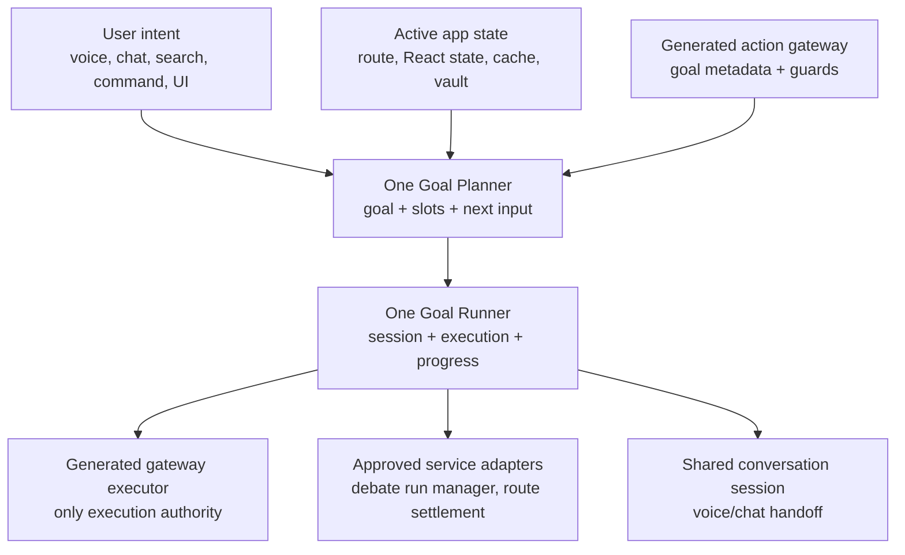

# One Goal Framework

Status: current-state framework for governed voice, chat, typed search, command bar, and UI action execution.

## Visual Map



## Current Truth

One Goal is the canonical action-execution framework behind One Voice and Agent Chat. It is not a separate assistant and it is not a provider tool runtime.

The primitive is Agent First:

- system instructions, app state, generated contracts, and A2A/ADK-style proposals provide the intelligence layer
- One is the head agent and may delegate to Kai, Nav, KYC, or deeper specialist agents through governed contracts
- code should not hard-code user stories such as “Analyze TSLA”; it should expose reusable resolvers and approved service adapters that contracts can reference
- local deterministic matching is a fallback for latency and tests, not the source of intelligence

Implemented foundation:

- generated actions now carry goal metadata, including `goal_id`, required inputs, workflow steps, progress, cancellation, result, and supported entrypoints
- `analysis.start` is the reference multi-step workflow for “Analyze TSLA”
- `specialist_chat.turn` is the shared adapter for generated specialist-turn actions such as `email.chat.turn`, `location.chat.turn`, `connections.chat.turn`, and Information Marketplace turns
- `planOneGoal` maps natural language plus candidate action ids into a generated action, slots, and exactly one next blocking input
- the planner is generic: it ranks generated action contracts, accepts provider/LLM candidate action ids first, and fills objective slots through resolver primitives such as `ticker_symbol` and `kai_pick_source`
- `runOneGoal` creates a shared goal session and executes only through the generated gateway or approved app service adapters
- Gemini Live proposals are treated as proposal signals; the One Goal planner remains authoritative
- Agent Chat can run the same goal path for mapped direct goals and falls back to the existing chat runtime for ordinary conversation
- `/api/one/goal/plan` and `/api/one/goal/compose` expose the product API shape; execution remains app-owned where live React state, route state, cache posture, and settlement are available

## Execution Rules

One Goal is governed by these rules:

1. Every executable goal starts from a generated `action_id`, usually proposed by One/Gemini Live/Agent Chat/A2A from system instructions and contracts.
2. The planner may rank generated contracts from natural language as a fallback, but the generated action contract defines required inputs and policy.
3. If all required inputs are present and the action policy is `allow_direct`, the runner may execute without another confirmation.
4. If an input is missing, One asks for exactly the next blocking input.
5. If the target workspace is earned but inactive, the runner may sync persona state and route-settle only when the generated contract is direct and does not require persona-switch confirmation.
6. If the action is `confirm_required` or `manual_only`, One switches to the governed chat/consent/A2A surface instead of provider-side execution.
7. If the action uses `specialist_chat.turn` and the policy is `allow_direct`, One may delegate to the existing Agent Chat A2A stream and speak the read-only result. If that stream returns a directive or prompt, One hands off to Agent Chat with the directive payload so the existing cards, confirmations, and client-side execution paths render.
8. Long-running goals emit milestone updates, support cancellation when the contract exposes it, and return a concise final summary.
9. Providers such as Gemini Live and future OpenAI Realtime may propose intents, but they must never execute tools directly.

## Resolver And Adapter Policy

Keep code small and primitive:

- slot resolvers convert evidence into slots, for example ticker extraction or default-list resolution
- service adapters bridge approved long-running app systems, for example the Kai debate run manager
- neither resolver nor adapter code should encode a full user story
- new goals should be added by authoring or generating goal metadata, not by adding another planner branch
- delete stale fallback maps once generated goal metadata covers the behavior

`user_utterance` is the generic resolver for specialist-turn goals. It fills the current transcript into the goal slot so the generated contract can route the turn without one-off transcript branches. Backend deterministic classification remains a fail-closed fallback and explicit delegate ids from generated contracts should be preferred when the frontend already selected the goal.

Provider proposals are intelligence hints, not authority. Gemini Live, Agent Chat, typed search, command bar, and UI buttons may all produce candidate action ids or slots, but One Goal must re-plan against the generated gateway before anything executes. Low-confidence realtime proposals are omitted before planning; the planner may still infer a generated goal from transcript and active app state, but a weak provider guess must not become the action. If a provider proposes a route-only action for a richer goal, such as opening analysis when the user asked to analyze a stock, the planner should prefer the generated multi-step goal when the slots and contract support it.

Memory candidates are goals only after review. A user saying "remember this" or sharing a stable high-confidence preference may produce a PKM preview goal or chat handoff, but canonical PKM writes must remain confirmation-gated and vault-authorized. Local encrypted voice memory is a narrow behavior cache; it is not the PKM authority and must not become a transcript persistence layer.

## Reference Workflow: Analyze TSLA

“Analyze TSLA” is the reference workflow because it touches finance, live app state, route settlement, cache, long-running streams, and summary composition.

Flow:

1. Parse `symbol=TSLA`.
2. Resolve source/list:
   - “use default” selects the default list directly.
   - exact future list/source resolvers may auto-select.
   - missing or ambiguous source asks “Which list should Kai use for this debate?”
3. Execute `analysis.start` through the generated gateway to preserve route/preview behavior.
4. Hydrate stock context through the existing cache-backed Kai service.
5. Open the analysis workspace as the visible progress surface.
6. Start or attach to the debate run through `DebateRunManagerService`.
7. Speak milestone updates from canonical stream events.
8. On completion, summarize decision, confidence, and short rationale in voice/chat; the full result remains in the analysis UI.

## Privacy Boundary

Goal planning may use redacted app state and generated contracts. It must not stream raw vault data, vault keys, decrypted PKM, private documents, raw cache keys, or transcript history into realtime provider context.

Backend `/api/one/goal/*` routes require `VAULT_OWNER` because they accept active app state and goal payloads. Those routes validate and compose product-level contract shapes; they do not become a second execution path.

## Verification

Focused checks:

```bash
cd hushh-webapp && npm run build:voice-gateway
cd hushh-webapp && npm run test -- __tests__/one-goal/one-goal-planner.test.ts __tests__/one-goal/one-goal-runner.test.ts __tests__/voice/kai-action-gateway.test.ts
cd hushh-webapp && npm run verify:voice-gateway
cd hushh-webapp && npm run typecheck
cd consent-protocol && python3 -m pytest tests/test_one_goal_routes.py -q
./bin/hushh docs verify
```

## Related References

- [One Voice Runtime Architecture](./one-voice-runtime-architecture.md)
- [One Voice Kai Compatibility Runtime](./one-voice-kai-compatibility-runtime.md)
- [Kai Action Gateway vNext](../kai/kai-action-gateway-vnext.md)
