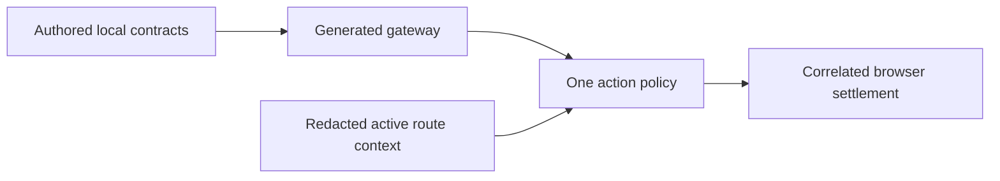

# One Voice Action Coverage Audit

Status: current coverage boundary for the generated action plane. This is an
admission audit, not a claim that every rendered control is voice-executable.

## Visual Map



## Current Truth

One can reason conversationally, but it may execute only an action that is in
the generated gateway and published by the active route/surface state. The
browser remains the executor and reports the observed result through the same
correlated settlement path used by Agent Bar, voice, Search, and UI actions.

### Included

- Route actions declared in a local `*.voice-action-contract.json`
- Current, generated controls and their validation metadata
- The active top interaction layer and redacted screen state
- Cross-screen `route.*` actions explicitly marked direct

### Excluded

- DOM-derived controls and text matching
- Credentials, vault keys, raw PKM, raw page content, and consent tokens in
  model context
- Manual-only or unconfirmed mutations
- Gmail: its manifest and route remain dormant, but it is not published to
  One, voice, Search, or the generated action catalog

## Sources

- [Authored contracts](../../../hushh-webapp)
- [Generated action gateway](../../../contracts/kai/kai-action-gateway.vnext.json)
- [Route orchestration index](../../../contracts/kai/one-route-orchestration-index.v1.json)
- [Frontend action runtime](../../../hushh-webapp/lib/agent/agent-action-runtime.ts)
- [Backend action gateway](../../../consent-protocol/hushh_mcp/services/action_gateway.py)
- [One action tools](../../../consent-protocol/hushh_mcp/one_adk/action_tools.py)

## Audit Procedure

1. Change the local action contract or route layout source, never generated JSON.
2. Regenerate the gateway, route index, surface map, and cache-coherence map.
3. Confirm an unavailable action is absent from the generated gateway and is
   rejected before a backend tool can execute it.
4. Exercise one direct navigation action and one guarded action in the same
   authenticated browser session, verifying directive and settlement ids match.
5. Run focused gateway, action-runtime, and One agent-tree tests.

```bash
cd hushh-webapp && npm run verify:voice-gateway
cd hushh-webapp && npx vitest run __tests__/voice/kai-action-gateway.test.ts
cd consent-protocol && python3 -m pytest tests/test_one_adk_agent_tree.py -q
```

## Related References

- [Kai Action Gateway vNext](../kai/kai-action-gateway-vnext.md)
- [One Voice Runtime Architecture](./one-voice-runtime-architecture.md)
- [One Agent Hierarchy](./one-agent-hierarchy.md)
