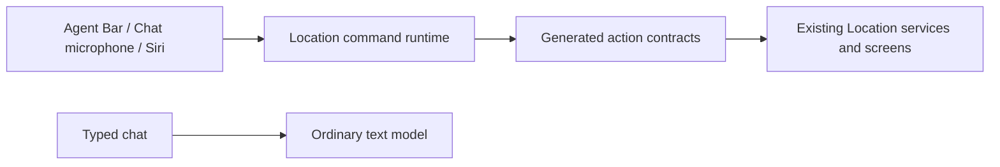

# One Voice Kai Compatibility Runtime

## Visual Map

## Current compatibility

One is the private agent. Kai is the finance specialist. The maintained command behavior is documented in [One Voice Runtime Architecture](./one-voice-runtime-architecture.md).

`kai-action-gateway.vnext.json`, existing `lib/voice` types, route journeys and local action identifiers remain compatibility contracts shared with typed search, text chat and Location tap flows. Authored `.voice-action-contract.json` files remain the source; generated projections must not become independent catalogs.

Talk to One, the Chat microphone and Siri free-text requests use the bounded Location command runtime. Typed Siri uses its typed proposal endpoint and the same checkpoint, preparation and confirmation ledger. Typed Agent Chat keeps ordinary model access and AG-UI. Shared context sanitizers and consent services retain historical filenames because they also serve text and commands.

The former Live websocket and relay-token entry points return retirement responses. `GeminiLiveClient` and the old transport constructor fail before networking. Local phrase classification, ASR/ONNX model packs and generated speech are retired; they are not fallback paths. Do not restore them through compatibility adapters.

Historical voice session and directive records are retained. Migration 208 is additive to the existing ledger and encrypted ADK sessions; its rollback preserves receipt metadata and removes command capsules that the previous application cannot resume.
