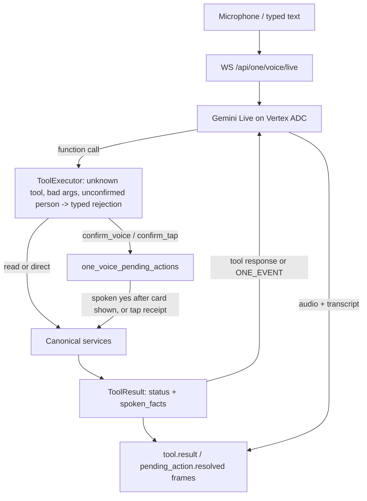

# One Live Voice: runtime, tool contract, consent rules, and Vertex ADC setup

Status: implemented; see [one-live-voice-decision-2026-09.md](./one-live-voice-decision-2026-09.md) for why.

## Visual Context

The platform map is [../architecture/architecture.md](../architecture/architecture.md); the bounded command runtime this adapter sits beside is [one-voice-runtime-architecture.md](./one-voice-runtime-architecture.md).

## Visual Map

## Runtime

1. `POST /api/one/voice/sessions` (vault-owner token) mints a single-use, 60-second HMAC ticket. `GET /api/one/voice/readiness` (Firebase) is the one flag the app reads.
2. `WS /api/one/voice/live?ticket=` consumes the ticket against `relay_ticket_nonces` (unreachable registry → rejected, never fail-open), then requires an `auth` frame within 5 s carrying the vault-owner token and, optionally, the Firebase id token. Both must name the ticket's user. The consent token never appears in a URL, a log, or the model prompt.
3. The session opens Gemini Live (`factory.build_live_client`: ADC, one pinned region) with the system instruction from `agents/one/agent.yaml` `capabilities.voice_head` plus the tool declarations, then runs three pumps: client → provider (audio, text, context, confirmations), provider → client (audio, transcripts, tool calls), and a watchdog (idle `ONE_VOICE_IDLE_CLOSE_SECONDS`, maximum `ONE_VOICE_SESSION_MAX_MINUTES`).
4. Frames are `one-voice-v1` (`hushh_mcp/one_voice/protocol.py`, mirrored in `hushh-webapp/lib/one-voice/protocol.ts`). Every action produces one typed payload that goes to the client as a frame and to the model as a tool response or an `[ONE_EVENT]` turn.

## Tool contract

- Every tool binds to one generated gateway `action_id`; `tests/one_voice/test_tool_registry_contract.py` fails when the id is missing or a gateway `confirm_required` policy would be weakened.
- Policies: `read`, `direct` (navigation, privacy-increasing), `confirm_voice` (reversible; spoken yes accepted only after the card was shown), `confirm_tap` (destructive/sensitive; hashed single-use receipt from the card).
- Person and circle arguments are `PersonRef{user_id}` / `CircleRef{circle_id}` and must already be confirmed in the conversation's entity context (`resolve_person` → read back → `confirm_person`). A spoken name is never an argument to a mutation.
- Results carry a tool-specific `status` vocabulary and `spoken_facts`. Pending statuses (`confirmation_required`, `tap_required`, `navigation_dispatched`, `grant_created`, `check_in_created`, `sos_grants_created`, `position_publish_pending`, `location_updates_pending`) are never success.
- Device-executed steps: `resume_device_location_updates` / `pause_device_location_updates` (the Location screen's own switch, gateway `location.resume_updates` / `location.pause_updates`) do no server work. They answer `location_updates_pending` and emit a `set_location_updates` client step; the app runs the same registered handler a tap runs (navigating to `/one/location` first when needed) and reports a typed result. The relay settles the final `tool.result` (`on`, `off`, `already_on`, `already_off`, or `rejected` with a typed `reason_code`) from that report, bound to the step's session, originating call, gateway action, desired state, and deadline; the raw report never reaches the model. Language-to-action is the model's own function calling over these declarations -- no alias, keyword, or transcript matcher sits before or after tool selection.
- `set_circle_kind` (gateway `location.set_circle_kind`, a `voice_tool` action like `location.set_precision`) changes only a circle's type through `update_circle(name=None, kind=…)`; a kind change never rides `location.rename_circle`'s approval, whose command receipt binds only `newName`.
- Circle context: the Circle detail screen publishes the open circle's canonical id as the typed `app_context.active_circle_id` field (never inside `screen_state`, which is rendered into the prompt). `get_circle_details` / `list_circle_members` with no `circle` argument read that circle through the authorized service; the id is a hint, not authority, and every mutation still needs the id confirmed. `list_circle_members` offers the roster's ids bound to that circle, so `confirm_person` can confirm a member who is not one of the person's connections -- revalidated against the circle's current membership, never taken from the model. `add_circle_member` decides on a fresh read and names the exact prerequisite (`already_member`, `invite_pending`, `connection_pending_outgoing`, `connection_pending_incoming`, `not_eligible`, `not_connected`); it never sends a connection request. After a membership change the remembered member count is re-read, not incremented. A successful decline of a connection request is `status: declined` (`request_status: rejected` is the row's state); `rejected` remains the executor's word for a refused call.
- The derived catalog is `contracts/kai/one-voice-live-tools.v1.json` (regenerate with `consent-protocol/scripts/generate_one_voice_tool_projection.py`; CI runs `--check`). It has no aliases.

Supported intents, by family (utterance → tool):

| Family | Examples | Tools |
|---|---|---|
| Session | "show my map", "open Location settings", "open my profile", "start location setup" | `open_screen` |
| People | "ask Ayesha for her location" (resolution first), "show my people", "invite Priya" | `resolve_person`, `confirm_person`, `list_people`, `get_person`, `invite_person`, `respond_connection_request`, `cancel_connection_request`, `remove_connection` |
| Device Location switch | "enable my location", "turn my location off" (this device's Location updates switch; never account sharing) | `resume_device_location_updates`, `pause_device_location_updates` |
| Location state | "is sharing with people on?", "stop sharing with everyone" (ends every share and link), "use approximate location", "hide me on the map" | `get_location_status`, `turn_sharing_on`, `turn_sharing_off`, `set_precision`, `get_location_settings`, `hide_on_map`, `show_on_map`, `set_auto_approve`, `list_my_place_ratings` |
| Sharing | "share my location with Maya for an hour", "check in with Maya", "show my links" | `request_location`, `list_requests`, `respond_request`, `withdraw_request`, `share_with`, `list_shares`, `stop_share`, `change_share_duration`, `create_check_in`, `list_links`, `create_public_link`, `revoke_public_link` |
| Circles | "create a Family circle", "who is in this circle?", "add Priya to Family", "take Rohan out of Family" (membership, not connection), "leave Work Friends" (not delete), "delete my Family circle" | `list_circles`, `resolve_circle`, `confirm_circle`, `get_circle_details`, `list_circle_members`, `create_circle`, `rename_circle`, `set_circle_kind`, `delete_circle`, `add_circle_member`, `remove_circle_member`, `leave_circle`, `list_circle_invites`, `respond_circle_invite`, `cancel_circle_invite`, `create_circle_invite_link` |
| Save My Soul | "open Save My Soul", "send an SOS" | `get_save_my_soul_status`, `trigger_save_my_soul`, `report_save_my_soul_delivery`, `stop_save_my_soul`, `add_emergency_contact`, `remove_emergency_contact` |
| Profile | "what is on my profile?", "change my name to …", "show my privacy settings" | `get_profile`, `update_display_name`, `get_privacy_settings`, `set_contact_discoverable` |
| Setup | "start location setup" | `get_location_setup_state`, `start_location_setup`, `accept_location_setup_consent`, `advance_location_setup` |

## Consent rules

- The socket requires a vault-owner token (HCT); people and profile mutations additionally require a fresh Firebase proof at confirmation.
- Location setup records consent strictly before the OS permission prompt (service rule and a table constraint); the client refuses `request_os_permission` without recorded consent.
- Turning sharing off revokes every active owner grant outside the Save My Soul lane and every active public link in the same transaction; Save My Soul must be stopped explicitly.
- Coordinates never reach the server in plaintext. `precision` is a stored preference and a plaintext envelope tag; the device coarsens the point before recipient-ECDH encryption and the server rejects a mismatched tag.
- Pending confirmations expire after 120 s; a newer mutation cancels the older; "no", "stop", "cancel" cancel by voice or by the Stop control.

## Vertex ADC setup and model pinning

1. Hosted lanes run `HUSHH_GENAI_AUTH_MODE=vertex_adc` with `GOOGLE_GENAI_USE_VERTEXAI=true` and the lane's GenAI project (`GENAI_GOOGLE_CLOUD_PROJECT`). The runtime service account needs `roles/aiplatform.user` there (already true for the text fleet).
2. An org-policy admin admits the Live model id in `constraints/vertexai.allowedModels` for the lane's GenAI project.
3. Run the read-only discovery probe per lane and pick one id: `cd consent-protocol && uv run python scripts/discover_vertex_live_models.py --project <genai project> --locations us-central1 --candidates gemini-live-2.5-flash-native-audio,<newer ids>`. Choose the candidate that connects in that lane, supports native audio + function calling + input/output transcription, and is the most stable tier admitted (GA over preview). Never choose "highest version" blindly.
4. Write the id in exactly three places: the registry entry (`hushh_mcp/runtime_providers/registry.py`, `supports_native_realtime=True`, regional `supported_vertex_locations`, no aliases), the lane's `_VERTEX_LIVE_MODEL_ID` substitution, and this document. `tests/test_uat_deploy_no_traffic_contract.py` asserts the substitution resolves to the registry entry.
5. Set `_VERTEX_LIVE_LOCATION` to one regional endpoint (`global`/`us`/`eu` are refused) and flip `_ONE_VOICE_LIVE_ENABLED=true` on UAT only. Production stays off until the UAT red-team transcript run passes.

## Limits and observability

`one_voice_conversations` keeps per-conversation counters (audio seconds, tool calls, ok/rejected results, pending created/confirmed/cancelled, `narration_without_receipt`, `unknown_tool_calls`, close code/class) and never audio, transcripts, names, or coordinates. Limits: `ONE_VOICE_SESSION_MAX_MINUTES` (30), `ONE_VOICE_IDLE_CLOSE_SECONDS` (90), one live session per user, `ONE_VOICE_MAX_SESSIONS_PER_INSTANCE` (8), ticket minting under the agent-chat rate limit. A provider outage (including a billing denial arriving as close 1008) closes the app socket with 4013 `voice_unavailable`; the app says "Voice is unavailable right now" and never retries with another model or region.
