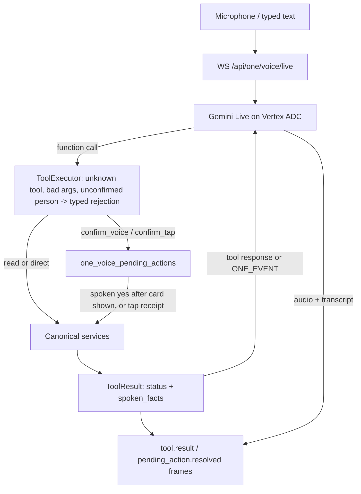

# One Live Voice: runtime, tool contract, consent rules, and Vertex ADC setup

Status: implemented; see [one-live-voice-decision-2026-09.md](./one-live-voice-decision-2026-09.md) for why.

## Visual Context

The platform map is [../architecture/architecture.md](../architecture/architecture.md); the bounded command runtime this adapter sits beside is [one-voice-runtime-architecture.md](./one-voice-runtime-architecture.md).

## Visual Map

```mermaid
flowchart TD
  mic[Microphone / typed text] --> ws[WS /api/one/voice/live]
  ws --> live[Gemini Live on Vertex ADC]
  live -->|function call| exec[ToolExecutor: unknown tool, bad args, unconfirmed person -> typed rejection]
  exec -->|read or direct| svc[Canonical services]
  exec -->|confirm_voice / confirm_tap| pending[one_voice_pending_actions]
  pending -->|spoken yes after card shown, or tap receipt| svc
  svc --> result[ToolResult: status + spoken_facts]
  result --> client[tool.result / pending_action.resolved frames]
  result -->|tool response or ONE_EVENT| live
  live -->|audio + transcript| client
```

## Runtime

1. `POST /api/one/voice/sessions` (vault-owner token) mints a single-use, 60-second HMAC ticket. `GET /api/one/voice/readiness` (Firebase) is the one flag the app reads.
2. `WS /api/one/voice/live?ticket=` consumes the ticket against `relay_ticket_nonces` (unreachable registry → rejected, never fail-open), then requires an `auth` frame within 5 s carrying the vault-owner token and, optionally, the Firebase id token. Both must name the ticket's user. The consent token never appears in a URL, a log, or the model prompt.
3. The session opens Gemini Live (`factory.build_live_client`: ADC, one pinned region) with the system instruction from `agents/one/agent.yaml` `capabilities.voice_head` plus the tool declarations, then runs three pumps: client → provider (audio, text, context, confirmations), provider → client (audio, transcripts, tool calls), and a watchdog (idle `ONE_VOICE_IDLE_CLOSE_SECONDS`, maximum `ONE_VOICE_SESSION_MAX_MINUTES`).
4. Frames are `one-voice-v1` (`hushh_mcp/one_voice/protocol.py`, mirrored in `hushh-webapp/lib/one-voice/protocol.ts`). Every action produces one typed payload that goes to the client as a frame and to the model as a tool response or an `[ONE_EVENT]` turn.

A Live tool response may end one provider turn before the model continues the same user request in another. Client frames retain each provider turn ID for display and fencing; the relay also retains the causal user input ID for stale-action checks. A newer user input supersedes the old action, while a model-only continuation remains eligible to propose its confirmation card. Live events carry no turn ID, so whatever Live says next is attributed to the relay's current turn. A spoken input becomes the current turn at once only when Live has finished a turn, owes no reply and has said nothing since; Live's answer is then delivered under the input's own ID. In every other case the input waits for Live's next boundary and the old turn is fenced: Live is still speaking (a barge-in, so the rest of that reply and anything it proposes never becomes the new answer), a tool result or an `[ONE_EVENT]` is still owed its spoken reply (a narration's acknowledgement included), or a typed or earlier spoken question is waiting. A model-only turn that ends without a new tool call releases an owed reply, so a reply Live never speaks holds back one input at most. Within one provider message the relay reads the input transcript before the model audio. Each placement is logged as `one_voice.turn_input mode=adopt|park_busy|park_owed|park_queued|park_pending`, and Live audio a fence drops as `one_voice.turn_muted chunks=N`. (Before 2026-10-05 every idle turn fenced the next spoken input, which muted the answer to every other follow-up question and left the pill on "Understanding".)

## Tool contract

- Every tool binds to one generated gateway `action_id`; `tests/one_voice/test_tool_registry_contract.py` fails when the id is missing or a gateway `confirm_required` policy would be weakened.
- Policies: `read`, `direct` (navigation, privacy-increasing), `confirm_voice` (reversible; spoken yes accepted only after the card was shown), `confirm_tap` (destructive/sensitive; hashed single-use receipt from the card).
- Person and circle arguments are `PersonRef{user_id}` / `CircleRef{circle_id}` and must already be confirmed in the conversation's entity context (`resolve_person` → read back → `confirm_person`). A spoken name is never an argument to a mutation.
- Results carry a tool-specific `status` vocabulary and `spoken_facts`. Pending statuses (`confirmation_required`, `tap_required`, `navigation_dispatched`, `grant_created`, `check_in_created`, `sos_grants_created`, `position_publish_pending`, `location_updates_pending`) are never success.
- `send_mail` first proposes a voice-confirmed action. The confirmation card's **Confirm** button opens an editable draft; a spoken yes calls `confirm_pending_action` for that card. The client acknowledges `pending_action.shown` only after the matching, unresolved card is visible in the One panel, scrolling the card into view when needed. The `open_mail_draft` client step must report a mounted review card before `draft_opened` is claimed. When that settlement cannot be recorded (voice storage unavailable, or the row is no longer in the state the settlement expects), the card resolves `draft_open_unconfirmed` with a `reason_code` (`storage_unavailable` / `draft_not_settled`) and the model hears "I couldn't verify the draft review state just now. Nothing was sent." -- never opened, never sent, never "nothing pending", and rule 13 forbids re-offering the same draft unasked. A recipient who is no longer an active connection is `recipient_not_connected` at preparation and `recipient_changed` at execution (never `person_has_no_email`); a sealed draft that cannot be opened is `private_draft_unavailable` (nothing ran). An identical re-proposal of a waiting draft returns `confirmation_waiting` (the open row's sealed payload is compared in memory; nothing extra is stored); a different dictation is a correction that replaces the card. Needs-reply reads report `scope: needs_reply` and are spoken as conversations that may need a reply, never as the newest. A Gmail 5xx after the send request is an unknown outcome (never retried, no resend offered). Only the owner's **Send** tap on the review card delivers mail.
- `reply_mail` answers an email One already showed, inside that email's own Gmail thread. Its arguments are a position (`ordinal`) and the reply text (`message`, sealed like a dictated draft) -- never a recipient, subject, address or message id. The server resolves the target from its own offer: an explicit position, else the row open on screen (the typed `app_context.active_mail_ordinal` + `active_mail_offer_revision`, honored only while that revision is the current offer; never in `screen_state`), else the single email just shown; anything else is `reply_target_required`. A reply goes only to whoever wrote the email: reply-all, forwarding, a new subject and attachments are not possible, so One says so, asks whether a reply to the sender alone would do, and prepares nothing until they answer (live eval: a sender-only `reply_mail` in place of "reply all" was 2 of 5 samples before the `reply_mail` description said so). The person-lookup names live in that description, not in the always-on narration rule: naming them in rule 13 made "what did Ayesha say about the launch" look Ayesha up first in 2 of 6 samples. It never looks the sender up as a person (`resolve_person` or `list_people`: a people list would replace the mail on screen, the one slot the person is choosing from), and the original sender need not be a connection: the authority is the owner's mailbox, the server-derived recipient, the review card and the Send tap. Preparation checks send readiness, then re-reads the message's routing headers with the read grant through `GmailMetadataReader.reply_source` (metadata only, pinned to the account the offer came from) and derives `Reply-To` (a present but unusable one is refused, never skipped for `From`), the `Re:` subject and the `threadId`/`In-Reply-To`/`References` binding; Trash, Spam, drafts, the owner's own messages (`SENT` or the owner's address) and multi-address replies are refused with typed reasons. The card sentence names only the position ("prepare a reply to email 2 in your list"); no sender, subject or address reaches the model, a log line or `spoken_facts`. The prepared snapshot holds an opaque AES-GCM `source_mail_ref` (owner-, account- and source-fingerprint-bound, 15-minute expiry) and an HMAC `target_key`, so a duplicate proposal is reused only for the same email (`ToolSpec.target_key`), and both terminal-scrub with `_sealed_args`. After a spoken yes the message is read again, a changed one is `reply_source_changed`, and the `open_mail_draft` step carries `mode: "reply"` and a fresh `source_mail_ref` inside `draft` (a client that predates replies rejects the step rather than opening an unthreaded compose card). The card locks To and Subject; `/email/prepare` and `/email/send` take `source_mail_ref` (mutually exclusive with `source_workflow_id`, no attachments) and re-derive the envelope and reply context from the message on each call, so only the body is the browser's. Off by default: `ONE_VOICE_MAIL_REPLY_ENABLED` gates the tool and the HTTP send of a reply card; deploy-uat turns it on through the generated runtime config.
- `schedule_mail` stores an email that the server sends later; nothing sends from the device. Its arguments are a confirmed `recipient` (`PersonRef`, exactly as `send_mail`), the dictated `subject` and `message` (sealed like a dictated draft) and exactly one time. A clock time or day is `send_at`: the owner-local wall-clock time, ISO-8601 without a UTC offset, that the Live head resolves from the owner's words against the current time and owner zone that `build_instruction` states; the server applies the owner's zone, daylight saving included (the 9:00 AM defaults for a bare "morning", "tomorrow" or date live in the tool description). A duration ("in 30 minutes") is `send_in_minutes` (2 to 43200), counted by the server and pinned at the card, so the yes never counts it again. Neither or both is a spoken question (`schedule_time_missing`, `schedule_time_ambiguous`). `owner_time` only accepts or refuses -- unparseable or worded, already past, under 60 seconds out, or more than 30 days out each get a typed reason and a question -- and never rounds or rewrites a time. The card names the stored instant in owner-local words ("I can send this to Priya Sharma tomorrow at 9:00 AM IST"), and the spoken yes re-checks the recipient connection and address, the time and the connected Gmail account before anything is stored. The yes writes one `gmail_owner_send_actions` row in state `scheduled` (migration 275): `payload_sealed` (AES-GCM, owner- and action-bound; the address, subject, body, recipient id and sending Google account), display-only `subject` and `recipient_display`, `expires_at = send_at + 24h`, and an idempotency key over the envelope, the time, the recipient and the sending Google account (HMAC'd, so a re-approval after reconnecting another account is a new row; a cancel rotates it, so the same email can be scheduled again). Only after that commit does the model hear "Scheduled for ..."; rule 13 forbids calling it sent. `list_scheduled_mail` puts the rows on screen, tells the model only a count and the next owner-local send time (never more than it fetched; a row already due is spoken as due and not yet sent), and mints an offer; `cancel_scheduled_mail` takes a position in that offer and flips `scheduled -> cancelled` with a compare-and-set that clears the sealed payload and the subject, saying honestly when the drain got there first. `POST /api/one/email/scheduled/drain` is called every minute by Cloud Scheduler with an OIDC token for `mail-scheduled-send@` (UAT only): it claims due rows with `FOR UPDATE SKIP LOCKED`, re-checks the recipient connection and the sending account (a change fails closed), arms `scheduled -> prepared` and calls the unchanged `GmailDeliveryService.execute()`, which re-verifies the envelope HMAC. Every refusal is settled `failed` with its reason -- `schedule_window_passed` (more than 24 hours late, or the window closed while armed), `recipient_disconnected`, `recipient_changed`, `gmail_unavailable` (Gmail disconnected or needing re-auth) or `sender_changed` -- so migration 252 projects a Feed item for every unsent email; immediate-send expiry never touches a scheduled row. An `outcome_unknown` is never re-sent, the sealed payload and the subject are cleared on every terminal state (each run starts with a bounded sweep of finished rows still holding either), the owner gets one push per outcome and none offers a resend, and an account reset deletes the owner's scheduled sends. Kill switches: `ONE_VOICE_MAIL_SCHEDULE_SEND_ENABLED` (new schedules also need the drain switch and mail reads, since nothing else would send them) and `MAIL_SCHEDULED_DRAIN_ENABLED` (delivery; listing and cancelling stay available while either is on, even with mail reads off, so the owner can always stop mail that could still go out). Both are off by default; deploy-uat turns them on.
- `list_drafts`, `open_draft` and `send_draft` work on the owner's Gmail drafts by position. The list reads draft metadata only (never bodies) with the read grant and mints an offer pinned to the Google account with `mailbox: drafts`; inbox paths (`open_mail`, positional `read_mail`, `reply_mail`) refuse a drafts offer and the drafts tools refuse an inbox one. Draft recipients and subjects can be written by someone else (a reply draft's "Re:" subject, a sender's display name), so the model hears only counts and positions: the list says how many drafts there are, and `send_draft`'s card says "send draft 2 in your list now" while the screen keeps the list and shows who it goes to (To, Cc and the owner's own Bcc) and the subject. A draft sends now: one cannot be scheduled, so a draft send with a later time is said to be impossible and nothing is prepared. Gmail draft ids are redacted from request-URL logs like message and thread ids. `open_draft` is dispatch-only (`draft_open_dispatched`); the screen fetches the body through `POST /api/one/voice/draft/open`, which applies the same offer, freshness and mailbox checks and answers 410 `DRAFT_GONE` for a draft that no longer exists. `send_draft` re-reads the draft from Gmail at preparation and again at the yes (gone or edited means no send), refuses a draft with no To recipient, and writes one audit row per draft send; an earlier send that did not confirm is never repeated. Gmail's `drafts.send` accepts the compose grant, not `gmail.send`, so a voice draft send needs the owner's Send switch and the existing optional Gmail drafts grant; without it One says how to turn drafts on. Unlike `send_mail` and `reply_mail`, a listed draft is sent by the spoken yes. Discarding a draft needs `gmail.modify` and is not a voice tool. Off by default: `ONE_VOICE_MAIL_DRAFTS_ENABLED`; deploy-uat turns it on.
- Every review card the relay opens gets a session-issued `delivery_ref`. When the card's Send finishes, the client sends `mail_delivery.result {delivery_ref, action_id}` -- no status -- and the relay re-reads that owner's send action (`get_owner_send_action`): only `sent` (for a reply, landed in the source's thread) is spoken as sent; `failed`, `outcome_unknown`, `thread_unconfirmed` (`reply_thread_mismatch`) and `unverified` (no such action for this owner, an action older than the card, a send still in flight) each have their own sentence, and none offers a resend. The event reaches the model only while the person is still on the turn that opened the card; a report for a card the session did not open is dropped quietly. Gmail sends never depend on the socket.
- Device-executed steps: `resume_device_location_updates` / `pause_device_location_updates` (the Location screen's own switch, gateway `location.resume_updates` / `location.pause_updates`) do no server work. They answer `location_updates_pending` and emit a `set_location_updates` client step; the app runs the same registered handler a tap runs (navigating to `/one/location` first when needed) and reports a typed result. The relay settles the final `tool.result` (`on`, `off`, `already_on`, `already_off`, or `rejected` with a typed `reason_code`) from that report, bound to the step's session, originating call, gateway action, desired state, and deadline; the raw report never reaches the model. Language-to-action is the model's own function calling over these declarations -- no alias, keyword, or transcript matcher sits before or after tool selection.
- `set_circle_kind` (gateway `location.set_circle_kind`, a `voice_tool` action like `location.set_precision`) changes only a circle's type through `update_circle(name=None, kind=…)`; a kind change never rides `location.rename_circle`'s approval, whose command receipt binds only `newName`.
- Connections: the people tools bind to the Connect family's own gateway actions (`connect.search_people` for `resolve_person`/`confirm_person`, `connect.send_request`, `connect.accept_request`, `connect.reject_request`, `connect.cancel_request`, `connect.remove_connection`); nothing on the voice path binds to `location.find_contacts` (device contact sync) or calls contact sync to resolve a name. `resolve_person` searches display names only (a phone number or email is refused with `identifier_not_a_name`), reads up to three directory pages and reports `truncated` rather than claiming "nobody" or "the only match" past that; every offer carries a revision and a 10-minute expiry, and `confirm_person` refuses a stale offer. A new `resolve_person`/`resolve_circle` cancels the open cards about that kind of entity (`ToolSpec.stale_on_lookup`: derived from `person_args`/`circle_args`; a card whose counterpart rides an opaque request id stays stale on any lookup; `create_circle` declares `lookup_targets=()`), so a correction never leaves an approvable card for the previous target while a lookup made for a follow-up never cancels an unrelated card. A lookup's cancel is a correction, so it never arms the recent-cancel guard (whose flag lets the model confirm on an earlier yes; after a lookup that yes answered "is that who you mean?"): the corrected card is asked fresh. The relay tells the client and the model about every superseded card. `accept_connection_request`, `decline_connection_request` and `cancel_connection_request` act only on request ids the server listed in this conversation (`list_people`), refuse anything else as `request_not_offered`, and their cards name the request's real counterpart from that listing, never a name the model supplied. `list_people` reads one page of connections (`LIST_PAGE_LIMIT`) with `has_more`; `counts` carry the totals. `invite_person` (message up to 1000 characters, the connections route's own bound) decides from the *committed* payload: `sent` needs a new pending request whose requester is the person, an existing request in either direction is `already_pending` with its direction, and a missing id/status is `malformed_request_result`, never "sent". `accept_connection_request` on a scope-bearing request returns `scope_review_required` and an `open_request_review` client step that opens the Consent Center for that request; opening it accepts nothing, and the relay settles the real outcome (`accepted`, `still_pending`, `declined`, `withdrawn`, `review_unverified`) from a re-read after the screen reports back. `remove_connection` re-reads the relationship after the cascade and reports `unverified` if it still shows connected.
- One open card per conversation, answered before anything else replaces it: a proposal from the same tool, or from a tool in the same declared `ToolSpec.correction_group` (`circle_add`: the three circle-add tools; `sharing_switch`: sharing on/off), is a correction and replaces the open card. A shared gateway action alone is not a correction (`request_location` and `withdraw_request` share one). Any other proposal, while a card the person has seen is open, returns `pending_action_exists` (never success, nothing written) with that card's id, and the relay rebinds the card to the current turn so a tap reports there; a card never shown was never reviewed and blocks nothing. Only `trigger_save_my_soul` (`ToolSpec.preempts_pending`) replaces a shown card unanswered. "Yes, and <another effect>" is confirm-first policy in `NARRATION_CONTRACT` rule 4: the waiting action is confirmed, and the follow-up is prepared only from its real result (for example the new circle's id). Voice storage failures fail closed without ending the session: an unreadable pending state proposes, confirms and cancels nothing (`rejected`/`storage_unavailable`); a ledger write that fails after the service committed still reports the service's result and leaves the row `confirmed` (never re-executable); `mark_shown`, screen, entity and resumption-handle writes are best effort (`one_voice.storage.failed op=…`). Before this, each of them closed the socket with 4013. Latency is logged as `one_voice.latency phase=first_tool|tool|exec|reply_audio|first_audio` with durations only.
- Actor proof: the client fetches a fresh Firebase proof for the auth frame on every connect, and every `firebase_plane` confirmation -- spoken, tapped, or over HTTP -- re-verifies the Firebase proof (signature, expiry, revocation, and that it names the signed-in user) immediately before the pending row is confirmed. A refused proof leaves the row pending (`firebase_proof_required` / `firebase_proof_invalid`); a tap with a fresh proof completes it. A post-confirmation exception is narrated as an unknown outcome, never "nothing changed".
- Circle context: the Circle detail screen publishes the open circle's canonical id as the typed `app_context.active_circle_id` field (never inside `screen_state`, which is rendered into the prompt). `get_circle_details` / `list_circle_members` with no `circle` argument read that circle through the authorized service; the id is a hint, not authority, and every mutation still needs the id confirmed. `list_circle_members` offers the roster's ids bound to that circle, so `confirm_person` can confirm a member who is not one of the person's connections -- revalidated against the circle's current membership, never taken from the model. `add_circle_member` decides on a fresh read and names the exact prerequisite (`already_member`, `invite_pending`, `connection_pending_outgoing`, `connection_pending_incoming`, `not_eligible`, `not_connected`); it never sends a connection request. Two or more confirmed people are `add_circle_members` (2-20, one card, one write, an answer per person). "All my connections" is `add_all_connections`: the model names only the circle; its prepared card reads the owner's connections through `plan_direct_connection_adds` and states exact counts (to add, already in, can't be added right now), binds the sorted ids and their digest in the private `_prepared` snapshot, refuses Trusted and the SMS circle (`unsupported`), and refuses before any card when the circle lacks room for everyone (`not_enough_room`, never a subset). Execution re-reads and refuses (`not_added`/`audience_changed`) if anyone approved can no longer be added; a connection made after the card is never added on its strength. `add_direct_connections` writes the approved ids in one transaction, as sorted chunks of twenty through `create_member_invites`, and notifies once after commit. After a membership change the remembered member count is re-read, not incremented. A successful decline of a connection request is `status: declined` (`request_status: rejected` is the row's state); `rejected` remains the executor's word for a refused call.
- Save My Soul (the product name; never a carrier text): `trigger_save_my_soul` and `stop_save_my_soul` are `confirm_tap` tools whose cards are *prepared* from live state (`ToolSpec.prepare`): the trigger card names exactly who will get the person's precise location for 8 hours, who on the roster is left out and why, and the note (140 characters, rejected rather than truncated); no card is shown when the roster cannot be read (`roster_unavailable` is not "empty"), when it is empty, when nobody on it can receive a location, or when an alert is already live (`already_active`). The snapshot rides in the pending row's args (`_prepared`) and execution refuses an audience that changed since the tap (`sos_audience_changed`, no grant created). Arming runs under the owner-scoped `sos_incident_guard` (a PostgreSQL advisory lock) so racing attempts cannot both create a full set; each created grant is recorded before the next contact is attempted, and a refused or crashed create for one contact never hides the others. `sos_grants_created` means ARMED: the relay treats it like `location_updates_pending` (card settled, `ok:false`, no counters, the turn stays listening) and hands the app the `publish_location_envelopes` step. When the device reports, the relay -- not the model -- runs `report_save_my_soul_delivery` bound to the armed set (or every live SOS grant the sender owns when the session holds no record) and re-resolves the same card with `sos_sent` / `sos_partial` / `sos_not_sent` / `sos_unverified` (the check itself could not run); caller-supplied ids can only add `unknown` rows, never narrow coverage, and the device's own claim never reaches the model. `stop_save_my_soul` counts a share as ended only on positive evidence: the revoke answered revoked/expired for that grant id, and a re-read no longer lists it live (when the re-read itself fails, only revokes with that positive answer count); everything else stays `unresolved` (`sos_partially_stopped`). Its card names the live shares it will end and the tap refuses (`sos_scope_changed`) if a share the card never named went live in between. It never tells anyone the person is safe. The trigger is `device_step`: the HTTP confirm route refuses it (`SESSION_CONFIRM_REQUIRED`) because only a live session can run and verify the publish step. Roster edits are future-only: `add_emergency_contact` never sends, `remove_emergency_contact` never revokes a live share, and both say so when an alert is live; `get_save_my_soul_status` offers the roster's ids so a removal is confirmed from the actual roster. A session record whose grants have all ended is dropped in favour of the server (`alert_ended` is reported as `sos_unverified`, never "not sent"). The delivery report binds to its own read action `location.verify_sos_delivery`; the publish step is given 60 s (the client's cap) so a cold GPS fix is not reported as a failure.
- The derived catalog is `contracts/kai/one-voice-live-tools.v1.json` (regenerate with `consent-protocol/scripts/generate_one_voice_tool_projection.py`; CI runs `--check`). It has no aliases.

Supported intents, by family (utterance → tool):

| Family | Examples | Tools |
|---|---|---|
| Session | "show my map", "open Location settings", "open my profile", "start location setup" | `open_screen` |
| People / Connections | "send Meera a connection request" (resolution first, then its own confirmation), "who am I connected with?", "is Kushal on Hussh?", "accept Rahul's request", "cancel my request to Dev", "disconnect from Ayesha" (ends the connection everywhere; not a circle removal, no block) | `resolve_person`, `confirm_person`, `list_people`, `get_person`, `invite_person`, `accept_connection_request`, `decline_connection_request`, `cancel_connection_request`, `remove_connection` |
| Device Location switch | "enable my location", "turn my location off" (this device's Location updates switch; never account sharing) | `resume_device_location_updates`, `pause_device_location_updates` |
| Location state | "is sharing with people on?", "stop sharing with everyone" (ends every share and link), "use approximate location", "hide me on the map" | `get_location_status`, `turn_sharing_on`, `turn_sharing_off`, `set_precision`, `get_location_settings`, `hide_on_map`, `show_on_map`, `set_auto_approve`, `list_my_place_ratings` |
| Sharing | "share my location with Maya for an hour", "check in with Maya", "show my links" | `request_location`, `list_requests`, `respond_request`, `withdraw_request`, `share_with`, `list_shares`, `stop_share`, `change_share_duration`, `create_check_in`, `list_links`, `create_public_link`, `revoke_public_link` |
| Circles | "create a Family circle", "who is in this circle?", "add Priya to Family", "add Priya, Rohan and Dev to Family" (one card), "add all my connections to Family" (one card with counts), "take Rohan out of Family" (membership, not connection), "leave Work Friends" (not delete), "delete my Family circle" | `list_circles`, `resolve_circle`, `confirm_circle`, `get_circle_details`, `list_circle_members`, `create_circle`, `rename_circle`, `set_circle_kind`, `delete_circle`, `add_circle_member`, `add_circle_members`, `add_all_connections`, `remove_circle_member`, `leave_circle`, `list_circle_invites`, `respond_circle_invite`, `cancel_circle_invite`, `create_circle_invite_link` |
| Save My Soul | "open Save My Soul" (navigation only), "alert my emergency contacts, I need help" (card, then tap), "who will get my alert?", "did it go through?", "stop my Save My Soul alert" (card, then tap) | `get_save_my_soul_status`, `trigger_save_my_soul`, `report_save_my_soul_delivery`, `stop_save_my_soul`, `add_emergency_contact`, `remove_emergency_contact` |
| Mail | "can you see my Gmail?", "anything that needs my reply?", "what's the second one about?", "open it", "email Ayesha that the build is ready" (resolve first, then a draft card), "reply to the second one saying thanks" (a reply card; the server derives the recipient), "mail Ayesha the notes tomorrow at 9" (resolve first, then a scheduled send the server delivers), "what have I scheduled?", "cancel the first one", "show my drafts", "send the second draft" | `get_mail_access`, `read_mail`, `open_mail`, `send_mail`, `reply_mail`, `schedule_mail`, `list_scheduled_mail`, `cancel_scheduled_mail`, `list_drafts`, `open_draft`, `send_draft` |
| Profile | "what is on my profile?", "change my name to …", "show my privacy settings" | `get_profile`, `update_display_name`, `get_privacy_settings`, `set_contact_discoverable` |
| Setup | "start location setup" | `get_location_setup_state`, `start_location_setup`, `accept_location_setup_consent`, `advance_location_setup` |

## Consent rules

- The socket requires a vault-owner token (HCT); people and profile mutations additionally require a fresh Firebase proof at confirmation.
- Location setup records consent strictly before the OS permission prompt (service rule and a table constraint); the client refuses `request_os_permission` without recorded consent.
- Turning sharing off revokes every active owner grant outside the Save My Soul lane and every active public link in the same transaction; Save My Soul must be stopped explicitly.
- Coordinates never reach the server in plaintext. `precision` is a stored preference and a plaintext envelope tag; the device coarsens the point before recipient-ECDH encryption and the server rejects a mismatched tag.
- Pending confirmations expire after 120 s; a newer mutation cancels the older; "no", "stop", "cancel" cancel by voice or by the Stop control.

## Vertex ADC setup and model pinning

1. Hosted lanes run `HUSHH_GENAI_AUTH_MODE=vertex_adc` with `GOOGLE_GENAI_USE_VERTEXAI=true` and the lane's GenAI project (`GENAI_GOOGLE_CLOUD_PROJECT`). The runtime service account needs `roles/aiplatform.user` there (already true for the text fleet).
2. An org-policy admin admits the Live model id in `constraints/vertexai.allowedModels` for the lane's GenAI project.
3. Run the read-only discovery probe per lane and pick one id: `cd consent-protocol && uv run python scripts/discover_vertex_live_models.py --project <genai project> --locations us-central1 --candidates gemini-live-2.5-flash-native-audio,<newer ids>`. Choose the candidate that connects in that lane, supports native audio + function calling + input/output transcription, and is the most stable tier admitted (GA over preview). Never choose "highest version" blindly.
4. Write the id in exactly three places: the registry entry (`hushh_mcp/runtime_providers/registry.py`, `supports_native_realtime=True`, regional `supported_vertex_locations`, no aliases), the lane's `_VERTEX_LIVE_MODEL_ID` substitution, and this document. `tests/test_uat_deploy_no_traffic_contract.py` asserts the substitution resolves to the registry entry.
5. Set `_VERTEX_LIVE_LOCATION` to one regional endpoint (`global`/`us`/`eu` are refused) and flip `_ONE_VOICE_LIVE_ENABLED=true` on UAT only. Production stays off until the UAT red-team transcript run passes.

## Limits and observability

`one_voice_conversations` keeps per-conversation counters (audio seconds, tool calls, ok/rejected results, pending created/confirmed/cancelled, `narration_without_receipt`, `unknown_tool_calls`, close code/class) and never audio, transcripts, names, or coordinates. Limits: `ONE_VOICE_SESSION_MAX_MINUTES` (30), `ONE_VOICE_IDLE_CLOSE_SECONDS` (90), one live session per user, `ONE_VOICE_MAX_SESSIONS_PER_INSTANCE` (8), ticket minting under the agent-chat rate limit. A provider outage (including a billing denial arriving as close 1008) closes the app socket with 4013 `voice_unavailable`; the app says "Voice is unavailable right now" and never retries with another model or region.
