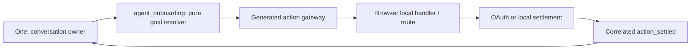

# One Voice Onboarding Journey

Status: current implementation contract for One's first-run voice journey.

## Visual Map

## Ownership and boundaries

One remains the only conversational and semantic head. Its current ADK turn supplies a
typed onboarding assessment; `agent_onboarding` deterministically adjudicates that
proposal against redacted journey and current-screen action state. It never classifies
meaning with keywords and has no tools, tokens, vault access, transcript, speaking
authority, or action authority. The generated action gateway and browser-local handler
remain the execution authority.

## Journey state

Authenticated progress is a versioned, pre-vault row: phase, active capability,
callback outcome, timestamp, and the fixed `/one/setup` resume route. Anonymous state
is browser-ephemeral until Firebase has settled the provider flow. The record never
stores raw voice turns, private page content, OAuth material, or vault material. It is a
resumption hint; route guards and the generated contracts are still authoritative.

| Phase | Permitted work | Success exit | Safe recovery |
| --- | --- | --- | --- |
| Anonymous auth | choose Google or Apple | verified Firebase session | choose a provider / retry |
| Phone required | phone verification only | setup hub | verify phone |
| Setup hub | choose a capability, skip, or finish | capability route / One home | return to hub |
| Capability setup | scoped local action or approved connector | terminal callback or explicit breadcrumb return to `/one/setup` | retain goal and return hub |
| External connector | callback settlement only | `/one/setup` | retry/cancel without root completion |
| Root completion | explicit hub finish or skip only | `/one` | none |

Finance and external connector completion return directly to `/one/setup`. Capability
workspaces without an authoritative terminal event preserve a setup-origin breadcrumb
and active goal so the person can explicitly return to the hub; they must not fabricate
completion from navigation alone. Only the hub's explicit Finish/Skip calls the
setup-exit service and synchronizes root completion to the pre-vault record and, when
unlocked, the vault-backed compatibility state.

## Voice and provider authentication

The public root route is the distinct `one_intro` voice screen. Its single
visible primary action, **Claim your One**, is the generated
`onboarding.claim_one` local action. Voice and tap call the same mounted
handler, so the same post-sign-in destination remains intact. Research, Blog, and
Developers remain descriptive public navigation until each has a visible,
wired generated action; One does not invent action identifiers for them.

At session start, One may offer a short idle cue, but it never wins over a
visitor command. A redacted speech-activity signal cancels the pending cue
before the relay queues it. When a visitor clearly names an available,
low-risk visible control, One uses the generated action search and exact
action runner immediately, without reintroducing itself or asking for a
redundant confirmation. It reports only the browser-observed settlement.

On Login, voice and tap first call the same Firebase popup functions. If the browser
rejects a voice-triggered popup because the directive lacks transient user activation,
voice alone falls back to the correlated Firebase redirect/resume path. Native retains
its native provider path. Generic “sign in” asks which provider; it does not claim
completion or silently select one. Cancellation, popup/redirect failure, missing user,
timeout, and route mismatch retain the goal and report the next safe instruction.

The phone code action is confirmation-required. A spoken code is processed by the
configured voice provider, held only in transient client memory, hidden from the
confirmation card, omitted from telemetry and journey state, and never repeated aloud.

Next middleware is intentionally not an intelligence layer: it cannot reliably observe
Firebase identity or client-local state. `deriveVoiceRouteScreen`, the generated gateway,
the browser-published redacted context, and the `/api/one/[...path]` BFF/proxy boundary
are the route authority. There is no public MCP route-awareness tool.

## Consent, delegation, and performance

Onboarding grants no broad standing authority. A capability specialist runs only after
its own authentication, vault, consent, and scope checks. One receives only redacted
live context (phase, active capability, route, permitted action identifiers, root state,
and callback posture) and waits for browser-observed settlement before speaking a success.

The deterministic resolver is in-process and targets a sub-50 ms computation. “Learning”
means this minimal consented progress record plus de-identified operational outcomes;
individual onboarding turns are not model-training input by default. Rollout is guarded
by `HUSHH_ONBOARDING_GOALS_DISABLED`; route guidance has the independent
`HUSHH_ROUTE_PLAYBOOKS_DISABLED` kill switch. The pre-existing route flow remains rollback while
the browser journey suite is expanded.

## Verification matrix

- explicit Google/Apple from Login tries the visible button's popup path and uses correlated redirect recovery only when browser activation blocks it; generic sign-in requests a provider
- cancelled or failed provider flows retain the existing goal and post-auth route
- Login → phone → hub → capability → terminal/explicit hub return reaches One home only through explicit hub completion
- Finance completion returns to the hub and cannot resolve root setup
- redacted relay context and directive settlement are correlated; One cannot state success before settlement
- generated contract output, Next.js BFF header forwarding, and browser hands-free journeys remain parity gates
