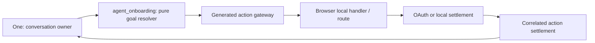

# One Onboarding Journey

Status: current implementation contract for One's first-run journey. Talk to
One uses the bounded Location command runtime described in
[One Voice Runtime Architecture](./one-voice-runtime-architecture.md); this
document describes the reused onboarding action-continuity rules.

## Visual Map

## Ownership and boundaries

One remains the only conversational and semantic head. Its current ADK turn supplies a
typed onboarding assessment; `agent_onboarding` deterministically adjudicates that
proposal against redacted journey and current-screen action state. It never classifies
meaning with keywords and has no tools, tokens, vault access, raw audio,
response authority, or action authority. The generated action gateway and browser-local handler
remain the execution authority.

## Journey state

Authenticated progress is a versioned, pre-vault row: phase, active capability,
callback outcome, timestamp, and the fixed `/one/setup` resume route. Anonymous state
is browser-ephemeral until Firebase has settled the provider flow. The record never
stores raw voice turns, private page content, OAuth material, or vault material. It is a
resumption hint; route guards and the generated contracts are still authoritative.

| Phase | Permitted work | Success exit | Safe recovery |
| --- | --- | --- | --- |
| Anonymous auth | choose Google or Apple | verified Firebase session | choose a provider / retry |
| Phone required | phone verification only | setup hub | verify phone |
| Setup hub | choose a capability, skip, or finish | capability route / One home | return to hub |
| Capability setup | scoped local action or approved connector | `/one/setup/<capability>?finish=1` | retain goal and return through the terminal step |
| External connector | callback settlement only | capability terminal step | retry/cancel without root completion |
| Root completion | explicit hub finish or skip only | `/one` | none |

Every capability ends at the shared terminal acknowledgement **Finish `<capability>`
setup**. That action alone adds the capability to the durable completed-capability set,
clears the active capability, and returns to `/one/setup`; backing out clears the active
goal without claiming completion. Finance is preferences → Plaid, statement upload, or
later → **Finish Finance setup**. Gmail callback success keeps Gmail active and routes to
**Finish Gmail setup**. The hub order is fixed: Connect Gmail, Location, Let One draft
for you, Finance, RIA, then Link your tools. RIA profile submission and CRM selection
return through their own explicit terminal acknowledgements. Memory, Consent, and
Information Marketplace remain product surfaces but are not setup-hub actions. Only the
hub's explicit Finish/Skip calls the setup-exit service
and resolves the root pre-vault record. Root completion never marks Finance complete.
Within the setup hub, One receives the same ordered remaining/completed partition shown
on screen. The completed section is hidden at zero and appears below Remaining after the
first terminal acknowledgement.

## Command and provider authentication

The public root route is the distinct `one_intro` command screen. Its single
visible primary action, **Claim your One**, is the generated
`onboarding.claim_one` local action. Command and tap call the same mounted
handler, so the same post-sign-in destination remains intact. Research, Blog, and
Developers remain descriptive public navigation until each has a visible,
wired generated action; One does not invent action identifiers for them.

There is no idle cue or conversational voice turn. When a visitor submits a
command that resolves to an available, low-risk visible control, the command
runtime uses the generated action search and exact action runner without a
redundant confirmation. It reports only the browser-observed settlement.

**Claim your One** is the canonical settled journey. One executes
`onboarding.claim_one` while `one_intro` is current. The browser navigates to
`/login`, publishes Login's redacted action inventory, and receives client
settlement before it reports the claim outcome. Only after that exact
destination context is accepted may the command runtime request a provider. If
the person requested Google or Apple, the correlated task carries only the
already-authored `auth.sign_in_google` (or Apple) ID; it becomes eligible only
after Login settles. A route change, back navigation, cancellation, timeout,
sign-out, or session close discards it.

On Login, tapping a visible provider button calls its Firebase popup synchronously.
One's semantic assessment maps an explicit command to that same exact generated
provider action, but an asynchronous command directive cannot manufacture browser
activation. The directive therefore settles as `trusted_activation_required` and the
command surface presents one provider-specific action: **Continue with Apple** or
**Continue with Google**. That trusted tap invokes the mounted handler before any
asynchronous work. There is no synthetic click, blank popup
broker, or same-tab redirect fallback. Native retains its native provider path.

The popup attempt is correlated to the initiating directive and validated resume
route. Only a verified Firebase user and token can settle success. Cancellation, SDK
failure, popup close, focus return while Firebase is still settling, missing user,
timeout, and stale completion retain the goal and restore a usable Login surface. A
new attempt cannot be cleared or completed by an older promise. Generic “sign in” asks
which provider; it never selects one silently.

### Gmail connector OAuth

Gmail connector OAuth is distinct from Firebase provider sign-in, but it follows the
same continuity principle on desktop web. A real **Connect Gmail** tap opens a named
browser popup synchronously, before connector preparation becomes asynchronous. The
existing backend-owned callback URI remains the only Google redirect target. The parent
tab retains its route-local state and its memory-only vault state; the popup receives only
an opaque connector attempt and, for setup, an opaque journey correlation. It never
receives a vault key, owner token, Firebase token, OAuth artifact, or receipt content.

After verified callback settlement, the popup posts a same-origin, exact-attempt terminal
outcome to its opener and closes. The opener force-refreshes the connector and durable
journey record before showing **Finish Gmail setup**; receipt scanning can continue in
the background. A blocked popup has no same-tab fallback. A direct/cold callback remains
safe: it follows the established return route and asks for a fresh vault unlock only when
the person next needs vault-backed receipt access.

Login legal documents are authored interaction layers. While Terms or Privacy is open,
the layer's generated close action and visible controls outrank Apple, Google, and
route-back actions. One may interpret “close this” naturally, but it can execute only
the active layer's exact generated action. Close success waits for committed layer
removal, focus restoration, and the refreshed surface revision.

The phone code action is confirmation-required. The code is entered only into the
authored browser or native control, held only in transient client memory, hidden from
confirmation cards, and omitted from telemetry and journey state.

Next middleware is intentionally not an intelligence layer: it cannot reliably observe
Firebase identity or client-local state. `deriveVoiceRouteScreen`, the generated gateway,
the browser-published redacted context, and the `/api/one/[...path]` BFF/proxy boundary
are the route authority. There is no public MCP route-awareness tool.

`OnboardingJourneyGuard` is the authenticated app-wide admission boundary. It verifies
the durable root state and admits only the verified active capability's route family;
query parameters are navigation history, never authority. Internal Profile,
Marketplace, RIA, Finance, and connector routes cannot bypass unfinished setup. A
pre-vault mutation invalidates the shared BFF bootstrap cache before the next decision.

Each authored route publisher carries its pathname lease. During navigation, a snapshot
whose publisher still belongs to the prior route exposes no actions. A command directive
settles only after the new pathname and its authored surface have both mounted; a timeout
remains `started`, never a fabricated success. Same-route action/layer revisions update
the current command context without restarting capture.

## Consent, delegation, and performance

Onboarding grants no broad standing authority. A capability specialist runs only after
its own authentication, vault, consent, and scope checks. One receives only redacted
command context (phase, active capability, route, permitted action identifiers, root state,
and callback posture) and waits for browser-observed settlement before showing success.

The deterministic resolver is in-process and targets a sub-50 ms computation. “Learning”
means this minimal consented progress record plus de-identified operational outcomes;
individual onboarding turns are not model-training input by default. Rollout is guarded
by `HUSHH_ONBOARDING_GOALS_DISABLED`; route guidance has the independent
`HUSHH_ROUTE_PLAYBOOKS_DISABLED` kill switch. The pre-existing route flow remains rollback while
the browser journey suite is expanded.

## Verification matrix

- explicit Google/Apple from Login selects the exact provider action and requests one provider-specific trusted tap; generic sign-in requests a provider
- popup success, cancellation, close/retry, focus recovery, SDK failure, and stale completion preserve the existing goal and post-auth route correctly
- Terms/Privacy expose only their active-layer action inventory and close through visible, keyboard, outside-interaction, and command paths
- Login → phone → hub → capability → explicit capability finish → hub reaches One home only through explicit hub completion
- Finance offers Plaid, statement upload, or later before its terminal finish and cannot resolve root setup
- redacted command context and directive settlement are correlated; One cannot show success before settlement
- generated contract output, Next.js BFF header forwarding, and browser hands-free journeys remain parity gates
