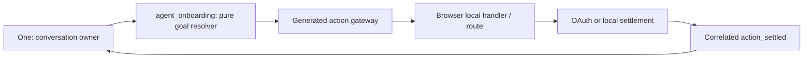

# One Voice Onboarding Journey

Status: current implementation contract for One's first-run voice journey.

## Visual Map

## Ownership and boundaries

One remains the only conversational head. `agent_onboarding` is a manifest-authored,
deterministic resolver beneath One: it receives a redacted journey context and returns
the next permitted goal. It has no LLM, tools, tokens, vault access, transcript, or
authority to execute an action. The generated action gateway and browser-local handler
remain the execution authority.

## Journey state

Authenticated progress is a versioned, pre-vault row: phase, active capability,
callback outcome, timestamp, and the fixed `/one/setup` resume route. Anonymous state
is browser-ephemeral until Firebase has settled the redirect callback. The record never
stores raw voice turns, private page content, OAuth material, or vault material. It is a
resumption hint; route guards and the generated contracts are still authoritative.

| Phase | Permitted work | Success exit | Safe recovery |
| --- | --- | --- | --- |
| Anonymous auth | choose Google or Apple | Firebase callback | choose a provider / retry |
| Phone required | phone verification only | setup hub | verify phone |
| Setup hub | choose a capability, skip, or finish | capability route / One home | return to hub |
| Capability setup | scoped local action or approved connector | `/one/setup` | retain goal and return hub |
| External connector | callback settlement only | `/one/setup` | retry/cancel without root completion |
| Root completion | explicit hub finish or skip only | `/one` | none |

Every individual capability, including Finance, returns to `/one/setup`. Only the
hub's explicit Finish/Skip calls the setup-exit service and synchronizes root completion
to the pre-vault record and, when unlocked, the vault-backed compatibility state.

## Voice and provider authentication

On Login, `auth.sign_in_google` and `auth.sign_in_apple` are generated Login-local
actions. A button uses Firebase popup OAuth because its trusted click permits a popup.
An explicit hands-free provider command uses web redirect OAuth in the existing tab:
an asynchronous voice directive has no browser user activation and therefore cannot
reliably open that popup. Native retains its native provider path. Generic “sign in”
must ask which provider; it does not claim completion or silently select one.

Before a voice redirect, the browser persists a versioned ephemeral intent containing
only provider, generated action id, directive correlation, original Login path, resume
target, and timestamp—never tokens or provider material. The launch settles as
`external_redirect_started`, which is terminal for the old WebSocket, not a success.
On return, Login makes the redirect callback the sole post-auth routing authority;
it settles from `getRedirectResult` or a Firebase-restored user, then resolves the
post-auth route. Cancellation, callback error, timeout, and route mismatch retain the
same goal and report the next safe instruction.

Next middleware is intentionally not an intelligence layer: it cannot reliably observe
Firebase identity or client-local state. `deriveVoiceRouteScreen`, the generated gateway,
the browser-published redacted context, and the `/api/one/[...path]` BFF/proxy boundary
are the route authority. There is no public MCP route-awareness tool.

## Consent, delegation, and performance

Onboarding grants no broad standing authority. A capability specialist runs only after
its own authentication, vault, consent, and scope checks. One receives only redacted
live context (phase, active capability, route, permitted action identifiers, root state,
and callback posture) and waits for browser-observed settlement before speaking a success.

The deterministic resolver is in-process and targets a sub-50 ms computation. “Learning”
means this minimal consented progress record plus de-identified operational outcomes;
individual onboarding turns are not model-training input by default. Rollout is guarded
by `HUSHH_ONBOARDING_GOALS_DISABLED`; the pre-existing route flow remains rollback while
the browser journey suite is expanded.

## Verification matrix

- explicit Google/Apple from Login starts the matching redirect; generic sign-in requests a provider
- cancelled, failed, or duplicate callbacks retain the existing goal and post-auth route
- Login → phone → hub → capability → hub reaches One home only through explicit hub completion
- Finance completion returns to the hub and cannot resolve root setup
- redacted relay context and directive settlement are correlated; One cannot state success before settlement
- generated contract output, Next.js BFF header forwarding, and browser hands-free journeys remain parity gates
