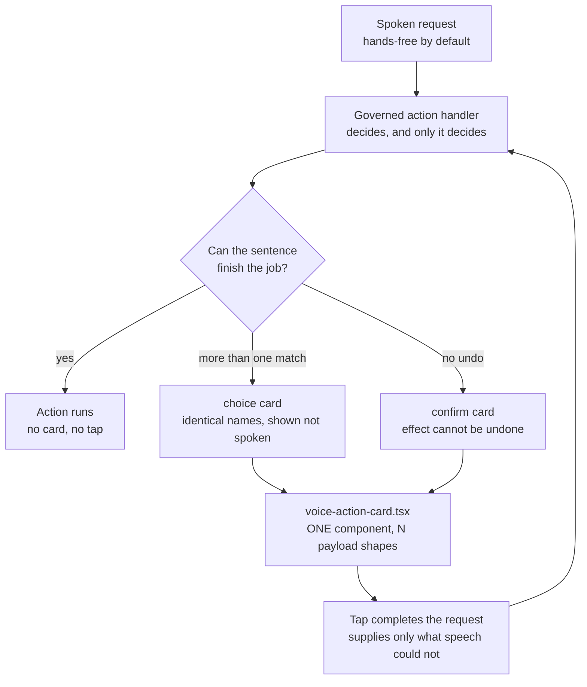

# One Voice pop-up design standard

## Visual Map



The voice pop-up is the one surface One raises when a spoken sentence cannot
finish the job on its own. There is exactly one component —
`hushh-webapp/components/agent/voice-action-card.tsx` — and every variant is a
payload shape rendered by it, never a new component.

This document is the standard those variants must hold to. It exists because
the alternative is what already happened once: each surface reached for
whatever button was nearest, and the result was a 32 px destructive control on
a build that ships to a phone.

---

## When a pop-up is allowed at all

Voice is hands-free by design. Confirmations were removed from it deliberately:
being asked "are you sure?" after saying a thing out loud is tiring, and a
spoken yes adds nothing the sentence did not already carry.

So a pop-up is not a general-purpose prompt. It appears only when the spoken
turn is genuinely unable to continue, for one of two reasons:

| Shape | Raised when | Example |
|---|---|---|
| `choice` | The sentence was ambiguous in a way speech cannot resolve | Two accounts share a display name |
| `confirm` | The effect cannot be undone by repeating the action | Removing a connection |

Anything that does not meet one of those two bars must not raise a card.

### The `confirm` bar, precisely

An action gets a confirmation when **repeating it cannot put things back**, or
when **someone else loses something**. It is opt-in per handler.

It is explicitly **not** derived from the contract's `risk_level`. That field
marks 11 wired actions `high`, and most of them are constructive —
`connect.send_request`, `location.create_circle`,
`location.add_emergency_contact`, and `location.share_selected`, the hands-free
share flow that was deliberately cleared of taps. Gating on `risk_level` would
put a tap back into the one flow that most needed to lose it.

Actions deliberately excluded: `connect.cancel_request` and
`location.pause_updates`, both reversible by saying the opposite.

---

## Layout standard

```
┌────────────────────────────────────────────┐
│ Prompt — one line, states the question     │
│                                            │
│ ◍  Subject name                            │  ← row: avatar, name,
│    distinguishing detail                   │    detail beneath
│                                            │
│ Consequence, when the action is            │
│ destructive                                │
│                                            │
│  ┌──────────────────┐ ┌──────────────────┐ │
│  │      Cancel      │ │      Action      │ │  ← 48 px, two-up
│  └──────────────────┘ └──────────────────┘ │
└────────────────────────────────────────────┘
```

**Rules, in priority order:**

1. **Cancel is always leftmost.** Every variant, no exceptions. Someone who has
   dismissed one card must not have to re-read the next one to find the way
   out, and the muscle memory only forms if the position never moves. When a
   variant has no second decision button, Cancel still occupies the left
   column — it does not stretch across, and it does not move right.
2. **Decision buttons are 48 px tall and share the full width, two-up.** The
   iOS minimum touch target is 44 pt and this build ships to a phone through
   Capacitor. Desktop comfort is not the constraint that matters.
3. **Row actions are 44 px** with a `min-w` floor, so a short label like
   "Connect" is not a sliver to aim at. Rows cannot take the full 48 px without
   the list outgrowing the card; 44 px is the floor, not a preference.
4. **The card wears `agent-approval-glass`**, `rounded-3xl`, and the same
   `max-w-[min(calc(100vw-3rem),392px)]` as the approval card. A voice pop-up
   should read as the surface the person already knows, not a new kind of
   window appearing mid-sentence.

---

## Colour

| Element | Treatment |
|---|---|
| Cancel | `bg-black/[0.05]`, inset ring, dark-mode `bg-white/[0.08]` |
| Ordinary action | Same neutral treatment as Cancel |
| Destructive action | Red text, red inset ring, **red-tinted** ground |

The destructive button is **tinted, never filled**. A solid red block reads as
the primary thing to press, and on a destructive choice the safe option should
not have to compete with it. Red text on a red-tinted ground says "this one is
the dangerous one" while leaving Cancel exactly as easy to hit.

Semantic colour comes from the `--destructive` token, never a literal hex.

---

## Copy

- **Prompt** names the subject: *"Remove your connection with Rashid?"* — never
  *"Are you sure?"*, which asks nothing the person can act on.
- **Consequence** is the action's own `meaning` from the generated contract,
  read at render time rather than restated. Restating it means the warning and
  the behaviour drift apart the first time the action changes. This makes
  `meaning` load-bearing for any action with a `confirm` card, which is guarded
  by a test.
- **Button labels are verbs**: `Remove`, `Connect` — never `OK` or `Yes`.
- **Per-candidate labels** in a `choice` card come from the same source the
  underlying list uses (`relationshipCta` for Connect). Two rows sharing a name
  are routinely in different states, so a single shared label would offer at
  least one person an action guaranteed to be refused.

---

## Behaviour

- **A tap completes the request.** The card is not a staging area — the person
  already said what they wanted, and the tap supplies only the part the
  sentence could not.
- **`confirmed` is set by the card's button and by nothing else**, so voice can
  raise a destructive question but can never answer its own. Covered by a test
  asserting the spoken turn does not remove.
- **Ambiguity resolves before confirmation.** Two people called Rashid produce
  the `choice` card first; only the person picked gets a `confirm` card. Never
  merge the two questions into one tap.
- **A failed action keeps the card up.** The other candidate may be the right
  one, and dismissing here returns the person to the dead end the card exists
  to remove.
- **A malformed payload renders nothing** and leaves the spoken refusal in
  place. An empty card is a worse dead end than the one being fixed, and a
  destructive button whose label failed to arrive must never render.
- **Fewer than two candidates is not a choice.** The resolver should have
  answered instead of asking.

---

## Adding a variant

1. Add the payload shape to `hushh-webapp/lib/voice/voice-action-card.ts` with a
   parser that validates it and returns `null` rather than rendering something
   half-formed.
2. Render it in `voice-action-card.tsx`. Reuse `SubjectRow`; do not invent a
   second row treatment.
3. Have the handler return it under its data key. The handler decides — nothing
   is inferred from contract metadata, because the one field that looked like it
   would work (`risk_level`) means something else.
4. Test the parse boundary and the refusal path, not only the happy one.

## Related

- [one-voice-runtime-architecture.md](./one-voice-runtime-architecture.md) —
  the directive channel these cards settle through.
- [one-goal-framework.md](./one-goal-framework.md) — journeys, which is how an
  action reaches the screen where its card can appear.
