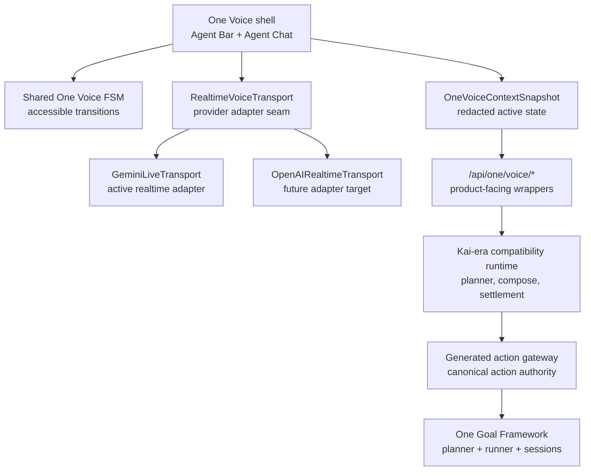

# One Voice Runtime Architecture

Status: current-state foundation for the One Voice migration.

## Visual Map



## Current Truth

One Voice is now a product-facing contract layer, not a second voice runtime.

Implemented foundation:

- Agent Bar and Agent Chat can share the same One Voice transition vocabulary.
- `OneVoiceContextSnapshot` carries route, surface, cache, persona, voice-state, and action-id metadata without raw vault data, user ids, transcript history, private documents, or cache keys.
- Gemini Live is represented as a provider adapter over the `RealtimeVoiceTransport` interface.
- Gemini Live now emits normalized transcript, assistant-text, and proposal-only action events; those events are signals into the One planner and generated gateway, not provider execution.
- One Goal now sits above the generated gateway for action execution across Gemini Live voice, Agent Chat, typed search, command bar, and UI actions. It maps intent to a generated goal, asks for one missing input at a time, runs direct actions only when the contract allows, and tracks long-running work through goal sessions.
- `/api/one/voice/session`, `/api/one/voice/plan`, and `/api/one/voice/compose` are One route wrappers over the Kai-era compatibility runtime.
- `/api/one/voice/benchmark` reports that live benchmark promotion still requires provider adapters and versioned artifacts.
- Native iOS and Android UI audits include a One Voice control smoke flow that starts the realtime surface, observes a voice mode or deterministic simulator permission/provider fallback, and ends the session when active.

The mature execution runtime still carries Kai-era implementation identifiers today. The generated Kai action gateway remains the semantic authority for action ids, `speaker_persona`, `delegate_agent_id`, confirmation policy, and runtime grounding until the One-owned gateway migration is complete.

## Runtime Boundary

One Voice owns the user-facing voice surface and transition contract. It does not widen authority.

Rules:

1. Realtime providers are audio/session adapters only.
2. Voice actions must still route through the generated action gateway.
3. `/api/one/voice/*` must preserve `VAULT_OWNER`, user-id match, rollout, canary, kill-switch, planner, composer, and settlement behavior from the Kai-era compatibility runtime.
4. Gemini Live may expose one provider-native proposal tool for generated action ids, slots, confidence, and reason. The provider must not execute tools; every action proposal still routes through the One planner, generated gateway, guard evaluation, A2A/chat dispatch, and settlement.
5. OpenAI Realtime support should attach behind `RealtimeVoiceTransport`, not through a parallel planner or action registry.

## One Goal Execution

One Voice does not execute actions directly. Actionable turns enter the [One Goal Framework](./one-goal-framework.md).

Rules:

- One is Agent First: realtime system instructions and generated contracts should let the LLM infer goals and propose action ids, while the app enforces guards, consent, route settlement, and service adapters.
- “Analyze TSLA” maps to the generated `analysis.start` goal and asks for the missing list/source before execution.
- “Analyze TSLA using default” has the ticker and source, so it can start directly when the action policy is `allow_direct` and guards pass.
- earned but inactive workspaces may be synced and route-settled only when the generated action is direct and does not require persona-switch confirmation
- long-running finance analysis opens the analysis workspace, starts or attaches through the debate run manager, speaks milestone updates, and returns the final decision summary back to the conversation
- delegated, sensitive, or manual-only actions switch to Agent Chat, consent, or the relevant specialist surface
- Gemini Live and future providers may propose `action_id` plus slots, but One Goal remains the authority for planning, guard evaluation, running, progress, and result speech

## Context Snapshot

`OneVoiceContextSnapshot` is safe for realtime prompt shaping because it is intentionally lossy:

- keeps screen id, route family, visible modules, available action ids, cache posture, vault readiness, portfolio readiness, persona, and voice state
- reduces selected entities to presence flags
- redacts user ids, vault owner tokens, vault keys, raw PKM, transcript history, private documents, and raw cache keys
- treats world-model context as `redacted_summary_only`

Vault-backed planning may still send the richer structured screen context through the existing planner contract. The One snapshot is attached as `one_voice_context` so backend consumers that read `screen_context.route` continue to work.

## Route Context Cascade

One Voice route awareness follows the same route contract cascade as the app shell:

- `deriveVoiceRouteScreen` must understand canonical nested routes and legacy compatibility inputs.
- `/one` is the One Agents dashboard screen (`one_agents`), and `/one/marketplace` is the One Information Marketplace screen (`one_marketplace`) rather than a generic app fallback.
- Canonical `/one/kai/*` routes are One-owned finance surfaces. Voice-triggered navigation to `/one/kai/analysis` must not be blocked by the page-level active-role mismatch guard; generated action contracts and One Goal guard evaluation own finance action authority.
- Profile panels are canonical nested routes, for example `/profile/security`, `/profile/gmail/actions`, and `/profile/support/compose?kind=<support_kind>`.
- Legacy `/profile?panel=...&detail=...` URLs are accepted for compatibility, but generated route actions should target nested profile routes unless they intentionally target canonical One capability routes such as `/one/gmail`, `/one/pkm`, or `/one/connected-systems`.
- Realtime context snapshots may include route family, active panel/detail, allowed action ids, cache posture, vault readiness, and redacted world-model summary. They must not include raw vault data, decrypted PKM, raw cache keys, transcript history, or private documents.

## Gemini Live Prompt Shaping

The Gemini Live relay contract carries the same redacted context through the HTTPS relay-session mint and the backend WebSocket setup:

- route/screen/persona/voice state
- available generated action ids
- visible modules
- `cache_freshness`, `vault_ready`, and `portfolio_ready`

Those fields are capability and readiness hints, not authority. One may say Kai can analyze stocks, markets, or portfolio questions when the active route or action ids expose Kai finance contracts. One must not say it is unable to provide stock analysis solely because the topic is financial. It must also avoid claiming live quotes, holdings, private portfolio access, completed trades, money movement, or saved-data reads unless the app provides explicit visible/redacted state and a governed action result confirms the outcome.

Gemini Live action proposals are normalized into `OneVoiceSessionEvent` frames (`transcript_final`, `assistant_text`, `action_proposal`, and `handoff`) and mirrored into a lightweight One conversation session. Agent Chat hydrates from that mirror only when the user asks to switch to chat, an action requires confirmation, or a delegated/sensitive/long-running action needs the richer A2A surface.

## Migration Rule

Do not describe One Voice as fully shipped end-to-end until these are true:

1. Agent Bar and Agent Chat consume the shared FSM in integration coverage.
2. Gemini and OpenAI adapters report through the same transport event contract.
3. All executable voice proposals go through generated gateway action ids.
4. Sensitive actions show intent preview, confirmation, result, and audit receipt states.
5. Live benchmark artifacts exist for provider promotion claims.

## Verification

Focused checks for this foundation:

```bash
cd hushh-webapp && npm run test -- __tests__/voice/voice-ui-state-machine.test.ts __tests__/lib/agent-voice-state.test.ts __tests__/voice/screen-context-builder.test.ts __tests__/voice/api-service-voice.test.ts
cd consent-protocol && python3 -m pytest tests/test_agent_persona.py tests/test_kai_voice_rollout_guardrails.py -q
cd hushh-webapp && npm run verify:voice-gateway
cd hushh-webapp && npm run ios:voice:test
cd hushh-webapp && npm run android:voice:test
./bin/hushh docs verify
```

Simulator voice tests prove the native control path, state exposure, permission fallback, and recovery behavior. They do not prove microphone quality, audio latency, or provider quality; those claims require live device/provider benchmark artifacts.

## Related References

- [One Reference Index](./README.md)
- [One Goal Framework](./one-goal-framework.md)
- [One Voice Kai Compatibility Runtime](./one-voice-kai-compatibility-runtime.md)
- [Kai Action Gateway vNext](../kai/kai-action-gateway-vnext.md)
- [One Voice Action Coverage Audit](./one-voice-action-coverage-audit.md)
- [One Agent Chained Voice Architecture](./one-agent-chained-voice-architecture.md)
- [Hussh Agent Ontology](../../vision/agent-ontology.md)
