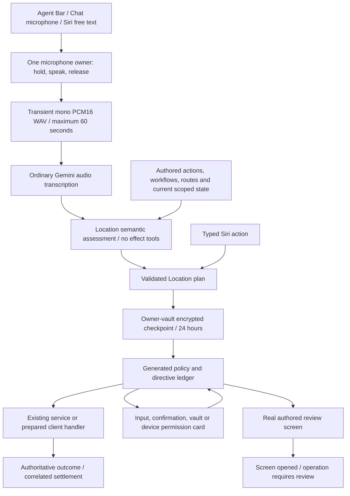

# One Voice Runtime Architecture

Status: Location command repair in progress. The physical-device acceptance journey is unverified and the repair has not been released. One is the private agent.

## Visual Map

The Agent Bar owns capture. Tap-to-start/finish is the accessible alternative to hold/release. Cancellation, backgrounding and stale session callbacks discard recording; finishing drains the whole bounded recording. No command starts another listening session. Gemini Live runs only as the flag-gated One Live Voice adapter described in [one-live-voice-decision-2026-09.md](./one-live-voice-decision-2026-09.md) and [one-voice-live-tool-contract.md](./one-voice-live-tool-contract.md); prewarming, reconnect-with-replay and conversational fallbacks remain retired. The normal text-model path remains available to typed Agent Chat.

The mounted command provider survives route and chrome changes. Press starts microphone preparation immediately; 250 ms distinguishes hold/release from tap-to-start/finish. Sliding left 64 px arms cancellation. Actual microphone level, elapsed time and readiness/cancel haptics use the shared segmented bar and waveform. Releasing before readiness discards the pending capture. Granting first-time microphone permission requires a fresh gesture. Progress remains compact; choices and genuine prerequisites expand a nonmodal card. Collapse, cancel and result dismissal have separate behavior and never restart listening.

`hushh_mcp/agents/location/agent.yaml` owns semantic instructions. `operons/location/capabilities.py` compiles Location capabilities from the generated gateway, knowledge package and workflow bindings on each assessment; it does not maintain a separate action list. The restricted ADK brain returns `LocationAssessment` directly and can request bounded reads through declared read-only ports. It cannot mutate, confirm itself or declare completion. Policy validates exact registered actions and declared inputs. Existing connection-name resolution binds records after interpretation; it never selects an action from a sentence.

Workflow assessment receives the owning knowledge projection, entry action, completion policy and command completion actions. Endpoint inventories, interaction implementations and execution bindings stay in the full server-side catalog used for validation and execution. The projection retains every registered capability without ranking or sentence matching. The authored instruction leaves prerequisite and completion reads to the workflow; semantic read tools resolve missing plan inputs and existing resource choices. A planning deadline returns HTTP504 with a bounded `timeout` reason in operational logs; invalid assessments return HTTP422 with `invalid_assessment`. Neither failure logs the request, protected context or provider output.

`location.plan.v2` represents action/workflow steps and references to verified earlier results; existing action-only v1 checkpoints remain readable. The unlocked session keeps at most 50 non-authorizing result references for 15 minutes, clears them on lock/sign-out, and refreshes their owning state before mutation. Only references required by an unfinished command enter its encrypted capsule. Created-circle dependencies use the circle receipt returned by the operation, not a repeated name lookup.

## Outcomes and authority

| Outcome | Current behavior |
| --- | --- |
| `end_to_end` | Execute an admitted backend binding or a prepared owning client handler. |
| `needs_user_gate` | Show missing inputs, exact recipient choices, confirmation, unlock or a real permission prompt; continue the same checkpoint. |
| `simulate` | Open the authored destination. A manual handoff closes with `review_required`; opening a screen cannot satisfy a dependent mutation. |

A normal route action can succeed when its requested screen opens. A mutation's screen fallback cannot report that the mutation succeeded. Missing preparations use authored screen handoffs instead of executing against ambient selection. Permission observations are checked again; a model assertion is never permission. Device settings and prompts remain user actions.

Preparation belongs to the existing local-handler registry. It freezes selected records, keys, audience, duration and any note before confirmation. Resource-choice cards contain current owner records. A salted commitment binds server authority to those inputs; the complete binding and its random salt stay in client memory or the owner-encrypted capsule. Coordinates and private check-in notes do not enter authority request bodies.

Request approval displays and binds the resolved duration, duration mode and request revision. The owning service checks the revision under its request lock before granting access. Extension requests open the real review screen: the existing extension service uses the current live grant, which this command receipt cannot pin. Cancellation is checked after handler mounting and asynchronous preparation; an effect already started still waits for its authoritative outcome. A newer Location toggle prevents the superseded step from satisfying a command prerequisite.

Typed Siri enters the same validated proposal and receipt lifecycle. It cannot authorize a changed or undisplayed resource by supplying a `confirmed` slot. Sensitive actions are reviewed in the command surface. Confirmation tokens are minted from actual user activation and must match the current directive, owner, action, inputs and context.

Unconnected people enter Connect's existing scope review through the exact `reviewPerson` route. A Firebase-authenticated participant read distinguishes unavailable, pending incoming, pending outgoing and currently connected states. Location keeps the original encoded audience/circle choice in its capsule and waits; opening Connect or sending a request does not complete the dependent Location action. Continue refreshes Location's own eligibility and keys. Owner changes invalidate the review and pending catalogs.

## Requested Location onboarding

“Complete setup” uses `workflow.setup.location`; “open setup” retains its navigation meaning. Fast mode skips informational screens, observes the real device permission, captures a fresh owner/run-bound position and prepares an encrypted draft. `draft_prepared` is an app result, not a fabricated user click. The private default is Other / Current location, with no mandatory address lookup or Home/Work question.

The command binds its stable step/operation to the workflow run before effects. A narrowly scoped `owner_requested_workflow` receipt authorizes only that run's private draft. Its finalization token and stable commit identity travel through the existing PKM coordinator, web/native service and v5 transaction. The writer appends the stable run place without normalizing or discarding existing records; an unrecognized saved-place record blocks the append for review. Place, circle and completion receipts remain the workflow owner's proof. Staging a draft, returning a locations array or opening the hub is insufficient. Lost finalization responses reconcile the same run/commit rather than saving another default place.

Returning from the OS permission prompt refreshes the current interaction without advancing its admission sequence. An unchanged foreground read cannot supersede the permission settlement already in flight. Run revisions reject stale projections; cancellation and owner changes still invalidate late responses.

## API and persistence

The command path uses the existing One namespace:

- `POST /api/one/transcriptions`: bounded audio to transient transcript.
- `POST /api/one/agent-chat/proposals`: semantic proposal.
- `POST /api/one/agent-chat/proposals/typed`: already typed action, with identical validation.
- `/api/one/action-proposals`: owner-bound list, checkpoint, resolve, admit, confirm, claim, execute, settle, resume and cancel lifecycle.

Web uses the existing authenticated API proxy; native uses the same service boundary. Both require the current vault-owner authority. This milestone follows **unlock first**: an account must already have a vault. Initial pre-vault setup remains available through its existing tap flow; an unlock dialog cannot create a missing vault.

The active-onboarding read returns HTTP 204 when no unfinished run exists. The web proxy preserves that status with an empty body and private, no-store headers; it must not serialize JSON into a bodyless response or turn the empty state into a gateway failure.

`one_adk_sessions`, under `one.location.commands.v1`, stores metadata and a client-vault AES-GCM capsule. The platform's outer session encryption is an additional layer, not ownership authority. Persisted continuations contain validated action inputs and a normalized unresolved intent, not raw audio, transcription, credentials or vault keys. Checkpoints precede effects and gates. Completion, cancellation and expiry remove the capsule. The existing retention job and command reads purge expired capsules after 24 hours.

Migration `212_location_command_runtime.sql` extends the existing directive ledger with command/step identity, stable operation IDs, execution receipts and a screen/action discriminator. Atomic claims serialize concurrent resumes. `location.create_circle` composes the owning service mutation with its receipt in one transaction and preserves the existing same-name no-op. Backend success refreshes the owning Location state before the next step. Private share/check-in uses the existing atomic encrypted-grant operation. Access requests journal stable operation receipts inside the owning event-bound transaction; command callers do not automatically retry uncertain HTTP effects.

After restart, authenticate, unlock and decrypt, then explicitly choose **Resume** or **Cancel**. Resume refreshes state, renews expired unconsumed authority and reconciles consumed/settled steps before reading resources they may have removed. It never replays a completed step. An unknown outcome uses its owning recovery or review control. Consumed audience and membership operations renew only their verified unfinished units, preserving their original binding and stable operation identity. Already completed units remain receipts, not new authority. Replanning locks the session then reads ledger state in a fresh transaction statement; only steps without consumption or execution receipts can be replaced. Changed capabilities revalidate the remaining plan. Postgres is the current shared coordination plane; a future Redis adapter must preserve the same atomicity and owner boundaries.

Location onboarding's private save has an explicit recovery path. **Refresh / Resume** first checks the exact workflow receipt. If the save is unfinished, the server advances its existing lease revision under the atomic writer's run lock and returns renewal proof. The client checkpoints that proof before retrying the same encrypted draft and stable commit identity. An older in-flight attempt is then unable to write; a completed save is reconciled without another write. Missing renewal proof or a failed checkpoint keeps the attempt blocked. Workflow receipt reads use Firebase identity, while PKM writes retain vault-owner authority. The finalizer's server-issued expiry is transmitted without rounding its microsecond precision.

The additive repair migrations extend the same stores: 213 binds workflow runs, 214 adds private finalization authority and the v5 writer, 215 records created resources, 216 journals membership batches, 217 records client-owned domain effects and 218 binds each share/request/check-in recipient to its exact reviewed terms. New effects require a fresh command authority; prior receipts remain readable after expiry or cancellation. Their paired rollbacks preserve historical proof. The real share writer, encrypted envelope and audience receipt commit together; request updates and their events share the owning transaction. A private check-in's point/note contribute a salted digest to preparation and remain client-owned until encryption.

Rollback requires stopping command traffic, restoring the prior application revision and applying migration 212's paired rollback. The rollback archives receipt metadata, removes command capsules and retains pre-existing typed-chat history. It does not reactivate provider speech automatically.

## Entry points and retirement

`command-agent-bar.tsx`, `command-capture.ts`, `location-command-runtime.ts`, `command_proposals.py`, `command_brain.py` and the existing service/handler registries own the implementation. The generated gateway retains stable `kai` compatibility identifiers. Legacy text backend bindings are authored on action contracts and generated into compatibility projections.

Obsolete Live clients on `/api/one/adk/*` receive an explicit retirement response; no Live model is constructed there. The maintained Live surface is `/api/one/voice/*` (`api/routes/one/voice.py`), which constructs its model only through `runtime_providers/factory.py` on Vertex ADC and only while `ONE_VOICE_LIVE_ENABLED` is on. The old local phrase router, ONNX/ASR model-pack downloads, FluidAudio packages and model-pack publication workflow are removed. Historical database records are preserved. Voice-persona controls no longer appear in settings.

## Verification and release boundary

Run `npm run verify:one-voice`, `npm run typecheck`, native plugin/privacy checks, the Location regression suite, focused backend command tests and real PostgreSQL command transaction tests. PostgreSQL tests require `ONE_COMMAND_TEST_DATABASE_URL` pointing to an isolated test database; never use a shared account database. Regenerate both the action gateway and product-agent registry after authored changes.

When integrating a branch with a different generated workflow history, run `node scripts/voice/generate-capability-graph.mjs --workflow-predecessor-ref <merged-ancestor-sha>` from `hushh-webapp`, then `node scripts/voice/generate-one-location-workflow-card-catalog.mjs`. The generator accepts only committed ancestors and proves unchanged or additive workflow semantics before preserving their compatible revisions. Authority changes and conflicting rejection or migration policies fail closed. This retains unfinished setup from either merge parent without hand-editing generated compatibility lists.

September 13 repair evidence includes mounted bar/provider/workflow tests, native slash/query settlement tests, focused semantic/read-port tests, actual PostgreSQL share/check-in/request/membership writers under concurrency and failure injection, and real encrypted v5→v4→v3→v2 PKM preservation/rollback tests. The existing coordinator's default-place test preserves Home, Work and unrelated records and refuses invalid records without a write. Mounted Connect tests cover scope review, account changes, cancel/reopen and reverse-direction request races. Native static/plugin and Siri contracts pass. Earlier baseline web/native builds and historical route audits are not acceptance evidence for this uncommitted repair. Provider generation receives the typed schema shape; full size and authority validation remains local. Exact digital silence returns an empty transcript without a model call.

Circle rename, removal, leave, delete and pending invitation acceptance/decline now use their existing owning operations with exact resource preparation and transactional receipts. Revalidation after domain lock waits rejects expired authority and rolls back coupled effects. Acceptance joins the circle and retains the inviter connection; it creates no location share. Real PostgreSQL tests cover all six operations, concurrent replay, changed reviews, receipt failure and expiry during a profile-lock wait.

Nearby checkout binds the exact presence incarnation and cannot end a newer visit on replay. Public-link creation/extension and revocation commit their effects, events and receipts together; sharing uses the actual system handoff, with a browser gesture screen where required. Public-link tests cover changed URLs/expiry, response loss, concurrent calls and rollback. Private check-in continuation stays inside the client-encrypted capsule. Five synthetic English/Hindi/Hinglish text assessments passed against the configured non-Live model; this is semantic-model evidence, not microphone or speech-transcription proof. A fresh iOS simulator native compile with the repaired static web bundle passed, followed by 16 native action-coordinator tests without skips. Android debug assembly and unit tests passed. These are build and native-contract proofs, not physical-device journey evidence.

The generated Location coverage check now verifies a backend binding, registered client preparation, or explicit authored screen for every current capability. Empty-circle creation follows its direct-execution policy through both command and typed Siri entrypoints. Saved-place mutations, contact scanning, share-duration editing and individual setup controls use explicit authored manual screens; the complete setup request uses its workflow. SOS opens its real review; opening it never means an alert was sent.

Nearby stores its encrypted rating visit and exact internal pointer in the presence transaction. Checkout closes only that owner-bound visit, with the command receipt in the same transaction; optional rating failures use a savepoint with bounded lock and statement waits. Migration 219 clears pointers on alias changes and terminal state and prevents delayed older visit writers from closing a newer active visit. Checkout replay returns its historical receipt alongside refreshed current visibility. Its rollback preserves encrypted visits and ratings. Completed-command replay never closes a later visit.

Fresh web production compilation, typechecking and page generation passed. After integrating the current baseline, 310 focused frontend tests, 700 backend tests and the expanded 152-test voice verification passed. Physical English/Hindi/Hinglish speech, OS permission prompts, interruption/tail capture and termination recovery still need proof on web, physical iPhone and Android. The native bundle/build checks must be repeated if subsequent integration changes affect them. No optional-device skip can satisfy this release. Founder Wiki verification/update remains outstanding because its credential was unavailable.

Created-circle result references are projected only from correlated completed-step receipts and a fresh owner-scoped circle read. Stable non-authorizing handles avoid duplicate candidates across result reads. Cancel retries retain the same command identity until terminal acknowledgement or owner-scoped expiry. Choice and semantic reassessment changes install only after encrypted checkpoint acknowledgement; a rejected or lost response requires explicit canonical refresh before further execution. Renewed partial operations retain their original consumed-history fence before semantic reassessment.
