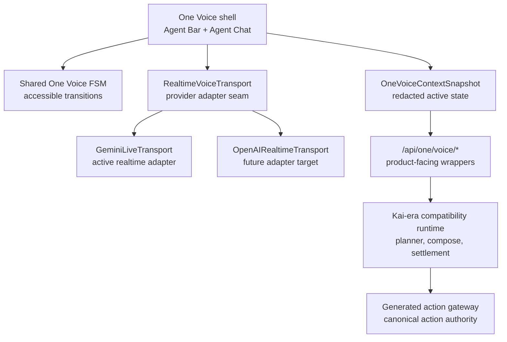

# One Voice Runtime Architecture

Status: current-state foundation for the One Voice migration.

## Visual Map



## Current Truth

One Voice is now a product-facing contract layer, not a second voice runtime.

Implemented foundation:

- Agent Bar and Agent Chat can share the same One Voice transition vocabulary.
- `OneVoiceContextSnapshot` carries route, surface, cache, persona, voice-state, and action-id metadata without raw vault data, user ids, transcript history, private documents, or cache keys.
- Gemini Live is represented as a provider adapter over the `RealtimeVoiceTransport` interface.
- `/api/one/voice/session`, `/api/one/voice/plan`, and `/api/one/voice/compose` are One route wrappers over the Kai-era compatibility runtime.
- `/api/one/voice/benchmark` reports that live benchmark promotion still requires provider adapters and versioned artifacts.

The mature execution runtime still carries Kai-era implementation identifiers today. The generated Kai action gateway remains the semantic authority for action ids, `speaker_persona`, `delegate_agent_id`, confirmation policy, and runtime grounding until the One-owned gateway migration is complete.

## Runtime Boundary

One Voice owns the user-facing voice surface and transition contract. It does not widen authority.

Rules:

1. Realtime providers are audio/session adapters only.
2. Voice actions must still route through the generated action gateway.
3. `/api/one/voice/*` must preserve `VAULT_OWNER`, user-id match, rollout, canary, kill-switch, planner, composer, and settlement behavior from the Kai-era compatibility runtime.
4. Gemini Live remains tool-less unless a later change routes function calls through the generated gateway and confirmation policy.
5. OpenAI Realtime support should attach behind `RealtimeVoiceTransport`, not through a parallel planner or action registry.

## Context Snapshot

`OneVoiceContextSnapshot` is safe for realtime prompt shaping because it is intentionally lossy:

- keeps screen id, route family, visible modules, available action ids, cache posture, persona, and voice state
- reduces selected entities to presence flags
- redacts user ids, vault owner tokens, vault keys, raw PKM, transcript history, private documents, and raw cache keys
- treats world-model context as `redacted_summary_only`

Vault-backed planning may still send the richer structured screen context through the existing planner contract. The One snapshot is attached as `one_voice_context` so backend consumers that read `screen_context.route` continue to work.

## Migration Rule

Do not describe One Voice as fully shipped end-to-end until these are true:

1. Agent Bar and Agent Chat consume the shared FSM in integration coverage.
2. Gemini and OpenAI adapters report through the same transport event contract.
3. All executable voice proposals go through generated gateway action ids.
4. Sensitive actions show intent preview, confirmation, result, and audit receipt states.
5. Live benchmark artifacts exist for provider promotion claims.

## Verification

Focused checks for this foundation:

```bash
cd hushh-webapp && npm run test -- __tests__/voice/voice-ui-state-machine.test.ts __tests__/lib/agent-voice-state.test.ts __tests__/voice/screen-context-builder.test.ts __tests__/voice/api-service-voice.test.ts
cd consent-protocol && python3 -m pytest tests/test_agent_persona.py tests/test_kai_voice_rollout_guardrails.py -q
cd hushh-webapp && npm run verify:voice-gateway
./bin/hushh docs verify
```

## Related References

- [One Reference Index](./README.md)
- [One Voice Kai Compatibility Runtime](./one-voice-kai-compatibility-runtime.md)
- [Kai Action Gateway vNext](../kai/kai-action-gateway-vnext.md)
- [One Voice Action Coverage Audit](./one-voice-action-coverage-audit.md)
- [One Agent Chained Voice Architecture](./one-agent-chained-voice-architecture.md)
- [Hussh Agent Ontology](../../vision/agent-ontology.md)
