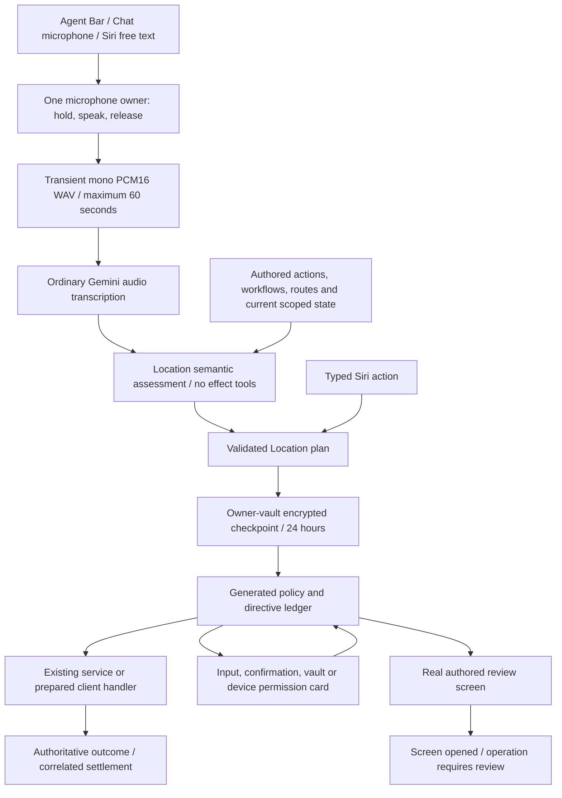

# One Voice Runtime Architecture

Status: implemented Location command path; release acceptance still requires the device evidence listed below. One is the private agent.

## Visual Map

The Agent Bar owns capture. Tap-to-start/finish is the accessible alternative to hold/release. Cancellation, backgrounding and stale session callbacks discard recording; finishing drains the whole bounded recording. No command starts another listening session. Gemini Live startup, relay execution, prewarming, reconnects, generated speech and conversational fallbacks are retired. The normal text-model path remains available to typed Agent Chat.

`agent_location/agent.yaml` owns semantic instructions. `operons/location/capabilities.py` compiles all current Location capabilities from the generated gateway on each assessment; it does not maintain a separate action list. The restricted brain makes ordinary structured model calls and returns `LocationAssessment` directly. It cannot mutate, confirm itself or declare completion. Policy validates exact registered actions and declared inputs. Existing connection-name resolution binds records after interpretation; it never selects an action from a sentence.

## Outcomes and authority

| Outcome | Current behavior |
| --- | --- |
| `end_to_end` | Execute an admitted backend binding or a prepared owning client handler. |
| `needs_user_gate` | Show missing inputs, exact recipient choices, confirmation, unlock or a real permission prompt; continue the same checkpoint. |
| `simulate` | Open the authored destination. A manual handoff closes with `review_required`; opening a screen cannot satisfy a dependent mutation. |

A normal route action can succeed when its requested screen opens. A mutation's screen fallback cannot report that the mutation succeeded. Missing preparations use authored screen handoffs instead of executing against ambient selection. Permission observations are checked again; a model assertion is never permission. Device settings and prompts remain user actions.

Preparation belongs to the existing local-handler registry. It freezes selected records, keys, audience, duration and any note before confirmation. Resource-choice cards contain current owner records. A salted commitment binds server authority to those inputs; the complete binding and its random salt stay in client memory or the owner-encrypted capsule. Coordinates and private check-in notes do not enter authority request bodies.

Request approval displays and binds the resolved duration, duration mode and request revision. The owning service checks the revision under its request lock before granting access. Extension requests open the real review screen: the existing extension service uses the current live grant, which this command receipt cannot pin. Cancellation is checked after handler mounting and asynchronous preparation; an effect already started still waits for its authoritative outcome. A newer Location toggle prevents the superseded step from satisfying a command prerequisite.

Typed Siri enters the same validated proposal and receipt lifecycle. It cannot authorize a changed or undisplayed resource by supplying a `confirmed` slot. Sensitive actions are reviewed in the command surface. Confirmation tokens are minted from actual user activation and must match the current directive, owner, action, inputs and context.

## API and persistence

The command path uses the existing One namespace:

- `POST /api/one/transcriptions`: bounded audio to transient transcript.
- `POST /api/one/agent-chat/proposals`: semantic proposal.
- `POST /api/one/agent-chat/proposals/typed`: already typed action, with identical validation.
- `/api/one/action-proposals`: owner-bound list, checkpoint, resolve, admit, confirm, claim, execute, settle, resume and cancel lifecycle.

Web uses the existing authenticated API proxy; native uses the same service boundary. Both require the current vault-owner authority. This milestone follows **unlock first**: an account must already have a vault. Initial pre-vault setup remains available through its existing tap flow; an unlock dialog cannot create a missing vault.

`one_adk_sessions`, under `one.location.commands.v1`, stores metadata and a client-vault AES-GCM capsule. The platform's outer session encryption is an additional layer, not ownership authority. Persisted continuations contain validated action inputs and a normalized unresolved intent, not raw audio, transcription, credentials or vault keys. Checkpoints precede effects and gates. Completion, cancellation and expiry remove the capsule. The existing retention job and command reads purge expired capsules after 24 hours.

Migration `208_location_command_runtime.sql` extends the existing directive ledger with command/step identity, stable operation IDs, execution receipts and a screen/action discriminator. Atomic claims serialize concurrent resumes. `location.create_circle` composes the owning service mutation with its receipt in one transaction and preserves the existing same-name no-op. Backend success refreshes the owning Location state before the next step. Private share/check-in uses the existing atomic encrypted-grant operation. Access requests journal stable operation receipts inside the owning event-bound transaction; command callers do not automatically retry uncertain HTTP effects.

After restart, authenticate, unlock and decrypt, then explicitly choose **Resume** or **Cancel**. Resume refreshes state, renews expired authority and reconciles consumed/settled steps before reading resources they may have removed. It never replays a completed step. An unknown outcome opens the appropriate review screen. Replanning locks the session then reads ledger state in a fresh transaction statement; only steps without consumption or execution receipts can be replaced. Changed capabilities revalidate the remaining plan. Postgres is the current shared coordination plane; a future Redis adapter must preserve the same atomicity and owner boundaries.

Rollback requires stopping command traffic, restoring the prior application revision and applying migration 208's paired rollback. The rollback archives receipt metadata, removes command capsules and retains pre-existing typed-chat/voice history. It does not reactivate provider speech automatically.

## Entry points and retirement

`command-agent-bar.tsx`, `command-capture.ts`, `location-command-runtime.ts`, `command_proposals.py`, `command_brain.py` and the existing service/handler registries own the implementation. The generated gateway retains stable `kai` compatibility identifiers. Legacy text backend bindings are authored on action contracts and generated into compatibility projections.

Obsolete Live clients receive an explicit retirement response; no Live model is constructed. The old local phrase router, ONNX/ASR model-pack downloads, FluidAudio packages and model-pack publication workflow are removed. Historical database records are preserved. Voice-persona controls no longer appear in settings.

## Verification and release boundary

Run `npm run verify:one-voice`, `npm run typecheck`, native plugin/privacy checks, the Location regression suite, focused backend command tests and real PostgreSQL command transaction tests. PostgreSQL tests require `ONE_COMMAND_TEST_DATABASE_URL` pointing to an isolated test database; never use a shared account database. Regenerate both the action gateway and product-agent registry after authored changes.

Current local evidence includes the backend CI suite, generated contracts, Location and command regressions, concurrent PostgreSQL claim/replan and rollback tests, web production/native export builds, an unsigned iOS simulator build, Siri factory tests, and compilation of the Android capture source against real Android/Capacitor dependencies. Managed semantic probes passed English, Hindi and Hinglish requests with their literal circle names preserved; an ambiguous name produced a clarification without invented identifiers. Provider generation receives the typed schema shape; full size and authority validation remains local. Exact digital silence returns an empty transcript without a model call.

These checks do not establish physical-device acceptance. Full Android packaging needs the project's legitimate Firebase configuration. Real English/Hindi/Hinglish speech, OS permission prompts, interruption/tail capture and termination recovery must still be rehearsed on web, iOS and Android before release. Founder Wiki verification/update remains outstanding because its credential was unavailable.
