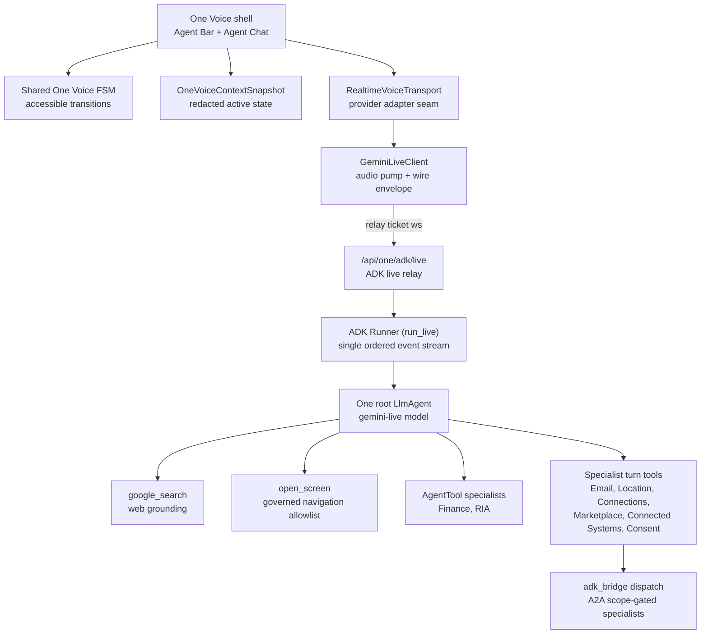

# One Voice Runtime Architecture

Status: current-state truth for the ADK-based One voice runtime.

## Visual Map



## Current Truth

One's voice runtime is Google ADK's `Runner.run_live` over Vertex AI. The
browser is an audio pump and directive executor; every decision (conversation
vs tool call vs navigation vs specialist delegation) is made inside One's
agent tree on the backend.

What shipped:

- `consent-protocol/hushh_mcp/one_adk/agent_tree.py` builds One as the root
  `LlmAgent` (name `one`, model `gemini-live-2.5-flash-native-audio` via
  `AGENT_ONE_ADK_MODEL`; the native-audio Live model is served regionally on
  Vertex, so the live client pins `AGENT_ONE_ADK_LOCATION`, default
  `us-central1`) with the full roster wired as tools: `google_search`,
  `open_screen`, `AgentTool(finance)`, `AgentTool(ria)`, and six
  dispatch-backed specialist turn functions.
- `consent-protocol/api/routes/one/adk_live.py` is the only voice relay:
  `POST /api/one/adk/relay-session` mints a signed one-time ticket
  (`api/routes/one/relay_auth.py`), `WS /api/one/adk/live` bridges the
  browser wire envelope onto `run_live`.
- The legacy hand-rolled Vertex pump
  (`api/routes/kai/agent_realtime_gemini.py`), the client-side lexical
  planner (`lib/voice/one-voice-live-action-bridge.ts`), and the
  `action_proposal` transport event were deleted. There is no second
  decision-maker anywhere in the voice path.

Voice responder contract (who makes LLM calls, who speaks):

- The root Live model is the ONLY audio producer. Specialists never speak.
- `AgentTool(finance)` / `AgentTool(ria)` consults run ONE nested text-mode
  `run_async` call on the specialist model inside the live turn; the root
  model folds the result into its spoken answer.
- The six `ask_*` specialist turn tools and `open_screen` make ZERO extra
  LLM calls: they are deterministic handlers (A2A dispatch / directive
  parking) whose structured results return to the root model.

Why this fixes the "random commands" class of bugs by construction:

- ONE decision-maker: One's root agent decides inside ADK's own flow. There
  is no client-side re-ranker and no separately-timed proposal frame to race
  the transcript.
- Turn correlation: `run_live` yields a single ordered `Event` stream per
  invocation; audio, transcriptions, function calls, and directives share the
  same ordered channel.
- Real interruption: interrupted turns surface as `event.interrupted` from
  the provider.

## Wire Protocol

Browser to relay:

| Frame | Meaning |
| --- | --- |
| `{"realtimeInput": {"audio": {"data": b64, "mimeType"}}}` | 16 kHz mono PCM16 mic audio |
| `{"type": "app_context", "appContext": {...}}` | redacted screen context + governed `consent_token` + `timezone` |
| `{"type": "app_speech", "text"}` | app-composed response for One to speak verbatim |
| `{"type": "user_text", "text"}` | typed user turn (chat parity / accessibility) |
| `{"type": "interrupt"}` | stop talking, close the activity window |

Relay to browser:

| Frame | Meaning |
| --- | --- |
| `{"setupComplete": {}}` | session live; client now pushes initial app_context |
| `{"serverContent": {"modelTurn": {"parts": [...]}}}` | 24 kHz PCM16 audio chunks |
| `{"serverContent": {"interrupted": true}}` | provider confirmed interruption |
| `{"serverContent": {"turnComplete": true}}` | model turn closed |
| `{"inputTranscription": {"text"}}` | final user transcript |
| `{"outputTranscription": {"text"}}` | final assistant transcript |
| `{"clientDirective": {"kind", "payload"}}` | tool-decided client action (e.g. navigate) |

## Auth and Consent Boundary

- The ws URL carries ONLY the opaque relay ticket. No hints, no bearer, no
  consent token in any URL.
- The vault owner consent token rides in the post-connect `app_context` frame
  and lands in ADK session state (`hussh:consent_token`). It is read by
  specialist turn tools only; it never reaches the model prompt.
- Specialist tools fail closed: without `hussh:user_id` + consent token in
  session state they return `needs_auth` instead of calling the specialist.
- Session state writes go through `session_service.append_event` with a
  `state_delta` (the relay's session object is a service copy; direct
  mutation does not persist).

## Directives

Tools never touch the client directly. They park a directive in session
state (`hussh:pending_directive`), which lands in the event's `state_delta`;
the relay forwards it exactly once as a `clientDirective` frame, ordered with
the event stream. The client executes it (`agent-bar.tsx` handles
`kind: "navigate"` via `router.push`).

`open_screen` is allowlist-governed: `APP_ROUTES` in `agent_tree.py` maps
screen ids to routes; anything outside the map is refused by construction.
`run_app_action` is the broader governed-action lane: it looks up an exact
`action_id` in the generated gateway (`contracts/kai/kai-action-gateway.vnext.json`,
loaded via `hushh_mcp.services.voice_action_manifest`) and parks the same
kind of client directive, or redirects to a specialist's `ask_*` tool when
the action is delegate-owned, or refuses `manual_only` actions with
where-to-do-it guidance.

## Onboarding and Proactive Prompting

Guiding a new user through account setup is an ordinary `run_app_action`/
`open_screen` job, not a separate onboarding engine: `ONE_IDENTITY_INSTRUCTION`
in `agent_tree.py` tells One that the welcome screen, sign-in, phone
verification, the `/one/setup` hub, and the Finance preferences wizard are
all reachable the same way as any other app surface, and that while someone
is still finishing setup One should proactively name the next thing they can
do and ask directly for anything that needs an answer (a wizard question, a
phone number) instead of only describing it.

Every previously tap-only onboarding control has a governed `action_id` so
voice has full parity with tapping: `setup.open_finance`/`...gmail`/`...email`/
`...location`/`...personal_data`/`...consent`/`...connected_systems` (hub
tiles), `setup.hub_master_ack` (master Skip/Continue), `setup.capability_continue`
(per-capability Continue), `kai.setup.answer_horizon`/`...answer_drawdown`/
`...answer_volatility` (wizard questions, each carrying a real spoken
`goal.required_inputs` prompt) and `kai.setup.launch_dashboard`, plus
`phone_mandate.submit_number` (`phone_mandate.submit_code` stays
`manual_only`, security-sensitive). Actions that change in-place component
state rather than navigating use a fourth `execution_target.path`,
`local_handler`: the owning component registers a small handler on mount via
`useLocalOnboardingActionHandler` (`hushh-webapp/lib/agent/local-onboarding-actions.ts`,
mirrors the `usePublishVoiceSurfaceMetadata` publish/clear lifecycle), and
`executeAgentGatewayAction` resolves it by `action_id` for the text/chat
execution path; the voice path already reaches the same client directive
through `run_app_action`'s existing `{kind: "action"}` parking.

Proactive prompting has two injection points, both in
`consent-protocol/api/routes/one/adk_live.py` and `hushh_mcp/one_adk/`:

- **Screen change**: the existing silent app-state note (`"...Use this
  silently."`) upgrades to an explicit ask-a-question instruction whenever
  the new screen is in `_ONBOARDING_SCREENS` (`getting_started`, `login`,
  `register_phone`, `one_setup`, `one_setup_hub`, `kai_setup_wizard`); every
  other screen keeps the original neutral/silent behavior.
- **Tool result**: there is no separate server-injected system turn after a
  tool call completes - the tool's own return dict is what the model reads
  on its next turn. `open_screen` (`agent_tree.py`) and `run_app_action`
  (`action_tools.py`) both add a `next_step` field to their success returns
  so One offers a next step after every screen it opens and every governed
  action it runs, not only after an onboarding-tagged screen change.

Note: the generated gateway's `reachability.screens` is matched against the
ROUTE-DERIVED screen id sent as `hushh:screen`
(`deriveVoiceRouteScreen()` in `route-screen-derivation.ts`, e.g. `one_setup`,
`register_phone`), not the custom `screenId` a component publishes via
`usePublishVoiceSurfaceMetadata` (e.g. `one_setup_hub`, `kai_setup_wizard`).
Onboarding contracts list both id sets in `reachability.screens` so
`list_app_actions`' screen-based ranking still works; direct `run_app_action`
execution by `action_id` is unaffected either way.

## Chat Runtime (parity path)

Typed Agent Chat (`api/routes/kai/agent_chat.py`) still uses its own
delegation gate (`classify_specialist_domain` + `adk_bridge.dispatch`) and
durable encrypted history. It shares the same specialist dispatch contract
(`A2ATask` / `SpecialistTurnResult`) as One's voice tools, so specialists
behave identically on both surfaces.

Migration rule for chat: move the chat turn loop onto the same
`get_one_runner()` via `run_async` only with dedicated regression coverage
for durable history, CRM action plans, and the SSE frame contract. Do not
fork a second agent tree for chat.

## Context Snapshot

`OneVoiceContextSnapshot` stays intentionally lossy:

- keeps screen id, route family, visible modules, available action ids,
  cache posture, vault readiness, portfolio readiness, persona, voice state
- redacts user ids, vault keys, raw PKM, transcript history, private
  documents, and raw cache keys

The client pushes it (plus consent token + timezone) as `app_context` on
`setupComplete` and again on every screen change while a session is live.
Screen changes surface to the model as bracketed non-speech user content.

## Verification

```bash
cd consent-protocol && ./bin/consent-protocol test-ci
cd consent-protocol && python3 -m pytest tests/test_one_adk_agent_tree.py -q
cd hushh-webapp && npx vitest run __tests__/voice
cd hushh-webapp && npm run typecheck && npm run verify:design-system
```

Live smoke (backend running locally): mint a ticket via
`POST /api/one/adk/relay-session`, open `WS /api/one/adk/live?relay_ticket=`,
send `{"type": "user_text", "text": "what is your name?"}`, and expect
audio frames plus `outputTranscription` containing "I'm One".

## Related References

- [One Agent Hierarchy](./one-agent-hierarchy.md)
- [One Reference Index](./README.md)
- [One Voice Kai Compatibility Runtime](./one-voice-kai-compatibility-runtime.md)
- [Agent Delegation Boundary](../iam/agent-delegation-boundary.md)
- [Hussh Agent Ontology](../../vision/agent-ontology.md)
