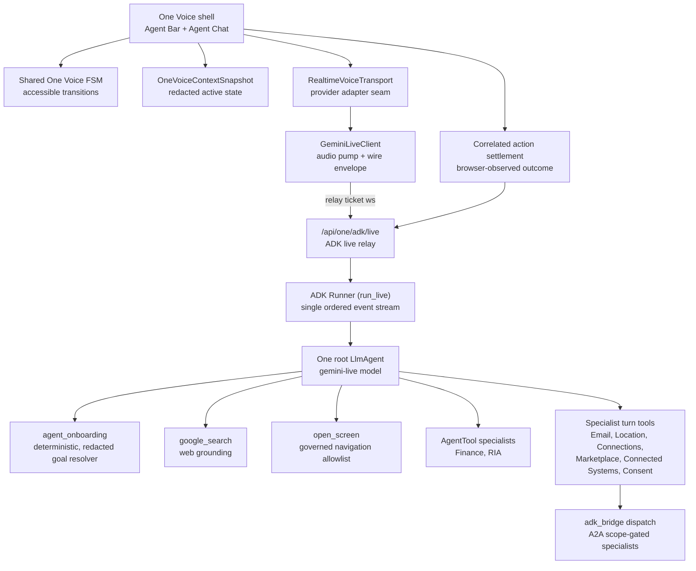

# One Voice Runtime Architecture

Status: current-state truth for the ADK-based One voice runtime.

## Visual Map



## Current Truth

### Route orchestration index

`contracts/kai/one-route-orchestration-index.v1.json` is generated from the
complete frontend/native surface map and the generated action gateway. Every
physical route has exactly one bounded, authored `voicePlaybook` in the route-layout
contract: purpose, canonical screen, entry cue, primary generated action reference,
happy-path references, recovery posture, completion boundary, and return policy. The
generated index joins that guidance to action coverage and specialist admission.
Only the server-resolved active playbook and its bounded generated active-action
inventory reach a live session; the browser cannot submit prompt text or widen
its action set.

Morphy AX consumes this verified state as a pure redacted presentation and
assessment-policy layer. It does not choose actions, create a second voice state
machine, or change `one_voice_context.v1` during rollout. See
[Morphy Agent Experience](../quality/morphy-agent-experience.md).

The index is not a second router, prompt bundle, consent grant, or TrustLink
input. Playbooks guide conversation but never execute. `deriveVoiceRouteScreen` remains the browser's canonical screen mapper,
and the action gateway remains the only executable-action authority. Before
One dispatches an internal A2A specialist, the backend checks the redacted
current route against this index; scoped consent remains the authority gate,
and TrustLink validation remains separate for delegation paths that use it.

### Native tools and MCP tools

One uses two deliberately separate tool planes:

1. **Native, local tools** are the latency-critical plane. `list_app_actions`,
   `run_app_action`, route navigation, onboarding resolution, and correlated
   browser settlement stay as bounded ADK function tools over generated
   contracts. A visible control never becomes an MCP-discovered tool, and an
   MCP server can never decide the current route, infer a DOM control, or
   report a browser action as complete.
2. **MCP tools** are the consented external-capability plane. A specialist may
   consume a small, manifest-owned MCP tool allowlist only after its route,
   auth, vault, consent, scope, and delegation gates pass. One stays the only
   conversational owner and receives a typed specialist result; it does not
   receive a broad remote tool catalogue or owner credentials.

This follows ADK's `McpToolset` model: MCP schemas are discovered and adapted
into ADK tools, and calls are proxied to the MCP server. That discovery and its
stateful connection lifecycle are intentionally outside the live root turn.
For Cloud Run, external MCP integrations use authenticated Streamable HTTP,
bounded connection/request timeouts, circuit breakers, telemetry, and a
strict tool filter. Stdio MCP is development-only. A restored process must
re-establish an MCP connection before use; no stale connection or cached tool
catalogue grants authority. On any connection, consent, or tool failure, the
specialist returns a typed recoverable result and One retains the active goal.

The source boundary is [ADK MCP tools](https://adk.dev/tools-custom/mcp-tools/):
its connection-management, tool-filtering, lifecycle, and Cloud Run guidance
is adopted here without turning MCP into a route-awareness or browser-control
protocol.

### Public welcome and first-turn priority

`/` is the public `one_intro` screen; it is not the authenticated `one_agents`
screen at `/one`. Its visible **Claim your One** button publishes
`onboarding.claim_one` through a local action contract and a browser-local
handler. The handler shares the exact redirect-preserving navigation path used
by the button, while the generated gateway remains the only way One can issue
that action.

The initial welcome cue is idle-only. The browser sends one bounded,
transcript-free `voice_activity_start` frame after sustained local speech
activity. The relay cancels its pending cue before it enters the ADK queue;
the client interrupts any already-playing cue through its normal barge-in
fence. One gives a clear, current-screen, low-risk visible-control request
priority over an introduction or onboarding narration, then waits for the
correlated browser settlement before claiming completion. No DOM inference,
client-side intent router, or public MCP route tool participates in this path.

Interactive route entry cues are debounced by the verified route/playbook key. A
visitor speech-activity frame cancels any pending cue before retained audio reaches
ADK. Confirmation-required voice directives use an inline ambient card; slots remain
transient and hidden, and confirm/cancel both report a correlated settlement.

### Active interaction layers

The browser publishes authored route, chrome, and interaction-layer inventories into
the existing runtime context. `VoiceInteractionLayerV1` describes only the top dialog,
popover, sheet, menu, confirmation, or bounded option surface: modality, lifecycle,
dismissibility, generated actions, control ids, bounded options, focus return,
underlying-action policy, and Agent continuity. It does not contain prompt text or
private page information.

The server receives only the composed, bounded active inventory. Modal and blocking
layers hide route actions; nonmodal layers retain only route actions the author
explicitly permits. One gives the top layer priority during its normal semantic
assessment, then the generated gateway validates the exact selected action. Closing a
layer uses its mounted generated handler and settles only after removal, focus return,
and context revision. No DOM inference, global synthetic Escape, keyword router, or
second action registry is involved.

Route inventories are pathname-leased. The client projects zero available actions when
the verified runtime pathname has changed but the old publisher has not yet unmounted.
Agent Bar waits for the destination route and its new authored publisher before
reporting a successful navigation settlement. Same-route visible-action or top-layer
changes are included in the relay's bounded route-context revision, so One receives the
new inventory without a page refresh or Live-session restart.

Search remains available as a separate input surface, but it is not a second voice
runtime. A selected Search action is passed to `executeAgentGatewayAction` and settles
through the same correlated browser path as an Agent Bar directive. The browser never
uses DOM state or a legacy client planner to make an action executable.

One's voice runtime is Google ADK's `Runner.run_live` over Vertex AI. The
browser is an audio pump and directive executor; every decision (conversation
vs tool call vs navigation vs specialist delegation) is made inside One's
agent tree on the backend.

What shipped:

- `consent-protocol/hushh_mcp/one_adk/agent_tree.py` builds One as the root
  `LlmAgent` (name `one`, model `gemini-live-2.5-flash-native-audio` via
  `AGENT_ONE_ADK_MODEL`; the native-audio Live model is served regionally on
  Vertex, so the live client pins `AGENT_ONE_ADK_LOCATION`, default
  `us-central1`) with the full roster wired as tools: `google_search`,
  `open_screen`, `AgentTool(finance)`, `AgentTool(ria)`, and specialist-turn
  function wrappers.
- `consent-protocol/api/routes/one/adk_live.py` is the only voice relay:
  `POST /api/one/adk/relay-session` mints a signed one-time ticket
  (`api/routes/one/relay_auth.py`), `WS /api/one/adk/live` bridges the
  browser wire envelope onto `run_live`.
- The legacy hand-rolled Vertex pump
  (`api/routes/kai/agent_realtime_gemini.py`), the client-side lexical
  planner (`lib/voice/one-voice-live-action-bridge.ts`), and the
  `action_proposal` transport event were deleted. There is no second
  decision-maker anywhere in the voice path.

Voice responder contract (who makes LLM calls, who speaks):

- The root Live model is the ONLY audio producer. Specialists never speak.
- `AgentTool(finance)` / `AgentTool(ria)` consults run ONE nested text-mode
  `run_async` call on the specialist model inside the live turn; the root
  model folds the result into its spoken answer.
- The deterministic `ask_*` specialist turn tools and `open_screen` make ZERO extra
  LLM calls: they are deterministic handlers (A2A dispatch / directive
  parking) whose structured results return to the root model.
- `resolve_onboarding_goal` is likewise deterministic but intentionally is not
  A2A: anonymous sign-in cannot require vault or consent authority. It sees
  only redacted journey state and returns permitted next actions; One retains
  conversational ownership. See [One Voice Onboarding Journey](./one-voice-onboarding-journey.md).

Current delegation limit: only Location, Nav, and Personal Information are
registered for a Live turn today. Email, Gmail, Connections, and Connected
Systems wrappers intentionally return `unavailable` until their callers can
mint an ingress-validated `A2AAuthorityContext`; the live relay must not pass
its raw vault-owner token into those ambient-user service paths. This is a
known capability gap, not a permission bypass.

Why this fixes the "random commands" class of bugs by construction:

- ONE decision-maker: One's root agent decides inside ADK's own flow. There
  is no client-side re-ranker and no separately-timed proposal frame to race
  the transcript.
- Turn correlation: `run_live` yields a single ordered `Event` stream per
  invocation; audio, transcriptions, function calls, and directives share the
  same ordered channel.
- Real interruption: interrupted turns surface as `event.interrupted` from
  the provider.

## Wire Protocol

Browser to relay:

| Frame | Meaning |
| --- | --- |
| `{"realtimeInput": {"audio": {"data": b64, "mimeType"}}}` | 16 kHz mono PCM16 mic audio |
| `{"type": "app_context", "appContext": {...}}` | redacted screen context + governed `consent_token` (explicit `null` clears it) + `timezone` |
| `{"type": "action_settled", "actionSettlement": {...}}` | correlated browser-observed outcome of an action directive |
| `{"type": "app_speech", "text"}` | app-composed response for One to speak verbatim |
| `{"type": "user_text", "text"}` | typed user turn (chat parity / accessibility) |
| `{"type": "interrupt"}` | stop talking, close the activity window |

Relay to browser:

| Frame | Meaning |
| --- | --- |
| `{"setupComplete": {}}` | session live; client now pushes initial app_context |
| `{"serverContent": {"modelTurn": {"parts": [...]}}}` | 24 kHz PCM16 audio chunks |
| `{"serverContent": {"interrupted": true}}` | provider confirmed interruption |
| `{"serverContent": {"turnComplete": true}}` | model turn closed |
| `{"inputTranscription": {"text"}}` | final user transcript |
| `{"outputTranscription": {"text"}}` | final assistant transcript |
| `{"clientDirective": {"kind", "payload"}}` | tool-decided client action (e.g. navigate) |

## Auth and Consent Boundary

- The ws URL carries ONLY the opaque relay ticket. No hints, no bearer, no
  consent token in any URL.
- The vault owner consent token rides in the post-connect `app_context` frame
  and lands in ADK session state (`hussh:consent_token`). It is read by
  specialist turn tools only; it never reaches the model prompt.
- Locking the vault or revoking consent sends `consent_token: null`, which
  clears the token from the active ADK session before any later specialist
  call. A live session never retains its former authority after that update.
- Specialist tools fail closed: without `hussh:user_id` + consent token in
  session state they return `needs_auth` instead of calling the specialist.
- Session state writes go through `session_service.append_event` with a
  `state_delta` (the relay's session object is a service copy; direct
  mutation does not persist).

## Directives

Tools never touch the client directly. They park a directive in session
state (`hussh:pending_directive`), which lands in the event's `state_delta`;
the relay forwards it exactly once as a `clientDirective` frame, ordered with
the event stream. The client executes it (`agent-bar.tsx` handles
`kind: "navigate"` via `router.push`).

`open_screen` is allowlist-governed: `APP_ROUTES` in `agent_tree.py` maps
screen ids to routes; anything outside the map is refused by construction.
`run_app_action` is the broader governed-action lane: it looks up an exact
`action_id` in the generated gateway (`contracts/kai/kai-action-gateway.vnext.json`,
loaded via `hushh_mcp.services.voice_action_manifest`) and parks the same
kind of client directive, or redirects to a specialist's `ask_*` tool when
the action is delegate-owned, or refuses `manual_only` actions with
where-to-do-it guidance.

### Action settlement

An action directive has two distinct stages: **proposal** and **settlement**.
The relay attaches a random `directiveId` to each direct `actionId` directive
and retains that correlation only for the current authenticated WebSocket.
The browser runs the action through `executeAgentGatewayAction`, then returns
its `succeeded`, `started`, `blocked`, `invalid`, `failed`, or `noop` result
with the same id. The relay rejects unmatched, replayed, or malformed reports.
Only a matched result becomes an `[App action settlement - not user speech]`
turn for One. One must describe that reported outcome, never assume an action
completed merely because it emitted a directive.

This closes the live chain as:

`One plan → governed directive → browser guard/execution → correlated settlement → grounded next turn`.

Desktop-web provider actions may require `trusted_activation_required`. One still
selects the exact Apple or Google generated action in its current ADK turn, but an
asynchronous directive does not carry browser transient activation. The blocked
directive produces one provider-specific Agent Bar action; its trusted tap invokes the
mounted Firebase popup handler synchronously and preserves the live session. Popup
success is correlated only after Firebase returns a verified user and token. The
browser-owned popup is not an in-app interaction layer, and popup close, cancellation,
focus recovery, retry, SDK failure, and stale completion report typed settlements
without reloading Login or allowing an old attempt to mutate a newer one.

Gmail connector OAuth uses the same activation boundary without impersonating Firebase
provider authentication. The generated **Connect Gmail** action is
`trusted_activation_required`: the Agent Bar's exact confirming tap opens the named
connector popup synchronously, and only then does the popup navigate to the
backend-issued Google authorization URL. The callback reports a same-origin, opaque
terminal settlement to the retained opener. The vault key and owner token remain solely
in the opener's memory; neither is written to browser storage or sent through the popup.

## Onboarding and Proactive Prompting

Guiding a new user through account setup is an ordinary `run_app_action`/
`open_screen` job, not a separate onboarding engine: `ONE_IDENTITY_INSTRUCTION`
in `agent_tree.py` tells One that the welcome screen, sign-in, phone
verification, the `/one/setup` hub, and the Finance preferences wizard are
all reachable the same way as any other app surface, and that while someone
is still finishing setup One should proactively name the next thing they can
do and ask directly for anything that needs an answer (a wizard question, a
phone number) instead of only describing it.

Every previously tap-only onboarding control has a governed `action_id` so
voice has full parity with tapping: `setup.open_finance`/`...gmail`/`...email`/
`...location`/`...pkm`/`...marketplace`/`...consent`/`...connected_systems` (hub
tiles), `setup.hub_master_ack` (master Skip/Continue), `setup.capability_continue`
(per-capability Continue), `kai.setup.answer_horizon`/`...answer_drawdown`/
`...answer_volatility` (wizard questions, each carrying a real spoken
`goal.required_inputs` prompt) and `kai.setup.launch_dashboard`, plus
`phone_mandate.submit_number` and confirmation-required
`phone_mandate.submit_code`. Spoken OTP values remain transient, redacted, and are never
repeated. Actions that change in-place component
state rather than navigating use a fourth `execution_target.path`,
`local_handler`: the owning component registers a small handler on mount via
`useLocalOnboardingActionHandler` (`hushh-webapp/lib/agent/local-onboarding-actions.ts`,
mirrors the `usePublishVoiceSurfaceMetadata` publish/clear lifecycle), and
`executeAgentGatewayAction` resolves it by `action_id` for the text/chat
execution path; the voice path already reaches the same client directive
through `run_app_action`'s existing `{kind: "action"}` parking.

Proactive prompting has two injection points, both in
`consent-protocol/api/routes/one/adk_live.py` and `hushh_mcp/one_adk/`:

- **Screen change**: the existing silent app-state note (`"...Use this
  silently."`) upgrades to an explicit ask-a-question instruction whenever
  the new screen is in `_ONBOARDING_SCREENS` (`getting_started`, `login`,
  `register_phone`, `one_setup`, `one_setup_hub`, `kai_setup_wizard`); every
  other screen keeps the original neutral/silent behavior.
- **Tool result**: there is no separate server-injected system turn after a
  tool call completes - the tool's own return dict is what the model reads
  on its next turn. `open_screen` (`agent_tree.py`) and `run_app_action`
  (`action_tools.py`) both add a `next_step` field to their success returns
  so One offers a next step after every screen it opens and every governed
  action it runs, not only after an onboarding-tagged screen change.

Note: the generated gateway's `reachability.screens` is matched against the
ROUTE-DERIVED screen id sent as `hushh:screen`
(`deriveVoiceRouteScreen()` in `route-screen-derivation.ts`, e.g. `one_setup`,
`register_phone`), not the custom `screenId` a component publishes via
`usePublishVoiceSurfaceMetadata` (e.g. `one_setup_hub`, `kai_setup_wizard`).
Onboarding contracts list both id sets in `reachability.screens` so
`list_app_actions`' screen-based ranking still works; direct `run_app_action`
execution by `action_id` is unaffected either way.

## Chat Runtime (parity path)

Typed Agent Chat (`api/routes/kai/agent_chat.py`) still uses its own
delegation gate (`classify_specialist_domain` + `adk_bridge.dispatch`) and
durable encrypted history. It shares the same specialist dispatch contract
(`A2ATask` / `SpecialistTurnResult`) as One's voice tools, so specialists
behave identically on both surfaces.

Migration rule for chat: move the chat turn loop onto the same
`get_one_runner()` via `run_async` only with dedicated regression coverage
for durable history, CRM action plans, and the SSE frame contract. Do not
fork a second agent tree for chat.

## Context Snapshot

`OneVoiceContextSnapshot` stays intentionally lossy:

- keeps screen id, route family, visible modules, available action ids,
  cache posture, vault readiness, portfolio readiness, persona, voice state,
  and the top redacted interaction-layer posture
- redacts user ids, vault keys, raw PKM, transcript history, private
  documents, and raw cache keys

The client pushes it (plus consent token + timezone) as `app_context` on
`setupComplete` and again on every screen change while a session is live. The
relay keeps a bounded allowlist of this redacted state in ADK session state for
tools only: `run_app_action` and `list_app_actions` use the supplied action ids
to avoid proposing controls that are not available on the current surface.
Raw snapshot fields never enter a model prompt. Screen changes alone surface to
the model as bracketed non-speech user content.

Only the active playbook, top-layer inventory, visible generated actions and bounded
options, and pending-settlement posture are composed into One's runtime instruction.
`list_app_actions` is retrieval over generated contracts, not semantic authority;
intelligence assesses meaning and deterministic policy validates route, layer, auth,
vault, consent, confirmation, and settlement boundaries.

## Verification

```bash
cd consent-protocol && ./bin/consent-protocol test-ci
cd consent-protocol && python3 -m pytest tests/test_one_adk_agent_tree.py -q
cd hushh-webapp && npx vitest run __tests__/voice
cd hushh-webapp && npm run typecheck && npm run verify:design-system
```

Live smoke (backend running locally): mint a ticket via
`POST /api/one/adk/relay-session`, open `WS /api/one/adk/live?relay_ticket=`,
send `{"type": "user_text", "text": "what is your name?"}`, and expect
audio frames plus `outputTranscription` containing "I'm One".

## Related References

- [One Agent Hierarchy](./one-agent-hierarchy.md)
- [One Reference Index](./README.md)
- [One Voice Kai Compatibility Runtime](./one-voice-kai-compatibility-runtime.md)
- [Agent Delegation Boundary](../iam/agent-delegation-boundary.md)
- [Hussh Agent Ontology](../../vision/agent-ontology.md)
