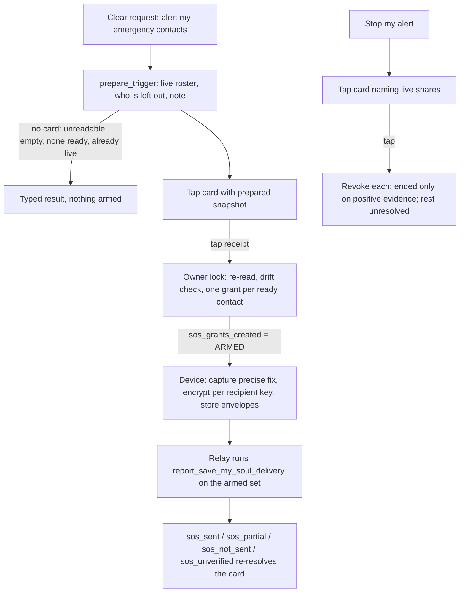

# Save My Soul in One Voice: source trace

Graph revision traced: `5c15f15` (the attached `save-my-soul-kg.html`). Checkout: `48837a216` (`origin/main`, 2026-09-18). This note records where the code disagrees with the graph and which behaviours were changed; the executable truth is `consent-protocol/hushh_mcp/one_voice/tools/sos.py`, `session.py` and their tests.

## Visual Context

The voice runtime this sits in is [one-voice-live-tool-contract.md](./one-voice-live-tool-contract.md); the Location domain that owns every write is [../architecture/architecture.md](../architecture/architecture.md).

## Visual Map

## Execution owners (verified)

| Effect | Owner | Notes |
|---|---|---|
| Emergency roster read | `OneLocationAgentService.list_sms_contact_ids` | UNION of the legacy `one_location_sms_contacts` table (with connection eligibility) and active memberships of the owner's `is_system AND system_kind='sms'` Circle. Discriminated by `system_kind`, never by name. The web client resolves its own SMS Circle by `isSystem && role === "owner"`; Trusted is `is_system=false`, so it cannot match. |
| Readiness | `phoneVerified && canReceiveLocation && keyId && publicKeyJwk` (`isSosShareReadyRecipient`); voice: `phone_verified and key` from the roster-scoped recipients read | `add_sms_contact` refuses an unverified phone (`LOCATION_RECIPIENT_UNAVAILABLE`). The Circle-detail member-invite path does not check phone/key (documented gap, unchanged). |
| Grant creation | `create_grant(share_kind="sos", require_recipient_phone_verified=True)` | 8 h `timed`; the service refuses a recipient outside the roster (`LOCATION_SMS_CONTACT_REQUIRED`). No incident-level lock existed; the SOS lane replaces (revoke + insert) per pair. Voice arming now holds `sos_incident_guard` (owner-scoped advisory lock) across re-read and creates. |
| Envelope publish + push | `POST /grants/{id}/envelopes` → `store_encrypted_envelope` | Sets `latest_envelope_id`; the FCM push is sent from this path only for the SOS lane. `create_grant` sends no push for SOS. |
| Voice publisher | `components/location/location-publisher-bridge.tsx` (mounted once by `AgentOwnerGate`, live on `/one`) | Claims a step before effects; forces precise; `maxAgeMs: 0` capture, `stale_fix` refusal above 55 s; never calls `runSosPanic`/`sendSosEmails`/`createGrant`. |
| Delivery verification | `report_save_my_soul_delivery` (server) | A contact is reached only when an envelope is stored on their grant. Now bound to the armed set; `sos_unverified` when the read fails. |
| Stop | `revoke_grant` per live SOS grant | Voice scope: every live sender-owned SOS share. Manual scope: the device incident's ids ∪ (now) server-side active SOS grants. |
| Email leg | manual `handleTriggerSos` → `sendSosEmails` → `/api/one/location/sos-email` | Plaintext coordinates/accuracy/capture time/note/emergency number to the recipients' emails on file. Manual surface only. |

## Graph vs. checkout differences

- **Python-side emitter**: the graph marks the arming emitter as inferred. It is `hushh_mcp/one_voice/tools/sos.py` (`trigger_save_my_soul`), not the Location service; the service owns grants, envelopes and pushes.
- **Shared panic core**: the voice path does not run `runSosPanic`. Grants are created server-side by the tool; the device only publishes envelopes for the ids it is handed (`payload.grants` fallback rows). No second incident, no double publish.
- **Capture freshness**: manual path uses the default capture (20 s reuse, 10-minute stale fallback via the bus); voice path forces `maxAgeMs: 0` and refuses fixes older than 55 s (`stale_fix`). No freshness timeout was invented; the manual policy is unchanged and recorded here as a difference.
- **Roster discriminator**: server `system_kind='sms'`; client `isSystem && role owner` (safe because Trusted is not `is_system`). Unchanged.
- **Note bound**: `ONE_LOCATION_SHARE_NOTE_MAX_LENGTH = 140` (client) and `SOS_NOTE_MAX_LENGTH = 140` (voice input model); both reject over-length, neither truncates. The email route separately caps at 300 for its own body.
- **"Coordinates only in ciphertext"** is true of the app-envelope leg only; the manual email leg carries plaintext coordinates. Voice does not run the email leg. **Decision required** (not made here): whether voice-triggered alerts should also email, which changes the effect (plaintext location by email).
- **Stop scope**: manual = incident grant ids (now also server active SOS grants); voice = every live SOS share. Both documented; neither expanded to ordinary shares.
- **`i am safe now`** was an alias of `location.stop_sos`; removed (stopping tells nobody anything).
- **`location.trigger_sos` gateway policy** is `allow_direct` because its `local_handler`/Kai path only opens the review screen (`review_only`); the One Voice tool is `confirm_tap` regardless. Left as-is (Siri/native regression surface); the `meaning` text now describes both paths.
- **Roster limit**: `SMS_SYSTEM_CIRCLE_MEMBER_LIMIT = 10` counts the owner's own membership row, so it admits owner + 9. Unchanged; the voice add maps the capacity refusal to `roster_full`.
- **Revoke event lane**: `_revoke_grant_transition` reads a `share_kind` column that does not exist, so SOS revokes are recorded/pushed as ordinary revokes. Unchanged (existing behaviour; noted for the service owner).

## Unverified here

Real-microphone and native (Siri/Action Button) checks; the Postgres guard test runs only where `ONE_COMMAND_TEST_DATABASE_URL` is set (CI's protocol lane), it skips locally.
