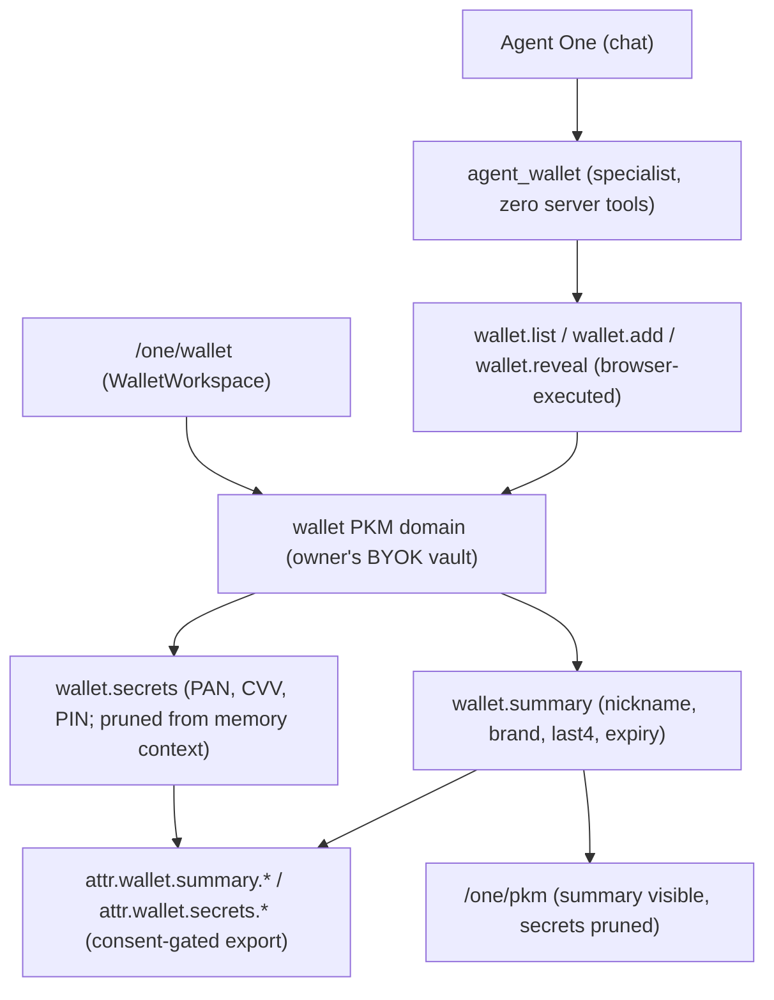

# Wallet (formerly Cards)

The Wallet is the owner's consent-scoped vault of payment cards inside the
private agent: a reserved PKM domain, a specialist agent, a route, chat
widgets, and two requestable scopes. It was designed as "payment cards" and
renamed to Wallet on 2026-09-02 (founder directive). Items inside it are still
called cards, because that is what they are; everything that names the feature
says Wallet. The **Wallet Profile** (public identity pass at `/one/wallet-card`,
`one_wallet_cards`, `ONE_WALLET_CARD_ENABLED`, `wallet-card-service.ts`) is a
different, older feature and was never renamed.

## Visual Map

## Naming map

| Surface | Before | Now |
|---|---|---|
| PKM domain | `payment_cards` | `wallet` (`OWNER_MANAGED_RESERVED_DOMAIN_SLUGS`) |
| Sub-intents | `payment_cards.summary` / `payment_cards.secrets` | `wallet.summary` / `wallet.secrets` |
| Requestable scopes | `attr.payment_cards.summary.*` / `attr.payment_cards.secrets.*` | `attr.wallet.summary.*` / `attr.wallet.secrets.*` |
| Static scope | `agent.cards.manage` (`AGENT_CARDS_MANAGE`, "Cards Management") | `agent.wallet.manage` (`AGENT_WALLET_MANAGE`, "Wallet Management") |
| Specialist agent | `agent_cards` (`agents/cards/agent.yaml`, LlmAgent `cards`, `_build_cards_agent`) | `agent_wallet` (`agents/wallet/agent.yaml`, LlmAgent `wallet`, `_build_wallet_agent`) |
| Route / screen | `/one/cards` (`ROUTES.ONE_CARDS`, screen `one_cards`, beacon `native-route-one-cards`) | `/one/wallet` (`ROUTES.ONE_WALLET`, screen `one_wallet`, beacon `native-route-one-wallet`) |
| Gateway actions | `route.one_cards`, `cards.list` / `cards.add` / `cards.reveal` | `route.one_wallet` ("Open Wallet"), `wallet.list` / `wallet.add` / `wallet.reveal` |
| Feature flags | `ONE_PAYMENT_CARDS_ENABLED`, `NEXT_PUBLIC_ONE_PAYMENT_CARDS_ENABLED` | `ONE_WALLET_ENABLED`, `NEXT_PUBLIC_ONE_WALLET_ENABLED` (deploy substitution `_ONE_WALLET_ENABLED`) |
| Kill switch | `HUSHH_CARDS_AGENT_DISABLED` | `HUSHH_WALLET_AGENT_DISABLED` |
| Backend validation | `payment_card_validation.py` (`validate_payment_card_envelope`) | `wallet_card_validation.py` (`validate_wallet_card_envelope`) |
| Frontend service | `lib/services/payment-cards-service.ts` (`PaymentCardsService`, `PAYMENT_CARDS_DOMAIN`) | `lib/services/wallet-service.ts` (`WalletService`, `WALLET_DOMAIN`) |
| Frontend types | `PaymentCardSummary`, `PaymentCardSecrets`, `PaymentCardInput` | `WalletCardSummary`, `WalletCardSecrets`, `WalletCardInput` |
| Components | `components/cards/cards-workspace.tsx` (`CardsWorkspace`) | `components/wallet/wallet-workspace.tsx` (`WalletWorkspace`, `WALLET_PAGE_SIZE`) |
| Chat widget state | `AgentCardWidget`, `cardWidgets` | `AgentWalletWidget`, `walletWidgets` |
| Chat sources | `agent_chat_cards_add` | `agent_chat_wallet_add` |
| Voice contracts | `cards-widgets.voice-action-contract.json`, `app/one/cards/page.voice-action-contract.json` | `wallet-widgets.voice-action-contract.json`, `app/one/wallet/page.voice-action-contract.json` |
| Test ids | `one-cards-*` | `one-wallet-*` (`one-wallet-workspace`, `one-wallet-list`, `one-wallet-search`, `one-wallet-no-match`) |
| Rehearsal | `verify-reviewer-payment-cards.mjs` | `verify-reviewer-wallet.mjs` |
| Memory | domain hidden (`INTERNAL_PKM_DOMAINS`) | domain visible as `wallet`; the `secrets` branch stays pruned |

Unchanged on purpose: `card_<uuid>` segment ids, `cardId` / `last4` / `brand`
fields, `secure-card-add-form.tsx` and `secure-card-reveal.tsx` (they render
one card), `lib/wallet/card-validation.ts` and `pan-paste-guard.ts` (they
validate a card), and every identity-pass identifier listed above.

## Where the pieces live

- Domain contract and sharing policy: `consent-protocol/hushh_mcp/services/domain_contracts.py`
- Scope policy and display metadata: `hushh_mcp/consent/pkm_scope_policy.py`, `hushh_mcp/consent/scope_helpers.py`
- Agent manifest and roster insertion: `hushh_mcp/agents/wallet/agent.yaml`, `hushh_mcp/one_adk/agent_tree.py` (`one_wallet_enabled()` gate)
- Store-domain guard: `api/routes/pkm_routes_shared.py` (`_enforce_wallet_write_policy`)
- Route, tile, breadcrumb, screen: `app/one/wallet/page.tsx`, `lib/onboarding/one-capabilities.ts`, `lib/navigation/top-shell-breadcrumbs.ts`, `lib/voice/route-screen-derivation.ts`
- Chat integration: `components/agent/agent-chat-workspace.tsx` (`wallet.list` / `wallet.add` / `wallet.reveal` branches, paste guard)
- Deploy: `deploy/backend.cloudbuild.yaml`, `deploy/frontend.cloudbuild.yaml`, `hushh-webapp/Dockerfile`, `deploy-dev.yml` / `deploy-uat.yml` (`_ONE_WALLET_ENABLED=true`), production off

A rename must also cover string literals passed as ids: `_load_product_agent_manifest("wallet")`
and the LlmAgent `name="wallet"` were the two the first pass missed and they crashed boot.
