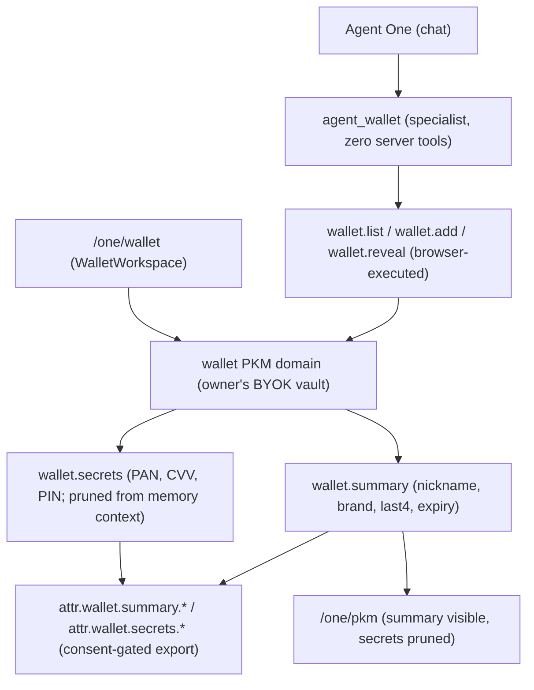

# Wallet (formerly Cards)

The Wallet is the owner's consent-scoped vault of payment cards inside the
private agent: a reserved PKM domain, a specialist agent, a route, chat
widgets, and two requestable scopes. It was designed as "payment cards" and
renamed to Wallet on 2026-09-02 (founder directive). Items inside it are still
called cards, because that is what they are; everything that names the feature
says Wallet. The **Wallet Profile** (public identity pass at `/one/wallet-card`,
`one_wallet_cards`, `ONE_WALLET_CARD_ENABLED`, `wallet-card-service.ts`) is a
separate identity lifecycle. The Cards tab now composes that lifecycle alongside
encrypted payment cards; it does not copy profile fields into the payment-card domain.

## Visual Map

```mermaid
flowchart TD
  one["Agent One (chat)"]
  wallet["agent_wallet (specialist, zero server tools)"]
  actions["wallet.list / wallet.add / wallet.reveal (browser-executed)"]
  route["/one/wallet (WalletWorkspace)"]
  vault["wallet PKM domain (owner's BYOK vault)"]
  summary["wallet.summary (nickname, brand, last4, expiry)"]
  secrets["wallet.secrets (PAN, CVV, PIN; pruned from memory context)"]
  scopes["attr.wallet.summary.* / attr.wallet.secrets.* (consent-gated export)"]
  memory["/one/pkm (summary visible, secrets pruned)"]

  one --> wallet
  wallet --> actions
  actions --> vault
  route --> vault
  vault --> summary
  vault --> secrets
  summary --> scopes
  secrets --> scopes
  summary --> memory
```

## Naming map

| Surface | Before | Now |
|---|---|---|
| PKM domain | `payment_cards` | `wallet` (`OWNER_MANAGED_RESERVED_DOMAIN_SLUGS`) |
| Sub-intents | `payment_cards.summary` / `payment_cards.secrets` | `wallet.summary` / `wallet.secrets` |
| Requestable scopes | `attr.payment_cards.summary.*` / `attr.payment_cards.secrets.*` | `attr.wallet.summary.*` / `attr.wallet.secrets.*` |
| Static scope | `agent.cards.manage` (`AGENT_CARDS_MANAGE`, "Cards Management") | `agent.wallet.manage` (`AGENT_WALLET_MANAGE`, "Wallet Management") |
| Specialist agent | `agent_cards` (`agents/cards/agent.yaml`, LlmAgent `cards`, `_build_cards_agent`) | `agent_wallet` (`agents/wallet/agent.yaml`, LlmAgent `wallet`, `_build_wallet_agent`) |
| Route / screen | `/one/cards` (`ROUTES.ONE_CARDS`, screen `one_cards`, beacon `native-route-one-cards`) | `/one/wallet` (`ROUTES.ONE_WALLET`, screen `one_wallet`, beacon `native-route-one-wallet`) |
| Gateway actions | `route.one_cards`, `cards.list` / `cards.add` / `cards.reveal` | `route.one_wallet` ("Open Wallet"), `wallet.list` / `wallet.add` / `wallet.reveal` |
| Feature flags | `ONE_PAYMENT_CARDS_ENABLED`, `NEXT_PUBLIC_ONE_PAYMENT_CARDS_ENABLED` | none: renamed to `ONE_WALLET_ENABLED` / `NEXT_PUBLIC_ONE_WALLET_ENABLED`, then removed on 2026-09-02 when the Wallet shipped unconditionally |
| Kill switch | `HUSHH_CARDS_AGENT_DISABLED` | none: the renamed switch was declared in the manifest but never read, and the claim was removed |
| Backend validation | `payment_card_validation.py` (`validate_payment_card_envelope`) | `wallet_card_validation.py` (`validate_wallet_card_envelope`) |
| Frontend service | `lib/services/payment-cards-service.ts` (`PaymentCardsService`, `PAYMENT_CARDS_DOMAIN`) | `lib/services/wallet-service.ts` (`WalletService`, `WALLET_DOMAIN`) |
| Frontend types | `PaymentCardSummary`, `PaymentCardSecrets`, `PaymentCardInput` | `WalletCardSummary`, `WalletCardSecrets`, `WalletCardInput` |
| Components | `components/cards/cards-workspace.tsx` (`CardsWorkspace`) | `components/wallet/wallet-workspace.tsx` (`WalletWorkspace`, `WALLET_PAGE_SIZE`) |
| Chat widget state | `AgentCardWidget`, `cardWidgets` | `AgentWalletWidget`, `walletWidgets` |
| Chat sources | `agent_chat_cards_add` | `agent_chat_wallet_add` |
| Voice contracts | `cards-widgets.voice-action-contract.json`, `app/one/cards/page.voice-action-contract.json` | `wallet-widgets.voice-action-contract.json`, `app/one/wallet/page.voice-action-contract.json` |
| Test ids | `one-cards-*` | `one-wallet-*` (`one-wallet-workspace`, `one-wallet-list`, `one-wallet-search`, `one-wallet-no-match`) |
| Rehearsal | `verify-reviewer-payment-cards.mjs` | `verify-reviewer-wallet.mjs` |
| Memory | domain hidden (`INTERNAL_PKM_DOMAINS`) | domain visible as `wallet`; the `secrets` branch stays pruned |

Unchanged on purpose: `card_<uuid>` segment ids, `cardId` / `last4` / `brand`
fields, `secure-card-add-form.tsx` and `secure-card-reveal.tsx` (they render
one card), `lib/wallet/card-validation.ts` (it validates a card), and every
identity-pass identifier listed above. The chat's card-number paste guard was
generalized into the Secrets guard (`lib/pkm/secret-span-guard.ts`): a card
number sent in chat is kept in Secrets and offered to Wallet, never blocked and
never sent to the model (`consent-protocol/docs/reference/personal-knowledge-model.md`,
"The Secrets area").

## Where the pieces live

- Domain contract and sharing policy: `consent-protocol/hushh_mcp/services/domain_contracts.py`
- Scope policy and display metadata: `hushh_mcp/consent/pkm_scope_policy.py`, `hushh_mcp/consent/scope_helpers.py`
- Agent manifest and roster insertion: `hushh_mcp/agents/wallet/agent.yaml`, `hushh_mcp/one_adk/agent_tree.py` (unconditional)
- Store-domain guard: `api/routes/pkm_routes_shared.py` (`_enforce_wallet_write_policy`)
- Route, tile, breadcrumb, screen: `app/one/wallet/page.tsx`, `lib/onboarding/one-capabilities.ts`, `lib/navigation/top-shell-breadcrumbs.ts`, `lib/kai/actions/route-screen-derivation.ts`
- Chat integration: `components/agent/agent-chat-workspace.tsx` (`wallet.list` / `wallet.add` / `wallet.reveal` branches, the Secrets guard and its "Add this card to Wallet" offer)
- Deploy: nothing Wallet-specific. The feature carries no flag in any lane.

A rename must also cover string literals passed as ids: `_load_product_agent_manifest("wallet")`
and the LlmAgent `name="wallet"` were the two the first pass missed and they crashed boot.

## Wallet entry and card collection

The first visit per account on a device to `/one/wallet` starts with the Wallet illustration and Continue,
without a duplicate Wallet page heading. Continue saves a cosmetic account-scoped device preference; later visits open
the workspace directly. This does not complete account setup or unlock the vault.

Cards owns the animated collection, safe summary search, and the existing
explicit reveal/removal actions. Profile, Referral and NWS are system cards and
remain present beside saved payment cards. They never enter payment-card storage
or invoke payment-card reveal/removal services.
Add opens the encrypted card-entry form directly. Save and Cancel return to
Cards, while switching tabs preserves and masks an unfinished draft. Vault lock
discards the form and revealed details. Chat and Secrets handoffs wait until
Continue, then use the existing card-entry flow.

The One dashboard preloads the same preprocessed WebP URL rendered by Wallet.
The illustration loads eagerly at high priority with an inline blur placeholder;
it does not wait for the card summary request or a server image transform.
Cold connections can still require an image download. The PNG remains the
source artwork.

## Adding a payment card

The Add tab accepts manual entry only: card number, name on card, expiry and CVV
are required. Card provider, PIN and issuing region are optional. A blank provider
uses number-based network detection, with Other for a valid unrecognized number;
a supplied provider supports overlapping network ranges. A supplied region is
validated, while a blank region stays blank. Existing nicknames remain readable;
new cards use the network label without asking for a nickname.

A confirmed encrypted save inserts the returned card immediately into Cards,
selects it, and clears the draft. Failed saves retain the draft for retry. The
20 supplied payment-card finishes are selected deterministically from the saved
card ID, so reload, renaming and incoming information do not change the artwork.
The owner-only presentation includes the entered cardholder name. It is read
from the encrypted secrets branch and never copied into the summary/index or
chat projection. Collection faces show only the last four number digits; the
selected card in an unlocked Wallet shows the full number. CVV and PIN stay
hidden. Locking the vault or changing
accounts drops the presentation. Reads that fail do not become an empty wallet,
and writes use the current snapshot revision to preserve concurrent additions.

## Card browser

The Cards tab uses `WalletCardBrowser` to coordinate an All overview, the existing
animated card collection, and a selected-card detail view. Cards open with one
full face above the remaining stack. The deck fits the available viewport above
the shared bottom controls, showing two lower card edges at normal zoom. Native
vertical scrolling unfolds it into a spaced column. Reduced-motion users receive
a static list. Card taps and the compact View details control open the same
existing detail flow; the card switcher remains available to assistive technology.

Agent One cards use the owner's identity and existing sharing services. Profile
details compose `WalletCardWorkspace`, including the real QR, aggregate scans,
last scan, edits, pause/resume, rotation, removal and Apple Wallet handoff. Referral
uses the existing referral link, qualification counts and referral event stream.
NWS has no computed score in this release. Its emerald face shows the fixed
900/1000 sample requested for the card design; the accessible description and
details identify it as a sample, not an evaluation. The NWS face has no QR;
its existing Wallet Profile QR and sharing controls remain in details. Saved-card selection remains metadata-only; the existing explicit
Show card details action owns decryption, and leaving Cards or selecting All
clears any revealed values.

### Automatic Wallet Profile

`WalletProfileBootstrap` runs once account authentication and the existing vault
owner session are ready, without visiting Wallet. `POST /api/one/wallet-card/ensure`
creates only a missing row from available account basics. Existing payloads,
paused profiles and removed profiles are preserved, including concurrent first
requests. The management route uses the same operation instead of requiring a
setup form. Missing optional fields remain editable in Wallet Profile.

New QR tokens have an encrypted recovery envelope under the deployed credential
encryption key, bound to the owner and token digest. Public lookup still uses the
hash. A legacy QR can be adopted from its valid device-local token; if neither
token nor envelope exists, the owner must explicitly rotate. Opening Wallet never
silently invalidates a printed QR. Migration 285 adds the nullable envelope.

Owner mutations notify account-scoped subscribers immediately. Visible Wallet
views refresh on focus and every 15 seconds for remote changes and aggregate
scan updates; this is polling, not a Wallet Profile SSE stream. Referral updates
continue to use the existing referral stream.

Usernames are owner-scoped profile labels, not globally unique URLs. Defaults use
the account name (`Ankit Kumar Singh` → `ankit.kumar.singh`). They allow 3–30
lowercase ASCII letters/digits and single internal dots; reserved and blocked
labels are rejected on the server as well as in the form. A nonrepresentable or
unavailable name receives `member`, which the owner can edit.

Existing-account batch provisioning uses
`consent-protocol/scripts/backfill_one_wallet_cards.py`. It defaults to dry-run,
has bounded batches, prints counts only, requires encrypted link recovery when
applying, and never edits existing rows. Apply it in each environment only after
its schema and runtime are deployed; a UAT deployment does not deploy production.

### Add: manual entry

Wallet Add and the secure chat widget share `SecureCardAddForm`. Neither offers
Scan card or Choose photo. Previously saved cards and Secrets handoffs continue
to use the same encrypted WalletService path. The standalone scanner module is
not reachable from Add.

### Sharing: review and manage inside Wallet

Sharing shows existing Wallet-specific grants with the recipient and information
shared. Manage opens a shared dialog inside Wallet. Revocation reuses
`useConsentActions`, requires confirmation and an exact request ID, and never
falls back to a scope-wide revoke. Pending requests remain in Consent Center.
No grants or card-specific permissions are invented. Failed reads never appear
as empty access. Reads exceeding 15 seconds show retry; late results cannot
replace a newer read.

### Mail-aligned Wallet surfaces

Cards, Add and Sharing use the shared 820px workspace measure and Mail-style
feature surface tokens (solid surface, shared border, radius and shadow).
Feature headings use Location's shared semantic section typography.
Physical card faces remain capped at 420px inside the wider Cards panel.

Wallet onboarding uses the full-resolution preloaded artwork without a blur
placeholder, centered with its title and Continue action. Stacked cards hide
their separate detail links while pinned and remeasure after expansion settles;
the card itself remains the details action. Sharing uses a labelled illustrative
card instead of the header counters; real access remains in the lists below.

Sharing lists existing recipients and the information shared, with Manage and
confirmed revocation through the existing consent actions. Pending requests stay
in Consent Center. Loading and read errors are distinct from empty access.

Wallet panels use solid surfaces and Location section typography. The collection
omits example labels and fictional total-due content. PIN is optional; blank or
whitespace-only PIN input is omitted before validation and saving.

### Card browsing gestures

The Cards overview presents one full card above a compact lower stack. Vertical scrolling unfolds the remaining cards; reduced-motion users receive a static, fully unfolded list. A left drag or horizontal trackpad scroll opens card-local summary controls; selecting a card opens its details. The first-use swipe hint is scoped to the account and device through OnboardingLocalService. The overview swipe panel shows identity fields or masked payment metadata, using the Profile row styling. It contains no second View details button and never decrypts payment secrets.

### Saved payment card numbers and encrypted Chat copies

Selecting a saved payment card in an unlocked Wallet displays its full number
on that face and in Card details. The collection remains a metadata projection.
Owner, key, tab, selection, visibility and unmount changes invalidate delayed
number reads and clear the selected number. CVV and PIN remain hidden.

The Hussh Chat share option requires choosing one person and confirming the selected card.
Canonical direct-message permission must allow sending, and the recipient must
have a registered secure key. The device encrypts only PAN, cardholder name,
network, expiry and region with a random AES-GCM key, wrapped separately for the
sender and recipient through the existing P-256 recipient-key seam. The
authenticated payload binds both participants, the saved card and a unique
share ID. CVV and PIN never enter the message.

Chat previews, search and replies show “Shared payment card”; encrypted card
messages cannot be edited into ordinary text. The recipient unlocks their
Wallet and explicitly opens the details on their device. Acknowledged sends
are recorded under that card's encrypted secrets and displayed in Shared with.
Existing Wallet-wide grants are labelled Wallet access separately. These are
snapshot copies: deleting the saved card or disconnecting cannot recall a copy
already received. If a required private key is unavailable, ask for a new share.

### Password-protected copies for anyone

Share card opens an 820px panel with the same 20px/28px gutters and compact
typography as Wallet Add. Anyone is the default method; Hussh Chat remains a
separate connected-recipient method. The owner chooses and confirms a password
of at least 12 characters, then prepares an encrypted file before a separate
Share encrypted file click. The shared file helper uses the system sheet where
available and downloads the same file otherwise. Cancellation never claims
delivery or starts a download. Generic exports do not invent recipient receipts.

`wallet-card-file.ts` projects only PAN, cardholder name, network, expiry and
region. A random 16-byte salt and PBKDF2-SHA256 with 600,000 iterations derive
a 256-bit AES-GCM key through the export-encryption seam. Authenticated metadata
binds the version and KDF parameters. The neutral `encrypted-card.json` package
contains no account/card identifier, password, CVV or PIN. Owner/card/password,
visibility and dialog lifecycle changes invalidate pending preparation.

The exact `/wallet/open` route is anonymous, outside the signed-in shell, and
analytics exempt. It reads a bounded local file and decrypts on the recipient's
device; it does not upload, persist or send card information to an API or model.
Malformed versions/KDF settings are rejected before derivation, oversized files
before reading, and incorrect passwords/tampering never reveal details. Changing
the file/password, hiding the page or unmounting invalidates delayed plaintext.

Send the password separately from the file. Anyone with both can open the copy;
the file has no expiry or recall. Recipients need no Hussh account, connection,
vault unlock or app installation. The reader route must be deployed to the
configured public app origin before people on other devices can use that URL;
localhost alone is only a developer preview.

### Complete card images

`wallet-card-image.ts` composes the approved artwork, bundled font, current face
fields and QR into one self-contained SVG. The face is revealed only after that
complete image loads; an opaque card placeholder occupies the same dimensions
while loading. Returning from details reuses cached public artwork. Personal
compositions and object URLs remain component-local and are invalidated when
identity or the QR link changes.

The same composition produces a 1080×681 PNG for Profile, Referral and NWS.
Share card prepares the file before the click to preserve Web Share activation.
Supported browsers share the PNG through the system sheet; unsupported browsers
download it. Installed apps use their existing file/share plugins and remove the
temporary cache file after the share sheet completes. Dismissing sharing does not
trigger a download. Copy link remains a separate action. Profile/NWS image sharing
is disabled when sharing is paused. Referral exports use the latest referral URL.
No export uploads the card or adds a new tracking authority; the existing QR
resolver still owns visits, pause and rotation behavior.
