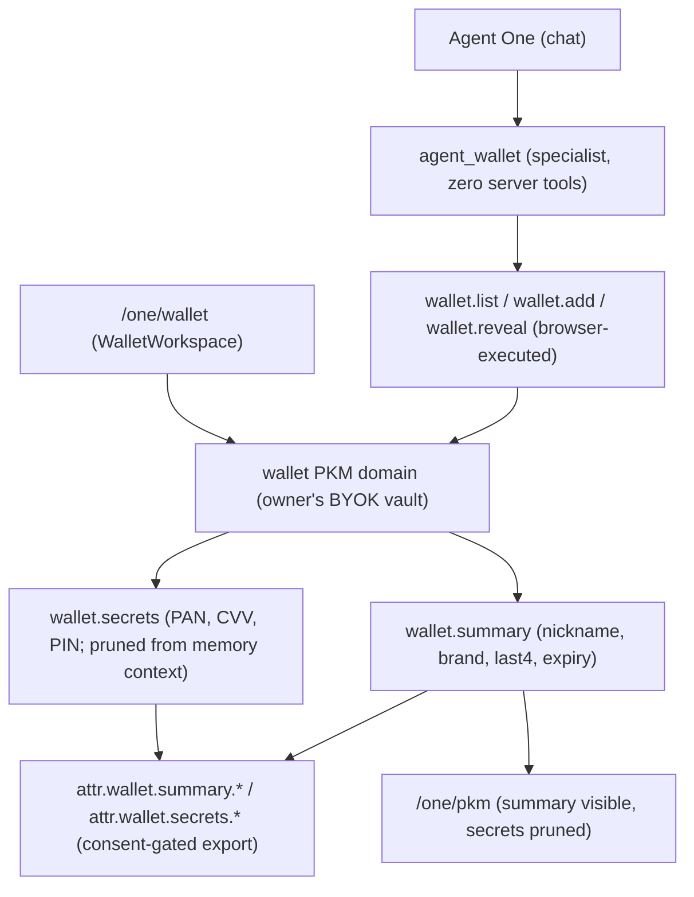

# Wallet (formerly Cards)

The Wallet is the owner's consent-scoped vault of payment cards inside the
private agent: a reserved PKM domain, a specialist agent, a route, chat
widgets, and two requestable scopes. It was designed as "payment cards" and
renamed to Wallet on 2026-09-02 (founder directive). Items inside it are still
called cards, because that is what they are; everything that names the feature
says Wallet. The **Wallet Profile** (public identity pass at `/one/wallet-card`,
`one_wallet_cards`, `ONE_WALLET_CARD_ENABLED`, `wallet-card-service.ts`) is a
different, older feature and was never renamed.

## Visual Map

```mermaid
flowchart TD
  one["Agent One (chat)"]
  wallet["agent_wallet (specialist, zero server tools)"]
  actions["wallet.list / wallet.add / wallet.reveal (browser-executed)"]
  route["/one/wallet (WalletWorkspace)"]
  vault["wallet PKM domain (owner's BYOK vault)"]
  summary["wallet.summary (nickname, brand, last4, expiry)"]
  secrets["wallet.secrets (PAN, CVV, PIN; pruned from memory context)"]
  scopes["attr.wallet.summary.* / attr.wallet.secrets.* (consent-gated export)"]
  memory["/one/pkm (summary visible, secrets pruned)"]

  one --> wallet
  wallet --> actions
  actions --> vault
  route --> vault
  vault --> summary
  vault --> secrets
  summary --> scopes
  secrets --> scopes
  summary --> memory
```

## Naming map

| Surface | Before | Now |
|---|---|---|
| PKM domain | `payment_cards` | `wallet` (`OWNER_MANAGED_RESERVED_DOMAIN_SLUGS`) |
| Sub-intents | `payment_cards.summary` / `payment_cards.secrets` | `wallet.summary` / `wallet.secrets` |
| Requestable scopes | `attr.payment_cards.summary.*` / `attr.payment_cards.secrets.*` | `attr.wallet.summary.*` / `attr.wallet.secrets.*` |
| Static scope | `agent.cards.manage` (`AGENT_CARDS_MANAGE`, "Cards Management") | `agent.wallet.manage` (`AGENT_WALLET_MANAGE`, "Wallet Management") |
| Specialist agent | `agent_cards` (`agents/cards/agent.yaml`, LlmAgent `cards`, `_build_cards_agent`) | `agent_wallet` (`agents/wallet/agent.yaml`, LlmAgent `wallet`, `_build_wallet_agent`) |
| Route / screen | `/one/cards` (`ROUTES.ONE_CARDS`, screen `one_cards`, beacon `native-route-one-cards`) | `/one/wallet` (`ROUTES.ONE_WALLET`, screen `one_wallet`, beacon `native-route-one-wallet`) |
| Gateway actions | `route.one_cards`, `cards.list` / `cards.add` / `cards.reveal` | `route.one_wallet` ("Open Wallet"), `wallet.list` / `wallet.add` / `wallet.reveal` |
| Feature flags | `ONE_PAYMENT_CARDS_ENABLED`, `NEXT_PUBLIC_ONE_PAYMENT_CARDS_ENABLED` | none: renamed to `ONE_WALLET_ENABLED` / `NEXT_PUBLIC_ONE_WALLET_ENABLED`, then removed on 2026-09-02 when the Wallet shipped unconditionally |
| Kill switch | `HUSHH_CARDS_AGENT_DISABLED` | none: the renamed switch was declared in the manifest but never read, and the claim was removed |
| Backend validation | `payment_card_validation.py` (`validate_payment_card_envelope`) | `wallet_card_validation.py` (`validate_wallet_card_envelope`) |
| Frontend service | `lib/services/payment-cards-service.ts` (`PaymentCardsService`, `PAYMENT_CARDS_DOMAIN`) | `lib/services/wallet-service.ts` (`WalletService`, `WALLET_DOMAIN`) |
| Frontend types | `PaymentCardSummary`, `PaymentCardSecrets`, `PaymentCardInput` | `WalletCardSummary`, `WalletCardSecrets`, `WalletCardInput` |
| Components | `components/cards/cards-workspace.tsx` (`CardsWorkspace`) | `components/wallet/wallet-workspace.tsx` (`WalletWorkspace`, `WALLET_PAGE_SIZE`) |
| Chat widget state | `AgentCardWidget`, `cardWidgets` | `AgentWalletWidget`, `walletWidgets` |
| Chat sources | `agent_chat_cards_add` | `agent_chat_wallet_add` |
| Voice contracts | `cards-widgets.voice-action-contract.json`, `app/one/cards/page.voice-action-contract.json` | `wallet-widgets.voice-action-contract.json`, `app/one/wallet/page.voice-action-contract.json` |
| Test ids | `one-cards-*` | `one-wallet-*` (`one-wallet-workspace`, `one-wallet-list`, `one-wallet-search`, `one-wallet-no-match`) |
| Rehearsal | `verify-reviewer-payment-cards.mjs` | `verify-reviewer-wallet.mjs` |
| Memory | domain hidden (`INTERNAL_PKM_DOMAINS`) | domain visible as `wallet`; the `secrets` branch stays pruned |

Unchanged on purpose: `card_<uuid>` segment ids, `cardId` / `last4` / `brand`
fields, `secure-card-add-form.tsx` and `secure-card-reveal.tsx` (they render
one card), `lib/wallet/card-validation.ts` (it validates a card), and every
identity-pass identifier listed above. The chat's card-number paste guard was
generalized into the Secrets guard (`lib/pkm/secret-span-guard.ts`): a card
number sent in chat is kept in Secrets and offered to Wallet, never blocked and
never sent to the model (`consent-protocol/docs/reference/personal-knowledge-model.md`,
"The Secrets area").

## Where the pieces live

- Domain contract and sharing policy: `consent-protocol/hushh_mcp/services/domain_contracts.py`
- Scope policy and display metadata: `hushh_mcp/consent/pkm_scope_policy.py`, `hushh_mcp/consent/scope_helpers.py`
- Agent manifest and roster insertion: `hushh_mcp/agents/wallet/agent.yaml`, `hushh_mcp/one_adk/agent_tree.py` (unconditional)
- Store-domain guard: `api/routes/pkm_routes_shared.py` (`_enforce_wallet_write_policy`)
- Route, tile, breadcrumb, screen: `app/one/wallet/page.tsx`, `lib/onboarding/one-capabilities.ts`, `lib/navigation/top-shell-breadcrumbs.ts`, `lib/voice/route-screen-derivation.ts`
- Chat integration: `components/agent/agent-chat-workspace.tsx` (`wallet.list` / `wallet.add` / `wallet.reveal` branches, the Secrets guard and its "Add this card to Wallet" offer)
- Deploy: nothing Wallet-specific. The feature carries no flag in any lane.

A rename must also cover string literals passed as ids: `_load_product_agent_manifest("wallet")`
and the LlmAgent `name="wallet"` were the two the first pass missed and they crashed boot.

## Wallet entry and card collection

Each visit to `/one/wallet` starts with the Wallet illustration and Continue,
without a duplicate Wallet page heading. Continue opens the workspace for that
visit; moving between its tabs does not replay the introduction. This is a
presentation step, not a persisted onboarding or consent gate.

Cards owns the animated collection, safe summary search, and the existing
explicit reveal/removal actions. An empty collection shows labelled demo
summaries; these never enter Wallet storage or invoke reveal/remove services.
Add opens the encrypted card-entry form directly. Save and Cancel return to
Cards, while switching tabs preserves and masks an unfinished draft. Vault lock
discards the form and revealed details. Chat and Secrets handoffs wait until
Continue, then use the existing card-entry flow.

The One dashboard preloads the same preprocessed WebP URL rendered by Wallet.
The illustration loads eagerly at high priority with an inline blur placeholder;
it does not wait for the card summary request or a server image transform.
Cold connections can still require an image download. The PNG remains the
source artwork.

## Card browser

The Cards tab uses `WalletCardBrowser` to coordinate an All overview, the existing
animated card collection, and a selected-card detail view. Cards open as a scroll-driven stack; Collapse cards switches to a compact deck and View all restores
a spaced list without overlapping detail links. A thumbnail strip outside the tab pager remains above the shared
bottom chrome; its plus action opens the existing Add form. Reduced-motion users
receive the same controls with a static list and instant selection.

An empty Wallet shows explicitly labelled demo cards with fictional numbers,
statements, activity, rewards, payment and autopay previews. These are presentation
records only: they are never inserted into saved Wallet cards or sent to payment,
consent, or vault services. Preview actions explain that no transaction or autopay
is performed. Saved-card selection remains metadata-only; the existing explicit
Show card details action owns decryption, and leaving Cards or selecting All
clears any revealed values.

The card thumbnail bar hides on downward page scrolling and returns on upward scrolling. Stopping alone does not reveal it; keyboard focus keeps its controls available.

### Add: photo-assisted entry

The Wallet Add tab keeps all fields on one screen. Scan card uses the native camera
or browser capture picker; Choose photo uses the device photo picker. Both prefill
an editable draft, never submit it. Existing manually entered name/expiry values
are preserved. CVV, PIN, issuing region and nickname remain manual.

Recognition runs locally with Tesseract.js. Worker, WASM and English language
assets are copied from locked npm dependencies by `hushh-webapp/scripts/prepare-wallet-ocr.mjs`
from Next config before development/build/export. Generated assets are ignored; no CDN, image
upload or OCR-result persistence is used. Native capture disables cropping and
gallery saving. Leaving Add, cancelling, or unmounting aborts the scan; the owned supervisor and nested OCR worker
are terminated after completion, failure or a 60-second timeout. Unsupported/ambiguous photos fall back to manual
entry. Existing validation and explicit encrypted WalletService submission remain
the sole save path. Native camera and bundled worker execution require device QA.

### Sharing: review and manage inside Wallet

Sharing shows real Wallet-specific requests and grants in card-style sections.
Review and Manage open in shared dialogs inside Wallet. Reviews disclose the
requester, exact summary/details category, wallet-wide coverage and chosen duration.
Individual decisions reuse `useConsentActions` and its canonical encrypted export;
full details require an unlocked vault and explicit approval. Revoke requires
confirmation and an exact request ID, never a scope-wide fallback. No sample
grants or card-specific permissions are invented. Reduced motion disables tile
lift while preserving all controls. Failed reads never appear as empty access.

The sharing guide and Requests/Shared with sections remain visible during reads.
Reads that exceed 15 seconds show retry rather than an indefinite spinner; late
results cannot replace a newer read. Recipient search and summary/details filters
only filter displayed rows, never alter grants or the overall access counts.

### Mail-aligned Wallet surfaces

Cards, Add and Sharing use the shared 820px workspace measure and Mail-style
feature surface tokens (white surface, blue accent tint, shared border, radius
and shadow). Desktop feature headings use the same 40px/800 foundation scale.
Physical card faces remain capped at 420px inside the wider Cards panel.

Wallet onboarding uses the full-resolution preloaded artwork without a blur
placeholder, centered with its title and Continue action. Stacked cards hide
their separate detail links while pinned and remeasure after expansion settles;
the card itself remains the details action. Sharing uses a labelled illustrative
card instead of the header counters; real access remains in the lists below.

Sharing filters update their explanatory content and scoped loading/empty
states immediately, then filter real records when available.
