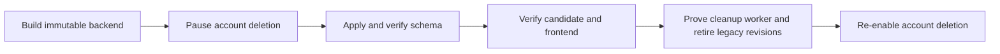

# Account deletion rollout and rollback

## Visual Map

Migration `201_account_deletion_tombstones.sql` and the tombstone-aware runtime
form one compatibility boundary. Applying the migration before the runtime is
necessary, but it is not sufficient on its own: a full deletion that was
already in flight before the DDL committed can finish without crossing either
root trigger, and a legacy account can lack one of the two root rows.

## Forward rollout authority gate

The release owner must complete this sequence for each environment:

1. Disable or gateway `DELETE /api/account/delete` on every serving revision.
2. Drain in-flight account-deletion requests and record that the request count
   is zero. Do not infer a drain from low traffic.
3. Apply migration 201 and verify both `BEFORE DELETE` root triggers on
   `actor_profiles` and `vault_keys`, plus every catalog-installed INSERT and
   changed-identity UPDATE guard. Verify the DDL event trigger is enabled so a
   later `CREATE TABLE` or `ALTER TABLE` cannot add an unguarded UID column.
   Confirm the versioned installer completed its hash-only
   `account_identity_presence` backfill and that exact UID lookup uses that
   table's primary-key index; the request path must not scan every UID column.
4. Shift 100% of traffic to a tombstone-aware bridge revision. If an old
   revision must remain temporarily, it must contain the same namespace-171,
   then namespace-198 lock and tombstone checks.
5. Provision a dedicated least-privilege Cloud Scheduler service account, pin
   its exact email and backend-origin OIDC audience on the runtime, and verify
   the enabled Cloud Scheduler job with
   `deploy/account-deletion/setup_cleanup_scheduler.sh`. The target must be the
   exact HTTPS `POST /api/account/deletion-cleanup/drain?limit=10` endpoint and
   must carry a Google-signed OIDC token. Never place a reusable credential in
   Scheduler headers or job metadata.
   The deploy identity also needs `logging.logEntries.list` so the release gate
   can require a fresh execution-log
   `type.googleapis.com/google.cloud.scheduler.logging.AttemptFinished` record
   for that exact job and URI with a concrete HTTP 2xx response. A changed
   `lastAttemptTime`, a missing HTTP status, or an earlier successful run is not
   completion evidence.
6. Run the two-connection stale-writer rehearsal. A writer waiting behind a
   deletion's namespace-171 lock must resume only after commit and fail with
   SQLSTATE `23514`; it must persist zero rows.
7. Re-enable account deletion only after steps 1-6 are evidenced.

Migration 201, its backend lifecycle runtime, and the web/native invalidation
UX must deploy as `scope=all`. The UAT scope resolver rejects a narrower manual
override whenever any account-lifecycle boundary file differs from either
serving service. Production backend deploys containing migration 201 are hard
blocked until the same fence, immutable bridge, completion-log, and drain
controls are implemented in the production workflow.

Before step 7, also prove that operational scripts cannot delete and recreate
`actor_profiles` or `vault_keys`. Migration 201 deliberately interprets either
root deletion as full-account erasure. `fix_partial_vault_rows.py` is therefore
inspection-only, and the local reviewer mirror must use in-place root upserts.

This rollout closes the cross-device lifecycle bug; it does not by itself
settle every legal-retention decision. Existing retention policies continue to
govern append-only or regulated evidence such as
`fabric_receipts`, `kai_funding_*`, `consent_audit`,
`consent_audit_receipts`, and
`internal_access_events`, and the UAT-only `hushh_tech_link_events` identity
ledger. Their documented retention/redaction policy, rather than an incidental
cascade, controls whether they survive an account deletion. Although the
tamper-evident receipt chain remains retention-controlled,
`consent_audit_receipts.subject_id` is a raw account UID: migration 201 must
backfill it into `account_identity_presence` and reject new receipts for a
tombstoned UID so retention cannot become account resurrection.

The UAT schema also contains personal-agent/BYOC tables that are still parked
and flag-off in the release migration tree. Account deletion must never erase
their provider coordinates and leave an external agent or customer-cloud setup
running. There is no in-repo consumer for the parked
`personal_agent_deletion_tombstones` design. Therefore any BYOC job, lifecycle
event whose registry is missing, provisioned/non-unprovisioned registry status,
external provider coordinate, or existing deprovision intent blocks account deletion with
`ACCOUNT_DELETION_EXTERNAL_RESOURCES_REQUIRE_DEPROVISIONING` and rolls back the
whole database transaction. Only a registry proven `unprovisioned` with no
external coordinates may be removed directly. This remains a no-ship gate for
enabling personal-agent/BYOC provisioning: an owned provider deprovisioner and
independent absence proof must land before deletion can safely report success
for a provisioned account.

Live-catalog erasure coverage also includes
`one_location_visibility_preferences`,
`one_location_visibility_exclusions` (both owner and excluded-user roles),
`kai_location_referrals` (owner, referrer, and candidate roles), and the
personal-agent tables above. `hushh_tech_link_events` is deliberately excluded
from this transactional delete set because its append-only trigger requires an
explicit redaction design under the existing retention policy. This change does
not introduce a new release-approval authority; the normal release SOP applies.

The in-process 60-second cleanup loop is a latency optimization only. Cloud Run
may freeze an instance after a response, so the external scheduler is the
durability path for pending Firebase deletion/quarantine work.

## Required monitoring

Alert the IAM on-call when any of these conditions occurs:

- the `account-deletion-cleanup-*` scheduler is disabled or its last attempt
  failed;
- `account_deletion.cleanup_scheduler_failed` appears in Cloud Logging;
- a due tombstone remains in `pending`, `retry_pending`, or `quarantined` for
  more than ten minutes;
- a `running` claim remains older than the five-minute lease-reclaim window;
- `quarantine_incomplete` is returned by the synchronous cleanup attempt.

The rollout evidence must include scheduler state, exact target URI and method,
exact OIDC service-account email and audience, oldest due-intent age, counts by
cleanup status, and a successful bounded drain. Raw Firebase UIDs must not
appear in evidence.

## Rollback authority gate

Once any tombstone exists, an arbitrary pre-201 traffic rollback is forbidden.
An old verifier ignores tombstones, and unchanged-UID UPDATE guards intentionally
permit cleanup mutations; routing deleted identities to that code can recreate
state outside the intended bridge.

A rollback is allowed only when one of these paths is proven:

- route 100% of traffic to a bridge revision that enforces tombstone lookup and
  the namespace-171 then namespace-198 lock order; or
- disable account deletion, prove every tombstone with a retained Firebase UID
  is deleted or both disabled and refresh-token-revoked, prove no cleanup claim
  is running, and keep migration 201 plus its write guards installed.

Never drop a non-empty tombstone table. A code rollback leaves the additive
schema and triggers in place. Schema rollback is limited to an unused migration
whose table is still empty and follows the checked rollback script.

## Lost-response recovery

The session-status and authenticated lifecycle checks acquire shared UID locks
in namespace order 171 then 198 before reading the tombstone. If an exclusive
deletion barrier remains held longer than the bounded lookup window, the API
returns `423 AUTH_ACCOUNT_DELETION_IN_PROGRESS` with `Retry-After: 2`, not a
generic availability error. Web and native clients must retain their privacy
gate and boundedly re-probe on that state; they must never release cached Vault
content while it is unresolved.

Clients treat a network failure after submitting deletion as an uncertain
outcome. Immediately before `DELETE /api/account/delete`, retain the exact
UID-bound Firebase token used for that operation in memory. Probe
`GET /api/account/session-status` with that captured token first. Only if the
result remains inconclusive and Firebase can still issue a token should the
client force-refresh once and re-probe; a post-delete fresh token may be
impossible. `AUTH_ACCOUNT_NOT_FOUND` from either status probe or a repeated
delete is a successful terminal deletion outcome: clear local user state and
return to login. Any other lost or uncertain response remains fail-closed: a
momentary `active` probe can be a pre-commit database snapshot while deletion
is still finishing, so the client must clear local user state and must not offer
automatic Retry. This avoids requiring a now-erased `VAULT_OWNER` token to
repeat an already-committed destructive operation or racing that commit.
