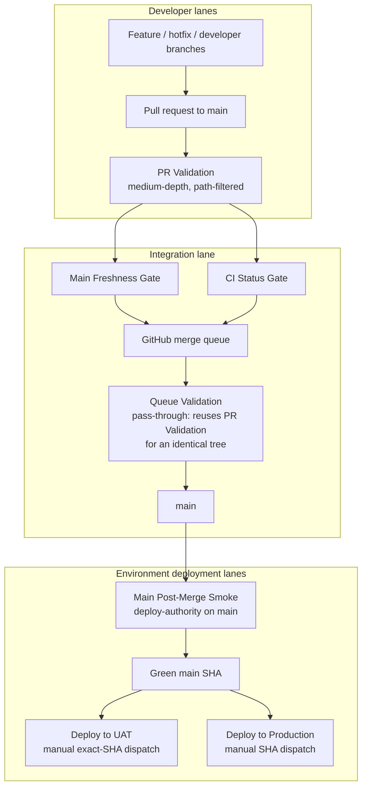

# CI Configuration Reference


## Visual Map



This document describes the queue-first CI model and how to stay aligned with it so code changes do not fail CI or deploy from the wrong authority gate. Run the local mirror before opening or updating a pull request, and before commits that touch core authority surfaces.

The canonical state-changing operator procedure is the
[Admin merge and release SOP](../../../.codex/skills/repo-operations/references/admin-release-sop.md).
This page defines CI behavior; it does not redefine Admin bypass or deployment
authority.

**Workflow files:** [.github/workflows/ci.yml](../../../.github/workflows/ci.yml), [.github/workflows/queue-validation.yml](../../../.github/workflows/queue-validation.yml), [.github/workflows/main-post-merge-smoke.yml](../../../.github/workflows/main-post-merge-smoke.yml)  
**Pre-PR mirror:** [`./bin/hushh codex pre-pr`](./cli.md)  
**Underlying local lane:** [`./bin/hushh ci`](./cli.md)  
**Orchestrator:** [scripts/ci/orchestrate.sh](../../../scripts/ci/orchestrate.sh)

Canonical pre-PR command:

```bash
./bin/hushh codex pre-pr
```

This command runs the same blocking local CI surface that feeds GitHub `PR Validation` and `CI Status Gate`. Use `./bin/hushh codex pre-pr --include-advisory` only when you intentionally want the wider non-blocking readiness lane too.

## Monitoring Rule

After any merge to `main`, bypass merge, deploy trigger, or manual workflow dispatch, keep monitoring the resulting GitHub workflow chain until it reaches a terminal state.

Minimum expectation:

1. watch the immediate `PR Validation`, `Queue Validation`, or dispatched workflow
2. if `main` goes green, watch `Main Post-Merge Smoke`
3. if a UAT deployment was explicitly requested, dispatch `Deploy to UAT` for that same green `main` SHA and watch it to terminal state
4. report the exact failing workflow, job, and step if anything fails
5. do not stop at "triggered" or "queued"
6. if the failure is within the CI/deploy/policy surface, move into fix-and-rerun mode until the change is green or a hard blocker is identified
7. when the run is expected to outlive the current chat turn, start the persistent watcher instead of relying on manual follow-up
8. when Codex initiated the merge or queue action, continuing this watch is mandatory; needing a user reminder to resume monitoring is process drift

UAT Cloud Run provenance is a release blocker. The deploy workflow stamps each backend/frontend revision with `HUSHH_DEPLOY_ENV`, `HUSHH_DEPLOY_SOURCE`, `HUSHH_DEPLOY_SHA`, and `HUSHH_DEPLOY_RUN_ID`, then verifies live traffic with [scripts/ci/verify-cloudrun-revision-provenance.py](../../../scripts/ci/verify-cloudrun-revision-provenance.py). A revision that is unlabelled, manually deployed, or built from a different SHA is classified as `deploy_authority_drift` and must not keep UAT traffic.

Codex-first PR watcher:

```bash
./bin/hushh codex ci-status --watch
```

Use this command first for active pull-request checks because it classifies failing jobs into the right owner skill and points to the next workflow pack before dropping to raw `gh run` inspection.

Merge-queue rule:

If Codex triggers `gh pr merge`, `gh pr merge --auto`, or any action that places a PR into merge queue, that is not completion. Codex must confirm the queue entry, then continue monitoring the authoritative workflow chain until:

1. `Queue Validation` reaches terminal state for the merge candidate
2. if the PR lands, `Main Post-Merge Smoke` reaches terminal state for the landed `main` SHA
3. only stop earlier when the user explicitly asked for queue placement rather than landed completion
4. if Codex triggered the merge path, it owns this monitoring step through terminal completion and should not pause after the queue accepts the PR

The repository-level `allow_auto_merge` setting must stay enabled. On a merge-queue repository, GitHub CLI uses that setting to enqueue PRs whose requirements are still settling; disabling it can make a validated maintainer PR fail with `enablePullRequestAutoMerge` before the queue is reached. This is not a validation bypass: `CI Status Gate`, merge queue validation, and `Main Post-Merge Smoke` remain mandatory.

Codex-first RCA surface:

```bash
./bin/hushh codex rca --surface uat --text
./bin/hushh codex rca --surface runtime --text
./bin/hushh codex rca --surface ci --text
```

Use this command when the failure is already on a core authority surface and the next step is classification, not generic monitoring. It preserves structured artifacts and keeps helper-only drift advisory unless it masks a runtime, deploy, DB, or semantic verification failure.

**Read `unevaluable_checks` before any blocking classification.** The runner reports three
states, not two: `healthy`, `blocked`, and `unevaluable` (exit `0`, `1`, `2`). An entry under
`unevaluable_checks` means a check could not run at all, so nothing was verified either way, and
it names the domain class it would otherwise have been blamed for. Never remediate a domain class
that came from an unevaluable check.

Why this matters, measured 2026-08-29: the uat surface reported `db_contract_drift` and
"Resolve DB release-contract drift before treating the surface as deployable" because
`verify_runtime_db_contract.sh` died at `import asyncpg`. The database contract was fine. In the
same run the semantic verifier died at `import dotenv` and produced *no* classification, so a
crashed release check read as a clean one, and the `ci` surface reported `core_ci_failed` for an
exit code of 143, which is SIGTERM: CI had not failed, CI had been killed. (The check it killed, `verify-runtime-config-contract.py`, was measured at 486s under heavy load; it scans every tracked file against 23 patterns.) Sub-reports now land
in `tmp/rca/<surface>/` (gitignored) instead of a temp directory that evaporated before anyone
could open the path the runner printed.

Canonical watcher:

```bash
scripts/ci/watch-gh-workflow-chain.sh --run-id <ci-run-id> --follow-workflow "Main Post-Merge Smoke"
```

Local daemon form:

```bash
scripts/ci/watch-gh-workflow-chain.sh --run-id <ci-run-id> --follow-workflow "Main Post-Merge Smoke" --daemonize
```

For deploy-only monitoring:

```bash
scripts/ci/watch-gh-workflow-chain.sh --run-id <deploy-run-id> --daemonize
```

The watcher logs to `tmp/devops-watch/`.

---

## Fundamental Blocking Policy

To prevent CI check-sprawl, only these queue/PR checks are hard-blocking by default:

1. `scripts/ci/secret-scan.sh`
2. web validation through `scripts/ci/web-core-check.sh`, `scripts/ci/web-targeted-check.sh`, and `scripts/ci/web-full-suite-check.sh` (`web-full-check.sh` is the first and last in sequence)
3. `scripts/ci/protocol-check.sh`
4. `scripts/ci/integration-check.sh`

Web validation is intentionally split:

1. PRs run `web-core` for install, preflight, docs/design contracts, typecheck, lint, and the required Next production build.
2. PRs run `web-targeted` for deterministic changed-path contract packs such as voice gateway, cache, analytics, routes/surface map, phone verification, and Capacitor static parity. The job (`Web Targeted Contracts (node)` / `(browser)`) is a two-leg matrix: `WEB_TARGETED_PART=node` runs the Vitest and verifier packs without downloading a browser, and `WEB_TARGETED_PART=browser` runs the Playwright packs with `PLAYWRIGHT_WORKERS=3` (the Playwright config's CI worker count; one when unset). Each pack is classified by whether its npm script reaches `playwright`, so the legs partition the matched packs; a local run (`all`) still runs every pack. `scripts/ci/test_web_ci_lane_partition.py`, run by the governance check, proves the partition against the real script.
3. PRs run `web-full-suite` (job `Web Full Suite (Vitest)`) for the whole Vitest suite (`npm run test:ci`, ~9,700 tests) plus the voice gateway, One Voice, surface-map, Capacitor static-parity and Capacitor plugin-contract checks. It runs in parallel with `web-core` as three Vitest shards (`WEB_FULL_SUITE_SHARD=<i>/3`, `vitest --shard`, jobs `Web Full Suite (Vitest) 1/3` to `3/3`); shard 1 also runs the contract verifiers, once. `CI Status Gate` reads the matrix's aggregate result, which is `success` only when every shard succeeded, and requires it to have **succeeded** (not merely not failed) whenever the frontend filter matches. Until 2026-09-26 this suite ran only in `Queue Validation`, which nothing merged through, so it gated no merge.
4. `web-full` is `web-core` followed by `web-full-suite`, for local and exhaustive runs. The legacy `web` stage remains an alias for `web-full` so older local wrappers keep their exhaustive behavior.

Fail-fast contract:

1. Cheap authority checks run before expensive web/protocol/integration lanes:
   secret scan, DCO/base-policy where applicable, branch freshness, path
   resolution, and repo governance.
2. The `Preflight Gate` fails before Next.js, full protocol, or integration
   runners start when one of those authority checks is already failed.
3. This intentionally saves CI minutes on governance failures. The tradeoff is
   that green runs start heavy jobs only after preflight completes.

The local parity script mirrors the blocking pre-merge validation stages. On GitHub, `main` should require `CI Status Gate` as the blocking status check on PR and queue commits, block a pull request that is behind its base through `Base Freshness Gate` (named `Main Freshness Gate` in older text; it feeds `CI Status Gate`), trust `Main Post-Merge Smoke Gate` for deployment eligibility on the landed `main` SHA, and restrict queue bypass to the dedicated sanctioned owner cohort only.

### Protected pipeline surfaces

Core CI and deploy surfaces are sealed separately from blanket owner-review policy.

- PRs that change protected pipeline paths are allowed only for the sanctioned bypass cohort defined in [config/ci-governance.json](../../../config/ci-governance.json).
- This guard currently covers:
  - `.github/workflows/**`
  - `.github/actions/**`
  - `scripts/ci/**`
  - `deploy/**`
  - `config/ci-governance.json`
- Enforcement happens inside the blocking governance lane through [scripts/ci/verify-protected-pipeline-edits.py](../../../scripts/ci/verify-protected-pipeline-edits.py).
- This does not waive the required independent approval of the latest push on `main`; the separately governed review-bypass cohort remains explicit. It seals core pipeline and CI authority to the sanctioned maintainer cohort.

### PKM rollout blocker

Production rollout is blocked unless PKM compatibility stays green for supported stored-version paths. The blocking CI manifests now explicitly include:

1. frontend `__tests__/services/pkm-upgrade-orchestrator.test.ts`
2. backend `tests/test_pkm_upgrade_routes.py`

These are the minimum gates for:

1. missing-manifest compatibility
2. malformed/legacy manifest normalization
3. manifest-authoritative upgrade truth when index summaries lag behind
4. structured PKM failure metadata reaching the task center

Local/UAT release rehearsal should additionally run the Kai no-write PKM drill before production rollout:

1. automatic upgrade start from app entry after unlock
2. no-write dummy save validation for the Kai drill user
3. post-upgrade investor / RIA / consent smoke from [Kai Runtime Smoke Checklist](../kai/kai-runtime-smoke-checklist.md)

The canonical blocker for that broader surface is:

1. [scripts/ci/pkm-upgrade-gate.sh](../../../scripts/ci/pkm-upgrade-gate.sh)
2. [scripts/ci/resolve-uat-verification-plan.py](../../../scripts/ci/resolve-uat-verification-plan.py) is the single changed-SHA selector used by PR, queue, post-merge, and UAT lanes
3. `integration-check.sh` runs the PKM gate only when that selector finds a PKM upgrade, stored-shape, migration, or fixture change; selector-policy changes are covered by always-on classifier contract tests. Ordinary UI, consent, MCP, RIA, and provider changes keep their own focused checks without repeating the PKM cycle
4. a missing or unproven comparison base fails closed to the deterministic PKM/reviewer plan, never to implicit paid model calls
5. when `PKM_UPGRADE_RUNTIME_AUDIT_BASE_URL` is set for a selected PKM release, the same gate also runs the live Playwright investor / RIA / PKM audits against that runtime

Every selected plan is written as a `*-verification-plan` workflow artifact and
includes the changed files, each lane's `required`/`skipped` state, and its
reason. This is evidence only: authority checks, migrations, deployment
provenance, runtime health, and directly affected frontend/backend checks remain
mandatory regardless of the expensive-lane selection.

Live Gemini/Vertex candidate checks are opt-in, not ordinary CI gates. UAT
dispatches default `run_live_model_checks=false`; explicitly setting it to
`true` selects candidate-model readiness and synthetic PKM evaluation for a
backend deployment. Direct backend Cloud Builds (including production) default
`_VERIFY_MANAGED_VERTEX_RUNTIME=false`; an operator may explicitly set it to
`true`. Local PKM evaluation similarly requires
`PKM_UPGRADE_STRUCTURE_AGENT_EVAL=1`. Omitted evaluation is **skipped**, not a
model-quality pass. Mocked provider contracts, model configuration checks,
zero-loss preservation/rollback, authorization, schema, provenance and runtime
health remain mandatory. This does not disable the application's own voice
readiness or model calls caused by an explicitly exercised product journey.

## When CI Runs

| Trigger | Branches | Behavior |
|--------|-----------|----------|
| Pull request | All branches (`**`) | `PR Validation` medium-depth CI (path-filtered) |
| Merge queue | `main`, `integration/pr-train` | `Queue Validation` pass-through: reports `CI Status Gate` on the merge group only when its tree equals the PR head's tree and PR Validation passed on that head; plus `Base Freshness Gate` |
| Push | `main` | `Main Post-Merge Smoke` compact deploy-authority smoke |
| Manual | Any | `PR Validation` `workflow_dispatch` with scope: `frontend` \| `backend` \| `all` |

**Path filters:** `PR Validation` runs jobs only when relevant paths change (or when run manually with a scope). `Queue Validation` runs no lane of its own (see [The merge queue in practice](#the-merge-queue-in-practice)), and `Main Post-Merge Smoke` stays compact rather than path-filtered.

- **Frontend jobs** run when `hushh-webapp/**`, protected CI workflow files, `scripts/ci/orchestrate.sh`, or `scripts/ci/web-*.sh` change.
- **Backend jobs** run when `consent-protocol/**`, `packages/hushh-mcp/**`, protected CI workflow files, or any `scripts/ci/**` file **except** `scripts/ci/web-*.sh` change.
- **iOS native job** (`ios-native-check`) runs when the `ios` filter matches; that filter lists the web surfaces the XCUITests render alongside the native shell paths, and it is pinned by `consent-protocol/tests/test_ios_lane_path_filter_covers_native_test_surfaces.py`, so a native test that starts rendering a new web surface fails CI until the filter names it. Inside the job, Swift package resolution is prefetched in the background while the native web export builds, the simulator boots in the background after the web export (not during it, so it never competes with `next build` for the runner's memory) while resolution and compilation run, and the authoritative `xcodebuild -resolvePackageDependencies` runs after `cap sync`. There is no Swift package `actions/cache`: pull-request caches are PR-scoped, so it never restored on a new PR, and each ~4.5GB save evicted the shared npm cache from the repository's 10GB budget.
- **Integration job** runs when either frontend or backend paths change.

**How `scripts/ci/` is split (2026-09-26).** Each file schedules the lanes that
actually run it, instead of every lane:

| `scripts/ci/` file | Schedules | Why |
|---|---|---|
| `orchestrate.sh` | frontend and backend | dispatches every stage |
| `web-*.sh` (`web-common.sh`, `web-core-check.sh`, `web-targeted-check.sh`, `web-full-suite-check.sh`, `web-full-check.sh`, `web-check.sh`) | frontend | the only `scripts/ci/` files the web lanes run |
| every other file, including any added later | backend | covers the protocol, MCP and integration lanes (`protocol-check.sh`, `verify-protocol-*`, `hushh-mcp-package-check.sh`, `integration-check.sh` and what it calls) and the deploy scripts the protocol test suite exercises directly |

The backend side is written as `scripts/ci/**` minus `!scripts/ci/web-*.sh`, so
a new script is backend by default rather than scheduling nothing. The filter
step sets `predicate-quantifier: 'some-with-excludes'` for that `!` pattern;
filters without a `!` pattern behave exactly as before. The iOS filter uses
the same mechanism to leave out `hushh-webapp/components/onboarding/setup/**`,
which nothing the CI-run XCUITest renders imports.

Guards, both in the backend CI manifest:
`consent-protocol/tests/test_ci_path_filters_cover_lane_scripts.py` derives
which `scripts/ci/` files each path-filtered job runs (through
`orchestrate.sh <stage>` and everything those scripts reference, plus every
script the lane's own code names) and fails when one of them would not
schedule that job. `consent-protocol/tests/test_ios_lane_path_filter_covers_native_test_surfaces.py`
traces the XCUITest render path's imports and fails if it ever reaches
`components/onboarding/setup/`.

One gap is known: the guard runs in the backend lane, so a PR that changes
only `web-*.sh` does not run it. If such a PR makes a web script call a
non-web `scripts/ci/` file, the guard catches it on the next backend-scheduling
change, not in that PR. Add the called file to the frontend filter in the same
change.

### Duplicate-Run Policy

Feature and hotfix branches intentionally rely on `pull_request` CI only. `Base Freshness Gate` blocks a PR that is behind its base, and `main` then runs a smaller smoke bundle (`Main Post-Merge Smoke`) on the real landed SHA.

### The merge queue in practice

The `main merge queue` ruleset is active, but its bypass list holds the
governed maintainer cohort, and those maintainers land PRs directly. No PR has
entered the queue since 2026-09-01, the date of the last full `Queue
Validation` run, and that run's `web-full` step was red in each of its last six
runs. So the queue does **not** absorb stale-base risk; `Base Freshness Gate`
on the PR is what blocks a stale branch.

**Since 2026-09-26 the full Vitest suite gates every frontend PR** through the
`Web Full Suite (Vitest)` lane in PR Validation, and `Queue Validation` is a
thin pass-through rather than a second copy of CI.

Why it was not deleted: `main` requires the `CI Status Gate` check
([config/ci-governance.json](../../../config/ci-governance.json)) and the
merge-queue ruleset is active, so a PR placed in the queue needs a `CI Status
Gate` on its merge group or the entry times out and is dropped. Deleting the
workflow would turn the queue into a trap rather than retire it.

What the pass-through checks, in
[scripts/ci/verify-queue-entry-reuses-pr-validation.py](../../../scripts/ci/verify-queue-entry-reuses-pr-validation.py):

1. the merge group's head ref names one PR (`gh-readonly-queue/<base>/pr-<N>-<sha>`);
2. the merge group's git **tree** is identical to the PR head's tree, which holds
   exactly when the PR already contained its base and no other entry is queued
   underneath it. Identical trees are identical content, so PR Validation's
   verdict is a verdict on the merge group, not an approximation of it;
3. the latest `PR Validation` run on that PR head has a successful `CI Status
   Gate` job.

Anything else fails closed with the fix: update the branch, wait for PR
Validation, re-queue. `Base Freshness Gate` still runs on the merge group.
Merge groups that stack several entries are therefore rejected rather than
approximated; with `max_entries_to_merge: 1` that only costs a re-queue.

To retire the workflow outright, the founder would remove the merge-queue
rulesets (`main merge queue`, `integration pr train merge queue`) and set
`merge_queue_required: false` in `config/ci-governance.json` in the same change;
the workflow can then be deleted.

---

## Global Gates (Always Run)

| Gate | Purpose | Behavior |
|------|---------|----------|
| Secret Scan | Detect leaked credentials/tokens early | `gitleaks` OSS CLI scans the event commit range, blocks on open GitHub secret-scanning alerts, and reports Dependabot backlog through the GitHub API |
| Upstream Sync | Detect consent-protocol subtree drift against upstream | Advisory only; warnings are non-blocking |
| Main Freshness Gate (job name `Base Freshness Gate`) | Block a branch that is behind its base | Blocking on pull requests (`MAIN_SYNC_MODE: block`, feeds `CI Status Gate`) and on `merge_group` |
| CI Status Gate | Single required check for branch protection | Fails if any required job fails/cancels/times out; allows intentional `skipped` jobs, except that a lane whose paths changed (`Web Full Suite (Vitest)` for frontend, the iOS and Android native lanes) must have succeeded |

Operational note:

- `Upstream Sync` and `Main Freshness Gate` are different surfaces.
- `Upstream Sync` must summarize the actual `consent-protocol/` subtree state from `scripts/ci/subtree-sync-check.sh`.
- `Main Freshness Gate` only describes branch currency relative to `main`.
- Local pre-push keeps upstream sync opt-in for shipping speed. Use `./bin/hushh protocol check-sync` or `CONSENT_PRE_PUSH_SYNC_CHECK=1 git push`; CI remains the shared advisory evidence lane.

## Live GitHub Enforcement

Protected branches are expected to enforce the same CI contract documented here:

- repository setting
  - auto-merge enabled so `gh pr merge` can hand green PRs to merge queue instead of failing before queue placement
- `main`
- `1` independent approving review of the latest push (the governed bypass cohort is separate)
  - required status checks: `CI Status Gate`
  - strict/up-to-date checks enabled
  - conversation resolution required
  - merge queue enabled for `main`
- force-pushes disabled
- branch deletion disabled

The live GitHub setting can drift from the docs, so verify it directly:

```bash
./scripts/ci/verify-main-branch-protection.sh
```

Current live nuance:

- the repo uses branch protection for review, freshness, and conversation-resolution requirements
- the sanctioned bypass cohort should be limited to the approved owner set, without overlapping push-restriction lists
- that sanctioned cohort is intentional governance and should not be reported as drift when it exactly matches `config/ci-governance.json` and includes `kushaltrivedi5`

## Deployment environments

GitHub deployment environments are part of the release authority surface and should stay minimal:

- `uat`
  - no reviewers
  - no admin bypass
  - protected branches only
  - used by [`.github/workflows/deploy-uat.yml`](../../../.github/workflows/deploy-uat.yml)
- `production`
  - no reviewers
  - no admin bypass
  - protected branches only
  - used by [`.github/workflows/deploy-production.yml`](../../../.github/workflows/deploy-production.yml)

There should not be parallel legacy production environments carrying approval logic that the current workflows no longer use.

GitHub only records deployment history under an environment after a workflow job actually runs with `environment: <name>`. Older deploy runs from before that binding existed are not retroactively re-linked. If `uat` or `production` looks empty after environment cleanup, trigger one fresh deploy from a green `main` SHA to seed the canonical history.

Verify live environment governance with:

```bash
python3 scripts/ci/verify-deployment-environment-governance.py
```

### GitHub Alert Parity

The secret gate is intentionally stricter than raw regex scanning:

- local runs use authenticated `gh` access to compare against open GitHub secret-scanning and Dependabot alerts
- CI uses a dedicated repo secret such as `GH_SECURITY_ALERTS_TOKEN` so GitHub Actions can read the same alert surfaces
- the final blocking mode fails if either:
  - `gitleaks` finds a leak in the scanned commit range, or
  - GitHub still reports any open secret-scanning alerts
- open Dependabot alerts are currently advisory in CI; they are still reported in logs and should be managed as backlog, but they do not block unrelated merges

## Advisory Checks (Non-Blocking By Default)

1. `scripts/ci/docs-parity-check.sh`
2. `scripts/ci/subtree-sync-check.sh`
3. `npm run verify:investor-language`
4. Native build/smoke checks (`./bin/hushh native ios --mode uat`, `./bin/hushh native android --mode uat`) for native release lanes
5. `scripts/ops/verify-env-secrets-parity.py` for release preflight and deployment readiness; it fails closed when the Firebase Admin credential and public Firebase client configuration name different projects, without rendering either value
6. Broad full-suite pytest runs and Kai accuracy/compliance suites

Do not add new CI/parity scripts without replacing or consolidating an existing check.

## Lean Required Gate Model

The required pre-merge lane stays intentionally small:

1. secret scan
2. DCO signoff
3. governance drift (`docs verify`, Apache/license surface, skill lint)
4. release contract alignment (`./bin/hushh db verify-release-contract`)
5. changed-surface web/backend checks
6. cross-surface integration checks

Post-merge smoke remains the deployment eligibility gate for `main`.

Practical maintainer rule:

1. Use `git commit -s` for new branch commits that are headed to GitHub.
2. Run `./bin/hushh codex pre-pr` before opening or updating a PR; the workflow runs the local DCO signoff gate before the broader CI mirror.
3. If unsigned commits already exist on the branch, repair them before push with `git rebase --signoff <base>` or a clean signed squash onto `origin/main` when subtree sync or merge repair made the branch history noisy.
4. After subtree sync, branch merge, rebase, queue repair, or any other history-changing operation, rerun `bash scripts/ci/check-dco-signoff.sh origin/main HEAD` immediately before pushing.
5. If the last local edit touched `.codex/`, `docs/`, `config/`, or `scripts/`, rerun `bash scripts/ci/orchestrate.sh governance` even if an earlier `./bin/hushh codex pre-pr` was green.

### Local core mirror

`bash scripts/ci/orchestrate.sh core` is the fast local pre-push run: secret and governance, then protocol and web-core in parallel (separate Python and Node runtimes), then mcp-package and integration, which need the protocol stage's Python environment. Measured on 2026-09-26 it took 374 s, against about 1,126 s for every stage run serially. The browser layout packs (`web-targeted`, 429 s) and the full Vitest suite (`web-full-suite`) are not in the core mirror; GitHub Actions runs them and stays the authority. Set `CORE_SERIAL=1` to run protocol and web-core one after the other. `web-targeted` runs every matched pack and lists every failure instead of stopping at the first, so one broken pack no longer hides the next.

Tests follow the same economy: add a test only for a real regression, a trust boundary (with a negative control), or a public API or schema contract, and extend existing test files before creating new ones (`AGENTS.md`, Verification rules 5 to 8).

### Script Lifecycle Policy

1. Add a new CI/helper script only when it replaces or consolidates an existing one in the same PR.
2. Every CI/helper script must have a clear owner (`frontend`, `backend`, or `platform`) in PR notes.
3. Any CI scope expansion requires reviewer approval from the owning team.

## Branch Lanes

1. `integration/pr-train` is the intake branch for non-maintainer contributor and agent work; governed maintainers may open branches cut from `origin/main` directly to `main`. `main` remains the sole promotion authority for UAT and production.
2. UAT and production use a green `main` SHA with successful `Main Post-Merge Smoke`. Dev accepts an exact CI-green branch SHA through the [Dev Fast Lane](./dev-fast-lane.md).
3. UAT deploys only by an explicit manual dispatch of that green `main` SHA through `.github/workflows/deploy-uat.yml`.
4. Manual UAT dispatch is limited to the current
   `uat.manual_dispatch_users` cohort in `config/ci-governance.json`; do not
   transcribe actor names into this document.
5. Production deploys only through a manual SHA dispatch in `.github/workflows/deploy-production.yml`, and only actors listed in `production.manual_dispatch_users` may trigger it.
6. Manual UAT or production redeploys must use a SHA that is reachable from `origin/main` and already green in post-merge smoke.
7. Feature and hotfix branches may deploy to dev through its governed main-owned dispatch. UAT and production require promotion through `main`.

Deploy to UAT is expected to behave as a closed-loop release lane:

1. start from an explicitly chosen green `main` SHA
2. sync canonical secrets
3. capture last healthy revisions
4. deploy changed surfaces
5. verify runtime mounts and semantic behavior
6. retry once on transient readiness
7. roll back only the failing changed surface
8. publish release artifacts with revisions, reports, and final status

See [Branch Governance](./branch-governance.md).

---

## Required Versions (Must Match CI)

| Tool | CI Version | Local requirement |
|------|------------|-------------------|
| Node.js | 24 for web/Node lanes | Local preflight accepts 20+; use 24 to reproduce CI |
| Python | 3.13 | 3.13 (CI asserts exactly 3.13) |
| npm | latest | Use latest (script upgrades before run) |
| uv | pinned by workflow | install `uv` locally and use `uv sync --frozen --group dev` |

Using a different Node or Python locally can cause “pass locally, fail in CI” if behavior or dependencies differ.

---

## Frontend Checks (Web / Next.js)

**Working directory:** `hushh-webapp/`

| Step | Command / behavior | Fails CI? |
|------|--------------------|-----------|
| Validate files | `package-lock.json` exists and valid JSON; `next.config.ts` exists | Yes |
| Install | `npm ci` | Yes |
| Design system | `npm run verify:design-system` | Yes |
| Cache coherence | `npm run verify:cache` | Yes |
| Docs/runtime parity | `npm run verify:docs` | Yes |
| TypeScript | `npm run typecheck` | Yes |
| Lint | `npm run lint -- --max-warnings=${WEB_LINT_WARNING_BUDGET}` | Yes |
| Phone verification regression | `npm run verify:phone-verification` | Yes |
| Build (web) | `npm run build` (Next.js) | Yes |
| Security audit budget | `npm audit --json` + budget gate (`moderate/high/critical`) | Yes |
| Tests | `npm run test:ci` (the whole Vitest suite), in the `Web Full Suite (Vitest)` lane | Yes |

**Build env (CI):** `NEXT_PUBLIC_BACKEND_URL` and all six `NEXT_PUBLIC_FIREBASE_*` vars are set to placeholders in the workflow so the build does not depend on real secrets.

**Coding rules that affect CI:**

- Do **not** use `fetch("/api/...")` in components or pages; use the service layer (see [Architecture](../architecture/architecture.md)).
- ESLint must pass with zero warnings (`--max-warnings=0`).
- TypeScript must compile with no errors.

---

## Backend Checks (Python / FastAPI)

**Working directory:** `consent-protocol/`

| Step | Command / behavior | Fails CI? |
|------|--------------------|-----------|
| Validate files | `pyproject.toml`, `uv.lock`, generated `requirements*.txt`, and `tests/` | Yes |
| Install | `uv sync --frozen --group dev` plus `bash scripts/sync_runtime_requirements.sh --check` | Yes |
| Lint | `uv run ruff check .` | Yes |
| Type check | `uv run mypy --config-file pyproject.toml --ignore-missing-imports` | Yes |
| Security | `uv run bandit -r hushh_mcp/ api/ -c pyproject.toml -ll` | Yes |
| Tests | `bash scripts/run-test-ci.sh` (manifest-driven curated suites run in parallel with pytest-xdist, plus a whole-tree collection gate) | Yes |

**Parallel pytest (2026-09-26).** `consent-protocol/scripts/run-test-ci.sh` runs the manifest with
`-n auto --dist loadfile`: one worker per CPU, and every test in a file stays on
one worker in file order, so module-scoped fixtures behave as they do serially.
The script is the switch; there is no environment flag. `protocol-check` in CI
and the local `orchestrate.sh core` stage both reach it through
`consent-protocol/scripts/ci/backend-check.sh`. `tests/conftest.py` gives each
xdist worker its own `OFFLINE_DB_PATH` file so workers never share SQLite rows;
the Postgres-backed tests already create a uniquely named schema or database
per test.

Measured 2026-09-26 on a 16-core Mac shared with other agent sessions (so the
spread is load, not the suite): the full manifest serially took 599 s (6,388
passed, 203 skipped); three parallel runs each passed the same 6,388 with the
same 203 skipped and zero failures, in 186 s, 59 s and 103 s. The three
`ONE_COMMAND_TEST_DATABASE_URL` Postgres files, run concurrently against one
shared database three times, passed 57/57 each time and left no schema behind.
Before the switch CI spent 321 s in serial pytest (of a 7.8 min `Protocol
(Python)` p50). Enabling it surfaced one class of defect: two route tests
baked a module-level `uuid4()` into their parametrize ids, so every worker
collected different test ids and xdist refused to start. They now use a fixed
synthetic id.

If a test genuinely cannot share a machine with others, mark it and run it in a
second, serial pass inside `run-test-ci.sh`; do not skip it and do not add a
flag. None needed that as of this change.

Blocking backend manifest:

1. `consent-protocol/scripts/test-ci.manifest.txt`
2. Keep this manifest small and stable.
3. Full local repo checks are available through `./bin/hushh test`.
4. Kai accuracy/compliance remains manual through `./bin/hushh protocol accuracy`.

**Test env (CI):**  
`TESTING=true`, `APP_SIGNING_KEY`, and `VAULT_DATA_KEY` are set in the workflow (see [ci.yml](../../../.github/workflows/ci.yml)).

**Consent-token rule for automated tests:** Use fixture-issued VAULT_OWNER tokens from `consent-protocol/tests/conftest.py`. `consent-protocol/tests/dev_test_token.py` is debug-only and must not be required by CI.

**Config files:**

- **Ruff:** [consent-protocol/pyproject.toml](../../../consent-protocol/pyproject.toml) — `[tool.ruff]` and `[tool.ruff.lint]`. Target Python 3.13, line-length 100, selected rules (E, F, B, I, S), per-file ignores for tests and routes.
- **Mypy:** Same `pyproject.toml` — `[tool.mypy]`. Python 3.13, `warn_return_any`, `ignore_missing_imports`, overrides for `hushh_mcp.*` and consent/vault.

**Coding rules that affect CI:**

- Use **Python 3.13**-compatible syntax and types.
- Avoid ambiguous names (e.g. single-letter `l`) so Ruff doesn’t flag them.
- Optional args: use `Optional[T] = None`, not `T = None`, to satisfy mypy.
- Return types: avoid returning untyped `Any` from functions that declare a concrete return type; use `cast()` or correct types so mypy passes.
- New backend code under `consent-protocol/` is type-checked and linted; keep `api/` and `db/` aligned with mypy and Ruff.

### Capability-graph evolution gate

`uv run python scripts/generate_capability_graph.py --check` runs in the backend lane (`consent-protocol/scripts/ci/backend-check.sh`) and again through `npm run verify:one-voice` in the web lanes. It regenerates `contracts/kai/one-capability-graph.v1.json` from its sources and diffs the semantic nodes against the pull request base, not against `HEAD`: the predecessor is the committed graph at the merge-base with `origin/<base>`, where the base is resolved in this order: `--base-ref <ref>`, then `CAPABILITY_GRAPH_BASE_REF` (used verbatim), then `GITHUB_BASE_REF` and `WEB_TARGETED_BASE_REF` (bare branch names are prefixed with `origin/`), else `origin/main`. `protocol-check` and `web-full-suite-check` both export `CAPABILITY_GRAPH_BASE_REF=origin/<PR base>` over a full-history checkout; Queue Validation runs no lane and so resolves no base. Under CI the check fails closed when that base cannot be resolved. Locally, when no base ref can be resolved, it falls back to comparing against the graph committed at `HEAD` and prints a warning; that fallback only catches a change relative to your last commit, so run with a real base ref before relying on it.

When it fires, the error names the semantic ids with unacknowledged breaking changes. Do not edit the generated graph by hand. Either land a workflow migration with the owning workflow package, or add an exact-revision deprecation entry to `consent-protocol/hushh_mcp/agents/capability_graph_evolution.v1.json` whose `from_revision` is the base graph's top-level `revision`; broad or stale acknowledgements never suppress the gate. Then regenerate in dependency order (the agent registry if it changed, the capability graph, then the runtime topology index last, because it digests the others) and rerun the check with the same base ref CI will use.

---

## Integration Check (Route and Docs Contract)

**Runs when:** Frontend or backend paths change (or manual run with scope that includes either).

| Step | Command / behavior | Fails CI? |
|------|--------------------|-----------|
| Verify | `bash scripts/ci/docs-parity-check.sh` | Yes |

Route contracts must stay in sync between frontend expectations, backend (or proxy) routes, and the route/mobile docs. See [API Contracts](../architecture/api-contracts.md). If you add or change routes, update the contract and run the docs parity lane (or full local CI).

---

## Streaming Contract Gates

Canonical streaming is a production contract, not an implementation detail.

- Contract source: [Streaming Contract](../streaming/streaming-contract.md)
- Runtime pattern: [Streaming Implementation Guide](../streaming/streaming-implementation-guide.md)
- Vertex constraints: [Vertex AI Streaming Notes](../streaming/vertex-ai-streaming-notes.md)

Minimum checks for streaming changes:

- Frontend stream checks: `cd hushh-webapp && npm run test:ci` (includes streaming/parser suites)
- Backend stream/auth tests: `cd consent-protocol && pytest tests/test_kai_auth_matrix.py`

---

## Running CI Locally

During implementation, use the focused checks for the changed contract. Before
an ordinary push, run the local core mirror once on the completed candidate:

```bash
scripts/ci/orchestrate.sh core
```

GitHub Actions remains authoritative for full web and browser validation. A
local pass does not prove hosted success. The dedicated pre-PR workflow and an
explicit full-mirror investigation still use the full command below; `codex
pre-pr` already calls it, so running both duplicates the same local suite.

```bash
./bin/hushh ci
```

This script, which also powers `./bin/hushh codex pre-pr`:

1. Validates required files (e.g. `package-lock.json`, `next.config.ts`, `pyproject.toml`, `uv.lock`, generated runtime artifacts, test files).
2. Checks Node (20+ minimum; use 24 for CI parity) and Python (3.13) and uses `uv` as the canonical backend toolchain.
3. Runs **frontend** checks: install, `tsc`, lint, Next build, audit-budget gate, curated test suite.
4. Runs **backend** checks: shared parity verification, install, Ruff, mypy, Bandit, curated test suite.
5. Runs **integration**: route/runtime contract verification.

To include advisory checks locally:

```bash
./bin/hushh ci --include-advisory
```

This advisory lane now includes the Codex operating-system audit:

```bash
./bin/hushh codex audit
```

To verify the live GitHub branch gate matches the documented minimum contract:

```bash
./scripts/ci/verify-main-branch-protection.sh
```

Fix failures in the selected local checks before pushing. Successful hosted
validation of the exact SHA remains required before deployment.

Secret-scan note:

- local and remote CI now both scan the relevant commit range by default
- use `GITLEAKS_LOG_OPTS=--all` only when you intentionally want a full-history audit

---

## Quick Reference: Commands That Must Succeed

| Area | Commands (from repo root) |
|------|----------------------------|
| Frontend | `cd hushh-webapp && npm ci && npm run typecheck && npm run lint -- --max-warnings=0 && npm run build && npm run test:ci` |
| Backend | `cd consent-protocol && uv sync --frozen --group dev && bash scripts/sync_runtime_requirements.sh --check && uv run ruff check . && uv run mypy --config-file pyproject.toml --ignore-missing-imports && uv run bandit -r hushh_mcp/ api/ -c pyproject.toml -ll && bash scripts/run-test-ci.sh` |
| Integration | `bash scripts/ci/docs-parity-check.sh` |
| Pre-PR mirror | `./bin/hushh codex pre-pr` |
| All | `./bin/hushh ci` |

---

## Strict Launch Gate (Release Cut)

One support/account-mail launch check (owner: `kushal@hushh.ai`): verify the
Workspace domain-wide delegation grant for the configured service-account client
ID includes `https://www.googleapis.com/auth/gmail.send`, then send synthetic
`[TEST]` welcome, passkey-add/remove, passphrase-change, and each support type
to the test inbox. Confirm a real Help & Feedback submission reaches
`one@hushh.ai`, its internal BCC reaches the support lead, and no report body
appears in application logs. Confirm one controlled UAT vault change produces
one notice without changing the vault outcome if mail fails. The public privacy
policy must explain support-message handling, the internal copy, and retention;
the in-app account-deletion control must be exercised. Check the managed backend
5xx and account-mail alert policies are enabled, target the verified
`kushal@hushh.ai` notification channel, and deliver a test incident. Missing
grant, policy wording, or alert delivery blocks public launch; source config
alone is not proof.

The first-welcome Firebase claim suppresses ordinary repeated sign-ins, but it
is not a distributed exactly-once mail ledger: simultaneous first-sign-in
requests or a failed claim update can duplicate an accepted welcome. Verify
the expected first-login traffic pattern or add durable idempotency before
claiming a strict at-most-once guarantee.

During launch, the owner records a short daily readout from the existing Cloud
Monitoring dashboard: backend 5xx/latency, support accepted versus failed or
uncertain, security-mail failure events, and open support issues. Follow the
existing production deploy traffic-rollback procedure for a bad application
revision; do not roll back a completed vault transition because email failed,
and do not blindly resend an uncertain Gmail submission.

Before creating a release tag/public rollout, run strict gate commands from repo root:

```bash
bash scripts/ci/docs-parity-check.sh
cd hushh-webapp && npm run typecheck
./bin/hushh native ios --mode uat
./bin/hushh native android --mode uat
cd hushh-webapp && npm run verify:cache
cd hushh-webapp && npm run verify:docs
python scripts/ops/verify-env-secrets-parity.py --project hushh-pda --region us-central1 --backend-service consent-protocol --frontend-service hushh-webapp
bash scripts/verify-pre-launch.sh
```

Blocking rule:
- Launch gate is strict-blocking. Any failing check or non-clean git tree is a release blocker.

## Production Deploy DB Governance Gates

The production deploy workflow (`.github/workflows/deploy-production.yml`) enforces additional DB governance before backend deploy:

1. Cloud SQL backup posture gate:
- validates Cloud SQL automated backups + PITR via `scripts/ops/cloudsql_backup_freshness_check.py`
- requires latest successful backup age within configured threshold (`BACKUP_MAX_AGE_HOURS`, default `30`)
- optional on-demand Cloud SQL backup via workflow input `run_predeploy_backup_job=true`

2. Migration governance + drift gate:
- checks migration filename monotonicity (`consent-protocol/db/migrations`)
- checks the production-pinned schema contract (`consent-protocol/db/contracts/prod_core_schema.json`)
- allows the repo to be ahead of production while production stays pinned to its approved migration floor
- checks live DB schema contract in read-only mode

3. Manifest artifact:
- emits a production migration release manifest with Cloud SQL backup evidence (backup id, completion timestamp)

UAT deploys use a separate latest-integrated contract:

- `consent-protocol/db/contracts/uat_integrated_schema.json`

The daily scheduled workflow `.github/workflows/prod-cloudsql-backup-posture.yml` runs the same backup posture policy and uploads a report artifact.

## Deploy Image Pipeline

Every deploy lane (`deploy-dev.yml`, `deploy-uat.yml`, `deploy-production.yml`)
builds each image once, pins it to an immutable `sha256` digest, and deploys that
digest. Nothing downstream re-resolves a mutable tag.

**Parallel web build.** A backend + frontend release used to run the web Cloud
Build (p50 263s, p90 333s over the last 30 UAT deploys) serially after the backend
image build, the migration fence, the migrations and the backend candidate
checks, although it depends on none of them. Now:

1. `Start frontend image build in parallel` submits
   `deploy/frontend-image.cloudbuild.yaml` with `--async`, right after the runtime
   secret sync (the build compiles `NEXT_PUBLIC_*` values from Secret Manager) and
   at the same moment as the backend image build.
2. `Wait for frontend image and pin its digest` runs where the frontend build used
   to start. `scripts/ci/await-prebuilt-image.sh` streams the build log, fails on
   any status but `SUCCESS`, resolves the tag once, and pins the executable
   linux/amd64 manifest with `scripts/ci/resolve-cloud-run-image.py`.
3. `Deploy frontend using Cloud Build` refuses to run without a well-formed
   `gcr.io/<lane project>/hushh-webapp@sha256:<64 hex>`, then submits
   `deploy/frontend.cloudbuild.yaml` with `_SKIP_IMAGE_BUILD=true` and
   `_IMAGE_REFERENCE=<digest>` and `--no-source` (no 59 MB upload for a
   deploy-only build). UAT and production then check the candidate revision runs
   exactly that digest.

The deploy, analytics smoke, promotion and rollback order is unchanged. Expected
saving: 3.5-4.5 minutes per backend + frontend release. `frontend_image_wait` in
the release status artifact records how long the lane still blocked on the web
build; near zero means it was fully hidden. Frontend-only and backend-only scopes
build only their own image. A deployment SHA older than this split has no
build-only config and keeps the combined serial build-and-deploy. The dev
auto-deploy Cloud Build trigger also keeps the combined path, which remains the
default of `frontend.cloudbuild.yaml`.

**Production backend promotion.** `deploy-production.yml` input
`backend_image_source` chooses the backend image:

- `build-from-source` (default today): rebuild at the SHA, as before.
- `promote-from-uat`: deploy the exact bytes UAT tested (about 2.7 minutes
  less). A preflight, before the secret sync, backup gate, fence and migrations,
  requires a healthy UAT release tag `deployed/uat/<sha8>-*` for exactly this SHA,
  reads the backend revision that tag recorded, and requires its `deploy-sha`
  label and `HUSHH_DEPLOY_SHA` to equal the SHA and its image to be
  `gcr.io/hushh-pda-uat/consent-protocol@sha256:...`
  (`scripts/ci/resolve-uat-verified-image.py`). A frontend-only UAT release does
  not verify a backend image and is refused. The build step then copies that
  digest into `gcr.io/hushh-pda/consent-protocol:prod-<sha>` and refuses a copy
  whose digest differs. Production Cloud Run always deploys from its own
  registry.

Promotion needs three read/copy bindings for the production deployer, listed in
[`deploy/iam/README.md`](../../../deploy/iam/README.md#production-image-promotion)
(`deploy/iam/grant_production_image_promotion.sh`). Until they exist, a promotion
run stops with a message naming the missing access. The founder flips the default
once they do.

The production **frontend** is never promoted: its image compiles
production-only public configuration (Firebase project, backend URL, GA4 id,
passkey RP ID, app env), and the build refuses a UAT analytics id. It is built
in `hushh-pda` with the parallel pattern above.

**Rollback.** Revert the change, or dispatch production with
`backend_image_source=build-from-source`. Cloud Run traffic rollback is
unchanged.

---

## Related Docs

- [Getting Started](../../guides/getting-started.md) -- Setup and local CI instructions.
- [API Contracts](../architecture/api-contracts.md) -- API contract verification.
- [Architecture](../architecture/architecture.md) -- Tri-Flow and service-layer rules.
- [Streaming Contract](../streaming/streaming-contract.md) -- Canonical SSE contract.

---

## Upstream CI (consent-protocol standalone)

The optional consent-protocol mirror has its own full CI pipeline at [hushh-labs/consent-protocol](https://github.com/hushh-labs/consent-protocol/actions). It runs on all branches plus merge queue and includes: secret scan, lint, typecheck, test, security scan, Docker build verification, and a final status gate.

The monorepo is authoritative. Its protocol and release gates determine merge
and deploy readiness. Mirror publication and mirror CI are optional maintainer
operations and must not delay a monorepo release or UAT deploy.

## The collection gate

`consent-protocol/scripts/run-test-ci.sh` runs `pytest --collect-only -q tests/` over the whole
tree before it runs the curated manifest. The manifest is an allowlist, so a
test file that is not listed is simply never executed, and a file that cannot
be IMPORTED is worse than that: pytest reports `no tests ran` for it, which in
CI is indistinguishable from a file that passed.

Measured 2026-09-11. `consent-protocol/tests/test_consent_lifecycle_chat.py`
imported a symbol deleted two days earlier. All 438 of its lines collected zero
tests and reported nothing, and a behavioural change to the proposal path drifted
away from an assertion in the same file with nothing going red.

It also distorts any whole-suite measurement taken against a branch that has
the broken file. A collection error aborts the entire run, so `pytest -q tests/`
returns a single error and executes nothing, and the run reads as one failure
rather than as no coverage at all. Compare failure counts only after confirming
the suite actually ran.

The gate is deliberately separate from the manifest: the manifest answers "which
suites gate a merge", and the gate answers "can every test file still be loaded".
