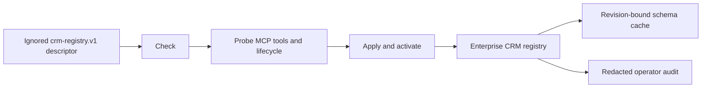

# CRM Registry Operations

## Visual Map

## Contract

`enterprise_crm_registry` and its exact `crm_operation_endpoints` rows are the
runtime source of truth. A future CRM is configuration, not a migration. The
only accepted input is an ignored local `crm-registry.v1` JSON descriptor whose
credentials section names environment variables; it never contains a secret.

Required descriptor sections are CRM identity, environment, primary object,
base and Streamable HTTP MCP endpoints, capability list, exact per-operation
tool names, request styles, fixed response paths, and synthetic probe arguments
when CRUD is declared.

## Commands

- `check` validates the descriptor, credential presence, URLs, exact operation
  set, and response-contract versions without network or database mutation.
- `probe` performs MCP `initialize`, `tools/list`, schema normalization, and the
  declared operation checks. CRUD runs create, ID read, update/readback, delete,
  and absent-ID verification with cleanup.
- `apply --activate` repeats the probe, encrypts runtime credentials,
  transactionally replaces the parent and exact operation rows, increments the
  configuration revision, invalidates old caches, writes a redacted audit
  event, prewarms the normalized schema, and activates last.
- `deactivate` increments the revision and marks the row inactive without
  deleting configuration or audit history.

Use `consent-protocol/scripts/ops/configure_crm_registry.py`. The old
`seed_crm_registry_row.py` filename is a deprecated delegate and contains no
database-write implementation.

## User lifecycle

The product lists every active CRM as `Set up`, `Connected`, or `Temporarily
unavailable`. Setup is optional. Lookup uses only the authenticated person's
server-verified email and phone. Exactly one match is bound; no match may lead
to a separately confirmed create; an ambiguous match is never bound. Once a
record is linked, read/update/delete resolve that owner binding server-side and
ignore or reject a browser-supplied record ID. Delete clears the binding.

## Cache and recovery

Postgres stores only normalized schema metadata, fresh for 24 hours and
display-only stale for at most seven days. Activation revisions invalidate old
schema/mapping keys. The device cache stores only safe registry and ready-schema
metadata. It never stores bindings, IDs, record values, intents, or edits.
