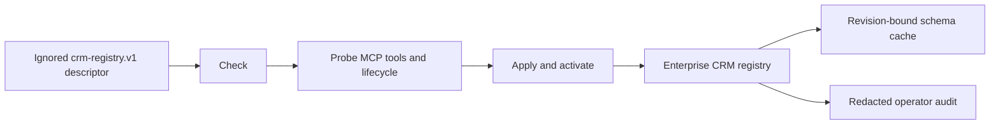

# CRM Registry Operations

## Visual Map

## Contract

`enterprise_crm_registry` and its exact `crm_operation_endpoints` rows are the
runtime source of truth. A future CRM is configuration, not a migration. The
only accepted input is an ignored local `crm-registry.v1` JSON descriptor whose
credentials section names environment variables; it never contains a secret.

Required descriptor sections are CRM identity, environment, primary object,
base and Streamable HTTP MCP endpoints, capability list, exact per-operation
tool names, request styles, fixed response paths, and synthetic probe arguments
when CRUD is declared.

For `crm-encrypted-fields.v1`, the descriptor also pins MuleSoft's recipient
key ID, public key, and fingerprint, plus the encrypted read/update tool
mappings. Those mappings may reuse the standard `read-crm-record` and
`update-crm-record` tools when MuleSoft supports the exact `encryptedFields`
wire contract. The operator verifies that the fingerprint is the SHA-256 digest
of that exact 32-byte X25519 public key. The mapping may not introduce a
plaintext fallback. Activation also requires a reviewed partner-conformance
evidence digest and explicit attestations that MuleSoft tested its strict tool
schema and schema-allowlists decrypted update keys.

## Schema-driven field interface

Field identity is detected, never hardcoded. Objects are shaped differently (a
Person Account exposes `PersonEmail`/`PersonTitle`; a Contact exposes
`Email`/`Title`; a custom object exposes its own keys), so the interface carries
whatever the object schema declares.

The pipeline is: detect the object schema (`object-schema`), let the
manifest-owned schema mapper bind each semantic slot (`email`, `phone`,
`firstName`, `lastName`, `fullName`, `address`) to the object's real field key,
then send those detected keys as typed `field: value` pairs on every CRUD call.
The mapping is cached by object type and schema fingerprint, so a CRM that
changes its schema re-detects and re-maps on next use with no code or config
change. That fingerprint cache is the graceful-update mechanism.

Both sides stay schema-agnostic:

- Hussh sends the detected field keys (for a Person Account create,
  `PersonEmail`, `Phone`, `FirstName`, `LastName`), never a generic alias.
- The gateway writes and reads exactly those keys and returns exactly the
  requested `returnFields`. It must not hardcode object-specific field names on
  create, nor inject a fixed default SELECT on read; a Contact-shaped default
  set (`Title, Department, Birthdate, Description`) breaks on Account.

A `create` therefore uses the typed `recordFields` request style, not
`basic_identity_fields.v1`. The latter sends generic `email`/`phone`/`lastName`
keys and delegates mapping to the gateway, which reintroduces per-object
hardcoding; keep it only for connectors whose gateway still requires that shape.
`crm_003` (Hussh Person Account) moves to the typed style in lockstep with the
gateway accepting typed keys. Do not flip it alone: the current gateway create
tool accepts only the generic parameters, so the typed payload would fail until
the gateway ships the typed-key contract. The staged change is a single
`requestStyle` edit on the `crm_003` create endpoint, applied with the gateway
change and re-probed before activation.

## Commands

- `check` validates the descriptor, credential presence, URLs, exact operation
  set, and response-contract versions without network or database mutation.
- `probe` performs MCP `initialize`, `tools/list`, schema normalization, and the
  declared operation and encrypted-fields tool checks. A cross-object registry
  probes every distinct object schema (for Hussh, `Account` and `Contact`)
  without reusing one object's record ID for another. This schema-only result
  cannot activate a write-capable row: activation fails closed until a safe
  cross-object fixture proves every declared operation. Same-object CRUD runs create, ID
  read, update/readback, delete, and absent-ID verification with cleanup.
- `apply --activate` repeats the probe, encrypts runtime credentials,
  transactionally replaces the parent and exact operation rows, increments the
  configuration revision, invalidates old caches, writes a redacted audit
  event, prewarms the normalized schema, and activates last.
- `deactivate` increments the revision and marks the row inactive without
  deleting configuration or audit history.

Use `consent-protocol/scripts/ops/configure_crm_registry.py`. The old
`seed_crm_registry_row.py` filename is a deprecated delegate and contains no
database-write implementation.

## User lifecycle

The product lists every active CRM as `Set up`, `Connected`, or `Temporarily
unavailable`. Setup is optional. Lookup uses only the authenticated person's
server-verified email and phone. Exactly one match is bound; no match may lead
to a separately confirmed create; an ambiguous match is never bound. Once a
record is linked, read/update/delete resolve that owner binding server-side and
ignore or reject a browser-supplied record ID. Delete clears the binding.

## Cache and recovery

Postgres stores only normalized schema metadata, fresh for 24 hours and
display-only stale for at most seven days. Activation revisions invalidate old
schema/mapping keys. The device cache stores only safe registry and ready-schema
metadata. It never stores bindings, IDs, record values, intents, or edits.
