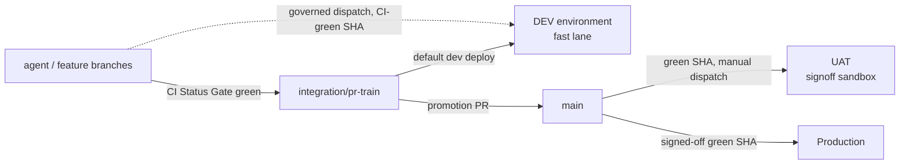

# Dev Fast Lane — the safe rule for agentic shipping

> `main` is the signoff lane (UAT → production). The dev environment is the agentic
> proving ground and never routes through `main`. This page is the canonical contract
> for how those two lanes stay fast AND correct at the same time.

Dev is a governed dispatch-only proving lane, never a promotion lane. Any decision
that lands a PR, promotes `main`, or deploys UAT/production follows the canonical
[Admin release SOP](../../../.codex/skills/repo-operations/references/admin-release-sop.md).

**The dev dispatch itself now follows that SOP's proof discipline too** (founder directive,
2026-08-06). Dev remains dispatch-only and still never promotes — what changes is that a
dev deploy is no longer an informal action. It carries the same evidence burden as any
other authority transition:

1. **Record the starting state** — current branch, `git status --short --branch` — and
   return to it afterwards. Do not create a convenience branch.
2. **Prove the exact SHA before dispatching.** It must be reachable from the requested ref
   *and* carry a terminal, successful `CI Status Gate`. Re-read the SHA immediately before
   the dispatch, not from a note taken earlier.
3. **Confirm the governed actor** (`scripts/ci/assert-governed-actor.py --surface dev`).
4. **Dispatch from `main` with `ref` set to the branch.** The workflow definition runs from
   `main`; the content deployed is `inputs.ref`. A dispatch made *from* the branch is
   refused in about a second, before a runner is assigned — and reads in the run list as an
   ordinary failure.
5. **Confirm the run actually started from live state.** A successful CLI response is not
   proof, exactly as §3A says of queue entry.
6. **Follow it to terminal state**, then verify the deployed revision genuinely carries the
   SHA — and, when the deploy is expected to apply migrations, that `schema_migrations`
   contains the rows it should. A green deploy is not evidence a migration ran.

The reason this tightened: a dev dispatch is where the parked migration lane applies, so
"it deployed" and "the schema moved" are different claims, and only one of them was ever
being checked.

## Visual Context

Canonical visual owner: [Operations Index](./README.md). Companion contracts:
[branch-governance.md](./branch-governance.md) (lanes),
[consent-protocol/docs/reference/dev-environment-setup.md](../../../consent-protocol/docs/reference/dev-environment-setup.md)
(environment).

## The rule in one screen



1. **`main` = signoff authority.** Only `main` SHAs reach UAT and production, exactly
   as before. UAT is where humans sign off `main` work before production. Nothing in
   the dev lane weakens this.
2. **Dev deploys the train, not `main`.** The default dev deploy target is
   `integration/pr-train` — the branch agent and contributor work already lands on.
   Dev is where the train is proven against real infrastructure *before* promotion to
   `main`, which is the whole point of having a dev environment.
3. **Escape hatch for speed:** a governed maintainer may dispatch a dev deploy from
   ANY ref, provided the exact SHA carries a green `CI Status Gate`. This lets a team
   validate a feature branch on real infrastructure without waiting for train intake.
4. **One correctness gate, reused — not a new one.** The dev deploy requires the same
   authoritative check that gates every merge in this repo (`CI Status Gate` on the
   exact SHA). No `Main Post-Merge Smoke` requirement (that is a `main` artifact), no
   extra review lane, no new approval ceremony.
5. **Dev never promotes.** There is no dev→UAT or dev→prod path. Promotion is only
   `integration/pr-train` → `main` → UAT signoff → production. Dev is evidence, not
   authority (no second decision-maker).

## Why this is safe (gate-by-gate correctness)

| Gate | Where it runs | What it guarantees |
| --- | --- | --- |
| Authoritative full-CI check on the exact SHA (`CI Status Gate` for PR heads, `Queue Validation` for train heads, `Main Post-Merge Smoke Gate` for main merges — any-of) | before every dev deploy | code is test-, type-, secret-, DCO-, and governance-clean — the same bar required to merge anywhere |
| Governed-actor dispatch (`assert-governed-actor.py --surface dev`) | dispatch time | only the maintainer cohort can deploy |
| Workflow definition pinned to `main` | dispatch time | the pipeline itself cannot be mutated from a feature branch; only the deployed *content* comes from the requested ref |
| Secret sync + runtime identity assertions | every deploy | dev cannot silently drift to wrong DB/CORS/identity |
| Migrations + `dev_minimum_schema.json` (policy: minimum, floor = UAT schema) | every backend deploy | dev may run AHEAD of UAT's schema (train migrations) but never behind it |
| Provenance labels + parity + semantic verification + auto-rollback | every deploy | a bad train deploy self-heals; dev state is always attributable to an exact SHA |
| Dev environment isolation (own project, DB, secrets) | always | nothing dev does can touch UAT or production data |

## What we deliberately did NOT add (overkill avoidance)

- **No new branch.** The train already exists, is already governed, and is already
  where agent work lands. A dedicated `dev` branch would be a second intake lane to
  keep fresh — pure maintenance cost.
- **No new review or approval step.** Landing on the train already requires review +
  merge queue + `CI Status Gate`. Dev deploy adds zero human steps to that.
- **No dev-specific CI workflow.** The existing PR Validation produces the
  `CI Status Gate` the dev deploy consumes.
- **No auto-deploy-on-push in the workflow itself.** Dispatch stays
  manual-by-governed-actor so workflow-lane dev deploys are always intentional and
  attributable. Auto-deploy exists as a separate GCP-native lane (below), added
  2026-07 at founder request when the cadence demanded it.

## GCP-native auto-deploy (Cloud Build triggers)

A companion lane for "commit to `main` and dev updates itself" without any
GitHub Actions dispatch: Cloud Build triggers in the dev project
(`dev-backend-autodeploy`, `dev-frontend-autodeploy`) fire on `main` pushes,
path-filtered per lane, and reuse the same shared build configs the workflow
deploys with. Backend runs migrations + the dev schema floor first. Setup and
gate trade-offs:
[dev environment runbook, Phase 6c](../../../consent-protocol/docs/reference/dev-environment-setup.md).
This lane trades the green-check assertion and verification/rollback layers
for speed — acceptable only because dev is disposable and promotes nothing.
UAT and production remain GitHub-Actions-only.

## Operating it

```bash
# Default: deploy the current train head to dev
# GitHub → Actions → Deploy to Dev → Run workflow (branch: main)
#   ref: integration/pr-train (default)   scope: auto

# Escape hatch: deploy a CI-green feature branch SHA
#   ref: feat/my-branch   sha: <exact green sha>   scope: auto
```

- Dev drift or a broken train schema? Dev is disposable by design: re-clone the DB
  from UAT per the
  [dev environment runbook](../../../consent-protocol/docs/reference/dev-environment-setup.md)
  and redeploy. Never "fix" dev by hand-editing infrastructure.
- Auditing dev at any time: `python3 scripts/ops/dev_environment_doctor.py`.

## Pod fleet

Dev is the only environment where per-user personal-agent pods run, because the registry
tables ship as parked, dev-only migrations
(`consent-protocol/db/migrations/parked/900_personal_agent_registry.sql`, applied through
`consent-protocol/db/dev_migration_manifest.json` and never through the release manifest).
Everything below is therefore a dev procedure; none of it applies to UAT or production,
where the tables do not exist at all.

### The registry table has never been created (verified 2026-08-06)

`personal_agent_registry` does not exist in the dev database, and every pod procedure
below is inert until it does. This is a deploy-history fact, not a code defect — the
mechanism is sound and simply has never been exercised:

- `db/migrate.py` runs from the **deployed SHA**, not from `main`. The dev-extra lane and
  the parked `900` / `905` migrations live only on the feature branch that introduced
  them, so a dispatch that deploys `main` or the `integration/pr-train` default runs a
  `migrate.py` with no dev-extra lane at all.
- The one dispatch that named the feature branch was made **from** that branch, and
  `Assert manual dispatch originates from main` refused it in one second, before a runner
  was even assigned. No step ran.

So the two halves have to be combined, and they are easy to conflate: **dispatch from
`main` (the workflow definition), with `ref` set to the feature branch (the content).**
Dispatching *from* the branch is refused; dispatching from `main` without a `ref` deploys
the train head and silently skips the migrations.

Two consequences worth knowing before debugging anything downstream:

- `_fleet_cap_reached` fails **open** when the count query raises (deliberately — a DB
  blip must not break agent setup for everyone), so a missing table does not surface as a
  cap error. It warns and continues.
- `/health/ready` reports `pod_fleet: "unknown"` rather than failing, by design. A green
  dev deploy and a healthy service therefore prove nothing about this table.

Partial application is the state most likely to mislead: `905` (which adds
`health_state`, `last_heartbeat_at`, `liveness_mode`) landed after `900`, so a deploy
carrying only the earlier commit would create the table **without** the columns the
liveness sweep reads. The sweep tolerates it — each pass is wrapped, so it logs
`pod_liveness.pass_failed` and continues rather than dying — but it will do so every 120
seconds indefinitely. Check `schema_migrations` for the `90x` rows, not just for the
table:

```sql
SELECT migration_id, status FROM schema_migrations WHERE migration_id LIKE '90%';
```

**Two sources of truth, and only one is authoritative.** The `personal_agent_registry` row
is the authority for provisioning state; a Cloud Run service is the compute that row points
at. They can legitimately disagree — most often because the backend is in plan mode. A pod
becomes a real, billable Cloud Run service only when `PERSONAL_AGENT_BACKEND=gcp` **and**
`HUSSH_GCP_BACKEND_LIVE` is on; with either unset,
`consent-protocol/hushh_mcp/services/gcp_backend.py` computes the deployment and returns a
plan-mode handle — never `live` — **without making any GCP call**, so `gcloud` shows nothing
while registry rows still read `provisioned`. Check the registry first, then the fleet.

**List the fleet.** The filter comes from the labels
`GcpBackend.render_deploy_config` actually sets — `app`, `hussh-space-id`, `hussh-tier`,
`hussh-env`, `hussh-purpose`. `app=hussh-one-pod` is the only one that is unconditional, so
filter on it and use the rest to narrow:

```bash
# Every pod in dev, with its cost labels
gcloud run services list --project hushh-pda-dev --region us-central1 \
  --filter="metadata.labels.app=hussh-one-pod" \
  --format="table(metadata.name, metadata.labels.hussh-env, metadata.labels.hussh-tier, status.url)"

# Fallback if your gcloud renders labels under a different key: pods are named
# one-pod-<lowercased HusshID>, per GcpBackend._service_name
gcloud run services list --project hushh-pda-dev --region us-central1 \
  --filter="metadata.name ~ ^one-pod-"
```

```sql
-- The authority. Run against the dev Cloud SQL instance.
SELECT status, count(*) FROM personal_agent_registry GROUP BY status ORDER BY 2 DESC;
```

A pod count that disagrees with the `provisioned` row count is the signal worth chasing.
`GET /health/ready` reports the same divergence as a `pod_fleet` check once
`POD_FLEET_HEALTH_SIGNAL_ENABLED` is on — see `consent-protocol/api/routes/health.py`. That
check is reported, never gating: broken pods are separate hosts and must never pull the
control plane out of rotation.

**Force-reap one pod.** The supported route is the owner-authorized API in
`consent-protocol/api/routes/one/personal_agent.py`: `POST /api/one/personal-agent/deprovision`
with that owner's `VAULT_OWNER` token. It revokes the standing `pkm.read` first, writes the
retained tombstone, then deletes the registry row — the ordering in
`consent-protocol/hushh_mcp/services/personal_agent_provisioning_service.py`. Prefer it
whenever it is available; it is the only route that leaves consent state correct. Note the
route returns 404 while `PERSONAL_AGENT_ENABLED` is off.

When the API is not reachable (feature flag off, no owner token), delete the compute
directly. This is the one sanctioned exception to "never fix dev by hand" above — a pod is a
disposable resource, not infrastructure config:

```bash
gcloud run services delete one-pod-<husshid-slug> \
  --project hushh-pda-dev --region us-central1 --quiet
```

Be honest about what that leaves behind: **only the compute is gone.** The registry row still
says `provisioned`, and the standing `pkm.read` grant for that user is still live. Close the
gap by re-running the API deprovision once the flag is back on — do not assume the reconcile
sweep will clean it up, because nothing starts that sweep today (see below). A hand-deleted
pod that nobody reconciles is exactly the divergence the `pod_fleet` health signal exists to
surface.

**Read the reconcile worker's logs.** The sweep that retries stalled provisions and reaps
idle pods is `consent-protocol/hushh_mcp/services/personal_agent_reconcile_worker.py`. Three
things about it matter operationally. **Nothing starts it automatically** — `server.py` has no
attach point for it, deliberately — so if you see no reconcile lines at all, the most likely
reason is that no one has wired it up in this environment. It sits behind its own kill-switch,
`PERSONAL_AGENT_RECONCILE_ENABLED`, on top of `PERSONAL_AGENT_ENABLED`, because reaping
**deletes compute**. And reaping removes only the host — the registry row, the HusshID, and
the A2A address survive, so the agent re-provisions on the owner's next activity.

It follows the log convention of `consent-protocol/hushh_mcp/services/revocation_worker.py`,
the worker it is modeled on: every line the loop emits is prefixed with the module's own
bracketed `_LABEL` constant, then a dotted `noun.verb` event name, then `key=value` pairs,
with one summary line per pass. Here `_LABEL` is `personal-agent reconcile`, so the whole
sweep is greppable on that one string:

```bash
gcloud logging read \
  'resource.type="cloud_run_revision"
   resource.labels.service_name="consent-protocol"
   textPayload:"[personal-agent reconcile]"' \
  --project hushh-pda-dev --limit 100 --freshness 1h --format="value(textPayload)"
```

| Line you will see | What it means |
| --- | --- |
| `Reconcile loop started (interval=…s)` | the sweep is scheduled and running |
| `not scheduled: reconcile sweep is disabled` | `PERSONAL_AGENT_RECONCILE_ENABLED` is off |
| `personal_agent.retried status=…` | a stalled row was re-driven through provisioning |
| `personal_agent.retry_failed status=…` | that retry raised; the row stays stalled |
| `personal_agent.reaped idle_since=…` | an idle pod's host was torn down |
| `personal_agent.reap_failed` | the host teardown raised; the pod is still billing |
| `Reconcile scan: N retried, M reaped, K failed of T in Xs` | the per-pass summary |
| *(nothing at all)* | either the loop was never started, or every pass is being skipped because a kill-switch is off — a skipped pass writes no line |

No owner identifier appears on any of those lines by design — only `hushh_id_present=true`
— so a log grep can tell you how many pods are stuck but never which person is behind one.
Use the registry query above for that, under the usual owner-gated access.

The sweep runs in the hub, not in a pod: `pod_mode` in
`consent-protocol/hushh_mcp/runtime_settings.py` keeps fleet-wide singleton workers out of
pods, so a fleet of pods cannot each run their own sweep against shared state.

**Manual rollback — and what it does and does not cover.** The lever is
`PERSONAL_AGENT_ENABLED=0` plus a redeploy. It genuinely does the main job — but read all
four points, because three of them are not what the shorthand implies.

1. **It does stop new provisioning.** Verified across every entry point: the phone-verify
   kickoff in `consent-protocol/hushh_mcp/services/actor_identity_service.py` returns
   `False` before scheduling anything; `provision()` and `register_pending()` in
   `consent-protocol/hushh_mcp/services/personal_agent_provisioning_service.py` raise
   `PersonalAgentDisabledError`; the owner-authorized routes in
   `consent-protocol/api/routes/one/personal_agent.py` return 404; and the reconcile
   sweep re-checks the same flag on **every pass**, returning a skipped report having
   touched nothing, so a flip mid-flight stops an already-running loop without a redeploy.
2. **It does leave existing pods alone** — the flag is read only on creation paths, so
   nothing deprovisions anything. But it is **not a freeze on the fleet.**
   `consent-protocol/api/routes/account.py` deliberately does **not** gate its
   personal-agent teardown on the flag (its own docstring says so), and routes through
   `resolve_compute_backend()`, so a user deleting their account still tears down a live
   pod with the flag off. That is correct — erasure must not be blockable by a feature
   flag — but "flag off" does not mean "nothing touches the fleet".
3. **It does not disarm the compute backend.** `PERSONAL_AGENT_BACKEND` and
   `HUSSH_GCP_BACKEND_LIVE` are independent switches
   (`consent-protocol/hushh_mcp/services/compute_backend.py`). Any caller that reaches
   `GcpBackend.provision` while those are live creates real billable services. For a
   belt-and-braces rollback, also clear `PERSONAL_AGENT_BACKEND` (resolves to the inert
   `NullBackend`) or `HUSSH_GCP_BACKEND_LIVE` (drops the backend to plan mode, no live GCP
   call). Turn `PERSONAL_AGENT_RECONCILE_ENABLED` off in the same pass: the master flag
   already stops the sweep today, but the reconcile switch is the one that keeps the reap
   half — the part that deletes compute — off if someone turns the master flag back on.
4. **The variable is not in any deploy config today.** A repo-wide search finds
   `PERSONAL_AGENT_ENABLED` in code, tests, and docs — and in no file under
   `.github/workflows/` or `deploy/`. It is unset in dev, so the surface is already off by
   default. Turning it **on** means adding it in two places: a `_PERSONAL_AGENT_ENABLED`
   substitution in `.github/workflows/deploy-dev.yml` and a matching `--set-env-vars` entry
   in `deploy/backend.cloudbuild.yaml`. Rollback is removing or zeroing it in the same two
   places and redeploying. Ordering matters: `deploy-dev.yml` drops any substitution the
   deployed SHA's cloudbuild does not declare, so the `deploy/backend.cloudbuild.yaml`
   change has to be present on the ref you deploy.

The redeploy is required only because a Cloud Run environment change is a new revision.
Inside a running process the flag is a live `os.getenv` read per call — `personal_agent_enabled`
is not cached — so it takes effect on the next call with no restart.

One in-flight edge, written here rather than left to be discovered: `provision()` checks the
flag on entry only, so a provision already past that line completes. If the redeploy drains
the old revision mid-provision, the row is left in `provisioning` with no pod — which is
precisely what the `pod_fleet` signal counts as a failed pod.

Verify the rollback landed:

```bash
# Fleet signal (when POD_FLEET_HEALTH_SIGNAL_ENABLED is on)
curl -s "$DEV_BACKEND_URL/health/ready" | jq '.checks'

# Feature state, straight from the runtime. This route is deliberately never
# flag-gated and never 404s, so it is honest with the flag off.
curl -s -H "Authorization: Bearer $DEV_ID_TOKEN" \
  "$DEV_BACKEND_URL/api/one/personal-agent/status" | jq '.featureEnabled'
```

Then confirm no new services appear: re-run the fleet list above and check the count is flat.

## The agentic-team principle behind the rule

Agents ship in minutes; humans sign off in hours. The pipeline must let those two
clocks run independently:

- the **fast clock** (agent iterations) gets a real hosted environment gated by
  exactly one automated correctness check that already exists,
- the **slow clock** (human signoff) keeps sole authority over what users touch,
  through the unchanged `main` → UAT → production lane.

Every gate in this repo must pay for itself in caught defects. When adding a step to
any deploy lane, name the defect class it catches; if an existing gate already catches
it, do not add the step.
