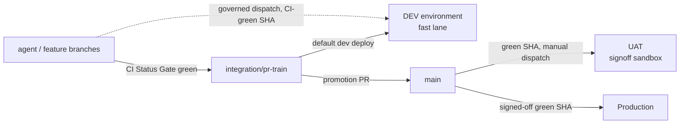

# Dev Fast Lane — the safe rule for agentic shipping

> `main` is the signoff lane (UAT → production). The dev environment is the agentic
> proving ground and never routes through `main`. This page is the canonical contract
> for how those two lanes stay fast AND correct at the same time.

Dev is a governed dispatch-only proving lane, never a promotion lane. Any decision
that lands a PR, promotes `main`, or deploys UAT/production follows the canonical
[Admin release SOP](../../../.codex/skills/repo-operations/references/admin-release-sop.md).

## Visual Context

Canonical visual owner: [Operations Index](./README.md). Companion contracts:
[branch-governance.md](./branch-governance.md) (lanes),
[consent-protocol/docs/reference/dev-environment-setup.md](../../../consent-protocol/docs/reference/dev-environment-setup.md)
(environment).

## The rule in one screen



1. **`main` = signoff authority.** Only `main` SHAs reach UAT and production, exactly
   as before. UAT is where humans sign off `main` work before production. Nothing in
   the dev lane weakens this.
2. **Dev deploys the train, not `main`.** The default dev deploy target is
   `integration/pr-train` — the branch agent and contributor work already lands on.
   Dev is where the train is proven against real infrastructure *before* promotion to
   `main`, which is the whole point of having a dev environment.
3. **Escape hatch for speed:** a governed maintainer may dispatch a dev deploy from
   ANY ref, provided the exact SHA carries a green `CI Status Gate`. This lets a team
   validate a feature branch on real infrastructure without waiting for train intake.
4. **One correctness gate, reused — not a new one.** The dev deploy requires the same
   authoritative check that gates every merge in this repo (`CI Status Gate` on the
   exact SHA). No `Main Post-Merge Smoke` requirement (that is a `main` artifact), no
   extra review lane, no new approval ceremony.
5. **Dev never promotes.** There is no dev→UAT or dev→prod path. Promotion is only
   `integration/pr-train` → `main` → UAT signoff → production. Dev is evidence, not
   authority (no second decision-maker).

## Why this is safe (gate-by-gate correctness)

| Gate | Where it runs | What it guarantees |
| --- | --- | --- |
| Authoritative full-CI check on the exact SHA (`CI Status Gate` for PR heads, `Queue Validation` for train heads, `Main Post-Merge Smoke Gate` for main merges — any-of) | before every dev deploy | code is test-, type-, secret-, DCO-, and governance-clean — the same bar required to merge anywhere |
| Governed-actor dispatch (`assert-governed-actor.py --surface dev`) | dispatch time | only the maintainer cohort can deploy |
| Workflow definition pinned to `main` | dispatch time | the pipeline itself cannot be mutated from a feature branch; only the deployed *content* comes from the requested ref |
| Secret sync + runtime identity assertions | every deploy | dev cannot silently drift to wrong DB/CORS/identity |
| Migrations + `dev_minimum_schema.json` (policy: minimum, floor = UAT schema) | every backend deploy | dev may run AHEAD of UAT's schema (train migrations) but never behind it |
| Provenance labels + parity + semantic verification + auto-rollback | every deploy | a bad train deploy self-heals; dev state is always attributable to an exact SHA |
| Dev environment isolation (own project, DB, secrets) | always | nothing dev does can touch UAT or production data |

## What we deliberately did NOT add (overkill avoidance)

- **No new branch.** The train already exists, is already governed, and is already
  where agent work lands. A dedicated `dev` branch would be a second intake lane to
  keep fresh — pure maintenance cost.
- **No new review or approval step.** Landing on the train already requires review +
  merge queue + `CI Status Gate`. Dev deploy adds zero human steps to that.
- **No dev-specific CI workflow.** The existing PR Validation produces the
  `CI Status Gate` the dev deploy consumes.
- **No auto-deploy-on-push in the workflow itself.** Dispatch stays
  manual-by-governed-actor so workflow-lane dev deploys are always intentional and
  attributable. Auto-deploy exists as a separate GCP-native lane (below), added
  2026-07 at founder request when the cadence demanded it.

## GCP-native auto-deploy (Cloud Build triggers)

A companion lane for "commit to `main` and dev updates itself" without any
GitHub Actions dispatch: Cloud Build triggers in the dev project
(`dev-backend-autodeploy`, `dev-frontend-autodeploy`) fire on `main` pushes,
path-filtered per lane, and reuse the same shared build configs the workflow
deploys with. Backend runs migrations + the dev schema floor first. Setup and
gate trade-offs:
[dev environment runbook, Phase 6c](../../../consent-protocol/docs/reference/dev-environment-setup.md).
This lane trades the green-check assertion and verification/rollback layers
for speed — acceptable only because dev is disposable and promotes nothing.
UAT and production remain GitHub-Actions-only.

## Operating it

```bash
# Default: deploy the current train head to dev
# GitHub → Actions → Deploy to Dev → Run workflow (branch: main)
#   ref: integration/pr-train (default)   scope: auto

# Escape hatch: deploy a CI-green feature branch SHA
#   ref: feat/my-branch   sha: <exact green sha>   scope: auto
```

- Dev drift or a broken train schema? Dev is disposable by design: re-clone the DB
  from UAT per the
  [dev environment runbook](../../../consent-protocol/docs/reference/dev-environment-setup.md)
  and redeploy. Never "fix" dev by hand-editing infrastructure.
- Auditing dev at any time: `python3 scripts/ops/dev_environment_doctor.py`.

### Proving information sharing between two people

`hushh-webapp/e2e/information-sharing-two-people.spec.ts` drives two browser contexts
against a running stack (localhost by default, or a dev preview via `BASE_URL`): the
primary reviewer owns the records, the counterpart asks for three of them for 72 hours,
and the proof walks allow (Consent Center, then the chat card the push would have
raised), decline, reveal, stop sharing and withdraw. Every state is read straight from
`/api/consent/center/list` with a per-read nonce, because the Next.js route keeps a
30 second hot cache per query string and bearer and nothing invalidates it on a decision;
a proof that trusted the page's own fetch could read the state from before the tap it
just made. It skips itself unless `REVIEWER_UID`, `REVIEWER_VAULT_PASSPHRASE`,
`REVIEWER_COUNTERPART_UID`, `REVIEWER_COUNTERPART_VAULT_PASSPHRASE`,
`E2E_COUNTERPART_PERSON_REF` (the owner's public person reference, the `/people/<ref>`
segment the counterpart opens), `E2E_REVIEWER_SIGNIN=1` and `E2E_INFORMATION_SHARING=1`
are all set; add `E2E_EXPECTED_GRANT_KEY` (a key present in the owner's first requested
item, never the value) to run the reveal step, and `E2E_LIVE_MODEL=1` to lift the
Flow B step where the counterpart asks through the private agent instead of the
composer (it needs a model that answers a turn, and it withdraws its own request
afterwards). One-time counterpart setup: create the second account in the same
environment, sign in, finish first-run setup so login no longer routes it to `/one/setup`,
and unlock its vault once so the wrapper exists. Nothing else on the account is needed:
the composer prepares the counterpart's secure key on every send, so do not seed a request
by hand, because a leftover pending request is exactly what the withdraw step counts
against. The backend serving the stack must hold the same four values plus
`APP_REVIEW_MODE=true` (`consent-protocol/api/routes/health.py` picks which identity to mint by matching
the passphrase, and a backend that holds no passphrase mints the primary for every
session, which the bridge then refuses as `uid_mismatch` rather than letting a two-person
proof run as one person). On localhost the overlay in `consent-protocol/.env.local`
still carries only `APP_REVIEW_MODE=true` (see `docs/reference/operations/env-and-secrets.md`), so export the four
reviewer values into the backend process environment for the session and restart it,
and agree that with whoever the running backend belongs to. Keep both identities in an
ignored local env file or a secret overlay, never in tracked files. Run it with:

```bash
cd hushh-webapp && E2E_REVIEWER_SIGNIN=1 E2E_INFORMATION_SHARING=1 \
  npx playwright test e2e/information-sharing-two-people.spec.ts --project=chromium
```

## The agentic-team principle behind the rule

Agents ship in minutes; humans sign off in hours. The pipeline must let those two
clocks run independently:

- the **fast clock** (agent iterations) gets a real hosted environment gated by
  exactly one automated correctness check that already exists,
- the **slow clock** (human signoff) keeps sole authority over what users touch,
  through the unchanged `main` → UAT → production lane.

Every gate in this repo must pay for itself in caught defects. When adding a step to
any deploy lane, name the defect class it catches; if an existing gate already catches
it, do not add the step.
