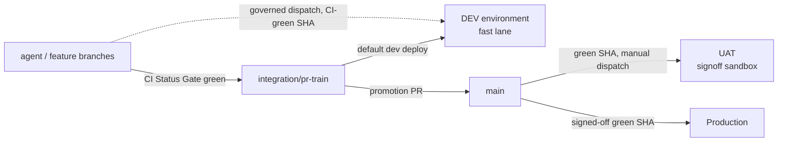

# Dev Fast Lane — the safe rule for agentic shipping

> `main` is the signoff lane (UAT → production). The dev environment is the agentic
> proving ground and never routes through `main`. This page is the canonical contract
> for how those two lanes stay fast AND correct at the same time.

## Visual Context

Canonical visual owner: [Operations Index](README.md). Companion contracts:
[branch-governance.md](branch-governance.md) (lanes),
[consent-protocol/docs/reference/dev-environment-setup.md](../../../consent-protocol/docs/reference/dev-environment-setup.md)
(environment).

## The rule in one screen



1. **`main` = signoff authority.** Only `main` SHAs reach UAT and production, exactly
   as before. UAT is where humans sign off `main` work before production. Nothing in
   the dev lane weakens this.
2. **Dev deploys the train, not `main`.** The default dev deploy target is
   `integration/pr-train` — the branch agent and contributor work already lands on.
   Dev is where the train is proven against real infrastructure *before* promotion to
   `main`, which is the whole point of having a dev environment.
3. **Escape hatch for speed:** a governed maintainer may dispatch a dev deploy from
   ANY ref, provided the exact SHA carries a green `CI Status Gate`. This lets a team
   validate a feature branch on real infrastructure without waiting for train intake.
4. **One correctness gate, reused — not a new one.** The dev deploy requires the same
   authoritative check that gates every merge in this repo (`CI Status Gate` on the
   exact SHA). No `Main Post-Merge Smoke` requirement (that is a `main` artifact), no
   extra review lane, no new approval ceremony.
5. **Dev never promotes.** There is no dev→UAT or dev→prod path. Promotion is only
   `integration/pr-train` → `main` → UAT signoff → production. Dev is evidence, not
   authority (no second decision-maker).

## Why this is safe (gate-by-gate correctness)

| Gate | Where it runs | What it guarantees |
| --- | --- | --- |
| `CI Status Gate` on the exact SHA | before every dev deploy | code is test-, type-, secret-, DCO-, and governance-clean — the same bar required to merge anywhere |
| Governed-actor dispatch (`assert-governed-actor.py --surface dev`) | dispatch time | only the maintainer cohort can deploy |
| Workflow definition pinned to `main` | dispatch time | the pipeline itself cannot be mutated from a feature branch; only the deployed *content* comes from the requested ref |
| Secret sync + runtime identity assertions | every deploy | dev cannot silently drift to wrong DB/CORS/identity |
| Migrations + `dev_minimum_schema.json` (policy: minimum, floor = UAT schema) | every backend deploy | dev may run AHEAD of UAT's schema (train migrations) but never behind it |
| Provenance labels + parity + semantic verification + auto-rollback | every deploy | a bad train deploy self-heals; dev state is always attributable to an exact SHA |
| Dev environment isolation (own project, DB, secrets) | always | nothing dev does can touch UAT or production data |

## What we deliberately did NOT add (overkill avoidance)

- **No new branch.** The train already exists, is already governed, and is already
  where agent work lands. A dedicated `dev` branch would be a second intake lane to
  keep fresh — pure maintenance cost.
- **No new review or approval step.** Landing on the train already requires review +
  merge queue + `CI Status Gate`. Dev deploy adds zero human steps to that.
- **No dev-specific CI workflow.** The existing PR Validation produces the
  `CI Status Gate` the dev deploy consumes.
- **No auto-deploy-on-push (yet).** Dispatch stays manual-by-governed-actor so dev
  state changes are always intentional and attributable. If cadence ever demands it,
  auto-deploy on train pushes is a one-line trigger addition — add it when the need is
  real, not before.

## Operating it

```bash
# Default: deploy the current train head to dev
# GitHub → Actions → Deploy to Dev → Run workflow (branch: main)
#   ref: integration/pr-train (default)   scope: auto

# Escape hatch: deploy a CI-green feature branch SHA
#   ref: feat/my-branch   sha: <exact green sha>   scope: auto
```

- Dev drift or a broken train schema? Dev is disposable by design: re-clone the DB
  from UAT per the
  [dev environment runbook](../../../consent-protocol/docs/reference/dev-environment-setup.md)
  and redeploy. Never "fix" dev by hand-editing infrastructure.
- Auditing dev at any time: `python3 scripts/ops/dev_environment_doctor.py`.

## The agentic-team principle behind the rule

Agents ship in minutes; humans sign off in hours. The pipeline must let those two
clocks run independently:

- the **fast clock** (agent iterations) gets a real hosted environment gated by
  exactly one automated correctness check that already exists,
- the **slow clock** (human signoff) keeps sole authority over what users touch,
  through the unchanged `main` → UAT → production lane.

Every gate in this repo must pay for itself in caught defects. When adding a step to
any deploy lane, name the defect class it catches; if an existing gate already catches
it, do not add the step.
