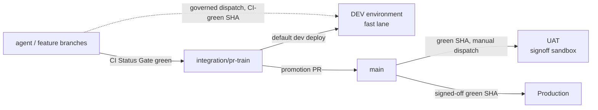

# Dev Fast Lane — the safe rule for agentic shipping

> `main` is the signoff lane (UAT → production). The dev environment is the agentic
> proving ground and never routes through `main`. This page is the canonical contract
> for how those two lanes stay fast AND correct at the same time.

Dev is a governed dispatch-only proving lane, never a promotion lane. Any decision
that lands a PR, promotes `main`, or deploys UAT/production follows the canonical
[Admin release SOP](../../../.codex/skills/repo-operations/references/admin-release-sop.md).

**The dev dispatch itself now follows that SOP's proof discipline too** (founder directive,
2026-08-06). Dev remains dispatch-only and still never promotes — what changes is that a
dev deploy is no longer an informal action. It carries the same evidence burden as any
other authority transition:

1. **Record the starting state** — current branch, `git status --short --branch` — and
   return to it afterwards. Do not create a convenience branch.
2. **Prove the exact SHA before dispatching.** It must be reachable from the requested ref
   *and* carry a terminal, successful `CI Status Gate`. Re-read the SHA immediately before
   the dispatch, not from a note taken earlier.
3. **Confirm the governed actor** (`scripts/ci/assert-governed-actor.py --surface dev`).
4. **Dispatch from `main` with `ref` set to the branch.** The workflow definition runs from
   `main`; the content deployed is `inputs.ref`. A dispatch made *from* the branch is
   refused in about a second, before a runner is assigned — and reads in the run list as an
   ordinary failure.
5. **Confirm the run actually started from live state.** A successful CLI response is not
   proof, exactly as §3A says of queue entry.
6. **Follow it to terminal state**, then verify the deployed revision genuinely carries the
   SHA — and, when the deploy is expected to apply migrations, that `schema_migrations`
   contains the rows it should. A green deploy is not evidence a migration ran.

The reason this tightened: a dev dispatch is where the parked migration lane applies, so
"it deployed" and "the schema moved" are different claims, and only one of them was ever
being checked.

## Visual Context

Canonical visual owner: [Operations Index](./README.md). Companion contracts:
[branch-governance.md](./branch-governance.md) (lanes),
[consent-protocol/docs/reference/dev-environment-setup.md](../../../consent-protocol/docs/reference/dev-environment-setup.md)
(environment).

## Governed pipeline evidence — 2026-09-29

The governed pipeline prerequisite landed on main as `a4a42abe2` through the
authorized Admin PR path. Main-owned dev workflow `36651691305` later deployed
application SHA `ccb593e8587742a69b58ea97c47e1c58c5c580aa`; its terminal
status was healthy, and backend and frontend serving revisions carried that
SHA at 100% traffic. This proves that application deployment, not owner-pod
installation or complete dev journey acceptance. Deploy subsequent candidates
only from an exact CI-green application SHA.

The candidate builds and pins the backend before migration, checks each selected
revision's Ready condition, SHA/run labels and environment, resolved image digest,
and run-specific tagged URL, then requires HTTP 200 without following redirects.
[Cloud Run tag updates](https://docs.cloud.google.com/sdk/gcloud/reference/run/services/update-traffic)
are separate from traffic percentages. Both selected services must pass before
promotion. Retention follows acceptance and preserves the captured rollback revision.
An explicit `build_pod_image` input defaults to false; publishing a dev artifact
does not authorize installation or production stable-channel promotion.

The current migration, release, capacity and owner/device acceptance
disposition is recorded in the [integration audit](../quality/adk-orchestration-docs-audit.md).

The semantic command-recovery probe distinguishes a successful recovery response
from a private-placement refusal. A canonical HTTP 409 with
`AGENT_PRIVATE_RUNTIME_REQUIRED` proves the hub boundary; it does not prove pod
recovery. Recognize its declared private hosting mode without comparing the whole
human-facing error object. Authentication failures, unavailable placement and
unrelated or contradictory conflicts remain blocking. Read back status, allowlisted
code and hosting mode only; keep credentials and response contents out of diagnostics.
After rollback, inspect the traffic-serving revision's release metadata rather
than the service template, which may still describe the failed candidate.

## The rule in one screen


```mermaid
flowchart LR
  feature["agent / feature branches"]
  train["integration/pr-train"]
  dev["DEV environment<br/>fast lane"]
  main["main"]
  uat["UAT<br/>signoff sandbox"]
  prod["Production"]
  feature -->|"CI Status Gate green"| train
  train -->|"default dev deploy"| dev
  feature -.->|"governed dispatch, CI-green SHA"| dev
  train -->|promotion PR| main
  main -->|"green SHA, manual dispatch"| uat
  main -->|"signed-off green SHA"| prod
```

1. **`main` = signoff authority.** Only `main` SHAs reach UAT and production, exactly
   as before. UAT is where humans sign off `main` work before production. Nothing in
   the dev lane weakens this.
2. **Dev deploys the train, not `main`.** The default dev deploy target is
   `integration/pr-train` — the branch agent and contributor work already lands on.
   Dev is where the train is proven against real infrastructure *before* promotion to
   `main`, which is the whole point of having a dev environment.
3. **Escape hatch for speed:** a governed maintainer may dispatch a dev deploy from
   ANY ref, provided the exact SHA carries a green `CI Status Gate`. This lets a team
   validate a feature branch on real infrastructure without waiting for train intake.
4. **One correctness gate, reused — not a new one.** The dev deploy requires the same
   authoritative check that gates every merge in this repo (`CI Status Gate` on the
   exact SHA). No `Main Post-Merge Smoke` requirement (that is a `main` artifact), no
   extra review lane, no new approval ceremony.
5. **Dev never promotes.** There is no dev→UAT or dev→prod path. Promotion is only
   `integration/pr-train` → `main` → UAT signoff → production. Dev is evidence, not
   authority (no second decision-maker).

## Why this is safe (gate-by-gate correctness)

| Gate | Where it runs | What it guarantees |
| --- | --- | --- |
| Authoritative full-CI check on the exact SHA (`CI Status Gate` for PR heads, `Queue Validation` for train heads, `Main Post-Merge Smoke Gate` for main merges — any-of) | before every dev deploy | code is test-, type-, secret-, DCO-, and governance-clean — the same bar required to merge anywhere |
| Governed-actor dispatch (`assert-governed-actor.py --surface dev`) | dispatch time | only the maintainer cohort can deploy |
| Workflow definition pinned to `main` | dispatch time | the pipeline itself cannot be mutated from a feature branch; only the deployed *content* comes from the requested ref |
| Secret sync + runtime identity assertions | every deploy | dev cannot silently drift to wrong DB/CORS/identity |
| Migrations + `dev_minimum_schema.json` (policy: minimum, floor = UAT schema) | every backend deploy | dev may run AHEAD of UAT's schema (train migrations) but never behind it |
| Provenance labels + parity + semantic verification + classified rollback | every deploy | release failures block acceptance; classified service failures restore the captured revision. A verifier setup failure can block without rollback, so read back serving traffic and the terminal receipt. |
| Dev environment isolation (own project, DB, secrets) | always | nothing dev does can touch UAT or production data |

## What we deliberately did NOT add (overkill avoidance)

- **No new branch.** The train already exists, is already governed, and is already
  where agent work lands. A dedicated `dev` branch would be a second intake lane to
  keep fresh — pure maintenance cost.
- **No new review or approval step.** Landing on the train already requires review +
  merge queue + `CI Status Gate`. Dev deploy adds zero human steps to that.
- **No dev-specific CI workflow.** The existing PR Validation produces the
  `CI Status Gate` the dev deploy consumes.
- **No auto-deploy-on-push in the workflow itself.** Dispatch stays
  manual-by-governed-actor so workflow-lane dev deploys are always intentional and
  attributable. The former GCP-native trigger lane is historical (below).

## Candidate verification and compatibility

The workflow definition comes from `main`; the selected application SHA must carry
its own successful canonical CI result. Deploy helpers run from that selected SHA.
Older compatibility images therefore need the candidate probe, provenance verifier,
Voice parity option, and protected-revision retention helper before dispatch.

Backend deployment builds an immutable image before any migration. Selected backend
and frontend candidates must pass exact-image provenance and direct health probes
before traffic promotion; redirects do not count as health. The captured serving
revision remains protected from retention cleanup as the rollback target. Migration
compatibility and recovery evidence must establish that it is a usable target.

The frontend image builds in parallel with the backend image and is pinned by
digest before the frontend deploy
([CI: deploy image pipeline](./ci.md#deploy-image-pipeline)). Because this workflow
runs from `main` while the tree comes from the selected SHA, a train SHA without
`deploy/frontend-image.cloudbuild.yaml` keeps the combined serial frontend build.

`build_pod_image` defaults to `false`. Enabling it builds a dev-only pod image and
does not approve installation on any owner's pod or publish a stable release.
Calendar and configured Live voice keys participate in runtime parity. Configuration
parity does not prove a successful connector operation or live voice session.

The governed workflow has completed live dev deployments. On 2026-09-27, readback
of the dev project's regional and global Cloud Build trigger inventories found no
triggers. Preserve this single deployment authority and existing owner resources.

### Deployment duration and independent work

Review on 2026-10-07: compare selected work and active deployment time separately
from queue waiting and source validation.

| Run | Observed deployment | Active job |
| --- | --- | --- |
| [Dev 37464072047](https://github.com/hushh-labs/hushh-research/actions/runs/37464072047) | Backend, frontend, pod image | 14m21s |
| [Dev 37450634683](https://github.com/hushh-labs/hushh-research/actions/runs/37450634683) | Backend, frontend, pod image | 14m54s |
| [UAT 37523933082](https://github.com/hushh-labs/hushh-research/actions/runs/37523933082) | Frontend only | 14m11s; another 14m53s elapsed before its first job |
| [UAT 37537896978](https://github.com/hushh-labs/hushh-research/actions/runs/37537896978) | Backend, frontend, Drive worker | 21m55s |
| [UAT 37554552503](https://github.com/hushh-labs/hushh-research/actions/runs/37554552503) | Backend, frontend, Drive worker | 29m34s |

This bounded sample does not show dev as intrinsically slower than UAT.
[Source validation 37572520334](https://github.com/hushh-labs/hushh-research/actions/runs/37572520334)
passed in 22m20s, with browser validation the critical path at 19m58s. That is a
separate cost. Earlier failed Drive fixtures spent about 26 minutes retrying;
their corrections now pass. One recovered Connections fixture flake remains a
follow-up, not permission to remove browser assertions.

[Dev 37574435209](https://github.com/hushh-labs/hushh-research/actions/runs/37574435209)
finished in about 17m17s but failed strict environment bootstrap after promotion:
configured native sign-in pins were missing from the canonical profile templates.
Health, provenance and schema passed; semantic verification never ran and both
rollback steps were skipped. The selected SHA remained at 100% traffic. Correct
the templates while preserving strict unknown-key refusal; obtain new exact-SHA
CI and terminal dev verification before acceptance. Its backend image reuse step
took one second; the requested new pod image took about 173 seconds. This is
distinct pod publication work, not a second backend image build.

Required full-suite jobs already own duplicate targeted unit/static checks.
The standalone agent-browser pack overlapped the broad two-engine pack and
cost 15.6 seconds. The selector now delegates it to the broad pack only when
that pack is selected; agent-only changes retain their standalone coverage. No broad gate cut, cache/worker change
or same-image rebuild is justified by this sample. Candidate health and
post-promotion provenance observe different states, as do pre/post migration
checks. Keep these authorities and measure actual completed work rather than
summing parallel lanes or equating PR validation with deployment.

Measured on 2026-09-27, governed dev run `36332480677` took 21m39s for
backend, frontend and a pod image. UAT run `36331605754` took 11m33s for
frontend only; the recent full UAT run `36329957069` took 22m18s and also
included the Drive worker. Compare selected services before comparing duration.

The branch-owned backend build now overlaps runtime IAM and its isolated model
probe with pod image publication. Deployment joins verified release metadata and
the model probe before creating its candidate revision. Docker builds remain
serial because they share a builder and contracts directory. This preserves the
migration, provenance, health and promotion gates. Governed run `36338207726`
completed in 18m59s for backend, frontend and a pod image, versus the preceding
21m39s run. Both services were read back serving `8ef90615bb`. This single-run
2m40s improvement includes normal cache/provider variability; it is not a fixed
deployment-time guarantee.

## GCP-native auto-deploy (Cloud Build triggers)

Historical: the `dev-backend-autodeploy` and `dev-frontend-autodeploy` triggers
previously deployed main pushes directly through Cloud Build. They were absent
from the live inventories checked on 2026-09-27. Cloud Build remains the image
build executor under the governed GitHub workflow; do not recreate the competing
push triggers from the older setup instructions in
[dev environment runbook, Phase 6c](../../../consent-protocol/docs/reference/dev-environment-setup.md).
The existing [integration audit](../quality/adk-orchestration-docs-audit.md)
records release evidence and the acceptance work still required.

## Operating it

```bash
# Default: deploy the current train head to dev
# GitHub → Actions → Deploy to Dev → Run workflow (branch: main)
#   ref: integration/pr-train (default)   scope: auto

# Escape hatch: deploy a CI-green feature branch SHA
#   ref: feat/my-branch   sha: <exact green sha>   scope: auto
```

- For dev drift or a broken schema, use the bounded recovery procedure in the
  [dev environment runbook](../../../consent-protocol/docs/reference/dev-environment-setup.md)
  and the governed deployment workflow. Existing reviewer history, assignments,
  devices and owner resources must be preserved. A database reset or replacement
  requires its own explicit scope and recovery evidence.
- Auditing dev at any time: `python3 scripts/ops/dev_environment_doctor.py`.

### Voice verification after the September 2026 route transition

Current source retires `/api/one/adk/relay-session` and the old ADK Live paths;
HTTP 410 there is expected and does not establish pod readiness. The maintained
`/api/one/voice/*` lane uses the shared hub's provider connection. Its readiness
is not evidence that a BYOC owner's voice runs in their pod.

The separate recorded-command lane uses admitted pod routes
`/api/one/pod/commands/transcriptions` and `/api/one/pod/commands/assess`, with
hub-owned checkpoint and effect authority. Verify the selected browser transport
and the serving revision before claiming private spoken-command acceptance.
The writer candidate selects recorded pod commands for BYOC and refuses new
hub Live sessions for non-Shared or unverified placement. Live private-command
acceptance remains unverified until the exact revision and pod are exercised.

The workflow definition runs from `main`; application content comes from its
selected `ref` and exact SHA. Read back serving revisions and traffic after each
run. A historical amber result, green build, or workflow label is not proof of
current voice behavior or successful rollback.

## Pod fleet

The branch's per-user pod registry tables ship as parked, dev-only migrations
(`consent-protocol/db/migrations/parked/900_personal_agent_registry.sql`, applied through
`consent-protocol/db/dev_migration_manifest.json` and never through the release manifest).
This is a dev procedure. The UAT and production release contracts do not include
these tables; verify deployed schema separately for each environment before a
rollout decision.

### Registry and serving state (verified 2026-09-29)

The dev registry and existing owner pod services are now live. The 2026-08-06
observation that the registry had not yet been created is historical. A dev
deploy still runs `db/migrate.py` from the selected application SHA, while the
workflow definition runs from `main`: dispatch from `main` with `ref` and the
exact verified branch SHA. Check the dev migration ledger and registry state
separately from workflow health; a green deploy alone does not establish the
schema or owner-pod state.

**Two sources of truth, and only one is authoritative.** The `personal_agent_registry` row
is the authority for provisioning state; a Cloud Run service is the compute that row points
at. They can legitimately disagree — most often because the backend is in plan mode. A pod
becomes a real, billable Cloud Run service only when `PERSONAL_AGENT_BACKEND=gcp` **and**
`HUSSH_GCP_BACKEND_LIVE` is on; with either unset,
`consent-protocol/hushh_mcp/services/gcp_backend.py` computes the deployment and returns a
plan-mode handle — never `live` — **without making any GCP call**, so `gcloud` shows nothing
while registry rows still read `provisioned`. Check the registry first, then the fleet.

**List the authorized portion of the fleet.** The filter comes from the labels
`GcpBackend.render_deploy_config` actually sets — `app`, `hussh-billing-space`, `hussh-tier`,
`hussh-env`, `hussh-purpose`. `app=hussh-one-pod` is the only one that is unconditional, so
filter on it and use the rest to narrow. This dev-project query sees only
services hosted in that project; BYOC services live in their owners' projects:

```bash
# Hub-project pod services only; owner-project BYOC services are elsewhere.
gcloud run services list --project hushh-pda-dev --region us-central1 \
  --filter="metadata.labels.app=hussh-one-pod" \
  --format="table(metadata.name, metadata.labels.hussh-env, metadata.labels.hussh-tier, status.url)"

# Fallback for labels rendered under a different key in this same project.
gcloud run services list --project hushh-pda-dev --region us-central1 \
  --filter="metadata.name ~ ^one-pod-"
```

```sql
-- The authority. Run against the dev Cloud SQL instance.
SELECT status, deployment_target, count(*)
FROM personal_agent_registry
GROUP BY status, deployment_target
ORDER BY status, deployment_target;
```

A count of this one Cloud Run project cannot be compared with all provisioned
registry rows. Reconcile a BYOC row against its recorded owner project and
service identity under the owner's authorized access; do not scan unrelated
owner projects. A mismatch within the same deployment target and project is
the signal worth chasing.
`GET /health/ready` reports the same divergence as a `pod_fleet` check once
`POD_FLEET_HEALTH_SIGNAL_ENABLED` is on — see `consent-protocol/api/routes/health.py`. That
check is reported, never gating: broken pods are separate hosts and must never pull the
control plane out of rotation.

**Preserve owner pods.** Do not delete an owner's Cloud Run service to resolve a
health, admission or update issue. The service, registry assignment, encrypted
recovery and owner approval form one lifecycle. Use the owner-authorized
deprovision flow only for an actual owner-requested teardown. For a failed
deployment or upgrade, follow the [first-light maintenance runbook](./dev-pod-first-light-runbook.md)
and [pod recovery procedure](./pod-backup-and-recovery.md), retaining the same
identity and recovery resources. An out-of-band service deletion leaves the
registry and grants inconsistent and is an incident operation, not fast-lane
cleanup.

**Read the reconcile worker's logs.** `server.py` now registers the worker at
startup. Dev enables it behind `PERSONAL_AGENT_RECONCILE_ENABLED` to retry stalled
provisioning. Its current startup adapter returns no idle-reap candidates and
refuses a reap if reached: registry row age is not proof of inactivity. The
separate image sweep is enabled in dev with
`PERSONAL_AGENT_UPGRADE_APPROVAL_REQUIRED=true`; an image offer alone cannot
upgrade an owner pod. Check the exact owner-approved operation before treating
an upgrade log as expected.

It follows the log convention of `consent-protocol/hushh_mcp/services/revocation_worker.py`,
the worker it is modeled on: every line the loop emits is prefixed with the module's own
bracketed `_LABEL` constant, then a dotted `noun.verb` event name, then `key=value` pairs,
with one summary line per pass. Here `_LABEL` is `personal-agent reconcile`, so the whole
sweep is greppable on that one string:

```bash
gcloud logging read \
  'resource.type="cloud_run_revision"
   resource.labels.service_name="consent-protocol"
   textPayload:"[personal-agent reconcile]"' \
  --project hushh-pda-dev --limit 100 --freshness 1h --format="value(textPayload)"
```

| Line you will see | What it means |
| --- | --- |
| `Reconcile loop started (interval=…s)` | the sweep is scheduled and running |
| `not scheduled: reconcile sweep is disabled` | `PERSONAL_AGENT_RECONCILE_ENABLED` is off |
| `personal_agent.retried status=…` | a stalled row was re-driven through provisioning |
| `personal_agent.retry_failed status=…` | that retry raised; the row stays stalled |
| `personal_agent.reaped idle_since=…` | Worker capability only; the current startup adapter supplies no idle-reap candidates. Investigate if observed. |
| `personal_agent.reap_failed` | Worker capability only; the current startup adapter refuses reap. Investigate if observed. |
| `upgraded hushh_id=…` | A stale-image candidate passed the separately gated owner-approved upgrade path; verify the exact operation and installed digest. |
| `upgrade failed hushh_id=…` | Candidate failed; inspect the operation and preserve prior-image recovery evidence. |
| `Reconcile scan: … retried, … reaped, … upgraded, … orphans erased …` | Per-pass summary; inspect each nonzero category. |
| *(nothing at all)* | Check startup, environment flags and log routing; the startup hook exists, but a disabled loop does not run passes. |

Current worker logs can include a HusshID and image fragment. Treat the output as
private operational evidence; do not copy raw lines into public reports. Use the
registry under owner-gated access when an operator must resolve the affected pod.

The sweep runs in the hub, not in a pod: `pod_mode` in
`consent-protocol/hushh_mcp/runtime_settings.py` keeps fleet-wide singleton workers out of
pods, so a fleet of pods cannot each run their own sweep against shared state.

**Manual rollback — and what it does and does not cover.** The lever is
`PERSONAL_AGENT_ENABLED=0` plus a redeploy. It genuinely does the main job — but read all
four points, because three of them are not what the shorthand implies.

1. **It does stop new provisioning.** Verified across every entry point: the phone-verify
   kickoff in `consent-protocol/hushh_mcp/services/actor_identity_service.py` returns
   `False` before scheduling anything; `provision()` and `register_pending()` in
   `consent-protocol/hushh_mcp/services/personal_agent_provisioning_service.py` raise
   `PersonalAgentDisabledError`; the owner-authorized routes in
   `consent-protocol/api/routes/one/personal_agent.py` return 404; and the reconcile
   sweep re-checks the same flag on **every pass**, returning a skipped report having
   touched nothing, so a flip mid-flight stops an already-running loop without a redeploy.
2. **It does leave existing pods alone** — the flag is read only on creation paths, so
   nothing deprovisions anything. But it is **not a freeze on the fleet.**
   `consent-protocol/api/routes/account.py` deliberately does **not** gate its
   personal-agent teardown on the flag (its own docstring says so), and routes through
   `resolve_compute_backend()`, so a user deleting their account still tears down a live
   pod with the flag off. That is correct — erasure must not be blockable by a feature
   flag — but "flag off" does not mean "nothing touches the fleet".
3. **It does not disarm the compute backend.** `PERSONAL_AGENT_BACKEND` and
   `HUSSH_GCP_BACKEND_LIVE` are independent switches
   (`consent-protocol/hushh_mcp/services/compute_backend.py`). Any caller that reaches
   `GcpBackend.provision` while those are live creates real billable services. For a
   belt-and-braces rollback, also clear `PERSONAL_AGENT_BACKEND` (resolves to the inert
   `NullBackend`) or `HUSSH_GCP_BACKEND_LIVE` (drops the backend to plan mode, no live GCP
   call). Turn `PERSONAL_AGENT_RECONCILE_ENABLED` off in the same pass: the master flag
   already stops the sweep today, but the reconcile switch is the one that keeps the reap
   half — the part that deletes compute — off if someone turns the master flag back on.
4. **The variable ships from `scripts/deploy/backend-deploy.sh`, not from the workflow.**
   Searching `.github/workflows/` and `deploy/` for `PERSONAL_AGENT_ENABLED` finds nothing,
   and that absence used to read here as "not wired anywhere" — it is not. The whole
   personal-agent block is emitted by `scripts/deploy/backend-deploy.sh` (the
   `append_optional_env` calls), guarded by `if [[ "${_DEPLOY_ENV}" == "dev" ]]`, with
   `_DEPLOY_ENV` passed through `deploy/backend.cloudbuild.yaml`. `append_optional_env`
   skips empty values, which is how every one of these stays off outside dev *by
   construction* rather than by remembering to unset it. The contract is proved by
   execution in `consent-protocol/tests/test_personal_agent_deploy_lane.py`.

   So changing one of these flags is an edit to **`scripts/deploy/backend-deploy.sh`** —
   which is deliberately **not** a `protected_pipeline_path`, so it rides the feature
   branch and reaches dev without a maintainer PR to `main`. Do **not** add a
   `_PERSONAL_AGENT_ENABLED` substitution to `deploy-dev.yml`: it would need the Admin SOP,
   would be silently dropped by the workflow's substitution skew guard unless a matching
   key is added to `deploy/backend.cloudbuild.yaml` on the deployed SHA, and would
   duplicate a mechanism that already works.

   *This item previously prescribed exactly that two-file workflow edit.* It was written
   before the deploy-script block existed and was never revised, so following it would have
   built a parallel path to a live mechanism. Recorded rather than quietly deleted, because
   the failure mode — a runbook that stays plausible after the system moves — is the one
   `AGENTS.md` §*Anti-drift rule* exists to catch.

The redeploy is required only because a Cloud Run environment change is a new revision.
Inside a running process the flag is a live `os.getenv` read per call — `personal_agent_enabled`
is not cached — so it takes effect on the next call with no restart.

One in-flight edge, written here rather than left to be discovered: `provision()` checks the
flag on entry only, so a provision already past that line completes. If the redeploy drains
the old revision mid-provision, the row is left in `provisioning` with no pod — which is
precisely what the `pod_fleet` signal counts as a failed pod.

Verify the rollback landed:

```bash
# Fleet signal (when POD_FLEET_HEALTH_SIGNAL_ENABLED is on)
curl -s "$DEV_BACKEND_URL/health/ready" | jq '.checks'

# Feature state, straight from the runtime. This route is deliberately never
# flag-gated and never 404s, so it is honest with the flag off.
curl -s -H "Authorization: Bearer $DEV_ID_TOKEN" \
  "$DEV_BACKEND_URL/api/one/personal-agent/status" | jq '.featureEnabled'
```

Then confirm no new services appear: re-run the fleet list above and check the count is flat.

## The agentic-team principle behind the rule

Agents ship in minutes; humans sign off in hours. The pipeline must let those two
clocks run independently:

- the **fast clock** (agent iterations) gets a real hosted environment gated by
  exactly one automated correctness check that already exists,
- the **slow clock** (human signoff) keeps sole authority over what users touch,
  through the unchanged `main` → UAT → production lane.

Every gate in this repo must pay for itself in caught defects. When adding a step to
any deploy lane, name the defect class it catches; if an existing gate already catches
it, do not add the step.
