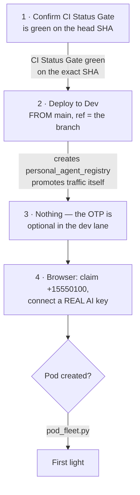

# Dev pod first light — the human actions, in order

## Maintaining an existing owner's software release

This section governs upgrades; the dated first-light walkthrough below is historical.
Dev's control plane is `hushh-pda-dev`. A user-cloud deployment can live in a
different project: resolve the named owner's registry entry before inspecting its
service. Shared-project service inventory does not prove an owner has no pod.

Build `consent-protocol/Dockerfile.pod` for the deployment platform with generated
contracts staged by the existing build recipe. Set `POD_IMAGE_TAG=dev-<full-source-sha>`.
Record source commit, immutable source digest, copied owner-project digest,
Cloud Run revision and `/pod/info` imageTag separately. Never treat `latest`, an
image version variable, or Cloud Run Ready as proof of the serving application.
Keep the tombstone-compatible ancestry check and owner-local encrypted state.

Normal updates use the existing status, Feed approval, registry operation and
upgrade service. Publishing a release must not install it. Bind each approval to
the owner, service incarnation and immutable image digest; Later defers 72 hours.
Wait for the authenticated handoff's durable idle receipt before replacement.
Verify the running release, readiness and memory/authority continuity before
reporting success. Keep the automatic sweep disabled until the deployed hub
enforces owner approval (`PERSONAL_AGENT_UPGRADE_APPROVAL_REQUIRED=true`).

### Release metadata and compatibility

The dev build reads the reviewed version, summary, changelog and supported
predecessor digests from `deploy/pod-release.json`. The existing build recipe
resolves the executable image digest and assembles metadata with the exact source
revision and workflow run through `scripts/deploy/assemble-pod-release.py`. It
archives that metadata with the build and configures `HUSSH_ONE_POD_RELEASE_B64`
alongside `HUSSH_ONE_POD_IMAGE`. This is governed deployment provenance, not an
independent cryptographic signature.

An empty `supportedUpgradeDigests` list offers no installation path for existing
pods. Add a predecessor only after proving its migration, encrypted recovery and
update continuity. Missing, mismatched or incompatible metadata refuses a new
upgrade before cloud access. A durable operation already in progress retains
its original approval and recovery path when a newer release is published.

Settings and Feed use the same status and approval contracts. Installed release
metadata follows the provider's recorded digest; publishing a new offer does not
erase the previous installation's verification. Shared accounts see their managed
service version without pod installation controls. The authored dev release and
its source tests do not establish a completed live update rehearsal or authorize
publication through the production stable channel.

### Model project ownership

The owner pod uses Vertex in its own cloud project through its native runtime
identity. Keep `GOOGLE_CLOUD_PROJECT` owner-local; do not copy the hub's
`GENAI_GOOGLE_CLOUD_PROJECT` into pod configuration or grant the pod access to
the hub's model bridge. Memory Bank, storage and encryption remain owner-local.

The dev hub uses `hushh-vertex-personal54` only for Gemini/Vertex model calls.
Its native project and billing linkage remain unchanged. Verify model routing
and prediction access separately for hub and pod; a working hub bridge does not
prove that the owner's Vertex project is ready.

### One-time legacy bootstrap exception

An installed release may predate the handoff protocol. Check with the configured
hub machine identity and a pod-audience ID token: the ingress wall returns 404
for an unauthorized human token even if the route exists. Require a successful
protected `/pod/info` control before interpreting upgrade-status 404 as absence.

A bootstrap requires explicit authorization for the named existing pod. It is a
maintenance transition and does not count as proof of the normal Feed upgrade.
Do not add a permanent bypass flag or silently bootstrap other owners.

1. Pause the dev upgrade sweep to avoid competing updates. Record service UID,
   traffic, image, configuration fingerprints, storage identity and recovery
   prerequisites without persisting credentials or decrypted information.
   Verify the flag on every serving revision, not only the service template:
   an environment update can create a retired revision while pinned traffic
   still serves the old revision with its sweep enabled. Explicitly promote the
   verified hold revision and confirm worker shutdown before image replacement.
2. Build and verify a versioned image with the handoff routes and their actual
   hub-to-pod authorization path. Preserve service identity, storage, KMS,
   secret bindings and single-writer settings. Do not recreate the service.
3. Use a deliberate maintenance handoff for this legacy image. Do not infer an
   authoritative drain receipt from quiet logs. Record any interruption and
   verify durable state before replacing the image.
4. Verify image/revision, protected route authentication, admission behavior,
   encrypted-state recovery and health after the transition. Reconcile registry
   provenance before enabling normal updates; never fabricate owner approval.
5. Re-enable the normal channel only after the deployed hub and Feed support
   owner approval and the next update can obtain a genuine handoff receipt.
   Preserve rollback ancestry and tombstones; unknown compatibility is a stop.

Record bootstrap results separately from the subsequent owner-approved update
acceptance. Do not repeat a bootstrap merely because later authentication fails.

**Dated 2026-08-07.** Everything code-side for task #110 is landed and pushed. What remains
is two human actions and a check: confirm CI is green, dispatch the dev deploy, and a browser
session with a real AI key. (Setting a dev OTP was removed; the code is optional in the
simulation lane, see step 3.)

Read this top to bottom before starting. Step 1 is the one most likely to be skipped, and
skipping it makes step 2 fail.

## Visual Map



## Before you start

| | |
|---|---|
| Branch | `claude/hushh-infrastructure-analysis-7o991c` |
| Head SHA | **take it from the PR** — see the note below |
| PR | [#4675](https://github.com/hushh-labs/hushh-research/pull/4675) (`[dev-ci][do-not-merge]`) |
| Target | `hushh-pda-dev` / `us-central1`, service `consent-protocol` |
| Front end | `https://dev.one.hushh.ai` |

You must be in the **`dev` surface** of the governed-actor cohort (`config/ci-governance.json`)
for step 2. Dev is a **shared, costed** environment — a dispatch replaces whatever was last
deployed there, so tell the team before you start.

### Step 2 is blocked until two files land on `main`

Both are `protected_pipeline_paths`, so both need the maintainer cohort and the Admin SOP.
Neither can be delivered from the branch: the deploy workflow and every script it runs
before *Checkout deployment SHA* execute from `main`'s tree, not from the SHA being
deployed. The branch carries both changes already — they are a cherry-pick, not a rewrite.

| File | Change | Why it blocks |
|---|---|---|
| `scripts/ci/require-deploy-sha-on-main.sh` | send the check-runs JSON to a file instead of one argv string | **hard blocker** — without it the gate exits 126 on this branch's SHAs and nothing deploys |
| `.github/workflows/deploy-dev.yml` | `_RUNTIME_ENVIRONMENT` and `_APP_ENV`: `uat` → `dev` | dev would deploy but keep reporting `uat` |

**Do not trust a SHA written in a document, including this one.** This page deliberately
does not pin one: the commit that added it changed the head, which is exactly how a pinned
SHA goes stale. Take the current head from PR #4675 (or `git rev-parse origin/claude/hushh-infrastructure-analysis-7o991c`)
and use that *same* value in steps 1 and 2. The two must match — the deploy gate checks the
SHA, not the branch.

---

## Step 1 — Confirm CI is green on the branch head

**This step used to say CI never runs automatically here, and gave a reason that turned
out to be wrong.** The claim was that GitHub does not raise `pull_request: synchronize`
for app-token pushes. It does — `pull_request` runs fire on this branch. What was actually
true is narrower: CI had not run for a stretch, and when it did run it was **failing**, so
the head carried no green gate either way.

`ci.yml` now also triggers on pushes to `claude/**`, so a push produces a run without
anyone dispatching one. Both the push and pull_request runs appear.

1. Open PR [#4675](https://github.com/hushh-labs/hushh-research/pull/4675) and look at the
   head commit's checks.
2. If **`CI Status Gate`** is green, go to step 2.
3. If it is red, read the first FAILING job, not the gate. The gate is a summary: when
   `Governance` fails, `Preflight Gate` fails, every test lane skips, and the gate reports
   failure over a suite that never ran. The real message is in the earlier job.
4. Only if no run exists at all: Actions → **PR Validation** → **Run workflow** → branch
   `claude/hushh-infrastructure-analysis-7o991c`, `scope: all`.

## Step 2 — Deploy to Dev, dispatched **from `main`**

**The trap.** The workflow *definition* always runs from `main`; the *content* deployed is
the ref you pass. An earlier attempt dispatched this from the branch and died in one second
at *Assert manual dispatch originates from main*.

1. GitHub → **Actions** → **Deploy to Dev** → **Run workflow**
2. **Use workflow from: `main`** ← the whole step turns on this
3. `scope`: `auto`
4. `ref`: `claude/hushh-infrastructure-analysis-7o991c`
5. `sha`: the SHA you confirmed green in step 1

Paste the SHA rather than leaving it blank. Blank means "head of ref at dispatch time"; if
anything lands on the branch between steps 1 and 2 you would deploy a SHA CI never saw, and
the gate would reject it.

**What this does that matters:** `db/migrate.py` runs from the *deployed SHA*, and
migrations `900`/`905` exist only on this branch — so this dispatch is what finally creates
`personal_agent_registry` in dev. It also rebuilds the pod image
(`_BUILD_POD_IMAGE` defaults true) and **promotes traffic itself**, so there is no manual
traffic step. The revision now runs with `ENVIRONMENT=dev` as well as `_DEPLOY_ENV=dev`;
the simulation guard reads the deploy lane either way.

**Watch:** the *Post-deploy dev schema contract gate* step. It is the one that would notice
if the new migrations did not land.

**Confirm before moving on:**

```
SELECT migration_id, status FROM schema_migrations WHERE migration_id LIKE '90%';
```

Both `900` and `905` must be present. `905` adds the columns the liveness sweep reads.

## Step 3 — Nothing. The OTP is optional in dev.

**This step used to exist and no longer does.** It required a `gcloud run services update`
after *every* dev deploy, because the deploy uses `--set-env-vars` and replaces the whole
environment — a step that would be forgotten, and whose absence looks exactly like a broken
lane.

In the simulation lane, no code configured means no code checked. Any code is accepted at
the confirm step. That relaxation is bounded on three sides, all of which must hold at once:

- `simulation_permitted()` — an explicit opt-in **and** a deploy lane naming a development
  environment. `uat`, `staging` and `production` are refused outright.
- the allowlist — only reserved fictitious numbers can be claimed at all.
- the challenge — the confirm call must still follow a start call for the same number.

**If you ever need to rehearse the real OTP flow in dev**, set `HUSHH_DEV_PHONE_TEST_CODE`
and the code check turns back on with no other change:

```bash
gcloud run services update consent-protocol \
  --region=us-central1 --project=hushh-pda-dev \
  --update-env-vars=HUSHH_DEV_PHONE_TEST_CODE=<a 6-digit code>
```

Separately, the **client-side phone mandate** is bypassed on `dev.one.hushh.ai` exactly as
it is on `localhost`, so a dev user is never routed to the phone screen. That is a routing
mandate only — it grants no verified phone, and the AI-connection gate still reads
`phone_verified is True` server-side before it will provision anything.

## Step 4 — Drive it from the browser

1. Sign in at `https://dev.one.hushh.ai` with a test account.
2. Verify a phone using one of the pinned simulation numbers — **`+15550100`** through
   **`+15550104`**. Any code is accepted unless `HUSHH_DEV_PHONE_TEST_CODE` is set.
3. **Connect an AI key.** This one cannot be faked: the gate validates the key against the
   provider, and provisioning is triggered by the AI connection, not by the phone step.

The phone is still read **server-side** from the verified identity and never from a request
body — the bypass replaces the SMS round trip, not the control.

## Confirming first light

```bash
# from consent-protocol/
uv run python scripts/ops/pod_fleet.py --project hushh-pda-dev --region us-central1
```

A pod appears labelled `app=hussh-one-pod`. **`Ready=True` is not proof it serves** — Cloud
Run's default startup probe is a TCP connect and gunicorn binds its port before its workers
boot, so a pod whose workers die on import reports Ready and still 503s everything. Look for
**`probe=http /health`**.

Then ask the agent a question in the app. A streamed answer is the thing nobody has seen
yet, in any environment, for anyone.

## Running pod operator tooling locally (2026-09-11)

`pod_upgrade.py`, `pod_fleet.py` and the rest of `consent-protocol/scripts/ops/` are
hub-side tools. They need three things at once, and missing any one of them fails in a
way that looks like something else.

**1. The hub's identity, not yours.** `pod_image_copy` pushes into a project hushh does
not own, so it refuses unless the acting identity is the consent-plane runtime service
account. Your own account is not it, and `load_operator_credentials` is explicitly the
wrong loader. The chain that works: gcloud's operator service account can impersonate
`consent-protocol-runtime@hushh-pda-dev`. Write an impersonated ADC once:

```jsonc
// ~/.config/gcloud/hushh-dev-consent-plane-adc.json   (chmod 600)
{
  "type": "impersonated_service_account",
  "service_account_impersonation_url":
    "https://iamcredentials.googleapis.com/v1/projects/-/serviceAccounts/consent-protocol-runtime@hushh-pda-dev.iam.gserviceaccount.com:generateAccessToken",
  "delegates": [],
  "source_credentials": { /* the operator SA key from ~/.config/gcloud/legacy_credentials/<operator>/adc.json */ }
}
```

then `export GOOGLE_APPLICATION_CREDENTIALS=~/.config/gcloud/hushh-dev-consent-plane-adc.json`.
Verify it resolves before trusting it:

```bash
uv run python -c "import google.auth,google.auth.transport.requests as t;c,_=google.auth.default(scopes=['https://www.googleapis.com/auth/cloud-platform']);c.refresh(t.Request());print(c._target_principal)"
```

**2. The live flags.** Without `HUSSH_GCP_BACKEND_LIVE` and `HUSSH_USER_GCP_LIVE` the
backend renders a plan, calls no cloud, and **reads as success at every layer**. On
2026-09-11 an upgrade run without them printed `already current`, exited 0, and wrote its
imagined result into the registry, nulling `source_image` and deleting `observed`. The
upgrade path now refuses a plan-mode backend outright, but every other tool still needs
the flags set deliberately. Both are `true` on the dev hub; neither is in the worktree
`.env`.

**3. The dev registry, which is not the worktree default.** The checked-in `.env` points
at UAT. Dev runs against `hushh-pda-dev:us-central1:hushh-dev-pg`:

```bash
cloud-sql-proxy --address 127.0.0.1 --port 6544 hushh-pda-dev:us-central1:hushh-dev-pg &
export DB_HOST=127.0.0.1 DB_PORT=6544 DB_NAME=postgres
export DB_USER=$(gcloud secrets versions access latest --secret=DB_USER --project=hushh-pda-dev)
export DB_PASSWORD=$(gcloud secrets versions access latest --secret=DB_PASSWORD --project=hushh-pda-dev)
unset DB_UNIX_SOCKET
```

**Two failure modes worth recognising by sight.** An upgrade that reports
`temporary_issue` is a sanitised message; the real reason is in the hub log as
`personal_agent.upgrade_failed`, and `pod incarnation unverified` there means the
registry row is missing `serviceUid`. And a retained `upgradeLease` is released only by a
terminal result, never by elapsed time, so one failed upgrade removes that pod from every
later sweep until someone resolves it against real evidence: the pod's heartbeat carries
`observed.imageTag`, which is proof, where age is not.

## If something refuses

| Symptom | Cause | Fix |
|---|---|---|
| Deploy fails at *Validate deployment SHA* with `Argument list too long`, exit 126 | The gate on `main` passes the check-runs JSON as one argv string; Linux caps that at 128 KiB and this branch's commits carry ~30 checks | Land the `require-deploy-sha-on-main.sh` fix on `main` (see above). Re-dispatching cannot help — the gate never read a check |
| Deploy fails at *Validate deployment SHA* with `Refusing deploy:` | Read the message. It names which of the three refusals fired: not in the clone, not reachable from the ref, or no green `CI Status Gate` | For the check case, step 1, then re-dispatch with the same SHA |
| Deploy dies in ~1 second | Dispatched from the branch | Re-dispatch with **Use workflow from: `main`** |
| Deploy fails at *Assert manual dev dispatch actor policy* | Account not in the `dev` surface | Governed-actor cohort in `config/ci-governance.json` |
| Phone step says not allowlisted | A number outside the pinned five, or the simulation lane is off | Use `+15550100`–`+15550104`; confirm the revision carries `HUSHH_DEV_SIMULATION_ENABLED` |
| Provisioning never starts | No AI key connected | The AI connection is the trigger, not the phone |
| `SimulationNotPermittedError` in the logs | `HUSHH_DEV_SIMULATION_ENABLED` missing | It ships in the dev block of `backend-deploy.sh`; confirm the revision is from this branch |
| Pod is Ready but 503s | Workers died on import | Read the pod's own logs; Ready means the port is bound, nothing more |

## Tear down what this creates

Dev is costed and live pods bill continuously. Check the fleet when you are done and remove
what the session created; the reap sweep is not attached and would not do it for you.

## Sources

- `.github/workflows/deploy-dev.yml` and `ci.yml`, `scripts/deploy/backend-deploy.sh`, `deploy/backend.cloudbuild.yaml`, read 2026-08-07.
- Live GitHub reads: PR #4675 head check runs (zero), the last 30 `PR Validation` runs on this branch (all `workflow_dispatch`), and repo-wide run activity confirming Actions is healthy, 2026-08-07.
- Companion records: [the dev fast lane](./dev-fast-lane.md) and [the north star](../architecture/private-agent-north-star.md).
