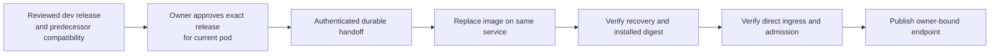

# Dev BYOC pod updates and controlled direct access

## Visual Map

## Maintaining an existing owner's software release

This section governs upgrades; the dated first-light walkthrough below is historical.
Dev's control plane is `hushh-pda-dev`. A user-cloud deployment can live in a
different project: resolve the named owner's registry entry before inspecting its
service. Shared-project service inventory does not prove an owner has no pod.

Build `consent-protocol/Dockerfile.pod` for the deployment platform with generated
contracts staged by the existing build recipe. Set `POD_IMAGE_TAG=dev-<full-source-sha>`.
Record source commit, immutable source digest, copied owner-project digest,
Cloud Run revision and `/pod/info` imageTag separately. Never treat `latest`, an
image version variable, or Cloud Run Ready as proof of the serving application.
Keep the tombstone-compatible ancestry check and owner-local encrypted state.

Normal updates use the existing status, Feed approval, registry operation and
upgrade service. Publishing a release must not install it. Bind each approval to
the owner, service incarnation and immutable image digest; Later defers 72 hours.
Wait for the authenticated handoff's durable idle receipt before replacement.
Verify the running release, readiness and memory/authority continuity before
reporting success. Keep the automatic sweep disabled until the deployed hub
enforces owner approval (`PERSONAL_AGENT_UPGRADE_APPROVAL_REQUIRED=true`).

### Release metadata and compatibility

The dev build reads the reviewed version, summary, changelog and supported
predecessor digests from `deploy/pod-release.json`. The existing build recipe
resolves the executable image digest and assembles metadata with the exact source
revision and workflow run through `scripts/deploy/assemble-pod-release.py`. It
archives that metadata with the build and configures `HUSSH_ONE_POD_RELEASE_B64`
alongside `HUSSH_ONE_POD_IMAGE`. This is governed deployment provenance, not an
independent cryptographic signature.

An empty `supportedUpgradeDigests` list offers no installation path for existing
pods. Add a predecessor only after proving its migration, encrypted recovery and
update continuity. Missing, mismatched or incompatible metadata refuses a new
upgrade before cloud access. A durable operation already in progress retains
its original approval and recovery path when a newer release is published.

Settings and Feed use the same status and approval contracts. Installed release
metadata follows the provider's recorded digest; publishing a new offer does not
erase the previous installation's verification. Shared accounts see their managed
service version without pod installation controls. The authored dev release and
its source tests do not establish a completed live update rehearsal or authorize
publication through the production stable channel.

### Controlled owner-direct access

Keep an existing BYOC pod private while applying its owner-approved image update.
Verify its service UID, image digest, single-writer recovery and machine-route
wall before changing ingress. On the same service, verify or widen Cloud Run
ingress and grant the public invoker only for the dev direct pilot. Verify the live IAM
policy, HTTPS/WSS reachability, frontend CORS preflight, hub machine-route
authentication, and a signed subject binding plus pod admission from a separate
network. A health response or public Cloud Run URL alone is insufficient.
Record the observed ingress with
`PersonalAgentRegistryRepo.record_direct_ingress_observed` only after the live
service and IAM checks; it keeps endpoint publication closed.

After those checks, use `PersonalAgentRegistryRepo.record_direct_readiness`
with the exact owner, HushhID, service UID, pod key, URL and verification time.
Its conditional write refuses a replaced pod or private ingress record. The
hub then publishes the signed endpoint; the browser pins it only after its own
admission succeeds. If any check fails, retain private ingress and leave the
direct-ready record absent. An update keeps the ingress axis; recheck the route
wall and recovery before treating the new image as accepted. Puppy access
still requires the owner's explicit per-device choice in Trusted devices.

### Model project ownership

The owner pod uses Vertex in its own cloud project through its native runtime
identity. Keep `GOOGLE_CLOUD_PROJECT` owner-local; do not copy the hub's
`GENAI_GOOGLE_CLOUD_PROJECT` into pod configuration or grant the pod access to
the hub's model bridge. Memory Bank, storage and encryption remain owner-local.

The dev hub uses `hushh-vertex-personal54` only for Gemini/Vertex model calls.
Its native project and billing linkage remain unchanged. Verify model routing
and prediction access separately for hub and pod; a working hub bridge does not
prove that the owner's Vertex project is ready.

### One-time legacy bootstrap exception

An installed release may predate the handoff protocol. Check with the configured
hub machine identity and a pod-audience ID token: the ingress wall returns 404
for an unauthorized human token even if the route exists. Require a successful
protected `/pod/info` control before interpreting upgrade-status 404 as absence.

A bootstrap requires explicit authorization for the named existing pod. It is a
maintenance transition and does not count as proof of the normal Feed upgrade.
Do not add a permanent bypass flag or silently bootstrap other owners.

1. Pause the dev upgrade sweep to avoid competing updates. Record service UID,
   traffic, image, configuration fingerprints, storage identity and recovery
   prerequisites without persisting credentials or decrypted information.
   Verify the flag on every serving revision, not only the service template:
   an environment update can create a retired revision while pinned traffic
   still serves the old revision with its sweep enabled. Explicitly promote the
   verified hold revision and confirm worker shutdown before image replacement.
2. Build and verify a versioned image with the handoff routes and their actual
   hub-to-pod authorization path. Preserve service identity, storage, KMS,
   secret bindings and single-writer settings. Do not recreate the service.
3. Use a deliberate maintenance handoff for this legacy image. Do not infer an
   authoritative drain receipt from quiet logs. Record any interruption and
   verify durable state before replacing the image.
4. Verify image/revision, protected route authentication, admission behavior,
   encrypted-state recovery and health after the transition. Reconcile registry
   provenance before enabling normal updates; never fabricate owner approval.
5. Re-enable the normal channel only after the deployed hub and Feed support
   owner approval and the next update can obtain a genuine handoff receipt.
   Preserve rollback ancestry and tombstones; unknown compatibility is a stop.

Record bootstrap results separately from the subsequent owner-approved update
acceptance. Do not repeat a bootstrap merely because later authentication fails.
