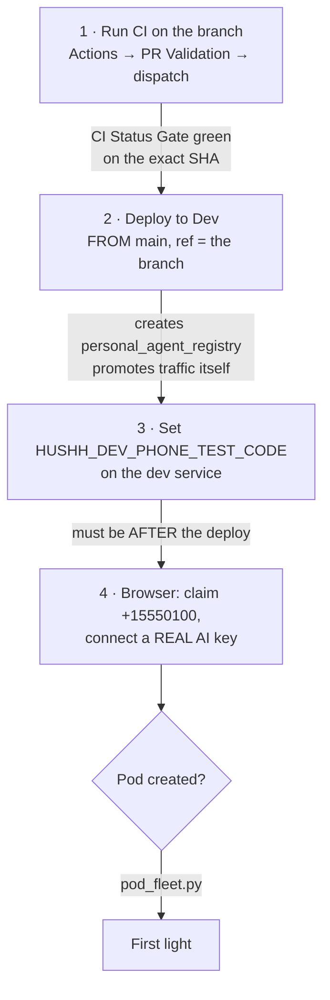

# Dev pod first light — the human actions, in order

**Dated 2026-08-07.** Everything code-side for task #110 is landed and pushed. What remains
is four human actions, three of which cannot be self-authorized: two governed workflow
dispatches, one environment write to a shared costed project, and a browser session with a
real AI key.

Read this top to bottom before starting. Step 1 is the one most likely to be skipped, and
skipping it makes step 2 fail.

## Visual Map



## Before you start

| | |
|---|---|
| Branch | `claude/hushh-infrastructure-analysis-7o991c` |
| Head SHA | `890e42823ee2792c4196d9cae8a4f11a195ce68f` |
| PR | [#4675](https://github.com/hushh-labs/hushh-research/pull/4675) (`[dev-ci][do-not-merge]`) |
| Target | `hushh-pda-dev` / `us-central1`, service `consent-protocol` |
| Front end | `https://dev.one.hushh.ai` |

You must be in the **`dev` surface** of the governed-actor cohort (`config/ci-governance.json`)
for step 2. Dev is a **shared, costed** environment — a dispatch replaces whatever was last
deployed there, so tell the team before you start.

If more commits land on the branch after this was written, the head SHA changes. Take the
new one from the PR and use it consistently in steps 1 and 2.

---

## Step 1 — Run CI on the branch head

**Why this step exists, and why it is easy to miss.** CI does not run automatically on this
branch. Every one of the last 30 `PR Validation` runs on it was a manual `workflow_dispatch`;
there has never been a `pull_request`-triggered run, and the head SHA currently carries
**zero** check runs. Actions itself is healthy — other branches got `pull_request` runs
minutes ago — so this is specific to how this branch is pushed.

Step 2 refuses any SHA without a green `CI Status Gate`, so without this it fails at
*Validate deployment SHA against requested ref*.

1. GitHub → **Actions** → **PR Validation** → **Run workflow**
2. Branch: `claude/hushh-infrastructure-analysis-7o991c`
3. `scope`: `all`
4. Run, and wait for the job named **`CI Status Gate`** to finish green.

**Confirm before moving on:** open the PR and check the head commit shows a green
`CI Status Gate`. A green *run* on an older commit is not the same thing — the gate checks
the SHA, not the branch.

## Step 2 — Deploy to Dev, dispatched **from `main`**

**The trap.** The workflow *definition* always runs from `main`; the *content* deployed is
the ref you pass. An earlier attempt dispatched this from the branch and died in one second
at *Assert manual dispatch originates from main*.

1. GitHub → **Actions** → **Deploy to Dev** → **Run workflow**
2. **Use workflow from: `main`** ← the whole step turns on this
3. `scope`: `auto`
4. `ref`: `claude/hushh-infrastructure-analysis-7o991c`
5. `sha`: `890e42823ee2792c4196d9cae8a4f11a195ce68f`

Paste the SHA rather than leaving it blank. Blank means "head of ref at dispatch time"; if
anything lands on the branch between steps 1 and 2 you would deploy a SHA CI never saw, and
the gate would reject it.

**What this does that matters:** `db/migrate.py` runs from the *deployed SHA*, and
migrations `900`/`905` exist only on this branch — so this dispatch is what finally creates
`personal_agent_registry` in dev. It also rebuilds the pod image
(`_BUILD_POD_IMAGE` defaults true) and **promotes traffic itself**, so there is no manual
traffic step. The revision runs with `ENVIRONMENT=uat` for behaviour parity and
`_DEPLOY_ENV=dev` for lane identity; that split is deliberate and is what the simulation
guard reads.

**Watch:** the *Post-deploy dev schema contract gate* step. It is the one that would notice
if the new migrations did not land.

**Confirm before moving on:**

```
SELECT migration_id, status FROM schema_migrations WHERE migration_id LIKE '90%';
```

Both `900` and `905` must be present. `905` adds the columns the liveness sweep reads.

## Step 3 — Set the simulation OTP (after the deploy, not before)

The phone lane needs both an allowlist and a code. The allowlist is pinned in the deploy
script; the code is not in the repo, deliberately — it is an auth-bypass credential and the
existing UAT equivalent is a Secret Manager secret.

```bash
gcloud run services update consent-protocol \
  --region=us-central1 \
  --project=hushh-pda-dev \
  --update-env-vars=HUSHH_DEV_PHONE_TEST_CODE=<choose a 6-digit code>
```

**Order matters.** The deploy uses `--set-env-vars`, which **replaces** the whole
environment. Setting the code first would have it wiped by step 2.

**Known friction, stated rather than discovered later:** every future dev deploy wipes this
value and it must be re-set. Making it survive means a Secret Manager entry plus a
substitution in `deploy/backend.cloudbuild.yaml` — a protected pipeline path, so it needs
the maintainer cohort. That is a deliberate follow-up, not part of this unblock.

## Step 4 — Drive it from the browser

1. Sign in at `https://dev.one.hushh.ai` with a test account.
2. Verify a phone using one of the pinned simulation numbers — **`+15550100`** through
   **`+15550104`** — and the code from step 3.
3. **Connect an AI key.** This one cannot be faked: the gate validates the key against the
   provider, and provisioning is triggered by the AI connection, not by the phone step.

The phone is still read **server-side** from the verified identity and never from a request
body — the bypass replaces the SMS round trip, not the control.

## Confirming first light

```bash
# from consent-protocol/
uv run python scripts/ops/pod_fleet.py --project hushh-pda-dev --region us-central1
```

A pod appears labelled `app=hussh-one-pod`. **`Ready=True` is not proof it serves** — Cloud
Run's default startup probe is a TCP connect and gunicorn binds its port before its workers
boot, so a pod whose workers die on import reports Ready and still 503s everything. Look for
**`probe=http /health`**.

Then ask the agent a question in the app. A streamed answer is the thing nobody has seen
yet, in any environment, for anyone.

## If something refuses

| Symptom | Cause | Fix |
|---|---|---|
| Deploy fails at *Validate deployment SHA* | No green `CI Status Gate` on that SHA | Step 1, then re-dispatch with the same SHA |
| Deploy dies in ~1 second | Dispatched from the branch | Re-dispatch with **Use workflow from: `main`** |
| Deploy fails at *Assert manual dev dispatch actor policy* | Account not in the `dev` surface | Governed-actor cohort in `config/ci-governance.json` |
| Phone step says not allowlisted | Code unset, or a number outside the pinned five | Step 3; use `+15550100`–`+15550104` |
| Provisioning never starts | No AI key connected | The AI connection is the trigger, not the phone |
| `SimulationNotPermittedError` in the logs | `HUSHH_DEV_SIMULATION_ENABLED` missing | It ships in the dev block of `backend-deploy.sh`; confirm the revision is from this branch |
| Pod is Ready but 503s | Workers died on import | Read the pod's own logs; Ready means the port is bound, nothing more |

## Tear down what this creates

Dev is costed and live pods bill continuously. Check the fleet when you are done and remove
what the session created; the reap sweep is not attached and would not do it for you.

## Sources

- `.github/workflows/deploy-dev.yml` and `ci.yml`, `scripts/deploy/backend-deploy.sh`, `deploy/backend.cloudbuild.yaml`, read 2026-08-07.
- Live GitHub reads: PR #4675 head check runs (zero), the last 30 `PR Validation` runs on this branch (all `workflow_dispatch`), and repo-wide run activity confirming Actions is healthy, 2026-08-07.
- Companion records: [the dev fast lane](./dev-fast-lane.md) and [the north star](../architecture/private-agent-north-star.md).
