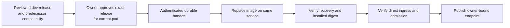

# Dev BYOC pod updates and controlled direct access

## Visual Map

```mermaid
flowchart LR
  A["Reviewed dev release<br/>and predecessor compatibility"] --> B["Owner approves exact release<br/>for current pod"]
  B --> C["Authenticated durable handoff"]
  C --> D["Replace image on same service"]
  D --> E["Verify recovery and installed digest"]
  E --> F["Verify direct ingress and admission"]
  F --> G["Publish owner-bound endpoint"]
```

## Owner-project first-light checks (2026-08-11 rehearsal)

For a new `user_gcp` bootstrap, treat API enablement as asynchronous. Verify Cloud
Resource Manager is enabled and required API operations have completed before
using them. Verify that the Cloud Storage service agent can use the bucket's KMS
key and that the deployer has `iam.serviceAccounts.actAs` on the **exact** pod
service account. Read back the rendered service identity and live IAM; a correct
helper without a production caller does not establish custody. Keep opaque
billing identifiers separate from the owner's selected space name, and verify
the pod's machine-route wall before publishing direct readiness. These are
dated rehearsal findings to recheck per project, not fleet-wide acceptance.
The [recovery guide](./pod-backup-and-recovery.md) owns the pod's conditional
first-boot key creation and encrypted recovery contract.

## Maintaining an existing owner's software release

This section governs upgrades; the dated first-light checks above and legacy
bootstrap exception below are historical.
Dev's control plane is `hushh-pda-dev`. A user-cloud deployment can live in a
different project: resolve the named owner's registry entry before inspecting its
service. Shared-project service inventory does not prove an owner has no pod.

Build `consent-protocol/Dockerfile.pod` for the deployment platform with generated
contracts staged by the existing build recipe. Set `POD_IMAGE_TAG=dev-<full-source-sha>`.
Record source commit, immutable source digest, copied owner-project digest,
Cloud Run revision and `/pod/info` imageTag separately. Never treat `latest`, an
image version variable, or Cloud Run Ready as proof of the serving application.
Keep the tombstone-compatible ancestry check and owner-local encrypted state.

Normal updates use the existing status, Feed approval, registry operation and
upgrade service. Publishing a release must not install it. Bind each approval to
the owner, service incarnation and immutable image digest. Later snoozes the Feed
reminder for 72 hours; Settings can still install a compatible release with no
active upgrade lease. Deferral does not approve or start an installation.
Wait for the authenticated handoff's durable idle receipt before replacement.
Verify the running release, readiness and memory/authority continuity before
reporting success. Keep the automatic sweep disabled until the deployed hub
enforces owner approval (`PERSONAL_AGENT_UPGRADE_APPROVAL_REQUIRED=true`).

### Release metadata and compatibility

The dev build reads the reviewed version, summary, changelog and supported
predecessor digests from `deploy/pod-release.json`. The existing build recipe
resolves the executable image digest and assembles metadata with the exact source
revision and workflow run through `scripts/deploy/assemble-pod-release.py`. It
archives that metadata with the build and configures `HUSSH_ONE_POD_RELEASE_B64`
alongside `HUSSH_ONE_POD_IMAGE`. This is governed deployment provenance, not an
independent cryptographic signature.

When recovery has qualified an already published dev image, the optional JSON
pin accepted by [the reuse verifier](../../../scripts/deploy/reuse-pod-release.py)
records its image, original source revision, original workflow run and
archived-release SHA-256. Create that reviewed pin only for the qualification
change; the existing build recipe owns its location. Dispatch the existing
main-owned workflow with `build_pod_image=true`; the candidate-owned build recipe
validates the archive and executable manifest, then publishes the new descriptor
without rebuilding the pod. `sourceRevision` retains the image's original source;
build provenance separately records the descriptor commit and new publisher run.
A mismatch aborts publication. Remove the reuse pin before the next application
image build. This path neither proves compatibility nor approves installation.

An empty `supportedUpgradeDigests` list offers no installation path for existing
pods. Add a predecessor only after proving its migration, encrypted recovery and
update continuity. Missing, mismatched or incompatible metadata refuses a new
upgrade before cloud access. A durable operation already in progress retains
its original approval and recovery path when a newer release is published.

Settings and Feed use the same status and approval contracts. Installed release
metadata follows the provider's recorded digest; publishing a new offer does not
erase the previous installation's verification. Shared accounts see their managed
service version without pod installation controls. The authored dev release and
its source tests do not establish a completed live update rehearsal or authorize
publication through the production stable channel.

Verified completion projects into the existing Feed only after registry
publication succeeds, using the approved operation ID as the Feed source key.
The synchronous and reconciliation paths share this projection; a retry cannot
create another notice. Failed, pending, unchanged-image and lost-publication
results do not emit completion. A Feed failure cannot undo an installation;
status remains a pure reader and the registry remains authoritative.
If a deployed defect omitted a notice, repair only that verified operation's
presentation through the existing Feed writer after checking its owner,
incarnation, installed digest and ready acknowledgement. Read back one source-key
row and unchanged registry state; never reinstall to manufacture a notice.

### Request concurrency and responsive controls

Verify Cloud Run request concurrency separately from the pod's one-instance,
one-worker contract. A Cloud Tasks worker or open relay occupies a request slot.
With maximum instances one and request concurrency one, status and cancellation
requests can wait behind that work. The September 28 reviewer rehearsal observed
organization completing before its queued cancellation could execute.

New on-demand Files provisioning configures concurrency eight in
`pod_files/provisioning.py`. Existing image updates intentionally preserve the
owner's current concurrency through `pod_upgrade_configuration.py`; installing
a newer image does not select a new capacity configuration. Record an explicit
choice before changing an existing owner's setting. Preserve one instance, one
worker, the selected CPU/memory, encrypted storage and keys. A configuration
revision still needs the existing authenticated maintenance handoff, incarnation
checks, recovery readback and renewed direct admission. Do not add workers or
instances to work around a request-slot limit.

After an authorized change, verify concurrent status/cancellation during bounded
work before the two- and four-operation stages. Observe memory and idle behavior;
configuration alone is not capacity acceptance. Cloud Run documents
[per-instance concurrency](https://docs.cloud.google.com/run/docs/about-concurrency)
and [WebSocket request behavior](https://docs.cloud.google.com/run/docs/triggering/websockets).

The HTTP startup probe allows up to 240 seconds for encrypted recovery before
accepting requests. Image-only BYOC updates preserve the observed HTTP health and
liveness probes; a TCP startup probe requires reconciliation before replacement.
A longer startup allowance does not qualify cold latency. Capture recovery phases
and replay work separately; the existing 150-second update observation window can
leave slower starts unconfirmed until reconciliation verifies the installed digest.

### Isolated image recovery rehearsal safeguards

When constructing a fixture `PodSpec`, retain its registry `billing_space_id`
explicitly. Normal owner update flow already carries that field. An omitted
fixture field can clear billing attribution during image replacement; it is not
permission to reconcile a real owner assignment implicitly. Compare runtime
settings by environment name and provider fields rather than provider ordering.

A failed candidate startup is a failed receipt even if the previous revision
continues serving. One bounded unchanged-configuration retry may distinguish a
transient failure, but does not establish its cause. Verify serving digest,
durable key/cursor, private IAM and unchanged service identity before recording
recovery. Isolated maintenance never substitutes for Settings owner approval.

### Recovering a denied Files queue creation

For a blocked Files activation, retain its existing approval, lease, successful
resource receipts and failed observation. A prior update's acknowledgement cannot
prove this operation. The maintenance-only `upgrade_pod` argument
`resume_files_queue_operation` admits one continuation of the exact recorded
queue-create HTTP 403 after fresh permission, queue-absence, worker-identity and
unchanged-service checks. Use the already approved immutable target and operation;
do not publish another approval, clear the lease or reset owner resources.

The registry claims continuation by strict comparison with the observed metadata.
Only the unfinished resource suffix runs, followed by the normal authenticated
drain and approved image/configuration installation. If the approved digest is
already installed, record this as a configuration restart, not an image upgrade. Configuration refusal remains visibly blocked and
retains the reservation. Unknown provider outcomes or a second denial require
investigation; they do not authorize replay. Queue permission checks allow a
bounded propagation wait before the durable pre-write authority checkpoint.
Verify installed digest, encrypted continuity and the exact completion receipt
before recording acceptance. This source recovery path does not itself prove a
successful live continuation. On 2026-10-01 the personal dev operation completed
this continuation on the same service and digest; that receipt does not qualify
other owners or production.

### Reconciling a legacy Files resource receipt

An untyped legacy bucket/key receipt requires original successful creation
records, the original bootstrap principal and current resource identities.
Current IAM alone does not prove creation ownership. Reconcile only the receipt
through a full-snapshot conditional write; preserve approvals, leases and unrelated
metadata. Missing creation evidence stops reconciliation.

If Files requires public-access prevention to be enforced, snapshot and read back
the bucket's retention, encryption, IAM and object inventory around that precise
change. Preserve recovery and PKM prefixes. Receipt correction grants no deletion
authority and does not replace the owner's exact Files-plan approval.

### Controlled owner-direct access

Keep an existing BYOC pod private while applying its owner-approved image update.
Verify its service UID, image digest, single-writer recovery and machine-route
wall before changing ingress. On the same service, verify or widen Cloud Run
ingress and grant the public invoker only for the dev direct pilot. Verify the live IAM
policy, HTTPS/WSS reachability, frontend CORS preflight, hub machine-route
authentication, and a signed subject binding plus pod admission from a separate
network. A health response or public Cloud Run URL alone is insufficient.
Record the observed ingress with
`PersonalAgentRegistryRepo.record_direct_ingress_observed` only after the live
service and IAM checks; it keeps endpoint publication closed.

After those checks, use `PersonalAgentRegistryRepo.record_direct_readiness`
with the exact owner, HushhID, service UID, pod key, URL and verification time.
Its conditional write refuses a replaced pod or private ingress record. The
hub then publishes the signed endpoint; the browser pins it only after its own
admission succeeds. If any check fails, retain private ingress and leave the
direct-ready record absent. An update keeps the ingress axis; recheck the route
wall and recovery before treating the new image as accepted. Puppy access
still requires the owner's explicit per-device choice in Trusted devices.

### Model project ownership

The production default is Vertex in the owner's cloud project through the pod's
native runtime identity. Dev also permits the explicitly approved personal Gemini
bridge. Bind that exception to the exact dev model project and runtime identity;
do not infer authorization from the hub configuration. Memory Bank, storage and
encryption remain owner-local. Files setup includes the selected processing
project in its frozen approval and shows the provider boundary before opt-in.

The dev hub's model project is selected by the governed build's
`_GENAI_PROJECT_ID` setting and cross-project allowlist in
`deploy/backend.cloudbuild.yaml`; the dev managed-AI default is `hushh-vertex-personal54`.
That setting alone does not redirect private-pod inference: the pod needs its own
verified configuration and prediction permission for that project.
Its native project and billing linkage remain separate. Verify the serving
revision's model routing and prediction access independently for hub and pod;
a configured bridge or enabled billing does not prove provider access.

### One-time legacy bootstrap exception

An installed release may predate the handoff protocol. Check with the configured
hub machine identity and a pod-audience ID token: the ingress wall returns 404
for an unauthorized human token even if the route exists. Require a successful
protected `/pod/info` control before interpreting upgrade-status 404 as absence.

A bootstrap requires explicit authorization for the named existing pod. It is a
maintenance transition and does not count as proof of the normal Feed upgrade.
Do not add a permanent bypass flag or silently bootstrap other owners.

1. Pause the dev upgrade sweep to avoid competing updates. Record service UID,
   traffic, image, configuration fingerprints, storage identity and recovery
   prerequisites without persisting credentials or decrypted information.
   Verify the flag on every serving revision, not only the service template:
   an environment update can create a retired revision while pinned traffic
   still serves the old revision with its sweep enabled. Explicitly promote the
   verified hold revision and confirm worker shutdown before image replacement.
2. Build and verify a versioned image with the handoff routes and their actual
   hub-to-pod authorization path. Preserve service identity, storage, KMS,
   secret bindings and single-writer settings. Do not recreate the service.
3. Use a deliberate maintenance handoff for this legacy image. Do not infer an
   authoritative drain receipt from quiet logs. Record any interruption and
   verify durable state before replacing the image.
4. Verify image/revision, protected route authentication, admission behavior,
   encrypted-state recovery and health after the transition. Reconcile registry
   provenance before enabling normal updates; never fabricate owner approval.
5. Re-enable the normal channel only after the deployed hub and Feed support
   owner approval and the next update can obtain a genuine handoff receipt.
   Preserve rollback ancestry and tombstones; unknown compatibility is a stop.

Record bootstrap results separately from the subsequent owner-approved update
acceptance. Do not repeat a bootstrap merely because later authentication fails.
