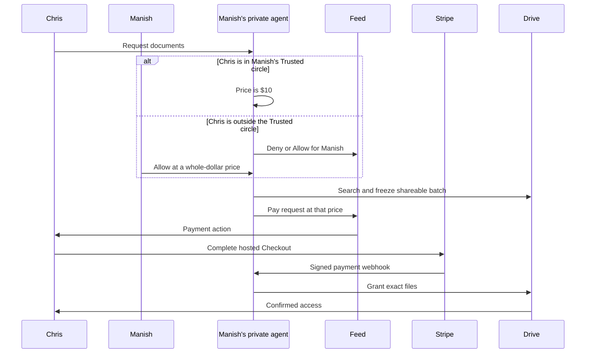

# Drive request payment gate

## Visual Context

Canonical visual owner: [Architecture Index](../architecture/README.md).

## User story

For a Trusted Circle request, the private agent searches under the existing owner
authority, freezes the first nonempty shareable batch, and puts a **Pay $10** item
in the requester's Feed. After Stripe confirms payment, the Drive worker resumes
the exact-file grant flow without another owner approval.

A request from anyone outside the Trusted circle waits in the owner's Feed under
**Needs you** with **Deny** and **Allow**. Allow opens a price sheet with $10,
$20 and $30 choices or a custom whole-dollar amount from $1 to $500. The sheet
first shows what Allow grants, read from the owner's review: the purpose, the
period, the recipient's Google account and **Viewer, until removed**. Allow
stays off until those terms load, and it answers that review's revision. After
Allow, the request runs the same automatic pipeline as a Trusted request:
background Drive search, the first frozen batch, a payment order at the owner's
price (for example **Pay $20** in the requester's Feed), and automatic sharing
after payment. Deny declines the request, and the requester sees **Declined your
file request**. Until the first batch is frozen, the owner can still decline an
allowed request from its review.

Where Allow is offered, the request shows only Allow and Deny, not an exact-file
review. The owner's manual exact-file review, charged at the default $10 after
approval, remains for requests that cannot be allowed: a current Trusted
member's request made before the owner's Drive was live, a request whose owner's
Drive is not live, or a request whose Allow a disconnect ended. Files are never
shared before a successful payment.

Each request has **one charge**, independent of document count or the number of
progressive 25-file batches: USD 10.00 for a Trusted request, or the owner's
price for an allowed request. No payment item is created when the search finds
zero shareable files. Earlier requests retain their original free behavior
because `payment_required` defaults to false and is set only on new eligible
requests while the rollout switch is on. When a request does not require
payment, Allow takes no price and the request runs free. The selected-file
indexing lane and the owner-reviewed question lane are outside this gate.

The payment layer exposes only opaque workflow identifiers to Stripe. The
existing live Drive search still runs on the backend with Manish's delegated
Google access and server-readable encrypted metadata. It should not be described
as end-to-end or strict cryptographic zero knowledge of the Drive documents.

## Search latency and bounded requests

Trusted, owner-allowed and owner-reviewed requests use the same metadata search
engine.
New request planning runs concurrently with already queued searches, so a slow
planner does not consume their worker slice before Google receives a query.
The existing authority checks, durable checkpoints and retry backoff remain in
the critical path.

The Documents agent expresses an explicit file count as `result_limit` (1–1,000)
with recent ordering. A date count such as “last three days” is not a file limit.
For generic “latest 100 documents,” the engine queries original files with native
timestamp ordering in the user corpus and each member shared drive. It stops
older pagination within a corpus only after enough distinct matches and the
complete boundary timestamp tie. Requested dates still apply to every match.
This direct-original scope does not expand shortcut aliases or folders; original
files in nested folders remain searchable through their corpus.

Topic and exact-title requests retain their existing discovery semantics,
including shortcut resolution and topical folders. Full-text results cannot
establish newest-N from their first page, so these requests finish their coverage
before ranking. Incomplete searches, invalid timestamps and scan limits cannot
produce a finalized bounded selection or payment. Valid out-of-order provider
pages disable early stopping and fall back to exhaustive collection.

For every bounded request, the store deduplicates candidates and selects the
newest N globally using the requested timestamp and a deterministic file-ID tie
break. It freezes final positions atomically. Intermediate candidates cannot be
reviewed, paid for or shared. Unshareable files within the newest N are not
silently replaced with older files. Once finalized, the automatic path or the
owner's review continues, followed by one request-bound payment.

Automated synthetic provider tests compare identical selections across 10,000
originals in two corpora: ordinary and tied latest-100 cases need 5 provider calls
and 400 scanned rows, versus 101 calls and 10,000 rows for exhaustive discovery.
The test includes both authority modes and a date-filtered case. These figures
prove less application work, not Google production latency or superiority to the
Drive UI. Provider, credential, search-page, commit and handoff timings remain
separate in correlated runtime telemetry; no end-to-end time guarantee is made.

Google's [files.list contract](https://developers.google.com/workspace/drive/api/reference/rest/v3/files/list),
[search semantics](https://developers.google.com/workspace/drive/api/guides/ref-search-terms),
and [shared-drive coverage](https://developers.google.com/workspace/drive/api/guides/enable-shareddrives)
define the native query, pagination and corpus boundaries used here.

## Authority and state

1. A new eligible request is created with `payment_required=true` only when
   `DRIVE_REQUEST_PAYMENTS_ENABLED=true`. Trusted-auto requests retain the
   existing Trusted Circle, verified identity, live connection, owner preference,
   and request-expiry checks. A request from outside the Trusted circle does
   nothing until the owner decides. Allow is accepted only while the request is
   pending, unexpired, not stopped, has a date range and has not started a
   search, the requester is not a current Trusted member, the owner's Drive is
   live, and the two people still have an active connection. Allow re-seals the
   request envelope with the `trusted_auto` marker and an owner Allow record
   holding the price. Every automatic recheck then accepts either current
   Trusted membership or that sealed record with an active connection between
   the two people. The plaintext `owner_allowed_at` column is the Consent
   Center's projection hint and never grants authority, but it can end it: a
   disconnect clears it in the same transaction, so the Allow ends for good.
   Reconnecting never restores it, as it never restores revoked scope grants or
   named Circles. A pending automatic request then returns to the owner's
   manual review, as a Trusted request does when its Trusted relationship
   changes.
2. Preparation freezes at least one shareable file before it creates the single
   request-bound payment order and durable requester Feed event. Owner-private
   filenames, request wording, contents, Google IDs, and email addresses stay out
   of the payment order, Stripe metadata, webhook logs, and push notification.
3. Only the authenticated requester may create or reuse a Stripe-hosted Checkout
   Session. Checkout charges `usd` and the amount stored on the order, with a
   server-selected return origin. The order fixes that amount when it is
   created: `1000` cents for a Trusted or owner-reviewed request, or the owner's
   price for an allowed one. Migration 291 limits every live order and retained
   obligation to whole dollars from `100` to `50000` cents. A success URL is an
   indication to refresh status, never proof of payment.
4. The public webhook verifies Stripe's signature on the raw request body,
   matches its session, amount, currency, request ID, and opaque payer binding to
   the stored order, and settles once. Replayed or out-of-order events cannot
   create a second grant authority. The database row is the source of truth.
5. Bulk approval, bulk worker claims, legacy per-file grant claims, and recipient
   link projections check the paid order transactionally before a grant can be
   dispatched or shown. Revocation, erasure, and provider reconciliation retain
   their existing authority paths.
6. The Feed row is durable. Push notification is best effort and contains only
   fixed copy and an opaque request ID: **Payment needed** and "Pay in One to
   continue your document request." The push never carries the price. Opening
   Feed or returning from Checkout reads authoritative server state.
7. A paid request that reaches a terminal state with zero confirmed grants is
   held from further sharing and enters one durable Stripe refund attempt. The
   private scheduled sharing drain checks uncertain outcomes before issuing a
   refund, reconciles the Stripe PaymentIntent on retry, and sends Chris a
   durable refund Feed update after Stripe confirms success. A payment arriving
   after authority is lost is held for the same reconciliation path.

## Configuration and rollout

The backend deployment has a fail-closed `DRIVE_REQUEST_PAYMENTS_ENABLED` switch.
It requires `STRIPE_SECRET_KEY` and `STRIPE_WEBHOOK_SECRET` secrets in the same GCP
project before enabling. UAT accepts a Stripe `sk_test_` key and production accepts
an `sk_live_` key; the webhook signing secret must be from the corresponding
endpoint. `APP_FRONTEND_ORIGIN` supplies the canonical HTTPS Checkout return
origin. The backend refuses Checkout if these values are absent or mismatched.

1. In `hushh-pda-uat`, create enabled Secret Manager versions named
   `STRIPE_SECRET_KEY` (Stripe test secret key) and `STRIPE_WEBHOOK_SECRET`
   (signature secret for the UAT endpoint). Give the backend runtime service
   account access. Register the public
   `/api/payments/stripe/webhook` endpoint in the same Stripe test account for
   `checkout.session.completed`, `checkout.session.async_payment_succeeded`, and
   `checkout.session.expired`. The service also treats the stored provider expiry
   timestamp as authoritative, so an expired checkout cannot keep a payment push
   alive while its expiry event is delayed.
   Never put a Stripe key, webhook secret, document metadata, or a live Checkout
   URL in GitHub variables, build substitutions, logs, or client code.
2. Deploy migration 262 and backend/frontend code with the switch off. Confirm
   historic requests and explicit owner approval still work. Keep GitHub UAT
   variable `DRIVE_REQUEST_PAYMENTS_UAT_ENABLED=false` until the bulk/erasure
   concurrency check below passes against PostgreSQL. After that check and
   Stripe test secrets are ready, enable the governed UAT deploy. It refuses to turn
   on without both project secrets.
3. Exercise both paths with a fresh request: no files produces no payment; a
   frozen nonempty batch produces one concise payment Feed item; a request from
   outside the Trusted circle stays blocked until the owner decides; Allow at $20
   produces a **Pay $20** item and the Stripe Checkout total matches; Deny shows
   the requester a declined request and starts no search; a Trusted request still
   pays $10; before payment, no Google ACL or recipient link exists; a test
   payment settles by webhook and resumes grants; a browser return alone changes
   nothing. Repeat with replayed webhooks, two devices, multiple requests,
   expired/cancelled requests, zero-delivery refunds, notification delivery
   failure, and background off. The private Drive worker also needs the UAT
   Stripe secrets so its scheduled sharing drain can reconcile refunds.
4. Production remains off until its live Drive worker/scheduler and the same
   acceptance path work. Put the production `sk_live_` key and the production
   endpoint's `whsec_` secret in `hushh-pda` Secret Manager, register the public
   production webhook URL, set GitHub variable
   `DRIVE_REQUEST_PAYMENTS_PROD_ENABLED=true`, and use the governed production
   deployment. Test a low-volume real payment and confirmed grant before
   expanding exposure.

Release requester clients that accept owner prices before owners can set one.
iOS and Android builds bundle the web assets, and a build released before owner
pricing shows a Pay row and accepts a payment status only for a `1000`-cent
order. On such a build, an owner-priced order fails closed: the requester sees
no Pay action and can't check out, so nothing is charged or shared, and the
request expires. Trusted `$10` orders still work there. Publish the native
requester builds with the order-price Feed projection and payment status check
before deploying the backend that lets owners allow at a price.

Turning the switch off stops marking new requests as paid-required. Already
marked requests stay gated so disabling the switch cannot bypass a charge in
progress. All three backend deployment lanes keep existing Stripe credentials
bound while the switch is off, allowing Checkout and signed webhooks to finish
for those requests. Keep the Stripe secrets and webhook endpoint available until
outstanding payments and refunds reconcile. If an incident requires stopping
Checkout itself, hold affected requests operationally and reconcile their orders
before removing credentials. Live orders cascade on request/account erasure, while
an account-free payment obligation retains only the random request UUID, payer
digest, amount and currency, provider identifiers and delivery outcome flags.
It lets the signed webhook and refund drain settle late charges without restoring
either participant's account or document details. Stripe's merchant records
follow the payment account's separate retention rules.

### Migration 291: owner Allow and owner price

Migration 291 adds the nullable `drive_share_requests.owner_allowed_at` column.
It replaces the `amount_cents = 1000` checks on `drive_request_payment_orders`
and `drive_request_payment_obligations` with one bound: whole dollars from `100`
to `50000` cents. It finds the old checks by definition, not by generated name.
The `1000` default stays, so Trusted orders and orders written by the previous
release are unchanged. Every step is catalog-guarded, so a replay changes
nothing and waits behind no live reader or writer.

The rollback refuses while any live order or retained obligation holds a price
other than `1000` cents, because the restored check would reject that row.
Otherwise it restores the fixed check and drops the column. Sealed owner Allow
records stay in request envelopes. The previous release requires current Trusted
membership for automatic work, so those requests stop instead of sharing.

### Activation check: bulk sharing and account erasure

Bulk create, approve, retry, stop, claim, settle, release, and request refresh
now take sorted owner and recipient graph advisory locks before connector,
share, request, or payment order locks when they may write identity-bearing
rows or Feed events. This aligns with account erasure, which takes exclusive
graph locks first. Before enabling new paid requests, exercise concurrent
erasure with freeze, approval, and effect settlement against PostgreSQL; local
unit checks cannot prove the absence of a database deadlock. Payment order,
webhook, and refund paths follow the same graph-first rule before identity
writes.

## Decisions for launch

Hussh is the merchant account. Manish sets the price for a request he allows,
but receives no payout: that would require Stripe Connect and a separate payout
contract. The implemented policy is an automatic full refund for a paid request
that ultimately delivers zero files, and Stripe test-mode UAT before live
production charging.

## Refund reconciliation

The refund worker records `first_dispatch_at` in the database before its first
Stripe call. On an uncertain Stripe response, it lists refunds for the exact
PaymentIntent and may retry `Refund.create` with the **same** request attempt
idempotency key only during the first 20 hours. Stripe may prune an idempotency
key after 24 hours, so a later create could issue a second refund if the first
response was lost. The worker stops creating after its shorter window and sets
`manual_review`; it continues read-only Stripe checks once per hour and will
record a full refund made through Stripe. [Stripe idempotency reference](https://docs.stripe.com/api/idempotent_requests).

Monitor `drive_request_payment_refunds` for `manual_review` or `failed`, joined
to `drive_request_payment_obligations` by `request_id`. For `manual_review`, inspect
the stored PaymentIntent and its refunds in the same Stripe account. If Stripe
has no full refund of the obligation's `amount_cents`, issue one manually for
that PaymentIntent; the worker will observe it. If the request still exists, it emits Chris's refund Feed
event after Stripe confirms success; after account erasure, the retained obligation
and Stripe refund are the operational evidence. Resolve a mismatched, failed, or canceled provider refund with payment
operations before changing a local order. Keep the order's
`reconciliation_required` hold in place until confirmation; a browser return or
an operator assumption must not restore document grants.
