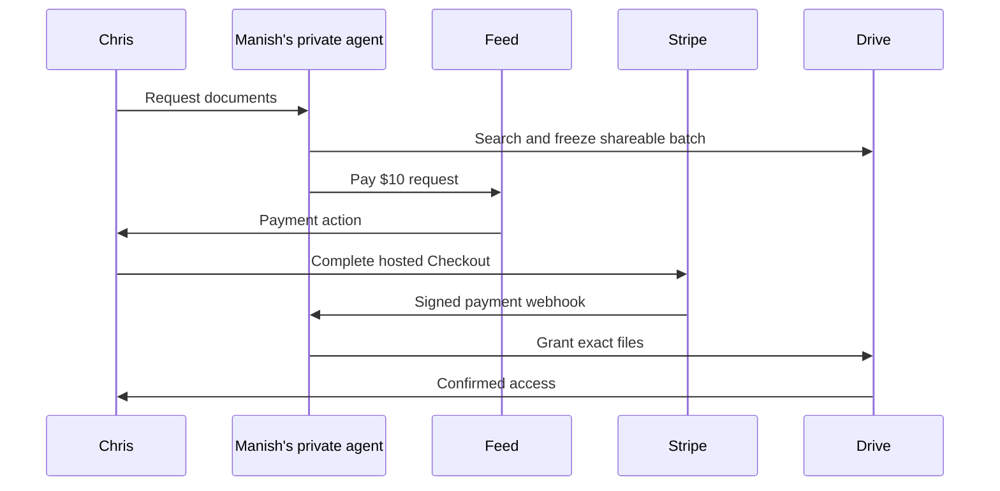

# Trusted Circle Drive request payment gate

## Visual Context

Canonical visual owner: [Architecture Index](../architecture/README.md).

## User story

Manish can be asleep while Chris, a verified member of Manish's Trusted Circle,
asks Manish's private agent for documents. With Manish's live Google Drive
connection and background preparation enabled, the private agent searches under
the existing owner authority, freezes the
first nonempty shareable batch, and puts a **Pay $10** item in Chris's Feed. Chris
pays through Stripe Checkout. A verified Stripe webhook records payment, then the
Drive worker resumes its existing exact-file Google Viewer grant flow. Chris sees
only confirmed grants. Manish does not receive a per-request consent screen for
this `trusted_auto` path; turning background preparation off stops new work.

The fee is **one USD 10.00 charge per request**, independent of document count or
the number of progressive 25-file batches. No payment item is created when the
search finds zero shareable files. Earlier requests retain their original free
behavior because `payment_required` defaults to false and is set only on new
eligible requests while the rollout switch is on. The selected-file indexing
lane and the owner-reviewed question lane are outside this gate.

Request-bound searches hand each committed Drive page to the batch orchestrator
before reading the next page. Each immutable batch contains at most 25 files;
a sparse page or final remainder is handed off immediately. The first nonempty
batch creates the single payment item. Once paid, committed batches can queue
for sharing while discovery continues. A payment or restart wake drains those
committed results before starting another search slice. An interrupted handoff
retains its saved cursor and frozen batch; it does not restart discovery or
create another charge. The existing recipient view refreshes confirmed results
during discovery and paginates them in groups of 25.

The payment layer exposes only opaque workflow identifiers to Stripe. The
existing live Drive search still runs on the backend with Manish's delegated
Google access and server-readable encrypted metadata. It should not be described
as end-to-end or strict cryptographic zero knowledge of the Drive documents.

## Authority and state

1. The trusted-auto request is created with `payment_required=true` only when
   `DRIVE_REQUEST_PAYMENTS_ENABLED=true`. The original Trusted Circle, verified
   identity, live connection, owner preference, and request-expiry checks remain.
2. Preparation freezes at least one shareable file before it creates the single
   request-bound payment order and durable requester Feed event. Owner-private
   filenames, request wording, contents, Google IDs, and email addresses stay out
   of the payment order, Stripe metadata, webhook logs, and push notification.
3. Only the authenticated requester may create or reuse a Stripe-hosted Checkout
   Session. Checkout uses fixed `usd` and `1000` cents and a server-selected
   return origin. New Checkout sessions use Stripe's Dashboard payment-method
   configuration. If a pending attempt used the retired `payment_method_types`
   parameter, recovery first replays its original idempotent payload. It reuses
   any cached session; only a definitive rejection of that parameter permits a
   retry under a stable versioned key. A success URL is an indication to refresh
   status, never proof of payment.
4. The public webhook verifies Stripe's signature on the raw request body,
   matches its session, amount, currency, request ID, and opaque payer binding to
   the stored order, and settles once. Replayed or out-of-order events cannot
   create a second grant authority. The database row is the source of truth.
5. Bulk approval, bulk worker claims, legacy per-file grant claims, and recipient
   link projections check the paid order transactionally before a grant can be
   dispatched or shown. Revocation, erasure, and provider reconciliation retain
   their existing authority paths.
6. The Feed row is durable. Push notification is best effort and contains only
   fixed copy and an opaque request ID. Opening Feed or returning from Checkout
   reads authoritative server state.
7. A paid request that reaches a terminal state with zero confirmed grants is
   held from further sharing and enters one durable Stripe refund attempt. The
   private scheduled sharing drain checks uncertain outcomes before issuing a
   refund, reconciles the Stripe PaymentIntent on retry, and sends Chris a
   durable refund Feed update after Stripe confirms success. A payment arriving
   after authority is lost is held for the same reconciliation path.

### Concurrent Google credential refresh

Parallel file jobs can encounter `refresh_in_progress` while another job renews
the owner's Google credential. The sharing worker treats that exact OAuth 409
as temporary contention: it waits briefly for the refresh, rechecks current
authority, and uses the refreshed credential only for the same connection
generation. Persistent contention returns to the durable retry schedule.
It must not become a terminal "not shared" result after one attempt. A provider
write with an uncertain outcome still follows read-only reconciliation.

The regression runs the production OAuth adapter and Google permission adapter
with a controlled provider transport, reproducing two simultaneous file jobs
and one expired credential. It verifies one token refresh, one necessary grant,
and recognition of the other file's existing access. This protects the race
that service-level adapter stubs previously missed.

### Recovering a partial request

The existing retry operation can reopen a completed progressive request marked
`partial`, retaining its paid order, frozen files, recipient and approval source.
Only skipped effects that never reached a provider write and have no receipt or
active lease can be requeued. Current payment, dates, trust/background authority,
connection generation, expiry and review digest are checked again. Confirmed
files and uncertain provider writes are excluded from this retry.

The request revision continues to bind its search and sibling batches. Recovery
increments the retried batch revision; a later terminal transition emits a fresh
outcome event for Feed and notifications without replacing those authority
bindings. This recovery does not create another payment order or charge.

## Configuration and rollout

The backend deployment has a fail-closed `DRIVE_REQUEST_PAYMENTS_ENABLED` switch.
It requires `STRIPE_SECRET_KEY` and `STRIPE_WEBHOOK_SECRET` secrets in the same GCP
project before enabling. UAT accepts a Stripe `sk_test_` key and production accepts
an `sk_live_` key; the webhook signing secret must be from the corresponding
endpoint. `APP_FRONTEND_ORIGIN` supplies the canonical HTTPS Checkout return
origin. The backend refuses Checkout if these values are absent or mismatched.

1. In `hushh-pda-uat`, create enabled Secret Manager versions named
   `STRIPE_SECRET_KEY` (Stripe test secret key) and `STRIPE_WEBHOOK_SECRET`
   (signature secret for the UAT endpoint). Give the backend runtime service
   account access. Register the public
   `/api/payments/stripe/webhook` endpoint in the same Stripe test account for
   `checkout.session.completed` and `checkout.session.async_payment_succeeded`.
   Never put a Stripe key, webhook secret, document metadata, or a live Checkout
   URL in GitHub variables, build substitutions, logs, or client code.
2. Deploy migration 262 and backend/frontend code with the switch off. Confirm
   historic requests and explicit owner approval still work. Keep GitHub UAT
   variable `DRIVE_REQUEST_PAYMENTS_UAT_ENABLED=false` until the bulk/erasure
   concurrency check below passes against PostgreSQL. After that check and
   Stripe test secrets are ready, enable the governed UAT deploy. It refuses to turn
   on without both project secrets.
3. Exercise a fresh Manish/Chris Trusted Circle request with background
   preparation on: no files produces no payment; a frozen nonempty batch produces
   one Pay $10 Feed item; before payment, no Google ACL or recipient link exists;
   a test payment settles by webhook and resumes grants; a browser return alone
   changes nothing. Repeat with replayed webhooks, two devices, multiple batches,
   expired/cancelled requests, zero-delivery refunds, notification delivery
   failure, and background off. The private Drive worker also needs the UAT
   Stripe secrets so its scheduled sharing drain can reconcile refunds.
4. Production remains off until its live Drive worker/scheduler and the same
   acceptance path work. Put the production `sk_live_` key and the production
   endpoint's `whsec_` secret in `hushh-pda` Secret Manager, register the public
   production webhook URL, set GitHub variable
   `DRIVE_REQUEST_PAYMENTS_PROD_ENABLED=true`, and use the governed production
   deployment. Test a low-volume real payment and confirmed grant before
   expanding exposure.

Turning the switch off stops marking new requests as paid-required. Already
marked requests stay gated so disabling the switch cannot bypass a charge in
progress. All three backend deployment lanes keep existing Stripe credentials
bound while the switch is off, allowing Checkout and signed webhooks to finish
for those requests. Keep the Stripe secrets and webhook endpoint available until
outstanding payments and refunds reconcile. If an incident requires stopping
Checkout itself, hold affected requests operationally and reconcile their orders
before removing credentials. Live orders cascade on request/account erasure, while
an account-free payment obligation retains only the random request UUID, payer
digest, fixed amount/currency, provider identifiers and delivery outcome flags.
It lets the signed webhook and refund drain settle late charges without restoring
either participant's account or document details. Stripe's merchant records
follow the payment account's separate retention rules.

### Activation check: bulk sharing and account erasure

Bulk create, approve, retry, stop, claim, settle, release, and request refresh
now take sorted owner and recipient graph advisory locks before connector,
share, request, or payment order locks when they may write identity-bearing
rows or Feed events. This aligns with account erasure, which takes exclusive
graph locks first. Before enabling new paid requests, exercise concurrent
erasure with freeze, approval, and effect settlement against PostgreSQL; local
unit checks cannot prove the absence of a database deadlock. Payment order,
webhook, and refund paths follow the same graph-first rule before identity
writes.

## Decisions for launch

Hussh is the merchant account. The implemented policy is an automatic full refund
for a paid request that ultimately delivers zero files, and Stripe test-mode
UAT before live production charging. A Manish payout would require Stripe Connect
and a separate payout contract.

## Refund reconciliation

The refund worker records `first_dispatch_at` in the database before its first
Stripe call. On an uncertain Stripe response, it lists refunds for the exact
PaymentIntent and may retry `Refund.create` with the **same** request attempt
idempotency key only during the first 20 hours. Stripe may prune an idempotency
key after 24 hours, so a later create could issue a second refund if the first
response was lost. The worker stops creating after its shorter window and sets
`manual_review`; it continues read-only Stripe checks once per hour and will
record a full refund made through Stripe. [Stripe idempotency reference](https://docs.stripe.com/api/idempotent_requests).

Monitor `drive_request_payment_refunds` for `manual_review` or `failed`, joined
to `drive_request_payment_obligations` by `request_id`. For `manual_review`, inspect
the stored PaymentIntent and its refunds in the same Stripe account. If Stripe
has no full USD 10.00 refund, issue one manually for that PaymentIntent; the
worker will observe it. If the request still exists, it emits Chris's refund Feed
event after Stripe confirms success; after account erasure, the retained obligation
and Stripe refund are the operational evidence. Resolve a mismatched, failed, or canceled provider refund with payment
operations before changing a local order. Keep the order's
`reconciliation_required` hold in place until confirmation; a browser return or
an operator assumption must not restore document grants.
