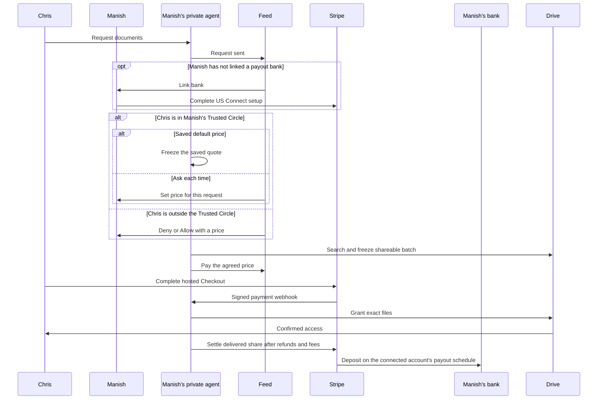

# Drive request payment gate

## Visual Context

Canonical visual owner: [Architecture Index](../architecture/README.md).

## User story

The owner sets a whole-dollar default from $1 to $500 in **Profile → Request
pricing**. **Save** makes it available to future requests; **Ask each time**
removes the automatic default. An unset price is not a $10 quote. Existing
requests retain the price already agreed or recorded on their order. Owners link
or manage a US bank through **Profile → Payouts** and Stripe-hosted Connect
onboarding. One does not collect bank credentials or use Plaid for this flow.

A requester can send a document request even if the owner has not finished payout
setup or set a price. The durable request waits, and Feed asks the owner to
**Link bank** first. No new payment order, Checkout or file grant is permitted
until the required owner setup is ready. A browser return from Stripe is only a
hint: the backend checks the connected account's submitted details, transfer
capability, bank payout capability and US eligibility before readiness changes.

For a current Trusted Circle request with a saved price and ready payouts, the
private agent can search while the owner is away, freeze the first nonempty
shareable batch, and put the agreed **Pay** action in the requester's Feed.
For **Ask each time**, Feed asks the owner to **Set price** for this request.
That fixes a request-specific quote without adding a non-trusted Allow record or
bypassing later Trusted Circle checks. Saving a global default can also resume
an unquoted trusted request. Once Stripe confirms payment, the Drive worker
continues exact-file grants without an additional approval.

An outside-circle request waits for the owner's decision. **Allow** opens a
price sheet with the request's purpose, period, recipient Google account and
Viewer access terms. The owner chooses a whole-dollar price and confirms that
review's revision. This both consents to the request and fixes its price; merely
setting a global default or linking a bank never approves a non-trusted request.
The same automatic search, payment and grant pipeline then runs. **Deny** starts
no search. Requests that cannot use the automatic Allow path keep their existing
manual exact-file review and payment gate.

Each request has **one charge**, independent of document count or progressive
25-file batches. No payment is created when search finds zero shareable files.
Requesters see the amount before they pay. No files or usable recipient links
are released before a signed payment confirmation. Historical free requests
remain free; old merchant-only orders retain their original terms and are never
backfilled into owner earnings.

Profile → Payouts shows document **Transactions** and separate **Bank deposits**.
Transaction details show the actual charge, refund, 3% Hussh commission, Stripe
processing fee and owner's net earnings. Unknown fees or net amounts show
**Calculating**, not zero. A transfer to the owner's Stripe balance is labelled
**Transferred to Stripe**; only Stripe's bank-payout state is labelled paid to the
bank. Feed and the open payout view reconcile live state without a manual refresh.

The payment layer exposes only opaque workflow identifiers to Stripe. The
existing live Drive search still runs on the backend with Manish's delegated
Google access and server-readable encrypted metadata. It should not be described
as end-to-end or strict cryptographic zero knowledge of the Drive documents.

## Search latency and bounded requests

Trusted, owner-allowed and owner-reviewed requests use the same metadata search
engine.
New request planning runs concurrently with already queued searches, so a slow
planner does not consume their worker slice before Google receives a query.
The existing authority checks, durable checkpoints and retry backoff remain in
the critical path.

The Documents agent expresses an explicit file count as `result_limit` (1–1,000)
with recent ordering. A date count such as “last three days” is not a file limit.
For generic “latest 100 documents,” the engine queries original files with native
timestamp ordering in the user corpus and each member shared drive. It stops
older pagination within a corpus only after enough distinct matches and the
complete boundary timestamp tie. Requested dates still apply to every match.
This direct-original scope does not expand shortcut aliases or folders; original
files in nested folders remain searchable through their corpus.

Topic and exact-title requests retain their existing discovery semantics,
including shortcut resolution and topical folders. Full-text results cannot
establish newest-N from their first page, so these requests finish their coverage
before ranking. Incomplete searches, invalid timestamps and scan limits cannot
produce a finalized bounded selection or payment. Valid out-of-order provider
pages disable early stopping and fall back to exhaustive collection.

For every bounded request, the store deduplicates candidates and selects the
newest N globally using the requested timestamp and a deterministic file-ID tie
break. It freezes final positions atomically. Intermediate candidates cannot be
reviewed, paid for or shared. Unshareable files within the newest N are not
silently replaced with older files. Once finalized, the automatic path or the
owner's review continues, followed by one request-bound payment.

Automated synthetic provider tests compare identical selections across 10,000
originals in two corpora: ordinary and tied latest-100 cases need 5 provider calls
and 400 scanned rows, versus 101 calls and 10,000 rows for exhaustive discovery.
The test includes both authority modes and a date-filtered case. These figures
prove less application work, not Google production latency or superiority to the
Drive UI. Provider, credential, search-page, commit and handoff timings remain
separate in correlated runtime telemetry; no end-to-end time guarantee is made.

Google's [files.list contract](https://developers.google.com/workspace/drive/api/reference/rest/v3/files/list),
[search semantics](https://developers.google.com/workspace/drive/api/guides/ref-search-terms),
and [shared-drive coverage](https://developers.google.com/workspace/drive/api/guides/enable-shareddrives)
define the native query, pagination and corpus boundaries used here.

## Authority and state

1. A new eligible request is created with `payment_required=true` only when
   `DRIVE_REQUEST_PAYMENTS_ENABLED=true`. Trusted-auto requests retain the
   existing Trusted Circle, verified identity, live connection, owner preference,
   and request-expiry checks. A request from outside the Trusted circle does
   nothing until the owner decides. Allow is accepted only while the request is
   pending, unexpired, not stopped, has a date range and has not started a
   search, the requester is not a current Trusted member, the owner's Drive is
   live, and the two people still have an active connection. Allow re-seals the
   request envelope with the `trusted_auto` marker and an owner Allow record
   holding the price. Every automatic recheck then accepts either current
   Trusted membership or that sealed record with an active connection between
   the two people. The plaintext `owner_allowed_at` column is the Consent
   Center's projection hint and never grants authority, but it can end it: a
   disconnect clears it in the same transaction, so the Allow ends for good.
   Reconnecting never restores it, as it never restores revoked scope grants or
   named Circles. A pending automatic request then returns to the owner's
   manual review, as a Trusted request does when its Trusted relationship
   changes. The separate trusted **Set price** operation changes only the quote,
   checks current trust, revision, expiry and no existing order/search, and never
   creates the sealed owner Allow record.
2. New paid requests carry a sealed `owner_settlement_required` marker. Missing
   bank readiness, an unset price or paused owner payouts keeps the request
   pending. Setup completion resumes only live, unpaid, unordered requests and
   preserves consent and existing quotes. Preparation freezes at least one
   shareable file before it creates the single request-bound payment order and
   durable requester Feed event. Owner-private
   filenames, request wording, contents, Google IDs, and email addresses stay out
   of the payment order, Stripe metadata, webhook logs, and push notification.
3. Only the authenticated requester may create or reuse a Stripe-hosted Checkout
   Session. Checkout charges `usd` and the amount stored on the order, with a
   server-selected return origin. The order fixes that amount when it is
   created from the saved default or the owner's request-specific quote. New
   owner-settlement requests with no valid quote cannot fall back to `1000` cents.
   Migration 291 limits every live order and retained
   obligation to whole dollars from `100` to `50000` cents. A success URL is an
   indication to refresh status, never proof of payment.
4. The public webhook verifies Stripe's signature on the raw request body,
   matches its session, amount, currency, request ID, and opaque payer binding to
   the stored order, and settles once. Replayed or out-of-order events cannot
   create a second grant authority. The database row is the source of truth.
5. Bulk approval, bulk worker claims, legacy per-file grant claims, and recipient
   link projections check the paid order transactionally before a grant can be
   dispatched or shown. Revocation, erasure, and provider reconciliation retain
   their existing authority paths.
6. The Feed row is durable. Push notification is best effort and contains only
   fixed copy and an opaque request ID: **Payment needed** and "Pay in One to
   continue your document request." The push never carries the price. Opening
   Feed or returning from Checkout reads authoritative server state.
7. A paid request that reaches a terminal state with zero confirmed grants is
   held from further sharing and enters one durable Stripe refund attempt. The
   private scheduled sharing drain checks uncertain outcomes before issuing a
   refund, reconciles the Stripe PaymentIntent on retry, and sends Chris a
   durable refund Feed update after Stripe confirms success. A payment arriving
   after authority is lost is held for the same reconciliation path.

## Configuration and rollout

The backend deployment has a fail-closed `DRIVE_REQUEST_PAYMENTS_ENABLED` switch.
It requires `STRIPE_SECRET_KEY` and `STRIPE_WEBHOOK_SECRET` secrets in the same GCP
project before enabling. `STRIPE_MODE` selects `test` or `live`; the API key must
match that mode, and production requires `live`. The webhook signing secret must
belong to the matching endpoint and mode. `APP_FRONTEND_ORIGIN` supplies the canonical HTTPS Checkout return
origin. The backend refuses Checkout if these values are absent or mismatched.

1. In `hushh-pda-uat`, create enabled Secret Manager versions named
   `STRIPE_SECRET_KEY` (Stripe test secret key) and `STRIPE_WEBHOOK_SECRET`
   (signature secret for the UAT endpoint). Give the backend runtime service
   account access. Register the public
   `/api/payments/stripe/webhook` endpoint in the same Stripe test account for
   `checkout.session.completed`, `checkout.session.async_payment_succeeded`, and
   `checkout.session.expired`. The service also treats the stored provider expiry
   timestamp as authoritative, so an expired checkout cannot keep a payment push
   alive while its expiry event is delayed.
   Never put a Stripe key, webhook secret, document metadata, or a live Checkout
   URL in GitHub variables, build substitutions, logs, or client code.
2. Deploy the release manifest through migration 297 and backend/frontend code
   before enabling owner settlement. Confirm
   historic requests and explicit owner approval still work. Keep GitHub UAT
   variable `DRIVE_REQUEST_PAYMENTS_UAT_ENABLED=false` until the bulk/erasure
   concurrency check below passes against PostgreSQL. After that check and
   Stripe test secrets are ready, enable the governed UAT deploy. It refuses to turn
   on without both project secrets.
3. Exercise both paths with a fresh request: no files produces no payment; a
   frozen nonempty batch produces one concise payment Feed item; a request from
   outside the Trusted circle stays blocked until the owner decides; Allow at $20
   produces a **Pay $20** item and the Stripe Checkout total matches; Deny shows
   the requester a declined request and starts no search; a Trusted request uses
   the saved default (for example $5); with no default, Set price affects only
   that request; missing bank setup blocks payment until verified; before payment,
   no Google ACL or recipient link exists; a test
   payment settles by webhook and resumes grants; a browser return alone changes
   nothing. Repeat with replayed webhooks, two devices, multiple requests,
   expired/cancelled requests, zero-delivery refunds, notification delivery
   failure, and background off. The private Drive worker also needs the UAT
   Stripe secrets so its scheduled sharing drain can reconcile refunds.
4. Production remains off until its live Drive worker/scheduler and the same
   acceptance path work. Put the production `sk_live_` key and the production
   endpoint's `whsec_` secret in `hushh-pda` Secret Manager, register the public
   production webhook URL, set GitHub variable
   `DRIVE_REQUEST_PAYMENTS_PROD_ENABLED=true`, and use the governed production
   deployment. Owner payouts additionally require an explicitly enabled
   production rollout, live US Connect onboarding and its separate Connect
   webhook; changing test keys alone does not enable them. Test a low-volume real
   payment, confirmed grant, owner transfer and bank-payout event before expanding
   exposure.

Release requester clients that accept owner prices before owners can set one.
iOS and Android builds bundle the web assets, and a build released before owner
pricing shows a Pay row and accepts a payment status only for a `1000`-cent
order. On such a build, an owner-priced order fails closed: the requester sees
no Pay action and can't check out, so nothing is charged or shared, and the
request expires. Legacy `$10` orders still work there. Those earlier native
builds also lack the new nullable quote/readiness contract. This rollout validates
the web/UAT journey; native store distribution is a separate release task and
must carry these requester contracts before exposing the new flow there.

Turning the switch off stops marking new requests as paid-required. Already
marked requests stay gated so disabling the switch cannot bypass a charge in
progress. All three backend deployment lanes keep existing Stripe credentials
bound while the switch is off, allowing Checkout and signed webhooks to finish
for those requests. Keep the Stripe secrets and webhook endpoint available until
outstanding payments and refunds reconcile. If an incident requires stopping
Checkout itself, hold affected requests operationally and reconcile their orders
before removing credentials. Live orders cascade on request/account erasure, while
an account-free payment obligation retains only the random request UUID, payer
digest, amount and currency, provider identifiers and delivery outcome flags.
It lets the signed webhook and refund drain settle late charges without restoring
either participant's account or document details. Stripe's merchant records
follow the payment account's separate retention rules.

### Migration 291: owner Allow and owner price

Migration 291 adds the nullable `drive_share_requests.owner_allowed_at` column.
It replaces the `amount_cents = 1000` checks on `drive_request_payment_orders`
and `drive_request_payment_obligations` with one bound: whole dollars from `100`
to `50000` cents. It finds the old checks by definition, not by generated name.
The database `1000` default remains for legacy compatibility. New owner-settlement
requests require an explicit valid quote; a disabled owner default is never
interpreted as this legacy amount. Every step is catalog-guarded, so a replay
changes nothing and waits behind no live reader or writer.

The rollback refuses while any live order or retained obligation holds a price
other than `1000` cents, because the restored check would reject that row.
Otherwise it restores the fixed check and drops the column. Sealed owner Allow
records stay in request envelopes. The previous release requires current Trusted
membership for automatic work, so those requests stop instead of sharing.

### Activation check: bulk sharing and account erasure

Bulk create, approve, retry, stop, claim, settle, release, and request refresh
now take sorted owner and recipient graph advisory locks before connector,
share, request, or payment order locks when they may write identity-bearing
rows or Feed events. This aligns with account erasure, which takes exclusive
graph locks first. Before enabling new paid requests, exercise concurrent
erasure with freeze, approval, and effect settlement against PostgreSQL; local
unit checks cannot prove the absence of a database deadlock. Payment order,
webhook, and refund paths follow the same graph-first rule before identity
writes.

## Owner settlement (new paid requests)

Hussh charges the requester through its US Stripe platform account. Every new
paid document request requires owner settlement. Its payment order and owner
ledger enroll atomically when `DRIVE_REQUEST_OWNER_PAYOUTS_ENABLED=true`; if that
rollout is off, the new request waits instead of silently using merchant-only
terms. Earlier orders are not backfilled. The document owner must complete
Stripe Connect onboarding for a US account before search/payment admission;
Checkout verifies the live account again before charging. Plaid is not involved
in owner settlement.

The private worker transfers the owner's share to their connected Stripe balance
only after the request reaches a terminal delivery outcome and Google confirms
access to the delivered files. A Stripe transfer is **not** proof that money has
arrived in the owner's bank; Stripe's connected-account payout schedule controls
that later step. No files delivered means a full requester refund and no owner
transfer. When only part of the approved set is delivered, the requester receives
a proportional refund before any owner transfer. Uncertain grant, refund or
transfer outcomes remain held for reconciliation; the worker never guesses that
delivery or a refund succeeded.

Hussh keeps **3% of the retained charge**. The owner bears the **actual Stripe
payment processing fee** on that charge, with the deduction capped at the
remaining retained proceeds. For example, on a fully delivered $10 order with a
$0.59 Stripe processing fee, Hussh keeps $0.30 and $9.11 is transferred to the
owner's Stripe balance. Stripe's actual balance transaction, rather than this
example fee, is authoritative. If retained proceeds cannot cover the fee, Hussh
absorbs the difference. Refunds, disputes and transfer reversals are reconciled
separately; a refund does not automatically reverse a Stripe Connect transfer.

Deploy migrations 292–294 and 297 with the flag off first. The UAT API and private
Drive worker both read GitHub variable `DRIVE_REQUEST_OWNER_PAYOUTS_UAT_ENABLED`,
defaulting to `false`; enable it only with matching Stripe credentials, a
completed US owner Connect account and the payment acceptance checks above.
The UAT release refuses an enabled rollout if Stripe secrets are absent.
Production API and worker keep this payout flag off in this release. Turning the
flag off pauses new order enrollment and new owner-paid Checkout, while already
paid obligations remain subject to delivery, refund and transfer reconciliation.
Do not remove Stripe secrets while any charge, refund or transfer is unresolved.

Register a separate connected-account event destination at
`/api/one/payouts/connect/webhook` for `account.updated`, `payout.created`,
`payout.updated`, `payout.paid` and `payout.failed`. Its
`STRIPE_CONNECT_WEBHOOK_SECRET` must be distinct from the platform Checkout
webhook secret and belong to the same test/live mode. The public API receives
these webhooks; the private Drive worker uses the payment API credentials for
settlement and does not receive public webhooks.

### UAT live payments

`STRIPE_UAT_MODE` is a GitHub UAT environment variable (`test` by default). Both
API and private worker source `deploy/drive/uat_stripe_bindings.sh` so they select
one mode and one secret family. With `live`, UAT binds `STRIPE_LIVE_SECRET_KEY`,
`STRIPE_LIVE_WEBHOOK_SECRET` and `STRIPE_LIVE_CONNECT_WEBHOOK_SECRET` in
`hushh-pda-uat` to the existing runtime variable names. Existing sandbox secrets
stay unchanged, including for old revisions. Production deployment is separate.

The live endpoints are `https://api.uat.hushh.ai/api/payments/stripe/webhook` and
`https://api.uat.hushh.ai/api/one/payouts/connect/webhook`. Their signing secrets
must be distinct from production and sandbox endpoints. Connect also receives
`account.external_account.created`, `account.external_account.updated` and
`account.external_account.deleted` so bank changes invalidate readiness.

Use two governed releases of the same exact commit:

1. Keep `STRIPE_UAT_MODE=test`. Apply migration 298 and deploy the mode-aware API
   and private worker. Verify both serving revisions use that commit and test
   secret bindings; record these revisions as the rollback targets. Do not flip
   mode while either serving role still runs older, mode-unaware code.
2. Provision the three `STRIPE_LIVE_*` secrets above and their matching live
   endpoints, initially disabled. After phase one's serving checks pass, enable
   both live endpoints and verify they are active immediately before setting
   `STRIPE_UAT_MODE=live` and dispatching the governed backend release of the same
   commit, which also deploys the private worker. The serving test runtime rejects
   live signatures or mode while Stripe retains and retries deliveries; live
   Checkout starts only when the live API serves. Do not promote a live API while
   either live endpoint remains disabled, which could lose the first payment's
   event delivery.
   Verify both serving revisions, `STRIPE_MODE=live`, the exact live secret
   family, and a read-only Stripe response with `livemode=true` after promotion.

If phase two fails, restore both recorded mode-aware test revisions and their
scheduler routing, and reset `STRIPE_UAT_MODE=test` for subsequent releases.
Retain migration 298, both secret families, and all financial history. Never
retag live money as test or roll back to mode-unaware code. A return to test
pauses live settlement; preserve the live endpoint configuration and reconcile
any outstanding live charges, refunds and transfers through a verified live
runtime before retiring it.

Never replace a test key in an old serving revision: cached test accounts and
unfinished sandbox orders cannot authorize live charges, refunds or transfers.
Owners complete
live Stripe verification and bank setup before paid-request admission. Test
history stays identified as test history, not real bank proceeds. Verify both
serving roles' mode and secret bindings after the governed release, and confirm
Stripe reports `livemode=true` with a read-only provider call. Do not use real
charges, transfers or bank edits as automated deployment probes.

### Migration 297: payout readiness and earnings updates

Migration 297 adds `pkm_owner_payout_accounts.account_ready`, initially false.
Existing bank mappings must be reverified against full Stripe readiness; the old
`payouts_enabled` field alone is insufficient. Replaying the migration preserves
already verified readiness. It also adds a security-definer trigger with a fixed
search path and no PUBLIC execution grant. A real owner-earning status change
emits only the owner-scoped `bank_payout_changed` wake signal. Amounts, request
text and provider identifiers stay out of that signal. Clients then reread their
own authenticated history; Postgres notification is a wakeup, not the ledger.

The rollback drops the trigger, its function and readiness cache without
changing requests, charges, refunds, transfers or balances. Reapplying starts
cached readiness at false. Roll back application/worker readers before dropping
the column; a code rollback must also account for new requests held under the
owner-settlement marker. The isolated PostgreSQL acceptance test executes
forward, replay, status notification, rollback twice and reapply, and verifies
ledger preservation. Release schema contracts in all lanes require the column
and trigger function. A backend-containing UAT deploy applies this migration
before promoting the API, then deploys the private Drive worker from the same
pinned image/SHA.

### Migration 298: Stripe mode isolation

The canonical base release manifest registers `298_stripe_mode_isolation.sql`
and its non-destructive rollback. Dev, UAT, and production schema contracts
require `stripe_owner_payout_accounts`, the mode columns on document payment
orders, retained obligations, owner earnings and packet orders, plus
`mirror_drive_request_stripe_mode()` and `bind_stripe_checkout_mode()`. The old
owner mapping remains intact for
rolling deployments; the new mapping is keyed by owner and `test`/`live` mode.
Existing Checkout IDs with a provider-defined test/live prefix classify known
historical orders. The same binding trigger classifies Checkout IDs written by
old replicas during promotion and rejects changes to an already bound mode. Unknown rows stay `legacy`; they cannot be promoted to live
merely by changing a runtime key. Bank external-account events join the existing
signed-event constraint without adding bank credentials to stored receipts.

Rollback preserves mode columns, mapped accounts, and all financial records.
Restore the matching prior application and Stripe configuration together; do
not drop the mode boundary or copy live accounts into the legacy test mapping.
Schema presence is a local contract check; provider connectivity, same-mode
webhooks, and the final serving deployment need separate runtime verification.

## Refund reconciliation

The refund worker records `first_dispatch_at` in the database before its first
Stripe call. On an uncertain Stripe response, it lists refunds for the exact
PaymentIntent and may retry `Refund.create` with the **same** request attempt
idempotency key only during the first 20 hours. Stripe may prune an idempotency
key after 24 hours, so a later create could issue a second refund if the first
response was lost. The worker stops creating after its shorter window and sets
`manual_review`; it continues read-only Stripe checks once per hour and will
record a matching refund made through Stripe. [Stripe idempotency reference](https://docs.stripe.com/api/idempotent_requests).

Monitor `drive_request_payment_refunds` for `manual_review` or `failed`, joined
to `drive_request_payment_obligations` by `request_id`. For `manual_review`, inspect
the stored PaymentIntent and its refunds in the same Stripe account. If Stripe
has no refund matching `drive_request_payment_refunds.amount_cents` (or the full
obligation amount for a legacy null amount), issue that exact amount manually
for the PaymentIntent; the worker will observe it. If the request still exists,
it emits the refund Feed event after Stripe confirms success; after account
erasure, the retained obligation and Stripe refund are the operational evidence.
Resolve a mismatched, failed, or canceled provider refund with payment operations
before changing a local order. A full refund keeps the order's
`reconciliation_required` hold until confirmation; a partial refund preserves the
paid order for files that were actually delivered. A browser return or operator
assumption is never payment or refund proof.
