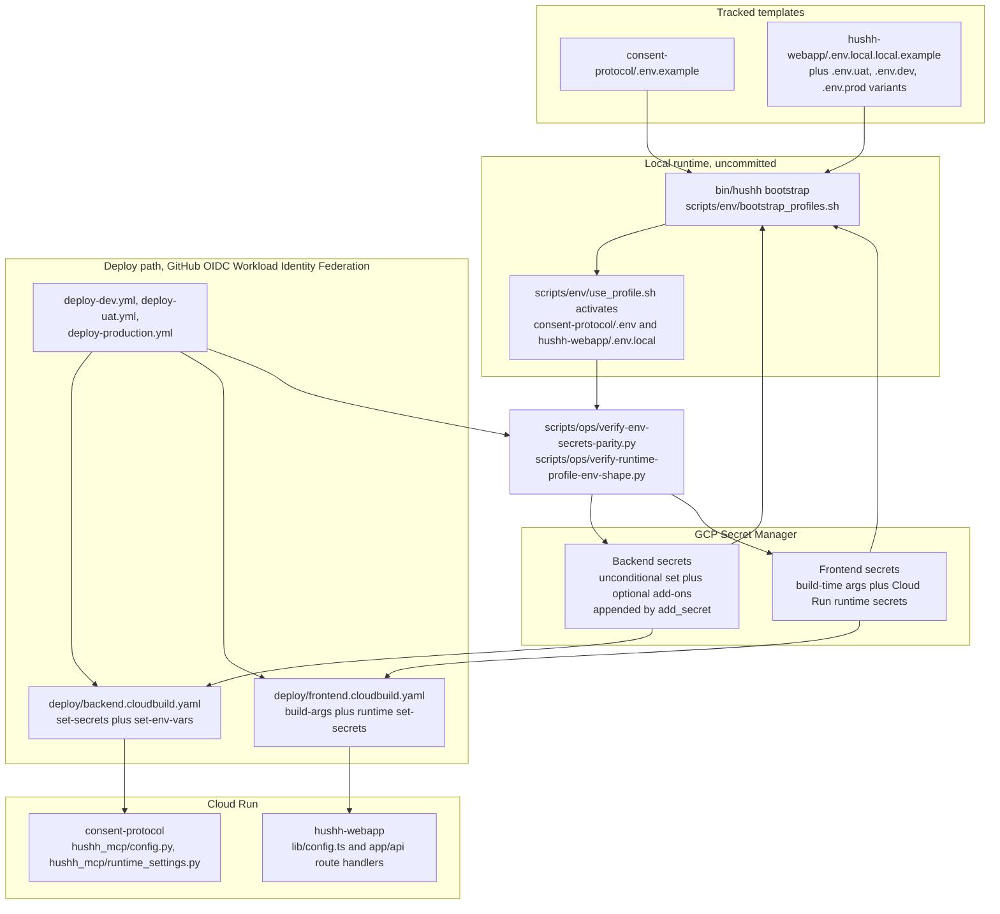

# Environment Variables and Secrets Reference

> Single source of truth for env vars and **strict parity** with code and GCP Secret Manager.  
> **Rule:** What is in `.env` / Secret Manager must match exactly what the code reads — no extra keys, no missing keys.


## Visual Context

Canonical visual owner: [Operations Index](README.md). Use that map for the top-down system view; this page is the narrower detail beneath it.

See also: [deploy/README.md](../../../deploy/README.md), [consent-protocol/.env.example](../../../consent-protocol/.env.example), [hushh-webapp/.env.example](../../../hushh-webapp/.env.example), [deploy/.env.backend.example](../../../deploy/.env.backend.example), [deploy/.env.frontend.example](../../../deploy/.env.frontend.example). For FCM push notifications, see [fcm-notifications.md](../../../consent-protocol/docs/reference/fcm-notifications.md).

## Visual Map

Where env values originate, how they reach each runtime, and which scripts
enforce the parity rule. Counts live in the cloudbuild files, not here, because a
number written in prose drifts the first time a secret is added.



---

## Parity rule: code ↔ .env ↔ Secret Manager

- **Local:** `.env` (backend) and `.env.local` (frontend) must contain exactly the keys the application code reads. Use the repo `.env.example` files as the template; they are audited to match the code.
- **Production:** GCP Secret Manager must hold **exactly** the secrets the code expects — no more, no less. The Cloud Build config (`deploy/*.cloudbuild.yaml`) injects only these; do not add secrets that are not read by the code, and do not remove any that are.
- **Canonical runtime modes:** the supported frontend `local`, `uat`, `dev`, and `prod` files must share one frontend key shape. The backend contributor runtime stays local-only in `consent-protocol/.env`. The hosted `dev` environment is a UAT infrastructure replica that keeps the `uat` runtime identity; see [consent-protocol/docs/reference/dev-environment-setup.md](../../../consent-protocol/docs/reference/dev-environment-setup.md).

## Canonical 3-environment contract

1. Backend environment identity is `ENVIRONMENT` and must be one of: `development`, `uat`, `production`.
2. Frontend environment identity is `NEXT_PUBLIC_APP_ENV` and must be one of: `development`, `uat`, `production`.
3. Legacy frontend fallback keys are read-only compatibility paths for one release cycle:
- `NEXT_PUBLIC_OBSERVABILITY_ENV`
- `NEXT_PUBLIC_ENVIRONMENT_MODE`
4. Local runtime-mode model (non-committed):
- backend template/source: `consent-protocol/.env.example` -> `consent-protocol/.env`
- frontend templates: `hushh-webapp/.env.local.local.example`, `hushh-webapp/.env.uat.local.example`, `hushh-webapp/.env.dev.local.example`, `hushh-webapp/.env.prod.local.example`
- local source files are created from templates and kept uncommitted
- active files: `consent-protocol/.env`, `hushh-webapp/.env.local`
- PKM rehearsal toggles, maintainer smoke identities, and review/bypass overlays belong in maintainer-only overlays, not in the canonical contributor runtime files.
5. Runtime profile bootstrap command:

```bash
./bin/hushh bootstrap
```

This is the supported contributor entrypoint. It installs dependencies, hydrates local runtime-profile files from templates plus current cloud secrets/runtime metadata when available, and runs the profile doctor.
It does not print secret values and sets profile files to `chmod 600`.
For backend Gmail and voice, bootstrap hydrates `consent-protocol/.env` using the same key names as hosted runtime. Missing Gmail/voice cloud values are warnings by default and only become failures with `--strict`.

### Local agent credential resilience

Local profile hydration is read-only and uses this ordered credential policy:

1. refreshable `gcloud` user credentials;
2. refreshable Application Default Credentials (ADC) when the interactive `gcloud` session has expired;
3. existing local profile values only when neither source can refresh.

Bootstrap never prints a credential or secret. It fails closed for an invalid local
`APP_SIGNING_KEY` or `VAULT_DATA_KEY` instead of reporting a stale cache as ready.
This improves agent-session resilience but does not bypass a Google Workspace
session policy: if ADC itself expires, reauthenticate with
`gcloud auth application-default login`. Use `gcloud auth login` only when you
also need interactive CLI operations. Do not create service-account key files for
local agent operation; GitHub deployment remains on its separate OIDC/WIF path.

6. Activate the chosen runtime profile:

```bash
./bin/hushh doctor --mode local
./bin/hushh web
./bin/hushh web --mode uat
./bin/hushh web --mode prod
./bin/hushh native ios --mode uat
./bin/hushh native android --mode uat
```

Low-level activation still exists when you need it:

```bash
bash scripts/env/use_profile.sh local
bash scripts/env/use_profile.sh uat
bash scripts/env/use_profile.sh prod
```

The local UAT-backed backend launcher now runs IAM schema verification before booting. If IAM is incomplete, it exits instead of silently falling back to investor-compatibility mode.

Profile-aware frontend-only launcher:

```bash
cd hushh-webapp
npm run dev -- --mode=local
```

### One-command parity audit

```bash
python3 scripts/ops/verify-env-secrets-parity.py \
  --project hushh-pda \
  --region us-central1 \
  --backend-service consent-protocol \
  --frontend-service hushh-webapp
```

Native release preflight (adds required native Firebase and signing keys):

```bash
python3 scripts/ops/verify-env-secrets-parity.py \
  --project hushh-pda-uat \
  --require-native-artifacts
```

The script reports:
- required backend/frontend key lists
- whether each required key exists in the target project
- missing keys (if any), with non-zero exit on failure

When `--require-gmail` is set, it also checks without rendering values that
`GMAIL_OAUTH_REDIRECT_URI` equals
`APP_FRONTEND_ORIGIN + /one/profile/gmail/oauth/return`. This blocks a deployment
whose Gmail callback secret belongs to another environment.

Deploy workflows add Gmail, One mailbox, and voice runtime checks with `--require-gmail --require-one-email --require-voice`. That enforcement stays in deploy/runtime verification and is not part of the default contributor PR CI lane.

### Runtime profile shape audit

Use this when the local profile files feel inconsistent or a new env key was added in only one place:

```bash
python3 scripts/ops/verify-runtime-profile-env-shape.py --include-runtime
```

It checks that:
- tracked backend profile templates share one canonical backend key set
- tracked frontend profile templates share one canonical frontend key set
- the real local canonical profile files and active `.env` / `.env.local` match those same shapes

### Firebase identity plane rule

1. The application uses one Firebase identity plane across `development`, `uat`, and `production`.
2. Environment separation is primarily at the database / backend runtime layer, not by changing the login provider between UAT and production.
3. The frontend and backend now use that same Firebase project directly; there is no separate auth-only override contract.
4. UAT and production share the live Plaid credential set; only local development should use sandbox Plaid secrets and `PLAID_ENV=sandbox`.
5. Web consent delivery uses different defaults by environment:
   - local development: `CONSENT_SSE_ENABLED=true`
   - UAT: `CONSENT_SSE_ENABLED=true`
   - production: `CONSENT_SSE_ENABLED=false` unless there is an explicit incident-response or rollout reason to enable it
6. App-review toggles, reviewer identity secrets, bypass flags, and rehearsal keys are maintainer-only overlays and are intentionally excluded from the canonical contributor runtime contract.
7. UAT backend revisions still mount `REVIEWER_UID` and `REVIEWER_VAULT_PASSPHRASE` from Secret Manager so reviewer-mode smoke can mint the Firebase custom token after deploy.
8. The canonical non-production reviewer fixture is `REVIEWER_UID` plus `REVIEWER_VAULT_PASSPHRASE`; `UAT_SMOKE_*` and `KAI_TEST_*` are deprecated migration aliases, and no `NEXT_PUBLIC_*` passphrase is allowed.
9. Localhost private-agent review: the local backend loads `consent-protocol/.env.local` as a maintainer overlay (`hushh_mcp/runtime_settings.py`; the file is absent in deployed environments, so this is a no-op there, and `override=False` keeps the canonical `.env` authoritative). Use `bash scripts/env/reviewer_mode.sh enable`, restart the backend, and run the reviewer preflight with `REVIEWER_SECRET_PROJECT=hushh-pda-uat`; it resolves `REVIEWER_UID` and `REVIEWER_VAULT_PASSPHRASE` from Secret Manager only into the test process. The overlay holds only `APP_REVIEW_MODE=true`; it never holds reviewer secrets. The preflight proves the localhost custom-token minter is enabled before Chromium launches, and the standard rehearsal blocks unapproved state-changing HTTP. Afterward, disable the mode and restart the backend. The overlay never ships.

### Environment divergence note (current)

1. UAT and production use the same canonical frontend key shape.
2. Each deployed environment resolves one active analytics measurement ID and one active GTM ID.
3. Maintainer-only overlays are intentionally excluded from generated contributor runtime files.

### Ops-only GitHub identity variables (deploy/backup governance)

These are not Cloud Run runtime secrets.

- Required on each `dev`, `uat`, and `production` GitHub environment:
  `GCP_WORKLOAD_IDENTITY_PROVIDER` and `GCP_DEPLOY_SERVICE_ACCOUNT`.
- UAT and production declare these required names in
  `config/ci-governance.json`; run
  `python3 scripts/ci/verify-deployment-environment-governance.py` to detect
  missing environment configuration before dispatch. The workflow reads
  `vars.*`, so setting same-named GitHub environment secrets does not satisfy
  the contract.
- Required as repository variables for the scheduled production backup posture
  workflow: `GCP_WORKLOAD_IDENTITY_PROVIDER` and
  `GCP_BACKUP_SERVICE_ACCOUNT`.
- These identities use GitHub OIDC Workload Identity Federation. Do not create,
  upload, or restore a service-account JSON key for deployment or backup jobs.

Used by:
- `.github/workflows/deploy-dev.yml`
- `.github/workflows/deploy-uat.yml`
- `.github/workflows/deploy-production.yml`
- `.github/workflows/prod-cloudsql-backup-posture.yml`

---

## Audit: env vars read by code

### Backend (consent-protocol)

| Variable | Where read | Required | Notes |
|----------|------------|----------|--------|
| `APP_SIGNING_KEY` | `hushh_mcp/config.py` | Yes | Min 32 chars (64-char hex recommended); signing/state integrity only |
| `VAULT_DATA_KEY` | `hushh_mcp/config.py` | Yes | Exactly 64-char hex; root for vault/PKM encryption and purpose-separated HKDF keys that protect encrypted nearby-presence anchors and opaque spatial/roster indexes; never used for signing |
| `DB_USER` | `db/connection.py`, `db/db_client.py` | Yes | |
| `DB_PASSWORD` | same | Yes | |
| `DB_HOST` | same | Yes | |
| `DB_PORT` | same | No (default 5432) | |
| `DB_NAME` | same | No (default postgres) | |
| `APP_FRONTEND_ORIGIN` | `server.py` | Yes (prod CORS fallback) | |
| `CORS_ALLOWED_ORIGINS` | `server.py` | Yes (prod recommended) | Explicit comma-separated CORS allowlist |
| `FIREBASE_ADMIN_CREDENTIALS_JSON` | `api/utils/firebase_admin.py`, `hushh_mcp/runtime_settings.py` | Yes (auth) | Canonical Firebase Admin and Workspace DWD credential. Approved Workspace client ID: `109021324828349644970`. |
| `FIREBASE_SERVICE_ACCOUNT_JSON` | `hushh_mcp/runtime_settings.py` | Optional alias | Runtime compatibility alias for `FIREBASE_ADMIN_CREDENTIALS_JSON`; do not introduce for new config. |
| `HUSHH_GENAI_AUTH_MODE` | `hushh_mcp/runtime_providers/factory.py` | Yes (hosted) | Must be `vertex_adc`; hosted API-key mode is rejected. |
| `GOOGLE_API_KEY` / `GEMINI_API_KEY` | `hushh_mcp/runtime_providers/factory.py` | Local only | Explicit `developer_api_key` compatibility mode only; never a hosted secret. |
| `GOOGLE_CLOUD_PROJECT` / `GOOGLE_CLOUD_LOCATION` | `hushh_mcp/runtime_providers/factory.py` | Yes (hosted) | Vertex routing metadata. Hosted text uses `global` so both Gemini 3.5 Flash and Gemini 3.1 Flash-Lite resolve; credentials come from Cloud Run workload ADC. |
| `HUSHH_VERTEX_LOCATIONS` | `hushh_mcp/runtime_providers/factory.py` | No | Ordered same-model failover candidates for managed Vertex ADC. Use the approved shared set `global,us,eu`; candidates never change the model or authorization behavior. |
| `GOOGLE_MAPS_API_KEY` | `hushh_mcp/config.py`, `hushh_mcp/services/google_maps_service.py` | Yes (One Location maps) | Server-side Google Maps Platform key for Places New, Geocoding, and Routes. Never expose as `NEXT_PUBLIC_*`. |
| `ONE_EMAIL_ADDRESS` | `hushh_mcp/services/support_email_service.py`, `hushh_mcp/services/one_email_kyc_service.py` | Optional | Canonical One mailbox identity. Default: `one@hushh.ai`. |
| `ONE_EMAIL_SERVICE_ACCOUNT_JSON` | `hushh_mcp/services/one_email_kyc_service.py` | Optional override | Prefer `FIREBASE_ADMIN_CREDENTIALS_JSON`; only use by approved exception. |
| `ONE_EMAIL_DELEGATED_USER` | `hushh_mcp/services/one_email_kyc_service.py` | Optional override | Real Workspace mailbox to impersonate for One intake. Defaults to `ONE_EMAIL_ADDRESS`. |
| `ONE_EMAIL_PUBSUB_TOPIC` | `hushh_mcp/services/one_email_kyc_service.py` | Yes (One email intake) | Gmail watch Pub/Sub topic for `one@hushh.ai`. |
| `ONE_EMAIL_WEBHOOK_AUDIENCE` | `hushh_mcp/services/one_email_kyc_service.py` | Yes (hosted intake) | Expected Pub/Sub push OIDC audience. Falls back to `GMAIL_WEBHOOK_AUDIENCE`. |
| `ONE_EMAIL_WEBHOOK_SERVICE_ACCOUNT_EMAIL` | `hushh_mcp/services/one_email_kyc_service.py` | Recommended | Expected Pub/Sub push service account. Falls back to `GMAIL_WEBHOOK_SERVICE_ACCOUNT_EMAIL`. |
| `ONE_EMAIL_WEBHOOK_AUTH_ENABLED` | `hushh_mcp/services/one_email_kyc_service.py` | Yes (hosted intake) | Must be `true` in UAT/production so Pub/Sub push OIDC verification cannot silently default off. |
| `ONE_EMAIL_WATCH_RENEW_TOKEN` | `api/routes/one/email.py` | Yes (hosted watch renewal) | Shared maintenance token for `POST /api/one/email/watch/renew`. |
| `ONE_EMAIL_WATCH_RENEW_AUTH_ENABLED` | `api/routes/one/email.py` | Yes (hosted renewal) | Must be `true` in UAT/production so maintenance endpoints require `X-Hushh-Maintenance-Token`. |
| `ONE_LOCATION_RETENTION_TOKEN` | `api/routes/one/location.py` | Yes (hosted retention) | Dedicated maintenance token for One Location retention purge. It is not shared with One Email maintenance tokens. |
| `ONE_LOCATION_RETENTION_AUTH_ENABLED` | `api/routes/one/location.py` | Optional local/test override | One Location retention auth defaults on; `false` is honored only in local/test environments. |
| `ONE_LOCATION_READ_ONLY_STATE_ENABLED` | `hushh_mcp/services/one_location_agent_service.py` | Hosted rollout gate | The service defaults to read-only state projection when this key is absent. Hosted secret generation defaults it to `false`; dev/production pin it off, and UAT may opt in only after the deploy privately verifies the canonical enabled scheduler, exact HTTPS purge URI, POST method, and a non-empty maintenance-auth header without printing its value. |
| `ONE_LOCATION_NEARBY_PRESENCE_MODE` | `api/routes/one/location.py` | Optional non-production override | `disabled` or `uat_simulation`. Development/UAT/staging default to the simulation; production remains disabled even if misconfigured. |
| `ONE_EMAIL_KYC_STRICT_CLIENT_ZK_ENABLED` | `hushh_mcp/services/one_email_kyc_service.py` | Optional | Defaults to `true`. Backend orchestrates consent/send/writeback metadata only; it must not decrypt exports or persist review draft plaintext. |
| `ONE_EMAIL_KYC_DEFAULT_SCOPE` | `hushh_mcp/services/one_email_kyc_service.py` | Optional | Must be on the service allowlist. Current approved value: `attr.identity.*`. |
| `SUPPORT_EMAIL_DELEGATED_USER` | `hushh_mcp/services/support_email_service.py` | Optional override | Real Workspace mailbox to impersonate for support/invite send. Defaults to `ONE_EMAIL_ADDRESS`. |
| `SUPPORT_EMAIL_FROM` | `hushh_mcp/services/support_email_service.py` | Optional | Visible From address for support/invite send. Defaults to delegated user. |
| `SUPPORT_EMAIL_TO` | `hushh_mcp/services/support_email_service.py` | Optional | Support recipient. Defaults to `ONE_EMAIL_ADDRESS`. |
| `SUPPORT_EMAIL_TEST_TO` | `hushh_mcp/services/support_email_service.py` | Optional | Test recipient for non-production email verification. |
| `SUPPORT_EMAIL_MODE` | `hushh_mcp/services/support_email_service.py` | Optional | `live` or `test`. Non-production defaults to `test` when `SUPPORT_EMAIL_TEST_TO` exists. |
| `GMAIL_OAUTH_CLIENT_ID` | `hushh_mcp/services/gmail_receipts_service.py` | Yes (Gmail sync) | Gmail OAuth client id. Same key name across local, UAT, and production. |
| `GMAIL_OAUTH_CLIENT_SECRET` | `hushh_mcp/services/gmail_receipts_service.py` | Yes (Gmail sync) | Gmail OAuth client secret. Same key name across local, UAT, and production. |
| `GMAIL_OAUTH_REDIRECT_URI` | `hushh_mcp/services/gmail_receipts_service.py` | Yes (Gmail receipts and owner-approved send) | Environment-owned Gmail OAuth callback. It must equal `APP_FRONTEND_ORIGIN + /one/profile/gmail/oauth/return`; register that exact URI in the Google OAuth client for each environment. |
| `GMAIL_OAUTH_TOKEN_KEY` | `hushh_mcp/services/gmail_receipts_service.py` | Yes (Gmail sync) | Encryption key for persisted Gmail OAuth tokens. Same key name across local, UAT, and production. |
| `OPENAI_API_KEY` | `hushh_mcp/services/voice_intent_service.py` | Yes (voice) | Required for the Kai voice lane's realtime transcription, planning/composition, and TTS. |
| `VOICE_RUNTIME_CONFIG_JSON` | `hushh_mcp/runtime_settings.py`, `api/routes/kai/voice.py`, `hushh_mcp/services/voice_intent_service.py` | Yes (voice) | Structured voice runtime config covering rollout, canary, allowlists, fail-fast policy, and model defaults. |
| `DEFAULT_CONSENT_TOKEN_EXPIRY_MS` | `hushh_mcp/config.py` | No | |
| `DEFAULT_TRUST_LINK_EXPIRY_MS` | same | No | |
| `ENVIRONMENT` | `hushh_mcp/config.py`, `api/routes/debug_firebase.py` | No | |
| `OTEL_ENABLED` | `api/middlewares/observability.py` | No | Enables OpenTelemetry export to Cloud Trace when true |
| `AGENT_ID` | `hushh_mcp/config.py` | No | |
| `HUSHH_HACKATHON` | `hushh_mcp/config.py` | No | |
| `CONSENT_TIMEOUT_SECONDS` | `mcp_modules/config.py` | No | MCP server timeout (not required for FastAPI runtime) |
| `ROOT_PATH` | `server.py` | No | |
| `HUSHH_KAI_AGENT_CHAT_STREAM_TIMEOUT_MS` | `hushh-webapp/app/api/kai/[...path]/route.ts` | No | Optional Next.js Kai proxy timeout for Agent chat SSE streams. Defaults to `120000`. |
| `GOOGLE_GENAI_USE_VERTEXAI` | Cloud Run env (Gemini SDK) | No | Set in deploy, not in .env |
| `CONSENT_SSE_ENABLED` | `api/routes/sse.py` | No | Off by default in production (FCM-first); sourced from `BACKEND_RUNTIME_CONFIG_JSON`, not a literal Cloud Run env var |
| `SYNC_REMOTE_ENABLED` | deploy env (`deploy/backend.cloudbuild.yaml`) | No | Legacy deploy flag; currently not read by backend code |
| `DEVELOPER_API_ENABLED` | `server.py`, `mcp_modules/config.py`, `api/developer_auth.py` | No | Enabled in both UAT and production; sourced from `BACKEND_RUNTIME_CONFIG_JSON`'s `developer_api_enabled` key via `hydrate_runtime_environment()`, not a literal Cloud Run env var |
| `HUSSH_TECH_CLIENT_ENABLED` | `hushh_mcp/services/hushh_tech_client_service.py` | No | UAT-only cohort switch from `BACKEND_RUNTIME_CONFIG_JSON`; production is hard-disabled in code |
| `HUSSH_TECH_DEVELOPER_APP_ID` | `api/routes/hushh_tech.py` | No | Exact UAT product registration id from `BACKEND_RUNTIME_CONFIG_JSON` |
| `HUSSH_TECH_ALLOWED_AUDIENCE` | `hushh_mcp/services/hushh_tech_client_service.py` | No | Exact UAT product audience from `BACKEND_RUNTIME_CONFIG_JSON` |
| `HUSSH_TECH_ALLOWED_REDIRECT_URIS` | `hushh_mcp/services/hushh_tech_client_service.py` | No | Exact UAT HTTPS callback allowlist from `BACKEND_RUNTIME_CONFIG_JSON` |
| `HUSSH_TECH_ALLOWED_CONSENT_SCOPES` | `api/routes/developer.py` | No | Exact, non-wildcard `attr.*` scopes for the dedicated product registration; empty denies every Research export |
| `HUSSH_TECH_UAT_FIREBASE_UID_ALLOWLIST` | `hushh_mcp/services/hushh_tech_client_service.py` | No | Synthetic Firebase UID cohort from `BACKEND_RUNTIME_CONFIG_JSON`; never email or phone |
| `HUSSH_TECH_TRUSTED_PROXY_HOPS` | `api/routes/hushh_tech.py` | No | Rightmost trusted edge hops skipped when deriving per-visitor rate-limit keys; direct Cloud Run default is `0` |
| `HUSSH_TECH_PROXY_AUDIENCE` | `api/routes/hushh_tech.py`, Research Next launch proxy | No | Exact Research consent API audience used by Google service-account proxy attestation |
| `HUSSH_TECH_TRUSTED_PROXY_SERVICE_ACCOUNTS` | `api/routes/hushh_tech.py` | No | Exact UAT runtime service accounts allowed to attest a forwarded visitor address |
| `HUSSH_TECH_FRONTEND_TRUSTED_PROXY_HOPS` | Research Next launch proxy | No | Rightmost edge hops skipped before the Research proxy signs in with its runtime service account |
| `HUSSH_TECH_LAUNCH_PEPPER` | `hushh_mcp/services/hushh_tech_client_service.py` | UAT only | Dedicated Secret Manager binding for one-time launch-code hashing; absent in production |
| `RATE_LIMIT_STORAGE_URI` | backend limiter and Research Next launch proxy | UAT only | Secret Manager binding for shared Redis abuse budgets; HushhTech remains fail-closed without a `redis://` or `rediss://` URI |
| `DEVELOPER_REGISTRY_JSON` | n/a (legacy) | Optional legacy | Legacy developer registry payload; no active backend reader |
| `HUSHH_DEVELOPER_TOKEN` | `api/routes/session.py` (`/api/user/lookup`) | Optional | Self-serve developer token for stdio MCP and token-auth developer lookups. Not part of the normal hosted runtime bootstrap. |

**Migrations/scripts:** Use **DB_*** only (same as runtime). `db/migrate.py` uses `db.connection.get_database_url()` and `get_database_ssl()`. No `DATABASE_URL` anywhere.

### Frontend (hushh-webapp)

| Variable | Where read | Required | Notes |
|----------|------------|----------|--------|
| `NEXT_PUBLIC_BACKEND_URL` | `lib/api/consent.ts`, `lib/config.ts`, api routes, etc. | Yes | Prod build: from Secret Manager `BACKEND_URL` |
| `NEXT_PUBLIC_FIREBASE_*` (6 base keys) | `lib/firebase/config.ts` | Yes | API key, auth domain, project ID, storage bucket, messaging sender ID, app ID |
| `NEXT_PUBLIC_FIREBASE_VAPID_KEY` | `lib/notifications/fcm-service.ts` | Yes (prod build) | Web FCM token registration; from Firebase Console. See [fcm-notifications.md](../../../consent-protocol/docs/reference/fcm-notifications.md). |
| `NEXT_PUBLIC_FIREBASE_MEASUREMENT_ID` | `lib/observability/env.ts` | Recommended | Active GA4 measurement ID for the deployed environment |
| `NEXT_PUBLIC_GTM_ID` | `app/layout.tsx`, `lib/observability/env.ts` | Recommended | Active GTM container for the deployed environment |
| `NEXT_PUBLIC_GOOGLE_MAPS_BROWSER_API_KEY` | `lib/one-location/maps-config.ts` | Required when Your Map is enabled | Browser-only Maps JavaScript key, restricted to the exact Hussh web origins. It is public build config, never the server Maps key. |
| `NEXT_PUBLIC_GOOGLE_MAPS_IOS_API_KEY` | `lib/one-location/maps-config.ts`, native archive scripts | Required for iOS Your Map | iOS Maps SDK key restricted to the Hussh bundle identifier. It is bundled only into the iOS archive. |
| `NEXT_PUBLIC_GOOGLE_MAPS_ANDROID_API_KEY` | `lib/one-location/maps-config.ts`, Android archive scripts | Required for Android Your Map | Android Maps SDK key restricted to the Hussh package and signing certificate fingerprints. It is bundled only into the Android archive. |
| `NEXT_PUBLIC_APP_ENV` | `lib/app-env.ts`, `lib/observability/env.ts`, `app/page.tsx` | Recommended | Canonical frontend environment key (`development`, `uat`, `production`) |
| `NEXT_PUBLIC_OBSERVABILITY_ENV` | `lib/app-env.ts` | Optional legacy | Read-only fallback when `NEXT_PUBLIC_APP_ENV` is unset |
| `NEXT_PUBLIC_ENVIRONMENT_MODE` | `lib/app-env.ts` | Optional legacy | Read-only fallback when `NEXT_PUBLIC_APP_ENV` is unset |
| `NEXT_PUBLIC_OBSERVABILITY_ENABLED` / `NEXT_PUBLIC_OBSERVABILITY_DEBUG` / `NEXT_PUBLIC_OBSERVABILITY_SAMPLE_RATE` | `lib/observability/env.ts` | No | Client analytics rollout controls |
| `NEXT_PUBLIC_AGENT_GEMINI_VOICE_ENABLED` | `lib/agent/agent-voice-settings.ts` | No | Frontend One Live kill switch. Defaults enabled; set `false`, `0`, `off`, `disabled`, or `no` to hide every request affordance for the Agent Bar's single Live owner. |
| `NEXT_PUBLIC_CONSENT_TIMEOUT_SECONDS` | `lib/constants.ts` | No | |
| `CAPACITOR_BUILD` | `next.config.ts` | Build script | |
| `BACKEND_URL` | Server-side api routes | Hosted runtime required | Canonical runtime backend origin for Next.js route handlers |
| `SESSION_SECRET` | `lib/auth/session.ts` | If session API | Server-only |
| `FIREBASE_ADMIN_CREDENTIALS_JSON` | `lib/firebase/admin.ts` | Server-side Firebase | Server-only |
| `MAIL_API_ENDPOINT` | `lib/runtime/settings.ts` → `lib/mail/mail-client.ts` | For lifecycle mail | `hushh-mail-api` origin. Plain env var, set from `_MAIL_API_ENDPOINT` in `deploy/frontend.cloudbuild.yaml` |
| `MAIL_API_KEY` | `lib/runtime/settings.ts` → `lib/mail/mail-client.ts` | For lifecycle mail | Server-only. Bound from Secret Manager only when the secret exists; absent means welcome/sign-in/phone-conflict mail stays off and sign-in is unaffected |

---

## Backend (consent-protocol) — reference

| Variable | Required | Secret | Where set | Notes |
|----------|----------|--------|-----------|--------|
| `APP_SIGNING_KEY` | Yes | Yes | Local: `.env`; Prod: Secret Manager | 32+ chars; HMAC signing |
| `VAULT_DATA_KEY` | Yes | Yes | Local: `.env`; Prod: Secret Manager | 64-char hex |
| `DB_USER` | Yes | Yes (prod) | Local: `.env`; Prod: Secret Manager | Cloud SQL database user |
| `DB_PASSWORD` | Yes | Yes (prod) | Local: `.env`; Prod: Secret Manager | DB password |
| `DB_HOST` | Yes | No | Local: `.env`; Prod: Cloud Run env | Pooler host |
| `DB_PORT` | No | No | Local: `.env`; Prod: Cloud Run env (default 5432) | |
| `DB_NAME` | No | No | Local: `.env`; Prod: Cloud Run env (default postgres) | |
| `APP_FRONTEND_ORIGIN` | Yes | Yes (prod) | Local: `.env`; Prod: Secret Manager | CORS fallback source |
| `BACKEND_RUNTIME_CONFIG_JSON` | Yes | Yes (prod) | Local: `.env`; Prod: Secret Manager | Structured runtime policy for DB socket, CORS, remote toggles, and platform settings |
| `CORS_ALLOWED_ORIGINS` | Yes (prod recommended) | No | Local: `.env`; Prod: Cloud Run env | Explicit CORS allowlist (comma-separated) |
| `HUSHH_GENAI_AUTH_MODE` | Optional local | Yes | Local: `.env`; Prod: Cloud Run env | Hosted value is `vertex_adc`; local API-key compatibility must be selected explicitly. |
| `GOOGLE_API_KEY` / `GEMINI_API_KEY` | Optional local | No | Local: `.env` only | Used only with `developer_api_key`; prohibited as hosted Gemini credentials. |
| `GOOGLE_CLOUD_PROJECT` / `GOOGLE_CLOUD_LOCATION` | ADC local/hosted | Yes | Local: env; Prod: Cloud Run env | Vertex routing; authentication comes from ADC. |
| `GOOGLE_MAPS_API_KEY` | Yes (One Location maps) | Yes | Local: `.env`; Prod: Secret Manager | Server-side Places New, Geocoding, and Routes key; never expose as `NEXT_PUBLIC_*`. |
| `HUSHH_KAI_AGENT_CHAT_STREAM_TIMEOUT_MS` | No | No | Local: `hushh-webapp/.env.local`; Frontend runtime env | Optional Next.js proxy timeout for Agent chat SSE streams. Defaults to `120000`. |
| `GMAIL_OAUTH_CLIENT_ID` | Yes (Gmail sync) | Yes | Local: `.env`; Hosted: Secret Manager | Same key name across local, UAT, and production. |
| `GMAIL_OAUTH_CLIENT_SECRET` | Yes (Gmail sync) | Yes | Local: `.env`; Hosted: Secret Manager | Same key name across local, UAT, and production. |
| `GMAIL_OAUTH_REDIRECT_URI` | Yes (Gmail receipts and owner-approved send) | Yes | Local: `.env`; Hosted: Secret Manager | Must equal the active environment origin plus `/one/profile/gmail/oauth/return`; local bootstrap explicitly restores the localhost callback after reading shared connector credentials. |
| `GMAIL_OAUTH_TOKEN_KEY` | Yes (Gmail sync) | Yes | Local: `.env`; Hosted: Secret Manager | Same key name across local, UAT, and production. |
| `OPENAI_API_KEY` | Yes (voice) | Yes | Local: `.env`; Hosted: Secret Manager | Required for voice runtime. |
| `VOICE_RUNTIME_CONFIG_JSON` | Yes (voice) | Yes | Local: `.env`; Hosted: Secret Manager | Structured runtime config for voice rollout, fail-fast policy, and model selection. |
| `FIREBASE_ADMIN_CREDENTIALS_JSON` | Yes (auth) | Yes | Local: `.env`; Prod: Secret Manager | JSON string. Also canonical Workspace DWD credential for `one@hushh.ai`. |
| `FIREBASE_SERVICE_ACCOUNT_JSON` | Optional alias | Yes | Legacy/runtime Secret Manager alias only | Accepted by backend for compatibility; prefer `FIREBASE_ADMIN_CREDENTIALS_JSON`. |
| `ONE_EMAIL_ADDRESS` | Optional | No | Local: `.env`; Prod: Cloud Run env or default | Defaults to `one@hushh.ai`. |
| `ONE_EMAIL_SERVICE_ACCOUNT_JSON` | Optional override | Yes | Secret Manager, only by exception | Prefer canonical Firebase Admin credential. |
| `ONE_EMAIL_DELEGATED_USER` | Optional override | No | Local: `.env`; Prod: Cloud Run env | Must be a real Workspace user mailbox. |
| `ONE_EMAIL_PUBSUB_TOPIC` | Yes (One intake) | No | Hosted Cloud Run env | Gmail watch topic. |
| `ONE_EMAIL_WEBHOOK_AUDIENCE` | Yes (hosted intake) | No | Hosted Cloud Run env | Pub/Sub OIDC audience. |
| `ONE_EMAIL_WEBHOOK_SERVICE_ACCOUNT_EMAIL` | Recommended | No | Hosted Cloud Run env | Pub/Sub push identity. |
| `ONE_EMAIL_WEBHOOK_AUTH_ENABLED` | Yes (hosted intake) | No | Hosted Cloud Run env | Must be `true` in UAT/production. |
| `ONE_EMAIL_WATCH_RENEW_TOKEN` | Yes (hosted renewal) | Yes | Secret Manager | Send as `X-Hushh-Maintenance-Token`. |
| `ONE_EMAIL_WATCH_RENEW_AUTH_ENABLED` | Yes (hosted renewal) | No | Hosted Cloud Run env | Must be `true` in UAT/production. |
| `ONE_LOCATION_RETENTION_TOKEN` | Yes (hosted retention) | Yes | Secret Manager | Dedicated token for location retention purge. Do not reuse `ONE_EMAIL_WATCH_RENEW_TOKEN`. |
| `ONE_LOCATION_RETENTION_AUTH_ENABLED` | Optional local/test override | No | Local/test env only | Auth defaults on; hosted environments require `ONE_LOCATION_RETENTION_TOKEN` even if this flag is set false. |
| `ONE_LOCATION_READ_ONLY_STATE_ENABLED` | Hosted rollout gate | No | `BACKEND_RUNTIME_CONFIG_JSON` | Service semantic default remains `true` when absent. Hosted deploys explicitly default to `false`; only UAT may opt in, and its deploy fails unless `one-location-retention-purge-uat` is enabled and targets the exact 12-hour purge endpoint. |
| `ONE_LOCATION_NEARBY_PRESENCE_MODE` | Optional non-production override | No | Local/UAT Cloud Run env | Use `uat_simulation` or `disabled`; omit from production because production is hard-disabled in code. |
| `ONE_EMAIL_KYC_STRICT_CLIENT_ZK_ENABLED` | Optional | No | Hosted Cloud Run env | Must remain `true` in dev/UAT strict client-side ZK mode. |
| `ONE_EMAIL_KYC_DEFAULT_SCOPE` | Optional | No | Hosted Cloud Run env | Must remain allowlisted. Current approved value: `attr.identity.*`. |
| `SUPPORT_EMAIL_DELEGATED_USER` | Optional override | No | Local: `.env`; Prod: Cloud Run env | Must be a real Workspace user mailbox, not a group. Defaults to `ONE_EMAIL_ADDRESS`. |
| `SUPPORT_EMAIL_FROM` | Optional | No | Local: `.env`; Prod: Cloud Run env | Visible From address. |
| `SUPPORT_EMAIL_TO` | Optional | No | Local: `.env`; Prod: Cloud Run env | Defaults to `ONE_EMAIL_ADDRESS`. |
| `SUPPORT_EMAIL_TEST_TO` | Optional | No | Local/UAT env | Non-production verification recipient. |
| `SUPPORT_EMAIL_MODE` | Optional | No | Local/UAT env | `live` or `test`. |
| `HUSHH_UAT_PHONE_TEST_NUMBERS` | UAT test only | Yes | UAT Secret Manager | Comma-separated E.164 allowlist for fixed-code phone verification; only honored when `ENVIRONMENT=uat`. |
| `HUSHH_UAT_PHONE_TEST_CODE` | UAT test only | Yes | UAT Secret Manager | Fixed OTP for the UAT phone allowlist. Never expose as `NEXT_PUBLIC_*`. |
| `HUSHH_UAT_PHONE_TEST_CHALLENGE_SECRET` | Optional | Yes | UAT Secret Manager | Optional HMAC key for stateless UAT phone challenge IDs; falls back to `APP_SIGNING_KEY`. |
| `HUSHH_PROD_PHONE_TEST_ENABLED` | Production test only | No | Prod Cloud Run env | Must be exactly enabled before production fixed-code phone verification is honored. |
| `HUSHH_PROD_PHONE_TEST_NUMBERS` | Production test only | Yes | Prod Secret Manager | Synthetic-only E.164 allowlist for production fixed-code phone verification. Do not mirror personal UAT numbers. |
| `HUSHH_PROD_PHONE_TEST_CODE` | Production test only | Yes | Prod Secret Manager | Fixed OTP for the production synthetic phone allowlist. Never expose as `NEXT_PUBLIC_*`. |
| `HUSHH_PROD_PHONE_TEST_CHALLENGE_SECRET` | Production test only | Yes | Prod Secret Manager | Required HMAC key for production stateless phone challenge IDs; production never falls back to `APP_SIGNING_KEY` or the OTP. |
| `ENVIRONMENT` | No | No | Default development; Prod: Cloud Run | production / development |
| `OTEL_ENABLED` | No | No | Local: `.env`; Prod: Cloud Run env | Enables OpenTelemetry export to Cloud Trace |

One mailbox production caveats:

- `one@hushh.ai` is a real Workspace user mailbox. UAT and production must not independently renew Gmail watches for the same mailbox unless a label/topic fanout strategy is explicitly documented and tested.
- Hosted One intake requires a daily Scheduler or equivalent maintenance call to `POST /api/one/email/watch/renew` with `X-Hushh-Maintenance-Token`. The runtime gate should confirm `one_email_mailbox_state.watch_status=active` and a future `watch_expiration_at`.
- Hosted One KYC retention uses `deploy/one-email/setup_kyc_retention_scheduler.sh` to schedule `POST /api/one/kyc/retention/purge?older_than_days=30` with the same maintenance token.
- Hosted One Location retention must run
  `deploy/one-location/setup_retention_scheduler.sh` and verify the hourly
  `one-location-retention-purge-uat` job before the UAT read-only state rollout
  is enabled. The UAT deploy checks that the job exists in
  `hushh-pda-uat/us-central1`, is `ENABLED`, and calls exactly
  `POST /api/one/location/retention/purge?older_than_hours=12`. The private
  check also requires a non-empty maintenance-auth header, while its sanitized
  evidence exposes only header presence and never the value. The scheduler
  authenticates with `X-Hushh-Maintenance-Token` set to the dedicated
  `ONE_LOCATION_RETENTION_TOKEN`; never print that header during verification.
- One Email KYC connector private keys are client/vault-owned. Do not configure backend connector public, key-id, or private-key env vars for strict client-side ZK mode.
- Strict client-side ZK KYC drafts are generated after vault unlock and must not persist server-side; production/public launch stays blocked until dev/UAT evidence proves that invariant.
| `GOOGLE_GENAI_USE_VERTEXAI` | No | No | Local: `.env`; Prod: Cloud Run env | True for Vertex AI |
| `AGENT_ID` | No | No | `.env` (default agent_hushh_default) | |
| `HUSHH_HACKATHON` | No | No | `.env` (default disabled) | |
| `DEFAULT_CONSENT_TOKEN_EXPIRY_MS` | No | No | `.env` | |
| `DEFAULT_TRUST_LINK_EXPIRY_MS` | No | No | `.env` | |
| `CONSENT_TIMEOUT_SECONDS` | No | No | `.env` / MCP config | |
| `PORT` | No | No | Optional (uvicorn/runner) | |
| `ROOT_PATH` | No | No | Optional (Swagger) | |
| `CONSENT_SSE_ENABLED` | No | No | Local: `.env`; UAT/Prod: `BACKEND_RUNTIME_CONFIG_JSON` | Local + UAT should be true for web fallback validation; production stays false by default (FCM-first) |
| `SYNC_REMOTE_ENABLED` | No | No | Local: `.env`; Prod: `BACKEND_RUNTIME_CONFIG_JSON` | Legacy deploy flag; keep false |
| `DEVELOPER_API_ENABLED` | No | No | Local: `.env`; Prod: `BACKEND_RUNTIME_CONFIG_JSON` | Enabled in both UAT and production; the developer API and remote MCP are a first-class, always-on channel, not a debug backdoor |
| `OBS_DATA_STALE_RATIO_THRESHOLD` | No | No | Local: `.env`; Scheduler/Job env | Threshold for Cloud SQL data-health stale-ratio anomaly |
| `DEVELOPER_REGISTRY_JSON` | Optional legacy | No | Local/non-prod env | Legacy developer registry JSON |
| `HUSHH_DEVELOPER_TOKEN` | Optional | No | Local: `.env` when needed | Self-serve developer token for stdio MCP and token-auth `/api/user/lookup` |
| `HUSSH_TECH_CLIENT_ENABLED` and related allowlists | UAT only | No | UAT: `BACKEND_RUNTIME_CONFIG_JSON` | Default off; exact product app, audience, redirect, and synthetic Firebase UID admission |
| `HUSSH_TECH_LAUNCH_PEPPER` | UAT only | Yes | UAT: direct Secret Manager binding | Dedicated HMAC domain for single-use launch codes; never placed in runtime JSON or client config |
| `RATE_LIMIT_STORAGE_URI` | UAT only | Yes | UAT: direct Secret Manager binding | Shared Redis budget for pre-authentication and product-route abuse controls; required before the cohort can turn on |

**CI (GitHub Actions):** Backend tests use `TESTING=true`, dummy `APP_SIGNING_KEY`, and dummy `VAULT_DATA_KEY`; no `.env` file required.

### MCP-only vars (not required for backend API runtime)

These are used by MCP modules (`mcp_modules/`) for MCP server functionality, not by the FastAPI backend:

- `CONSENT_API_URL` - MCP server FastAPI URL (defaults to `http://localhost:8000`)
- `PRODUCTION_MODE` - MCP server production mode flag
- `DEVELOPER_API_ENABLED` - MCP view of `/api/v1/*` availability (enabled in production, matching UAT)
- `HUSHH_DEVELOPER_TOKEN` - optional self-serve developer token for stdio MCP and token-auth lookup

**Note:** These are not required for Cloud Run backend deployment; only needed when running the MCP server locally.

---

## Frontend (hushh-webapp)

| Variable | Required | Secret | Where set | Notes |
|----------|----------|--------|-----------|--------|
| `NEXT_PUBLIC_BACKEND_URL` | Yes | No | Local: `.env.local`; Prod build: Secret Manager (BACKEND_URL) | Baked at build time |
| `NEXT_PUBLIC_FIREBASE_API_KEY` | Yes | No | Local: `.env.local`; CI: dummy; Prod: build-arg | Public |
| `NEXT_PUBLIC_FIREBASE_AUTH_DOMAIN` | Yes | No | Same as above | |
| `NEXT_PUBLIC_FIREBASE_PROJECT_ID` | Yes | No | Same as above | |
| `NEXT_PUBLIC_FIREBASE_STORAGE_BUCKET` | Yes | No | `.env.local` / CI / Prod build-arg | Required by current Cloud Build frontend manifest |
| `NEXT_PUBLIC_FIREBASE_MESSAGING_SENDER_ID` | Yes | No | Same | Required by current Cloud Build frontend manifest |
| `NEXT_PUBLIC_FIREBASE_APP_ID` | Yes | No | Same | Required by current Cloud Build frontend manifest |
| `NEXT_PUBLIC_FIREBASE_VAPID_KEY` | Yes | No | Same | **Web push (FCM)**: VAPID key from Firebase Console -> Cloud Messaging -> Web configuration -> Key pair. Required for production build and consent push on web. See [fcm-notifications.md](../../../consent-protocol/docs/reference/fcm-notifications.md). |
| `NEXT_PUBLIC_FIREBASE_MEASUREMENT_ID` | Recommended | No | `.env.local` / CI / build-arg | Active analytics measurement ID for the deployed environment |
| `NEXT_PUBLIC_GTM_ID` | Recommended | No | `.env.local` / CI / build-arg | Active GTM container for the deployed environment |
| `NEXT_PUBLIC_GOOGLE_MAPS_BROWSER_API_KEY` | Required when Your Map is enabled | No | `.env.local` / Secret Manager / build-arg | Restricted browser Maps JavaScript key; never reuse the server Maps key. |
| `NEXT_PUBLIC_GOOGLE_MAPS_IOS_API_KEY` | Required for iOS Your Map | No | `.env.local` / Secret Manager / native archive environment | Restricted iOS Maps SDK key; not injected into the Cloud Run frontend. |
| `NEXT_PUBLIC_GOOGLE_MAPS_ANDROID_API_KEY` | Required for Android Your Map | No | `.env.local` / Secret Manager / native archive environment | Restricted Android Maps SDK key; not injected into the Cloud Run frontend. |
| `NEXT_PUBLIC_APP_ENV` | Recommended | No | `.env.local` / CI / build-arg | Canonical frontend environment key: `development` / `uat` / `production` |
| `NEXT_PUBLIC_OBSERVABILITY_ENV` | Optional legacy | No | `.env.local` / CI / build-arg | Read-only fallback key when `NEXT_PUBLIC_APP_ENV` is unset |
| `NEXT_PUBLIC_ENVIRONMENT_MODE` | Optional legacy | No | `.env.local` / CI / build-arg | Read-only fallback key when `NEXT_PUBLIC_APP_ENV` is unset |
| `NEXT_PUBLIC_OBSERVABILITY_ENABLED` | No | No | `.env.local` / CI / Prod build-arg | Toggle analytics emission |
| `NEXT_PUBLIC_OBSERVABILITY_DEBUG` | No | No | `.env.local` / CI / Prod build-arg | Debug logging for observability client |
| `NEXT_PUBLIC_OBSERVABILITY_SAMPLE_RATE` | No | No | `.env.local` / CI / Prod build-arg | Sampling rate (0-1) |
| `CAPACITOR_BUILD` | For native build | No | Set by npm script | true for cap:build |
| `NODE_ENV` | No | No | Set by Next.js / CI | |
| `BACKEND_URL` | Server-side | Hosted runtime required | Cloud Run runtime env or local profile value; do not leave unset in hosted environments | |
| `SESSION_SECRET` | If using session API | Yes | Server env only | Not in client |
| `FIREBASE_ADMIN_CREDENTIALS_JSON` | Server-side Firebase | Yes | Server env only | |
| `MAIL_API_ENDPOINT` | For lifecycle mail | No | Cloud Run runtime env from `_MAIL_API_ENDPOINT` | Public `hushh-mail-api` URL |
| `MAIL_API_KEY` | For lifecycle mail | Yes | Secret Manager `MAIL_API_KEY`, bound only when present | Never `NEXT_PUBLIC_`; a browser-reachable key would be an open relay under the Hussh Workspace SPF/DKIM identity |
| `NEXT_PUBLIC_CONSENT_TIMEOUT_SECONDS` | No | No | Optional; sync with backend | |

**CI:** Frontend build uses dummy Firebase vars and `NEXT_PUBLIC_BACKEND_URL=https://api.example.com`; no `.env.local` required.

**Prod/UAT deploy (Cloud Build):** Secret `BACKEND_URL` is passed both as a build-arg and as a Cloud Run runtime env so client and server-side route handlers stay aligned.

### Legacy/Deprecated vars

- ~~`NEXT_PUBLIC_CONSENT_API_URL`~~ - **Removed**: Use `NEXT_PUBLIC_BACKEND_URL` instead. Updated in `lib/api/consent.ts` to use `NEXT_PUBLIC_BACKEND_URL`.

---

## Secret Manager (GCP) — strict parity with code

Secret Manager must hold **exactly** the keys the code uses. No extra secrets; no missing secrets. Cloud Build injects only these.

### Backend baseline (8 secrets) — all injected by `deploy/backend.cloudbuild.yaml`

| Secret name | Env var / usage in code |
|-------------|-------------------------|
| `APP_SIGNING_KEY` | `APP_SIGNING_KEY` (hushh_mcp/config.py) |
| `VAULT_DATA_KEY` | `VAULT_DATA_KEY` (hushh_mcp/config.py) |
| `GOOGLE_MAPS_API_KEY` | `GOOGLE_MAPS_API_KEY` (`hushh_mcp/services/google_maps_service.py`) |
| `FIREBASE_ADMIN_CREDENTIALS_JSON` | `FIREBASE_ADMIN_CREDENTIALS_JSON` (api/utils/firebase_admin.py) |
| `APP_FRONTEND_ORIGIN` | `APP_FRONTEND_ORIGIN` (server.py CORS) |
| `BACKEND_RUNTIME_CONFIG_JSON` | `BACKEND_RUNTIME_CONFIG_JSON` (runtime settings hydration for DB socket, CORS, remote toggles, and service policy) |
| `DB_USER` | `DB_USER` (db/connection.py, db/db_client.py) |
| `DB_PASSWORD` | `DB_PASSWORD` (same) |

### Backend voice add-ons (2 secrets)

| Secret name | Env var / usage in code |
|-------------|-------------------------|
| `OPENAI_API_KEY` | `OPENAI_API_KEY` (`hushh_mcp/services/voice_intent_service.py`) |
| `VOICE_RUNTIME_CONFIG_JSON` | `VOICE_RUNTIME_CONFIG_JSON` (`hushh_mcp/runtime_settings.py`, `api/routes/kai/voice.py`) |

### Backend market-data add-ons (2 secrets)

| Secret name | Env var / usage in code |
|-------------|-------------------------|
| `FINNHUB_API_KEY` | `FINNHUB_API_KEY` (`api/routes/kai/market_insights.py`, `hushh_mcp/operons/kai/fetchers.py`) |
| `PMP_API_KEY` | `PMP_API_KEY` (`api/routes/kai/market_insights.py`, `hushh_mcp/operons/kai/fetchers.py`) |

### Backend production phone-test add-ons (3 secrets)

| Secret name | Env var / usage in code |
|-------------|-------------------------|
| `HUSHH_PROD_PHONE_TEST_NUMBERS` | `HUSHH_PROD_PHONE_TEST_NUMBERS` (`api/routes/account.py`) |
| `HUSHH_PROD_PHONE_TEST_CODE` | `HUSHH_PROD_PHONE_TEST_CODE` (`api/routes/account.py`) |
| `HUSHH_PROD_PHONE_TEST_CHALLENGE_SECRET` | `HUSHH_PROD_PHONE_TEST_CHALLENGE_SECRET` (`api/routes/account.py`) |
**Literal Cloud Run env vars, not in Secret Manager:** `ENVIRONMENT`, `HUSHH_GENAI_AUTH_MODE`, `GOOGLE_GENAI_USE_VERTEXAI`, `GOOGLE_CLOUD_PROJECT`, `GOOGLE_CLOUD_LOCATION`, `HUSHH_VERTEX_LOCATIONS`.

**Sourced from the `BACKEND_RUNTIME_CONFIG_JSON` secret, not literal Cloud Run env vars:** `DB_HOST`, `DB_PORT`, `DB_NAME`, `DB_UNIX_SOCKET`, `CLOUDSQL_INSTANCE_CONNECTION_NAME`, `CONSENT_SSE_ENABLED`, `SYNC_REMOTE_ENABLED`, `DEVELOPER_API_ENABLED`, `REMOTE_MCP_ENABLED`, `CORS_ALLOWED_ORIGINS`, and the non-secret `HUSSH_TECH_*` policy keys. Each key is copied into `os.environ` at process start by `hydrate_runtime_environment()` (`hushh_mcp/runtime_settings.py`), so the actual Cloud Run service spec never shows these as plain env vars — only a `secretKeyRef` to `BACKEND_RUNTIME_CONFIG_JSON`. `HUSSH_TECH_LAUNCH_PEPPER` is the exception: it is a separate direct secret binding. A prior version of this doc claimed these were literal Cloud Run env vars; production ran with a stale Supabase `db_host` in this JSON for months as a direct result of that being untrue.

**Strict parity:** `DATABASE_URL` is not used anywhere. Migrations (`db/migrate.py`) use **DB_*** only, via `db.connection.get_database_url()`. Do **not** create or keep `DATABASE_URL` in Secret Manager; delete it if present.

### Frontend (11 centrally-managed build-time values + one server-side runtime secret)

| Secret name | Build-arg / usage in code |
|-------------|---------------------------|
| `BACKEND_URL` | `NEXT_PUBLIC_BACKEND_URL` (baked into client) |
| `NEXT_PUBLIC_FIREBASE_API_KEY` | `NEXT_PUBLIC_FIREBASE_API_KEY` |
| `NEXT_PUBLIC_FIREBASE_AUTH_DOMAIN` | `NEXT_PUBLIC_FIREBASE_AUTH_DOMAIN` |
| `NEXT_PUBLIC_FIREBASE_PROJECT_ID` | `NEXT_PUBLIC_FIREBASE_PROJECT_ID` |
| `NEXT_PUBLIC_FIREBASE_STORAGE_BUCKET` | `NEXT_PUBLIC_FIREBASE_STORAGE_BUCKET` |
| `NEXT_PUBLIC_FIREBASE_MESSAGING_SENDER_ID` | `NEXT_PUBLIC_FIREBASE_MESSAGING_SENDER_ID` |
| `NEXT_PUBLIC_FIREBASE_APP_ID` | `NEXT_PUBLIC_FIREBASE_APP_ID` |
| `NEXT_PUBLIC_FIREBASE_VAPID_KEY` | `NEXT_PUBLIC_FIREBASE_VAPID_KEY` (Web FCM push key) |
| `APP_FRONTEND_ORIGIN` | `NEXT_PUBLIC_APP_URL` |
| `NEXT_PUBLIC_FIREBASE_MEASUREMENT_ID` | `NEXT_PUBLIC_FIREBASE_MEASUREMENT_ID` |
| `NEXT_PUBLIC_GTM_ID` | `NEXT_PUBLIC_GTM_ID` |
| `NEXT_PUBLIC_GOOGLE_MAPS_BROWSER_API_KEY` | `NEXT_PUBLIC_GOOGLE_MAPS_BROWSER_API_KEY` (restricted browser Maps key) |

Cloud Run frontend runtime secrets (server-only Next.js API handlers):

| Secret name | Runtime env usage in code |
|-------------|---------------------------|
| `FIREBASE_ADMIN_CREDENTIALS_JSON` | `lib/firebase/admin.ts` |

### gcloud CLI: list and create only these secrets

```bash
# List existing required secrets
gcloud secrets list --project=YOUR_PROJECT_ID

# Create a missing backend secret (repeat for each of the baseline names)
gcloud secrets create APP_SIGNING_KEY --replication-policy=automatic --project=YOUR_PROJECT_ID
echo -n "your-value" | gcloud secrets versions add APP_SIGNING_KEY --data-file=- --project=YOUR_PROJECT_ID

# Create missing frontend values in Secret Manager (repeat for each of the 16 client-facing names)
gcloud secrets create BACKEND_URL --replication-policy=automatic --project=YOUR_PROJECT_ID
echo -n "https://your-backend.run.app" | gcloud secrets versions add BACKEND_URL --data-file=- --project=YOUR_PROJECT_ID
```

**Required backend 8:** `APP_SIGNING_KEY`, `VAULT_DATA_KEY`, `GOOGLE_MAPS_API_KEY`, `FIREBASE_ADMIN_CREDENTIALS_JSON`, `APP_FRONTEND_ORIGIN`, `BACKEND_RUNTIME_CONFIG_JSON`, `DB_USER`, `DB_PASSWORD`.
**Required backend voice secrets when enabled:** `OPENAI_API_KEY`, `VOICE_RUNTIME_CONFIG_JSON`.
**Required backend Plaid secrets when brokerage is enabled:** `PLAID_CLIENT_ID`, `PLAID_SECRET`, `PLAID_ACCESS_TOKEN_KEY`.
**Required frontend 12:** `BACKEND_URL`, `APP_FRONTEND_ORIGIN`, `NEXT_PUBLIC_FIREBASE_API_KEY`, `NEXT_PUBLIC_FIREBASE_AUTH_DOMAIN`, `NEXT_PUBLIC_FIREBASE_PROJECT_ID`, `NEXT_PUBLIC_FIREBASE_STORAGE_BUCKET`, `NEXT_PUBLIC_FIREBASE_MESSAGING_SENDER_ID`, `NEXT_PUBLIC_FIREBASE_APP_ID`, `NEXT_PUBLIC_FIREBASE_VAPID_KEY`, `NEXT_PUBLIC_FIREBASE_MEASUREMENT_ID`, `NEXT_PUBLIC_GTM_ID`, `NEXT_PUBLIC_GOOGLE_MAPS_BROWSER_API_KEY`.

**Native Your Map archive inputs:** `NEXT_PUBLIC_GOOGLE_MAPS_IOS_API_KEY` and `NEXT_PUBLIC_GOOGLE_MAPS_ANDROID_API_KEY`. These are restricted client configuration delivered only to the corresponding signed archive; they are not Cloud Run environment variables and must never reuse `GOOGLE_MAPS_API_KEY`.

These Firebase values are public client config, but storing them in Secret Manager keeps deployment manifests free of hardcoded production values.

**Note:** Consent push on web uses FCM and requires `NEXT_PUBLIC_FIREBASE_VAPID_KEY`. The value comes from Firebase Console (Cloud Messaging -> Web Push certificates), and deployment should source it through Secret Manager for consistency.

**Delete if present (strict parity):** `DATABASE_URL` is not used anywhere. To remove:
```bash
gcloud secrets delete DATABASE_URL --project=YOUR_PROJECT_ID
```

Verify manually with `gcloud secrets list --project=YOUR_PROJECT_ID` and the checklist in [deploy/README.md](../../../deploy/README.md).

---

## Backup/Recovery Ops Identity

### GitHub Actions (required)

| Variable | Scope | Used by | Notes |
|----------|-------|---------|-------|
| `GCP_WORKLOAD_IDENTITY_PROVIDER` | GitHub repository variable | `.github/workflows/prod-cloudsql-backup-posture.yml` | Full Workload Identity Provider resource name for GitHub OIDC; non-secret configuration. |
| `GCP_BACKUP_SERVICE_ACCOUNT` | GitHub repository variable | `.github/workflows/prod-cloudsql-backup-posture.yml` | Dedicated read-only backup-posture identity; never the Cloud Run LLM runtime identity. |

### Backup posture config (Cloud SQL)

Production backups are native Cloud SQL automated backups + PITR; there is no
backup Cloud Run job or GCS backup bucket in the recovery path.

| Key | Scope | Used by | Notes |
|-----|-------|---------|-------|
| `BACKUP_MAX_AGE_HOURS` | Deploy/workflow env | `scripts/ops/cloudsql_backup_freshness_check.py` | Freshness gate threshold (default `30`) |

Validation command:

```bash
python3 scripts/ops/cloudsql_backup_freshness_check.py \
  --project-id hushh-pda \
  --instance hushh-vault-db \
  --max-age-hours 30 \
  --report-path /tmp/prod-backup-posture-report.json
```

---

## Mobile Firebase Artifacts (iOS/Android)

Committed files:
- `hushh-webapp/ios/App/App/GoogleService-Info-README.md` (tracks the iOS Firebase plist setup workflow)

Production release process:
- Store base64-encoded production artifacts in Secret Manager:
  - `IOS_GOOGLESERVICE_INFO_PLIST_B64`
  - `ANDROID_GOOGLE_SERVICES_JSON_B64`
- Release CI decodes and overwrites template files only inside the ephemeral job workspace before native build/sign.
- Frontend runtime profile files do not carry these native artifacts. Treat them as release-only inputs, not web runtime env.
- Local native developers manage platform artifacts in the native project paths or through explicit release tooling; `./bin/hushh bootstrap` does not materialize them into the active frontend runtime profile.

Repository guard:
- CI and the bootstrap/native build flow must preserve tracked Firebase artifacts as templates and keep real release artifacts out of git.

Local iOS signing:
- Store Apple signing assets in Secret Manager or your release system of record.
- They are not part of the canonical frontend runtime profile files and should not be added back to `hushh-webapp/.env.local*`.

Local Android release signing:
- Store Android release keystore and signing values in Secret Manager or your release system of record.
- They are not part of the canonical frontend runtime profile files and should not be added back to `hushh-webapp/.env.local*`.

---

## Where variables are set

| Context | Backend | Frontend |
|---------|---------|----------|
| Local dev | `consent-protocol/.env` (from `.env.example`) | `hushh-webapp/.env.local` |
| CI | Env in workflow (dummy keys, TESTING=true) | Env in workflow (dummy Firebase, BACKEND_URL) |
| Production | Secret Manager + Cloud Run env (GOOGLE_GENAI_USE_VERTEXAI, ENVIRONMENT) | Secret Manager → build-args in Dockerfile |
