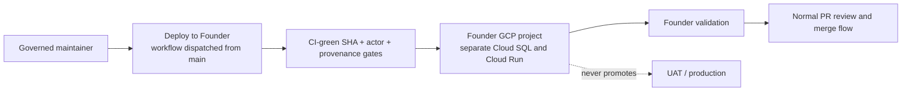

# Founder Sandbox environment (`hushh-pda-founder`)

> A dedicated GCP environment that mirrors `hushh-pda-dev`, reserved as the
> founder/leadership **fast sandbox** for **highly-unstable features**: deploy any
> CI-green ref in real time, validate a new direction, iterate — without disrupting
> the shared dev environment. The dev team then reviews, refines, and picks up the
> stable workstreams. It is a **disposable sandbox**, never a promotion lane.

## Visual Map

## Status — scaffolding, inert until two things happen

Everything in this document is **repo-side configuration**. It does nothing on its
own. The Founder environment becomes live only when **both** of these are done:

1. **The config below is on `main`.** The deploy workflow is `workflow_dispatch`-only
   and guarded to run its *definition* from `main`, so on any feature branch it is
   inert YAML that cannot be dispatched. A maintainer must land these files on `main`.
2. **The GCP project is provisioned** (the [one-time runbook](#one-time-provisioning-operator)
   below). Until `hushh-pda-founder` and its GitHub `founder` environment exist, no
   deploy can target it.

No live cloud resources or billing are created by adding these files.

## Why a separate project (not just reuse dev)

`hushh-pda-dev` is the shared integration environment the whole team relies on.
Highly-unstable, exploratory work can leave it in a broken state. A **separate
project** isolates that blast radius: the founder lane can be red, half-migrated, or
mid-experiment while dev stays trustworthy for everyone else. The pattern, gates, and
behavior are otherwise identical to dev (this is a faithful clone).

> This is a **GCP dev/sandbox** environment and is intentionally independent of the
> product's runtime posture (general/mass deployments are primary on Anypoint via the
> pre-purchased Titanium capacity; the FedRAMP-High / regulated tier is primary on
> GCP). The sandbox simply mirrors the existing GCP-based dev infrastructure.

## Repo artifacts (this change)

| File | Role | Cloned from |
|---|---|---|
| `.github/workflows/deploy-founder.yml` | The deploy lane (dispatch). `environment: founder`, project `hushh-pda-founder`, `--surface founder`. Keeps the full CI-green SHA gate + auto-rollback. | `deploy-dev.yml` |
| `config/ci-governance.json` → `founder` block | The actor allowlist for `--surface founder` (same maintainer cohort as dev). | `dev` block |
| `scripts/ci/assert-governed-actor.py` | `--surface` now accepts `founder`. | — |

The shared builds `deploy/backend.cloudbuild.yaml` and `deploy/frontend.cloudbuild.yaml`
are **unchanged** — every environment-specific value is passed in as a substitution,
so the founder lane reuses them verbatim and cannot drift.

## Deploy lane

**Primary — dispatch (any CI-green ref, real time).** This is the fast path for
unstable feature branches. A governed maintainer runs Actions → **Deploy to Founder**,
choosing an eligible feature branch and optionally an exact `sha`. The
same guards as dev apply:
- The workflow *definition* runs from `main`; the *content* deployed is `inputs.ref` / `inputs.sha`.
- Actor must be in the `founder` allowlist (`assert-governed-actor.py --surface founder`).
- The SHA must be reachable from the ref **and** carry a green authoritative CI check
  (`CI Status Gate` / `Queue Validation` / `Main Post-Merge Smoke Gate`, any-of). Full
  quality gate, zero promotion gate — exactly the dev fast-lane contract.

## Guardrails (inherited from the dev fast lane)

- **Never promotes.** Founder deploys nothing to UAT or production; UAT/production
  remain `main`-only, GitHub-Actions-only, and stricter-gated. Never point a founder
  trigger at them.
- **Behavior parity via `ENVIRONMENT=uat`.** Like dev, the founder runtime runs with
  `_RUNTIME_ENVIRONMENT=uat` (and `_APP_ENV=uat`) so behavior gates match UAT. Do
  **not** introduce a literal `ENVIRONMENT=founder` — the backend would treat the
  unknown string as *local* dev and silently flip auth/debug defaults.
- **Full CI gate.** `CI Status Gate` runs on every PR regardless of environment, so
  founder work is held to the same quality bar as everything else.
- **No shared email ingress.** One Email KYC, Gmail watch renewal, and UAT Pub/Sub
  subscriptions are disabled. They require a separate connector authority and an
  environment-specific audience before they can be enabled.
- **Governance-protected.** `.github/workflows/`, `deploy/`, `scripts/ci/`, and
  `config/ci-governance.json` are in `main.protected_pipeline_paths`, so these files
  are edit-restricted to the maintainer cohort once on `main`.

## One-time provisioning (operator)

Requires GCP org admin + GitHub org admin. Mirror the dev runbook
([`consent-protocol/docs/reference/dev-environment-setup.md`](../../../consent-protocol/docs/reference/dev-environment-setup.md)),
substituting `hushh-pda-founder` for `hushh-pda-dev`:

1. **Project + region.** Create project `hushh-pda-founder` (region `us-central1`),
   link billing, enable the same APIs the dispatch lane uses (Cloud Run, Cloud Build,
   Cloud SQL, Secret Manager, and AI Platform).
2. **Cloud SQL.** Create instance `hushh-founder-pg` (mirror dev's Postgres shape).
3. **Service accounts + WIF.** Create `consent-protocol-runtime@hushh-pda-founder…`
   (runtime identity, `roles/aiplatform.user` + the dev runtime roles) and a
   `github-deployer` SA with a Workload Identity Federation binding for GitHub Actions.
4. **Secrets.** Seed only the founder project's required runtime secrets and
   `BACKEND_RUNTIME_CONFIG_JSON`. Do not copy Workspace credentials, One Email KYC
   credentials, or a UAT Pub/Sub subscription into the sandbox.
5. **GitHub environment.** Create a repo environment named **`founder`** carrying
   `GCP_WORKLOAD_IDENTITY_PROVIDER` and `GCP_DEPLOY_SERVICE_ACCOUNT` (pointing at the
   SAs above), matching how `dev` is wired.
6. **Schema floor.** The lane reuses `consent-protocol/db/contracts/dev_minimum_schema.json`
   as its release floor (dev's skew-guard fallback behavior is unchanged).
7. **Domain mapping.** Point `founder.one.hushh.ai` to the founder frontend before
   dispatching a hosted browser rehearsal; the workflow uses that origin for CORS and
   frontend verification.

## How the team uses it

- A maintainer deploys an eligible feature branch via **Deploy to Founder** to see
  exploratory work running end-to-end without disrupting shared dev.
- Leadership validates the direction live; the dev team then reviews the diff, refines
  it, and merges the *stable* slice through the normal `integration/pr-train` → `main`
  flow. The sandbox stays disposable — reset or redeploy freely.
